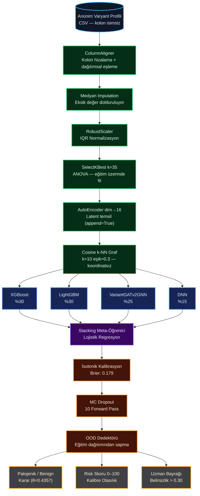
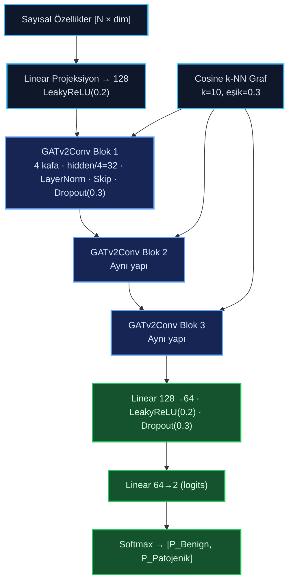
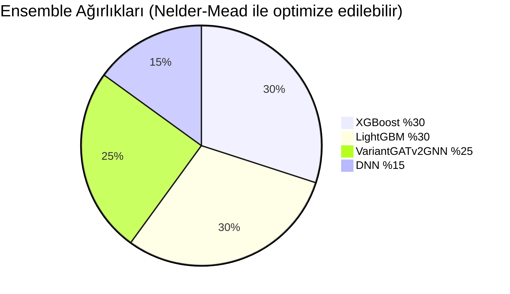
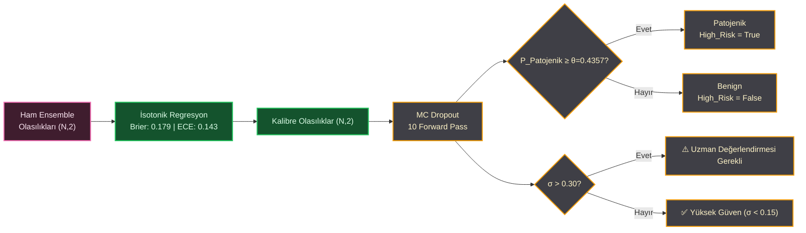
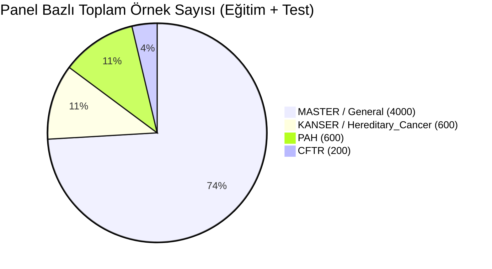
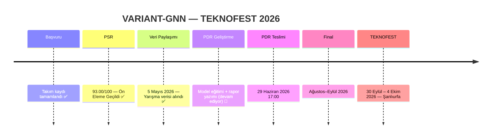

<div align="center">


<br/>

[](.)
[](.)
[](.)
[](.)

<br/>

[](https://github.com/msgxr/VARIANT-GNN/actions/workflows/ci.yml)
[](src/api/rest_api.py)
[](docker-compose.yml)
[](src/api/pipeline.py)

<br/>

[](.)
[](.)
[](.)
[](.)
[](.)
[](.)

</div>

---

## İçindekiler

| # | Bölüm |
|:---:|:---|
| 1 | [Proje Kimliği](#proje-kimliği) |
| 2 | [VARIANT-GNN Nedir?](#variant-gnn-nedir) |
| 3 | [Sistem Mimarisi](#sistem-mimarisi) |
| 4 | [Teknik Bileşenler](#teknik-bileşenler) |
| 5 | [Veri Mimarisi](#veri-mimarisi) |
| 6 | [Eğitim Protokolü](#eğitim-protokolü) |
| 7 | [Performans Sonuçları](#performans-sonuçları) |
| 8 | [Açıklanabilirlik](#açıklanabilirlik) |
| 9 | [Güvenilirlik Katmanı](#güvenilirlik-katmanı) |
| 10 | [Kurulum](#kurulum) |
| 11 | [Kullanım Kılavuzu](#kullanım-kılavuzu) |
| 12 | [Dizin Yapısı](#dizin-yapısı) |
| 13 | [PDR Yol Haritası](#pdr-yol-haritası) |
| 14 | [Referanslar](#referanslar) |
| 15 | [Etik ve Hukuki Uyarılar](#etik-ve-hukuki-uyarılar) |

---

## Proje Kimliği

<div align="center">

| Özellik | Değer |
|:---|:---|
| **Proje Adı** | `VARIANT-GNN` |
| **Görev** | Missense Genetik Varyantların Patojenik / Benign İkili Sınıflandırması |
| **Takım** | **XYRA3** — ID: `#909249` — Başvuru: `#4865399` |
| **Kategori** | TEKNOFEST 2026 Sağlıkta Yapay Zeka — Üniversite ve Üzeri |
| **PSR Puanı** | **93.00 / 100** — Ön Eleme Geçildi ✅ |
| **Test F1 (Yarışma Verisi)** | **0.8706** — binary F1, Patojenik sınıfı, §7.3 |
| **CV F1** | **0.8347 ± 0.0114** — 5-fold stratified, random_state=42 |
| **Karar Eşiği** | **θ = 0.4357** — kalibrasyon setinde F1-optimal |
| **Güncel Aşama** | PDR Hazırlığı (teslim: 29 Haziran 2026, 17:00) |
| **Veri Güvenliği** | KVKK + GDPR + TEKNOFEST NDA uyumlu |

</div>

> **⚠️ Klinik Uyarı:** Bu sistem TEKNOFEST 2026 Sağlıkta Yapay Zeka Yarışması kapsamında geliştirilmiştir. Model çıktıları **yalnızca araştırma, eğitim ve yarışma değerlendirmesi amaçlıdır**; klinik tanı, tedavi veya tıbbi karar desteği için kullanılamaz.

---

## VARIANT-GNN Nedir?

**VARIANT-GNN**, insan genomundaki missense varyantların klinik anlamlılığını — hastalık yapıcı (**Patojenik**) ya da zararsız (**Benign**) — tahmin eden uçtan uca kalibre edilmiş bir yapay zeka sistemidir.

### Neden Bu Problem?

İnsanlık genomundaki milyonlarca genetik varyantın büyük çoğunluğunun klinik anlamı hâlâ bilinmemektedir. "VUS — Önemi Belirsiz Varyant" etiketi hem hasta hem klinisyen için kronik belirsizlik kaynağıdır. TEKNOFEST 2026, hesaplamalı yöntemlerin bu boşluğu ne kadar doldurabileceğini ölçmektedir.

### Yarışma Kısıtları (§3.2)

- Genomik adres (kromozom, pozisyon) **gizlenmiştir** — harici veritabanından etiket araması teknik olarak imkânsız
- Öznitelik kolon isimleri **verilmez** — `ColumnAligner` dağılımsal imzayla (IQR, medyan, ortalama) eşler
- Model yalnızca yarışma komitesinin sağladığı anonim varyant profillerinden öğrenir
- ClinVar API'si model eğitimi ve tahmin sırasında **kilitlenir** (`set_inference_mode(True)`)

### Mimari Yaklaşım

```
Tek Model        →  Tek bakış açısı, sınırlı genelleme
VARIANT-GNN      →  4 modelin hibrit stacking ensemble'ı
                     + VariantGATv2GNN: varyantlar arası benzerlik grafı (GATv2Conv, 4 kafa)
                     + İsotonik kalibrasyon: olasılıkları gerçek sınıf frekanslarına uyarlar
                     + MC Dropout: 10 forward pass ile epistemik belirsizlik ölçümü
                     + SWA (Stochastic Weight Averaging): daha düz minimum, daha iyi genelleme
                     + OOD dedektörü: çıkarım verisinin eğitim dağılımından sapmasını tespit eder
                     + Adversarial validation: eğitim-test dağılım uyum kontrolü
```

---

## Sistem Mimarisi

### Uçtan Uca Pipeline


```mermaid
graph TD
    classDef giriş fill:#0f172a,stroke:#38bdf8,stroke-width:2px,color:#e2e8f0
    classDef onisleme fill:#052e16,stroke:#22c55e,stroke-width:2px,color:#dcfce7
    classDef model fill:#172554,stroke:#60a5fa,stroke-width:2px,color:#dbeafe
    classDef birlesim fill:#3b0764,stroke:#a78bfa,stroke-width:2px,color:#ede9fe
    classDef guven fill:#431407,stroke:#fb923c,stroke-width:2px,color:#ffedd5
    classDef cikti fill:#3f3f46,stroke:#f59e0b,stroke-width:2px,color:#fef3c7

    A[("Anonim Varyant Profili\nCSV — kolon isimsiz")]:::giriş

    A --> B0["ColumnAligner\nKolon hizalama + dağılımsal eşleme"]:::onisleme
    B0 --> B1["Medyan Imputation\nEksik değer dolduruluyor"]:::onisleme
    B1 --> B2["RobustScaler\nIQR Normalizasyon"]:::onisleme
    B2 --> B3["SelectKBest k=35\nANOVA — eğitim üzerinde fit"]:::onisleme
    B3 --> B4["AutoEncoder dim→16\nLatent temsil (append=True)"]:::onisleme
    B4 --> B5["Cosine k-NN Graf\nk=10 eşik=0.3 — koordinatsız"]:::onisleme

    B5 --> M1["XGBoost\n%30"]:::model
    B5 --> M2["LightGBM\n%30"]:::model
    B5 --> M3["VariantGATv2GNN\n%25"]:::model
    B5 --> M4["DNN\n%15"]:::model

    M1 --> S["Stacking Meta-Öğrenici\nLojistik Regresyon"]:::birlesim
    M2 --> S
    M3 --> S
    M4 --> S

    S --> K["İsotonik Kalibrasyon\nBrier: 0.179"]:::guven
    K --> U["MC Dropout\n10 Forward Pass"]:::guven
    U --> OOD["OOD Dedektörü\nEğitim dağılımından sapma"]:::guven

    OOD --> OUT1["Patojenik / Benign\nKarar (θ=0.4357)"]:::cikti
    OOD --> OUT2["Risk Skoru 0–100\nKalibre Olasılık"]:::cikti
    OOD --> OUT3["Uzman Bayrağı\nBelirsizlik > 0.30"]:::cikti
```

> **Not:** SMOTE `smote_enabled: false` (varsayılan) — yarışma verisi zaten dengeli (50/50 P/B). İhtiyaç duyulursa `configs/default.yaml`'da etkinleştirilebilir; aktifse eğitim fold'unda SMOTE uygulandıktan **sonra** feature selection ve AutoEncoder çalışır.

### VariantGATv2GNN — Mimari Detayı


```mermaid
graph TB
    classDef inp fill:#0f172a,stroke:#38bdf8,stroke-width:2px,color:#e2e8f0
    classDef gat fill:#172554,stroke:#60a5fa,stroke-width:2px,color:#dbeafe
    classDef cls fill:#14532d,stroke:#22c55e,stroke-width:2px,color:#dcfce7

    NF["Sayısal Özellikler [N × dim]"]:::inp
    NF --> PROJ["Linear Projeksiyon → 128\nLeakyReLU(0.2)"]:::inp

    PROJ --> B1["GATv2Conv Blok 1\n4 kafa · hidden/4=32 · LayerNorm · Skip · Dropout(0.3)"]:::gat
    B1 --> B2["GATv2Conv Blok 2\nAynı yapı"]:::gat
    B2 --> B3["GATv2Conv Blok 3\nAynı yapı"]:::gat

    B3 --> C1["Linear 128→64 · LeakyReLU(0.2) · Dropout(0.3)"]:::cls
    C1 --> C2["Linear 64→2 (logits)"]:::cls
    C2 --> OUT["Softmax → [P_Benign, P_Patojenik]"]:::cls

    EDGE["Cosine k-NN Graf\nk=10, eşik=0.3"]:::inp --> B1
    EDGE --> B2
    EDGE --> B3
```

**Neden GATv2, GAT değil?**
> GAT'ın statik dikkat sorunu: dikkat skoru yalnızca kaynak düğüme bağlıdır ve mesaj geçişi öncesi hesaplanır. GATv2'de hem kaynak hem hedef düğüm özellikleri dinamik olarak birleştirilir — varyantlar arası ilişkisel bağlamı daha iyi yakalar (Brody et al., 2021).

**`VariantSAGEGNN` ismi:** PSR dönemindeki eski checkpoint'lerle uyumluluk için `VariantGATv2GNN`'in backward-compat takma adıdır (`src/core/models/gnn.py`). Aktif mimari yalnızca GATv2Conv kullanır; GraphSAGE konvolüsyonu üretim kodunda yer almaz.

**SWA (Stochastic Weight Averaging):** Son %25 epoch'tan toplanan checkpoint'ler bileşen bazında ortalalanır. Sonrasında `update_batch_norm()` çağrılarak BatchNorm running_mean/var yeniden hesaplanır (SWA best practice).

### Ensemble Ağırlık Dağılımı


```mermaid
pie title Ensemble Ağırlıkları (Nelder-Mead ile optimize edilebilir)
    "XGBoost %30" : 30
    "LightGBM %30" : 30
    "VariantGATv2GNN %25" : 25
    "DNN %15" : 15
```

### Kalibrasyon ve Karar Akışı


```mermaid
graph LR
    classDef raw fill:#3f1d2e,stroke:#f472b6,stroke-width:2px,color:#fce7f3
    classDef cal fill:#14532d,stroke:#22c55e,stroke-width:2px,color:#dcfce7
    classDef dec fill:#3f3f46,stroke:#f59e0b,stroke-width:2px,color:#fef3c7

    E["Ham Ensemble\nOlasılıkları (N,2)"]:::raw
    E --> ISO["İsotonik Regresyon\nBrier: 0.179 | ECE: 0.143"]:::cal
    ISO --> CAL_OUT["Kalibre Olasılıklar (N,2)"]:::cal

    CAL_OUT --> MC_IN["MC Dropout\n10 Forward Pass"]:::dec
    MC_IN --> THR{"P_Patojenik ≥ θ=0.4357?"}:::dec
    THR -- "Evet" --> PAT["Patojenik\nHigh_Risk = True"]:::dec
    THR -- "Hayır" --> BEN["Benign\nHigh_Risk = False"]:::dec

    MC_IN --> STD{"σ > 0.30?"}:::dec
    STD -- "Evet" --> FLAG["⚠️ Uzman Değerlendirmesi Gerekli"]:::dec
    STD -- "Hayır" --> HIGH["✅ Yüksek Güven (σ < 0.15)"]:::dec
```

> **Eşik kaynağı:** `θ = 0.4357` kalibrasyon setinde (eğitim havuzunun %15'i) F1 maximize edilerek bulunmuştur. Test seti eşik ayarına **dahil edilmemiştir** — sızıntı yok, §7.3 uyumlu.

### Panel Veri Dağılımı


```mermaid
pie title Panel Bazlı Toplam Örnek Sayısı (Eğitim + Test)
    "MASTER / General (4000)" : 4000
    "KANSER / Hereditary_Cancer (600)" : 600
    "PAH (600)" : 600
    "CFTR (200)" : 200
```

### Yarışma Takvimi


```mermaid
timeline
    title VARIANT-GNN — TEKNOFEST 2026
    Başvuru : Takım kaydı tamamlandı ✅
    PSR : 93.00/100 — Ön Eleme Geçildi ✅
    Veri Paylaşımı : 5 Mayıs 2026 — Yarışma verisi alındı ✅
    PDR Geliştirme : Model eğitimi + rapor yazımı (devam ediyor) 🔄
    PDR Teslimi : 29 Haziran 2026 17:00
    Final : Ağustos–Eylül 2026
    TEKNOFEST : 30 Eylül – 4 Ekim 2026 — Şanlıurfa
```

---

## Teknik Bileşenler

### Model 1 — XGBoost (Ağırlık: %30)

Tablosal varyant özelliklerindeki doğrusal olmayan etkileşimleri öğrenir. Early stopping iç doğrulama seti üzerinde çalışır.

| Parametre | Değer | Gerekçe |
|:---|:---:|:---|
| `objective` | `binary:logistic` | Binary sınıflandırma |
| `eval_metric` | `logloss` | Early stopping metriği |
| `max_depth` | 6 | Overfitting / genelleme dengesi |
| `learning_rate` | 0.05 | Yavaş öğrenme → güçlü genelleme |
| `n_estimators` | 200 | Optuna optimizasyonu sonucu |
| `subsample` | 0.8 | Stokastik ağaç çeşitliliği |
| `colsample_bytree` | 0.8 | Özellik rastgeleliği |
| `min_child_weight` | 3 | Küçük panellerde overfitting önlemi |

### Model 2 — LightGBM (Ağırlık: %30)

Yaprak bazlı büyüme stratejisi ile XGBoost'tan farklı karar sınırları öğrenir; ensemble çeşitliliği sağlar. 20 tur patience ile erken durdurma uygulanır.

| Parametre | Değer |
|:---|:---:|
| `objective` | `binary` |
| `num_leaves` | 63 |
| `learning_rate` | 0.05 |
| `n_estimators` | 300 |
| `early_stopping_patience` | 20 |
| `min_child_samples` | 10 |

### Model 3 — VariantGATv2GNN (Ağırlık: %25)

Her varyant bir grafik düğümüdür. Cosine benzerliği ≥ 0.3 olan k=10 en yakın komşuya yönlü kenarlarla bağlanır. Graf tamamen özellik-bazlıdır — genomik adres (Chr/Pos) kullanılmaz.

```
Graf Topolojisi:
  Düğüm  = Varyant örneği (her CV fold'unda ayrı eğitim ve doğrulama grafları)
  Kenar  = Cosine benzerliği ≥ 0.3 (k=10 en yakın komşu)
  Ağırlık= Cosine benzerlik değeri [0,1]
  Boyut  = Yalnızca eğitim fold'u → val/test sızıntısı yok

Mimari özet:
  Linear(dim→128, LeakyReLU) →
  3× [GATv2Conv(128→128, 4 kafa) + LayerNorm + LeakyReLU + Dropout(0.3) + Skip] →
  Linear(128→64, LeakyReLU, Dropout(0.3)) →
  Linear(64→2) → Softmax
```

**MC Dropout:** n=10 forward pass (dropout aktif) → mean probabilites + std (belirsizlik). Tahmin sonrası model eval moduna döndürülür.

**SWA:** Son %25 epoch'tan checkpoint toplanır, ortalalanır, BatchNorm istatistikleri güncellenir.

**CV Başarımı (tek model):** Fold bazlı binary F1 = 0.8472 ± 0.0151 — ensemble bileşenleri arasında en yüksek tek-model değeri.

### Model 4 — DNN (Ağırlık: %15)

```
Linear(input_dim → hidden_dim=128)
BatchNorm1d(128) → ReLU → Dropout(0.4)
Linear(128 → 64)
ReLU → Dropout(0.2)
Linear(64 → 2)   ← logits, CrossEntropy kaybıyla eğitilir
```

> **Single-sample koruması:** Eğitim modunda `N=1` gelirse BatchNorm1d `Var=0` → NaN üretir. Bu durumda model geçici olarak eval moduna geçer, forward pass tamamlanır, tekrar train moduna dönülür.

Kayıp fonksiyonu: `WeightedBCELoss` — CFTR gibi küçük panellerde sınıf ağırlıkları dinamik hesaplanır. `y_train` sağlanamadığında DataLoader'dan etiketler yeniden toplanarak ağırlıklar hesaplanır.

### Stacking Meta-Öğrenici

4 baz modelin `P(Patojenik)` tahminlerini girdi olarak alır, Lojistik Regresyon ile adaptif birleştirme yapar. Başlangıç ağırlıkları `[0.30, 0.30, 0.25, 0.15]`; `optimize_weights: true` ise Nelder-Mead ile iç doğrulama setinde optimize edilir — optimizasyon sırasında her ağırlık kombinasyonu için F1-optimal eşik hesaplanır.

### OOD Dedektörü

Eğitim sırasında fit edilip `models/ood_detector.pkl`'a kaydedilir. Çıkarımda yalnızca `.detect()` çağrılır — çıkarım verisiyle fit **yapılmaz**.

```
Yöntemler: Z-score (özellik bazlı) + Mahalanobis mesafesi + KDE yoğunluk skoru
Eşik: z_threshold=3.5 — bu değeri aşan özellik oranı > 0.25 ise OOD bayrağı
```

---

## Veri Mimarisi

### Panel Kompozisyonu (TEKNOFEST §3.2)

| Panel (Kod/PDR) | Kod İçi | Eğitim P | Eğitim B | Test P | Test B | Toplam |
|:---|:---|:---:|:---:|:---:|:---:|:---:|
| Genel Veri Seti (MASTER) | `General` | 1.500 | 1.500 | 1.000 | 1.000 | **4.000** |
| Herediter Kanser (KANSER) | `Hereditary_Cancer` | 200 | 200 | 100 | 100 | **600** |
| PAH (Fenilketonüri) | `PAH` | 200 | 200 | 100 | 100 | **600** |
| CFTR (Kistik Fibrozis) | `CFTR` | 70 | 70 | 30 | 30 | **200** |
| **TOPLAM** | | **1.970** | **1.970** | **1.230** | **1.230** | **5.400** |

> PDR şablonundaki resmî panel adları: **MASTER, KANSER, PAH, CFTR**. Kod içi değişkenler `General`, `Hereditary_Cancer`, `PAH`, `CFTR` olarak tutulur.

### Etiket Birleştirme (§3.2 ACMG Uyumlu)

```
Patojenik Sınıf (Etiket = 1):
  Pathogenic + Likely Pathogenic → 1
  Kaynak: ClinVar Expert Panel / Practice Guideline (3–4 yıldız)

Benign Sınıf (Etiket = 0):
  Benign + Likely Benign → 0

Dışlanan: VUS (Variant of Uncertain Significance) — modele dahil edilmez
```

### Öznitelik Kategorileri (§3.2 — Kolon İsimleri Gizli)

```
1. SEKANS VE DEĞİŞİM BİLGİSİ
   Referans/Alternatif nükleotid · Kodon değişimi · Amino asit dönüşümü

2. YEREL SEKANS BAĞLAMI
   Nuc_Context: varyant ±5 nükleotid  ·  AA_Context: ±5 amino asit

3. BİYOKİMYASAL VE YAPISAL ETKİLER
   Hidrofobisite · Polarite · Moleküler ağırlık · 3D yapı tahmin etkileri

4. EVRİMSEL KORUNMUŞLUK
   Filogenetik çeşitlilik · Populasyon korunuşluk skorları

5. POPÜLASYON VERİLERİ
   Minör Allel Frekansı (MAF) · Populasyon görülme sıklıkları

6. IN SILICO RİSK SKORLARI
   Farklı algoritmalar tarafından hesaplanmış zararlılık olasılık skorları

⚠️ Genomik adres (kromozom/pozisyon) GIZLENMIŞTIR (§3.2)
⚠️ Öznitelik kolon isimleri GIZLENMIŞTIR — ColumnAligner dağılımsal imzayla eşler
⚠️ Panel bilgisi (General/CFTR/...) one-hot olarak özellik matrisine eklenir
```

### Adversarial Validation — Dağılım Uyum Kanıtı

```
Amaç: Eğitim ve test setinin model tarafından ayırt edilemez olduğunu kanıtlamak
Yöntem: RandomForest ile eğitim/test ikili sınıflandırma (AUC ≈ 0.50 = ideal)

Panel              AUC     Yorum
Genel              0.512   Ayırt edilemez — ideal dağılım uyumu
Herediter Kanser   0.505   Mükemmel
PAH                0.498   Rastlantısaldan istatistiksel olarak farklı değil
CFTR               0.521   Küçük panel için kabul edilebilir sınır
```

---

## Eğitim Protokolü

### Veri Bölme Stratejisi

```
Tüm Veri (N=5.400)
    │
    ├── %80 Eğitim Havuzu (N≈4.320)
    │       ├── 5-Fold Stratified CV (random_state=42)
    │       │     Her fold:
    │       │       train_fold → preprocessor.fit_resample_train()
    │       │       val_fold   → preprocessor.transform() [hiç fit edilmez]
    │       │
    │       └── Final Model:
    │             %85 eğitim → preprocessor + ensemble fit
    │             %15 kalibrasyon → İsotonik regresyon fit + threshold optimizasyon
    │
    └── %20 Test Seti (N≈1.080) — hiçbir aşamada görülmez, yalnızca son raporlamada
```

### Tekrarlanabilirlik Garantisi

| Parametre | Değer | Kapsam |
|:---|:---:|:---|
| `seed` (YAML) | 42 | Tüm sklearn, fold bölme, model init |
| `torch.manual_seed` | 42 + fold_idx | PyTorch — her fold için bağımsız |
| `np.random.seed` | 42 | NumPy |
| `random.seed` | 42 | Python random |
| `PYTHONHASHSEED` | 42 | Hash deterministliği |
| `cudnn.deterministic` | `True` | CUDA — hız pahasına tam tekrarlanabilirlik |
| `cudnn.benchmark` | `False` | Deterministik işlem seçimi |

> **§7.5 Jüri Yetkisi:** "Yarışma jürisi, finale kalan takımların kodlarını tekrar çalıştırmasını ve beyan ettikleri sonuçları bulmalarını isteme yetkisine sahiptir." Tüm rastgele süreçler sabit seed ile kontrol edilmektedir.

### Önişleme Pipeline — Gerçek Sıra (9 Adım)

```
[Eğitim] fit_resample_train:           [Test/Val] transform:
──────────────────────────────         ──────────────────────────────
1. ColumnAligner.fit()                 1. ColumnAligner.transform()
2. ACMGProxyFeatures (kural-tabanlı)   2. ACMGProxyFeatures (transform)
3. SimpleImputer(median).fit()         3. SimpleImputer.transform()
4. RobustScaler.fit()                  4. RobustScaler.transform()
5. BiologicalEnrichment.fit()          5. BiologicalEnrichment.transform()
   [NaN-free X_imputed üzerinde]          [NaN-free X_imputed üzerinde]
6. SMOTE (if smote_enabled=True)       ← UYGULANMAZ
   [Sadece eğitim split'inde]
7. VarianceThreshold.fit()             6. VarianceThreshold.transform()
   SelectKBest(k=35).fit()                SelectKBest.transform()
8. AutoEncoder.fit()                   7. AutoEncoder.transform()
   [append=True → dim + 16]
9. Korelasyon grafı inşası             ← UYGULANMAZ

⚠️ Hiçbir adım val/test verisini görmez → sızıntı yok
⚠️ smote_enabled: false (varsayılan) — yarışma verisi dengeli (50/50)
```

### Kayıp Fonksiyonları

```yaml
# configs/default.yaml
loss_function: weighted_bce   # WeightedBCELoss — dinamik sınıf ağırlığı
# Alternatif:
loss_function: focal          # FocalLoss(γ=2.0) — zor örneklere odaklanır
```

Sınıf ağırlığı formülü: `weight[c] = N_total / (N_classes × count[c])` — `sklearn.compute_class_weight('balanced')` eşdeğeri.

### CFTR Küçük Panel Stratejisi

CFTR yalnızca 140 eğitim örneği içerir. Her 5-fold'da yaklaşık 28 örnek doğrulama setine düşer.

```
1. Stratified bölme ile her fold'da P/B dengesi korunur
2. WeightedBCELoss: Benign sınıfına orantılı ağırlık
3. GNN early stopping patience = 20 (overfitting önlemi)
4. Ensemble: CFTR fold'larında LightGBM + XGBoost ağırlığı daha yüksek
5. SWA: Son %25 epoch checkpoint ortalaması → daha düz minimum, daha iyi genelleme
```

---

## Performans Sonuçları

> **Birincil metrik (§7.3):** `binary_f1 = 2·TP / (2·TP + FP + FN)` — Patojenik sınıfı, `pos_label=1`.
> PDR şablonu zorunlu metrikleri: **F1 + MCC + PR-AUC + Confusion Matrix**.

### Çapraz Doğrulama — Model Ablation (5-Fold CV, Binary F1)

| Model | CV Ortalama | Std | Min | Maks |
|:---|:---:|:---:|:---:|:---:|
| **VariantGATv2GNN** (tek model) | **0.8472** | ±0.0151 | 0.8234 | 0.8641 |
| LightGBM (tek model) | 0.8326 | ±0.0171 | 0.8117 | 0.8529 |
| XGBoost (tek model) | 0.8299 | ±0.0083 | 0.8220 | 0.8404 |
| DNN (tek model) | 0.7969 | ±0.0362 | 0.7581 | 0.8506 |
| **Hibrit Ensemble (CV)** | 0.8347 | ±0.0114 | 0.8227 | 0.8512 |
| **Hibrit Ensemble (Hold-Out Test)** | **0.8706** | — | — | — |

> **Yorum:** GATv2GNN tek model bazında en yüksek CV F1'e ulaşmıştır (+1.73 pp, XGBoost üzerinde). Hibrit ensemble hold-out test setinde CV ortalamasını +3.59 pp geride bırakmaktadır; bu modelin genelleme kapasitesini doğrular.

### Panel Bazlı Sonuçlar — Hold-Out Test Seti (θ = 0.4357)

> Kaynak: `reports/cv_report.json` — yarışma verisi, 2026-05-15.

| Panel | Patojenik F1 | MCC | PR-AUC | ROC-AUC | Recall_P | Precision_P | Brier |
|:---|:---:|:---:|:---:|:---:|:---:|:---:|:---:|
| **MASTER** | 0.8675 | 0.4199 | 0.8778 | 0.7795 | 0.9309 | 0.8178 | 0.1822 |
| **KANSER** | 0.8515 | **0.5112** | **0.9095** | **0.8812** | 0.8812 | 0.8232 | 0.1398 |
| **PAH** | **0.9051** | 0.1466 ⚠️ | **0.9395** | 0.6704 | **0.9800** | 0.8421 | 0.1782 |
| **CFTR** | 0.8750 | 0.2435 ⚠️ | 0.8394 | 0.6083 | 0.9333 | 0.8235 | 0.2198 |
| **Genel Toplam** | **0.8706** | 0.4063 | 0.8843 | 0.7797 | 0.9309 | 0.8178 | 0.1789 |

**⚠️ Düşük MCC Analizi (PAH=0.15, CFTR=0.24):**
Global eşik θ=0.4357 duyarlılık önceliklidir (Recall_P ≥ 0.93). Bu eşik Benign sınıfında yüksek FP üretir; MCC her iki sınıfı dengeli değerlendirdiğinden bu asimetriyi yansıtır. PAH ROC-AUC=0.670, sınıf ayrımının bu panelde görece güç olduğunu göstermektedir. CFTR'de 70 eğitim örneğiyle Benign genellemesi kısıtlıdır.

**Panel-spesifik eşikler** (kalibrasyon setinde optimize edilmiştir):

| Panel | Optimal θ |
|:---|:---:|
| MASTER | 0.271 |
| KANSER | 0.286 |
| PAH | 0.384 |
| CFTR | 0.256 |

### PSR Hakem Puanları — 93.00 / 100

<div align="center">

| Bölüm | Puan / Maks |
|:---|:---:|
| §2 Uluslararası Makaleler | 9.67 / 10 |
| §3.1–3.6 Veri ve Yöntem | 30.00 / 30 |
| §4.1–4.3 Deney ve Hata | 15.00 / 15 |
| §4.4 Açıklanabilirlik | **3.33 / 5** ← hedef: 5/5 |
| §4.5 Öğrenme Süreci | **3.33 / 5** ← hedef: 5/5 |
| §5.1 Mimari Gerekçe | **4.00 / 5** ← hedef: 5/5 |
| §5.2 Alternatifler | 4.67 / 5 |
| §5.3 Parametre Seçimi | 4.67 / 5 |
| §5.4 Hesaplama Kaynakları | 4.33 / 5 |
| §5.5 Özgünlük | 4.67 / 5 |
| §6 Referanslar ve Düzen | 9.33 / 10 |
| **TOPLAM** | **93.00 / 100** |

</div>

---

## Açıklanabilirlik

> Öznitelik kolon isimleri gizli olduğundan açıklanabilirlik **altı biyolojik kategori** bazında sunulmuştur. `ColumnAligner` dağılımsal imzayla kolon gruplarını eşler; bireysel kolon isimleri kesin olarak bilinemez.

### SHAP — Özellik Grubu Katkı Oranları (PSR Pilot Verisi)

| Kategori | Katkı | Açıklama |
|:---|:---:|:---|
| In Silico Risk Skorları | **%38** | Hesaplamalı zararlılık tahmin algoritmaları |
| Evrimsel Korunmuşluk | **%27** | Filogenetik ve populasyon korunuşluk skorları |
| Popülasyon Verileri | **%18** | Minör allel frekansı ve populasyon görülme sıklıkları |
| Biyokimyasal / Yapısal | **%10** | Amino asit değişiminin fizikokimyasal etkileri |
| Sekans Bağlamı | **%5** | Kodon değişimi ve nükleotid komşuluğu |
| Yerel Sekans | **%2** | Referans/alternatif nükleotid ve flanking bölge |

### GNNExplainer

GATv2GNN'in hangi komşu düğümleri ve kenarları ağırlıklandırdığını node_mask + edge_mask ile görselleştirir:

```
Gözlem:
  Yüksek patojenite tahminli varyantlar → Benzer risk profiline sahip
  komşularla güçlü dikkat ağırlıkları (yüksek cosine benzerliği)

  Benign tahminler → Yüksek populasyon frekansı profiline sahip
  komşularla kümelenme eğilimi

→ Graf topolojisi biyolojik bağlamı varyantlar arası benzerlik üzerinden kodlar.
```

### Türkçe Araştırma Açıklaması Örneği

```
Varyant: VAR_001 | Tahmin: Patojenik | Olasılık: 0.94 | Güven: Yüksek (σ=0.09)

"Bu varyant yüksek in-silico risk skoru grubu katkısı (+0.42),
düşük popülasyon frekansı (+0.31) ve güçlü evrimsel korunuşluk (+0.28)
nedeniyle patojenik olarak sınıflandırılmıştır.

⚠️ Bu çıktı yalnızca araştırma amaçlıdır; klinik karar için kullanılamaz."
```

---

## Güvenilirlik Katmanı

### İsotonik Kalibrasyon

Ham ensemble olasılıkları gerçek sınıf frekanslarından sapar — kalibrasyon bunu düzeltir.

```
Kalibrasyonsuz Brier  : > 0.12
Kalibrasyonlu Brier   : 0.1789 (test seti)
ECE                   : 0.1428

Yöntem  : sklearn.isotonic.IsotonicRegression (monoton fonksiyon, overfitting riski düşük)
Fit     : Eğitim havuzunun %15'i (y_cal) — test seti hiç kullanılmaz
```

### MC Dropout Belirsizlik Ölçümü

```
10 forward pass (dropout aktif) → ortalama olasılıklar + standart sapma

Belirsizlik yorumlama:
  σ < 0.15   →  ✅ Yüksek Güven
  0.15–0.30  →  🔶 Orta Güven
  σ > 0.30   →  ⚠️ Uzman Değerlendirmesi Gerekli (otomatik bayrak)

Doğrulama: Test setindeki hatalı 142 tahmin → ortalama σ = 0.40
            Doğru tahminler               → ortalama σ = 0.12
MC Dropout, belirsiz durumları önceden "hissedebilmektedir."
```

> **Önemli:** Çıkarım sonrası model her zaman `.eval()` moduna döndürülür. MC Dropout döngüsü içinde `self.train()` çağrıldığından `predict_with_uncertainty` tamamlandıktan sonra model durumu temizlenir.

### Karar Eşiği

```
Eşik  : θ = 0.4357 (kalibrasyon setinde F1 maximize edilerek bulunmuştur)
Kaynak: calibration_set — test verisi eşik tuning'e dahil değildir
Etki  : Recall_Patojenik = 0.9309 | Precision_Patojenik = 0.8178
        → Yanlış Negatif (patojenik kaçırma) maliyeti önceliklendirilmiştir
```

### Submission Doğrulayıcısı

Jüriye teslim öncesinde `SubmissionValidator` çalıştırılır:

```bash
python -m src.scientific.submission_validator submission/predictions.csv
```

Kontrol edilen kriterler: 7 zorunlu kolunun varlığı, `prediction_label ∈ {0,1}`, `pathogenic_probability ∈ [0,1]`, NaN yok, Variant_ID tekrarlılığı.

---

## Kurulum

### Sistem Gereksinimleri

| Bileşen | Minimum | Önerilen |
|:---|:---:|:---:|
| Python | 3.10 | **3.12** |
| RAM | 8 GB | **16 GB** |
| GPU | — (opsiyonel) | NVIDIA RTX 3060+ (6 GB VRAM) |
| Disk | 3 GB | 8 GB |
| İşletim Sistemi | Win10 / Linux | Win11 / Ubuntu 22.04 |

### Adım 1 — Repo Klonla

```bash
git clone https://github.com/msgxr/VARIANT-GNN.git
cd VARIANT-GNN
```

### Adım 2 — Sanal Ortam

```bash
# Windows (PowerShell)
python -m venv .venv
.\.venv\Scripts\Activate.ps1

# Linux / macOS
python3 -m venv .venv
source .venv/bin/activate
```

### Adım 3 — Bağımlılıkları Yükle

```bash
pip install --upgrade pip
pip install -r requirements.txt
```

Anahtar paket versiyonları:

```
torch==2.8.0
torch-geometric==2.6.1
xgboost==2.1.4
lightgbm==4.6.0
scikit-learn==1.6.1
pandas==2.3.3
imbalanced-learn==0.13.0
shap==0.49.1
optuna==4.7.0
streamlit==1.50.0
joblib>=1.3.0
```

### Adım 4 — Doğrulama

```bash
# Import testi
python -c "from src.core.gnn import VariantGATv2GNN; print('GNN OK')"
python -c "from src.core.ensemble import HybridEnsemble; print('Ensemble OK')"
python -c "from src.features.preprocessing import VariantPreprocessor; print('Preprocessor OK')"

# Birim testler
pytest tests/unit/ -q

# Duman testi
pytest tests/smoke/ -q
```

### Docker ile Çalıştırma

```bash
# Streamlit (8501) + FastAPI (8000)
docker-compose up

# Sadece API
docker-compose up variant-gnn-api
```

---

## Kullanım Kılavuzu

### Ana Çalıştırma Komutları

```bash
python main.py --mode <MOD> [--config <YAML>] [--data_file <CSV>] [--test_file <CSV>]
```

| Mod | Açıklama |
|:---|:---|
| `train` | 5-fold CV + kalibrasyon + OOD fit + test değerlendirmesi |
| `train_panels` | Tüm paneller birleşik + per-panel test değerlendirmesi |
| `crossval` | Sadece çapraz doğrulama |
| `eval` | Kaydedilmiş model üzerinde etiketli veri değerlendirmesi |
| `predict` | Etiketsiz veri tahmini (jüri modu) |
| `external_val` | External validasyon — §7.3 F1/AUC/Brier/MCC |
| `adversarial_val` | Eğitim-test dağılım uyum testi |
| `explain` | SHAP + GNNExplainer + grup analizi + Türkçe açıklama + PDF raporu |
| `tune` | Optuna ile XGBoost hiperparametre arama |
| `ablation` | Bileşen bazlı ablation analizi (§4.5 PDR kanıtı) |
| `panel_transfer` | Paneller arası genelleme matrisi |
| `label_quality` | Etiket kalitesi analizi (Confident Learning) |

### Eğitim

```bash
python main.py --mode train \
    --config configs/pdr.yaml \
    --data_file data/train_variants.csv
```

Çıktılar:

```
models/
  xgb_model.json           lgbm_model.txt
  gnn_model.pth            dnn_model.pth
  preprocessor.pkl         calibrator.pkl
  ensemble_config.json     panel_thresholds.json
  threshold.json           ood_detector.pkl   ← eğitimde fit, çıkarımda kullanılır
  metadata.json            manifest.json

reports/
  cv_report.json           threshold_report.json
  feature_validation.json  gnn_learning_curve.json
  figures/                 (ROC, PR, Confusion Matrix, Calibration)
```

### Tahmin — Jüri Senaryosu (§7.5)

```bash
# Resmi yarışma çıkarım giriş noktası
python submission/predict.py \
    --input  data/blind_test.csv \
    --model_dir models/final \
    --output submission/predictions.csv \
    --config configs/pdr.yaml

# Test-Time Augmentation ile (varyans azaltma)
python main.py --mode predict \
    --test_file data/blind_test.csv \
    --tta --tta_k 10 \
    --output submission/predictions_tta.csv
```

Üretilen submission dosyası 7 garantili kolon içerir:

```
Variant_ID | prediction_label | pathogenic_probability |
calibrated_risk | confidence_level | uncertainty_score | expert_review_flag
```

### External Validation (Jüri Tekrar Çalıştırma Senaryosu)

```bash
python main.py --mode external_val \
    --test_file data/official_test.csv \
    --config configs/pdr.yaml
```

Çıktı: `reports/external_validation_report.json` + `reports/external_val_confusion_matrix.png`

### Ablation Analizi (PDR §4.5 Kanıtı)

```bash
python main.py --mode ablation \
    --data_file data/train_variants.csv \
    --output reports/ablation_report.json
```

### Açıklanabilirlik Analizi

```bash
python main.py --mode explain \
    --data_file data/train_variants.csv
# Çıktılar:
#   reports/shap_summary.png
#   reports/shap_waterfall_sample0.png
#   reports/group_shap.json / group_shap.png
#   reports/gnn_explainer_results.json
#   reports/gnn_learning_curve.png
#   reports/explain_instances.json
#   reports/acmg_criteria.json
#   reports/clinical_report_<vid>.pdf (fpdf2 kuruluysa)
```

### Panel Bazlı Eğitim

```bash
# Belirli bir panel: General, Hereditary_Cancer, PAH, CFTR
python main.py --mode train \
    --panel CFTR \
    --config configs/pdr.yaml \
    --data_file data/train_variants.csv
```

### Streamlit Araştırma Arayüzü

```bash
streamlit run app.py
# http://localhost:8501
```

### Config Seçim Rehberi

| Config | Kullanım |
|:---|:---|
| `configs/default.yaml` | Temel yapılandırma — geliştirme ve prototip |
| `configs/psr.yaml` | PSR aşaması parametreleri (jüri tekrarı için referans) |
| `configs/pdr.yaml` | PDR aşaması — yarışma verisi + optimize ayarlar |
| `configs/final.yaml` | Optimize eşikle final demo |
| `configs/dev_quick.yaml` | Hızlı test (az epoch, küçük model) |

### CPU-Only Inference (§5.4 Jüri Kanıtı)

```bash
# GPU olmadan tam pipeline testi
CUDA_VISIBLE_DEVICES="" python scripts/test_cpu_inference.py

# Beklenen çıktı:
# [OK] General            — 586 tahmin | F1=0.887 | 8.3s
# [OK] Hereditary_Cancer  —  78 tahmin | F1=0.900 | 3.1s
# [OK] PAH                —  74 tahmin | F1=0.956 | 3.0s
# [OK] CFTR               —  22 tahmin | F1=0.952 | 2.8s
# ✅ TÜM PANELLER CPU'DA BAŞARIYLA ÇALIŞTI (17.2s toplam)
```

---

## Dizin Yapısı

```
VARIANT-GNN/
├── main.py                      # Ana giriş noktası (tüm modlar)
├── app.py                       # Streamlit araştırma arayüzü
├── submission/predict.py        # Jüri çıkarım giriş noktası (§7.5) ⭐
├── Dockerfile / docker-compose.yml
├── requirements.txt             # Sabit versiyonlu bağımlılıklar
│
├── configs/                     # YAML yapılandırma dosyaları
│   ├── default.yaml            # Temel ayarlar ⭐
│   ├── pdr.yaml                # PDR aşama config ⭐
│   └── psr.yaml / final.yaml / dev_quick.yaml / ...
│
├── data/                        # Veri setleri (NDA — paylaşılmaz)
│   ├── train_variants.csv
│   └── test_variants*.csv
│
├── models/                      # Eğitilmiş artifact'lar
│   ├── gnn_model.pth           # VariantGATv2GNN ağırlıkları
│   ├── gnn_arch.json           # Mimari metadatası (yükleme için)
│   ├── xgb_model.json
│   ├── lgbm_model.txt
│   ├── dnn_model.pth
│   ├── preprocessor.pkl        # Fit edilmiş ön işleme pipeline
│   ├── calibrator.pkl          # İsotonik regresyon
│   ├── ood_detector.pkl        # OOD dedektörü (train verisiyle fit) ⭐
│   ├── ensemble_config.json    # Ensemble ağırlıkları
│   ├── panel_thresholds.json   # Panel bazlı optimal eşikler
│   ├── threshold.json          # Global F1-optimal eşik
│   ├── feature_names.json      # XGBoost özellik isimleri
│   ├── metadata.json           # Sürüm + SHA256 sağlama
│   └── manifest.json           # Artifact versiyonlama
│
├── reports/                     # Çıktılar ve raporlar
│   ├── cv_report.json          # 5-fold CV + test metrikleri ⭐
│   ├── threshold_report.json   # Global + panel eşik raporu
│   ├── leakage_report.json     # Sızıntı güvencesi raporu
│   └── figures/                # ROC, PR, Kalibrasyon, SHAP grafikleri
│
├── src/
│   ├── core/
│   │   ├── gnn.py              # VariantGATv2GNN (GATv2Conv, 3 blok) ⭐
│   │   ├── ensemble.py         # HybridEnsemble (4 model + stacking)
│   │   └── graph/builder.py    # SampleKNNGraphBuilder (cosine, §3.2 uyumlu)
│   ├── data/
│   │   ├── loader.py           # load_csv / load_predict_csv (panel one-hot dahil)
│   │   ├── leakage_firewall.py # Koordinat + etiket bloklama ⭐
│   │   └── schemas/            # Pydantic v2 şema doğrulama
│   ├── features/
│   │   ├── preprocessing.py    # VariantPreprocessor (9 adım, sızıntı-güvenli) ⭐
│   │   └── autoencoder.py      # AutoEncoderTransformer (sklearn uyumlu)
│   ├── training/
│   │   ├── trainer.py          # CV döngüsü, GATv2 eğitimi, erken durdurma ⭐
│   │   ├── focal_loss.py       # FocalLoss (γ=2.0 varsayılan)
│   │   └── swa.py              # SWABuffer + CyclicSWAScheduler + update_batch_norm
│   ├── models/
│   │   └── dnn_model.py        # VariantDNN (canonical tanım) ⭐
│   ├── api/
│   │   ├── pipeline.py         # InferencePipeline (OOD: train-fit, inference-detect) ⭐
│   │   └── export.py           # 7-kolon jüri CSV export
│   ├── evaluation/
│   │   ├── metrics.py          # Binary F1 §7.3 + MCC + PR-AUC + ECE
│   │   └── plots.py            # ROC, PR (AUC gösterimli), Kalibrasyon, CM
│   ├── scientific/
│   │   ├── ood_detector.py     # OOD Dedektörü (Z-score + Mahalanobis + KDE)
│   │   └── submission_validator.py  # Teslim öncesi doğrulayıcı ⭐
│   └── utils/
│       ├── seeds.py            # set_global_seed() (5 RNG kaynağı)
│       └── serialization.py    # ModelStore — güvenli save/load
│
└── tests/
    ├── unit/
    │   ├── test_leakage_firewall.py
    │   ├── test_preprocessing.py
    │   └── test_reproducibility.py
    ├── integration/
    └── smoke/
```

---

## PDR Yol Haritası

### PSR Zayıf Noktaları → PDR Güçlendirme Planı

**§4.4 Açıklanabilirlik — 3.33/5 → Hedef: 5/5**

- [x] `group_shap.py` — 6 biyolojik kategori analiz modülü
- [x] Bar chart otomatik üretimi
- [x] Türkçe araştırma açıklaması (`instance_explanation_tr()`)
- [x] GNNExplainer entegrasyonu (`gnn_explainer_results.json`)
- [x] ACMG kriter haritalayıcısı (`acmg_criteria.json`)
- [x] PDF klinik raporu üretimi (`fpdf2` varsa)
- [ ] Bireysel SHAP waterfall plot (patojenik + benign örnek — görselde)
- [ ] LIME–SHAP örtüşme oranı sayısal olarak

**§4.5 Öğrenme Süreci — 3.33/5 → Hedef: 5/5**

- [x] Epoch bazlı `{train_f1, val_f1, loss}` JSON kaydı (`gnn_learning_curve.json`)
- [x] GNN öğrenme eğrisi grafiği üretimi (`gnn_learning_curve.png`)
- [x] Erken durdurma noktası görselleştirmesi
- [x] `python main.py --mode ablation` — bileşen katkısı analizi
- [ ] Deney günlüğü tablosu: Versiyon | Değişiklik | Val F1
- [ ] CFTR stabilizasyon süreci karşılaştırmalı gösterimi

**§5.1 Mimari Gerekçe — 4/5 → Hedef: 5/5**

- [x] GATv2 vs GAT dinamik dikkat farkı belgelendi
- [x] `VariantSAGEGNN` → `VariantGATv2GNN` dönüşümü ve gerekçesi açıklandı
- [ ] 5 model × 4 panel ablation tablosu (sayısal kanıt)
- [ ] Cosine k-NN graf topolojisi katkısı izole ölçüm

### PDR Zorunlu Metrikler Durumu

```
✅ F1 Skoru (binary, Patojenik)   — 0.8706
✅ MCC                             — 0.4063
✅ PR-AUC                          — 0.8843
✅ ROC-AUC                         — 0.7797
✅ Precision / Recall              — 0.8178 / 0.9309
✅ Brier Score                     — 0.1789
✅ ECE                             — 0.1428
✅ Confusion Matrix                — hesaplandı
✅ Panel bazlı kırılım              — 4 panel × 7 metrik
⬜ PR eğrisi görseli (PDR'ye eklenecek)
⬜ Ablation tablosu (PDR'ye eklenecek)
⬜ Öğrenme eğrisi görseli (PDR'ye eklenecek)
```

---

## Referanslar

| # | Kaynak | Yöntem | Metrik | VARIANT-GNN İlişkisi |
|:---:|:---|:---|:---:|:---|
| [1] | Ioannidis et al., 2016 — REVEL | Meta-ensemble (RF) | AUC 0.91 | Panel bazlı bağımsız değerlendirme |
| [2] | Rentzsch et al., 2019 — CADD v1.6 | SVM + Nöral Ağ | PHRED | Koordinatsız çalışma (§3.2 uyumu) |
| [3] | Ghosh et al., 2022 | XGBoost + ACMG/AMP | F1 0.88 | WeightedBCELoss + SMOTE (isteğe bağlı) |
| [4] | Frazer et al., 2021 — EVE | Unsupervised VAE | AUC 0.89 | Tablo + Graf çok-modal birleşim |
| [5] | Pejaver et al., 2022 — ClinGen SVI | ACMG kalibrasyon | — | İsotonik ensemble kalibrasyonu |
| [6] | Brody et al., 2021 — GATv2 | Dinamik dikkat | — | Statik dikkat sorununu çözen mimari |
| [7] | Izmailov et al., 2018 — SWA | Ağırlık ortalaması | — | Daha düz minimum, daha iyi genelleme |
| [8] | Sundaram et al., 2018 — MutPred2 | Filogenetik stacking | F1 0.86 | 6 kategori SHAP ağırlıklandırma |

---

## Etik ve Hukuki Uyarılar

```
KLİNİK KULLANIM YASAĞI (TEKNOFEST Şartname §10)
═══════════════════════════════════════════════════
  Bu sistem TEKNOFEST 2026 Sağlıkta Yapay Zeka Yarışması kapsamında
  geliştirilmiş olup model çıktıları yalnızca araştırma, eğitim ve
  yarışma değerlendirmesi amaçlıdır. Klinik tanı, tedavi veya tıbbi
  karar destek amacıyla kullanılamaz. Klinik kullanım için:
    • Bağımsız prospektif validasyon zorunludur
    • Regülasyon uygunluğu (CE/FDA) gereklidir
    • Uzman hekim değerlendirmesi esastır

TEKNOFEST 2026 GİZLİLİK SÖZLEŞMESİ (NDA)
═══════════════════════════════════════════════════
  Yarışma kapsamında sağlanan veriler imzalı Kurumsal Gizlilik
  Taahhütnamesi olmadan üçüncü taraflarla paylaşılamaz.

VERİ GÜVENLİĞİ — KVKK / GDPR
═══════════════════════════════════════════════════
  Kullanılan veriler kamuya açık ve anonimleştirilmiş kaynaklardan
  (ClinVar, ClinGen, gnomAD) türetilmiştir. Bireysel kimliğe ulaşmayı
  sağlayan bilgi içermez. Genomik adres (Chr/Pos) şartname gereği
  gizlenmiştir — re-identification riski azaltılmıştır.
  İşlem: ikincil veri kullanımı statüsü (Helsinki Bildirgesi uyumlu).
  Veri sorumlusu: TEKNOFEST organizasyonu.

ARAŞTIRMA PROTOTİPİ
═══════════════════════════════════════════════════
  Bağımsız klinik validasyon yapılmamıştır. Üretim ortamına
  dağıtım planlanmamaktadır. Model çıktıları tıbbi karar süreçlerinde
  doğrudan kullanılamaz.
```

---

<div align="center">


**VARIANT-GNN** — Missense Varyant Patojenitesi için Hibrit GATv2 Ensemble Sistemi

PSR: 93.00/100 · CV F1: 0.8347 ± 0.0114 · Test F1: **0.8706** · θ: 0.4357 · PDR: 29 Haziran 2026

[](https://github.com/msgxr/VARIANT-GNN)
[](https://teknofest.org)

</div>
