<div align="center">
  


<br/>

| 🚀 **Status** | 🏆 **Score** | 🛠️ **Framework** | 🧠 **Model** |
| :---: | :---: | :---: | :---: |
|  |  |  |  |

</div>

<p align="center">
  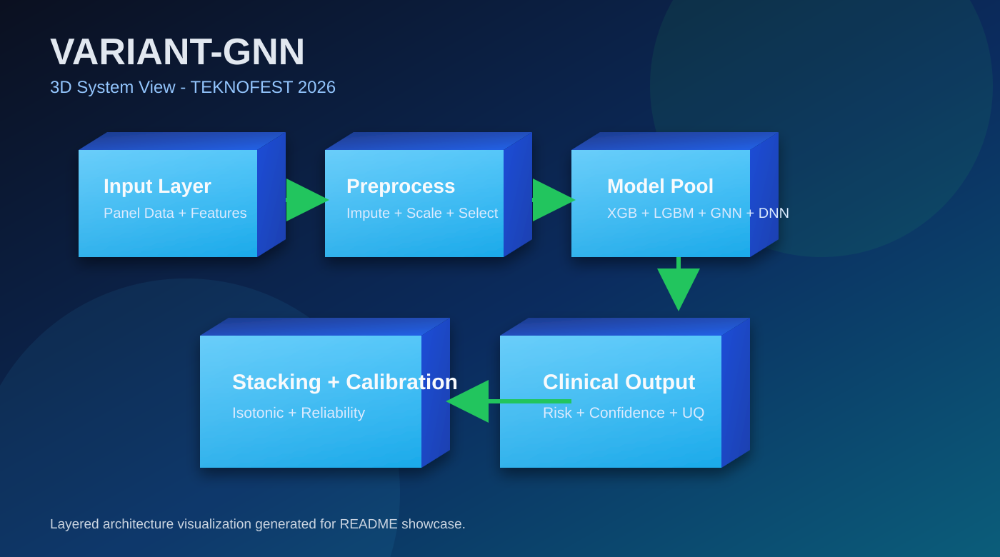
</p>


## 📂 Project Identity & Metadata

<div align="center">

| 🏷️ Attribute | 📋 Details |
| :--- | :--- |
| **Project Name** | `VARIANT-GNN` |
| **Mission** | Clinical Decision Support via Variant Classification |
| **Team / ID** | **XYRA3** / `#909249` |
| **Category** | TEKNOFEST Health AI (University & Above) |
| **Current Stage** | **PSR: PASSED (93.00/100)** |
| **Next Stage** | **PDR Development (In Progress)** |

</div>

---

## ⚡ Core Engine Features

> [!IMPORTANT]
> VARIANT-GNN is not just a model; it's a **calibrated clinical ecosystem** designed for high-stakes medical decisions.

- 💎 **Hybrid Stacking**: Synergy of XGBoost, LightGBM, GNN, and DNN.
- 📉 **Uncertainty Quantification**: Bayesian-style inference with MC Dropout.
- ⚖️ **Clinical Calibration**: Isotonic regression for real-world probability mapping.
- 🔍 **Transparent Reasoning**: SHAP + LIME + GNNExplainer for "White-Box" results.
- 🌍 **Panel-Adaptive**: Dynamic performance across 4 distinct genetic panels.

---

## 🏗️ 3D Architectural Blueprint (PSR Engine)

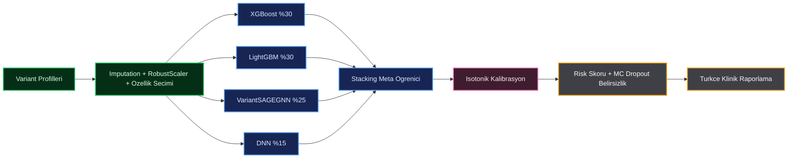
```mermaid
flowchart LR
    classDef prep fill:#052e16,color:#dcfce7,stroke:#22c55e,stroke-width:2px;
    classDef model fill:#172554,color:#dbeafe,stroke:#60a5fa,stroke-width:2px;
    classDef post fill:#3f1d2e,color:#fce7f3,stroke:#f472b6,stroke-width:2px;
    classDef out fill:#3f3f46,color:#fafafa,stroke:#f59e0b,stroke-width:2px;

    A[Variant Profilleri]:::prep --> B[Imputation + RobustScaler + Ozellik Secimi]:::prep
    B --> C1[XGBoost %30]:::model
    B --> C2[LightGBM %30]:::model
    B --> C3[VariantSAGEGNN %25]:::model
    B --> C4[DNN %15]:::model

    C1 --> D[Stacking Meta Ogrenici]:::model
    C2 --> D
    C3 --> D
    C4 --> D

    D --> E[Isotonik Kalibrasyon]:::post
    E --> F[Risk Skoru + MC Dropout Belirsizlik]:::out
    F --> G[Turkce Klinik Raporlama]:::out
```

### Katmanli 3D Hissiyatli Iskelet

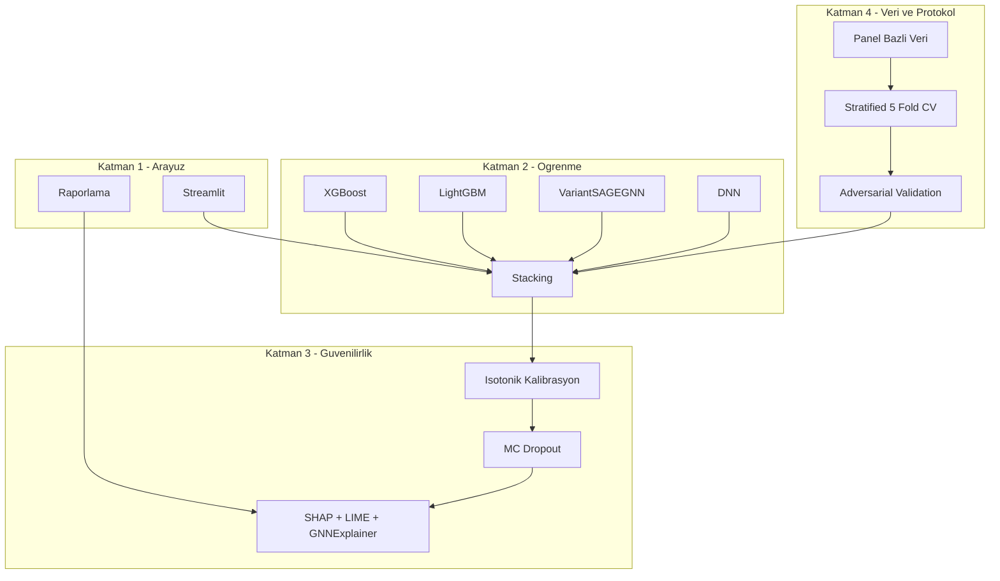
```mermaid
flowchart TB
    subgraph K1[Katman 1 - Arayuz]
      U1[Streamlit]
      U2[Raporlama]
    end

    subgraph K2[Katman 2 - Ogrenme]
      M1[XGBoost]
      M2[LightGBM]
      M3[VariantSAGEGNN]
      M4[DNN]
      M5[Stacking]
    end

    subgraph K3[Katman 3 - Guvenilirlik]
      P1[Isotonik Kalibrasyon]
      P2[MC Dropout]
      P3[SHAP + LIME + GNNExplainer]
    end

    subgraph K4[Katman 4 - Veri ve Protokol]
      D1[Panel Bazli Veri]
      D2[Stratified 5 Fold CV]
      D3[Adversarial Validation]
    end

    U1 --> M5
    U2 --> P3
    M1 --> M5
    M2 --> M5
    M3 --> M5
    M4 --> M5
    M5 --> P1
    P1 --> P2
    P2 --> P3
    D1 --> D2 --> D3 --> M5
```

## Visual Showcase (Renkli + Dinamik)

<p align="center">
  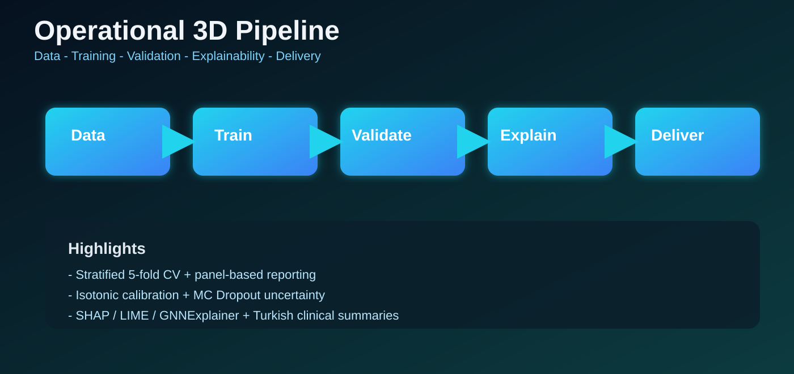
</p>

### 0) 3D Dataflow Galaxy

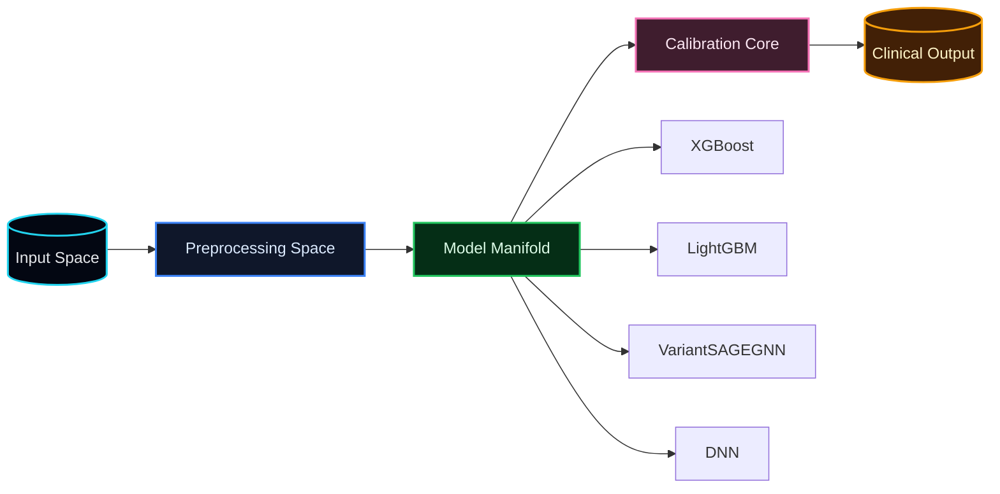
```mermaid
flowchart LR
    classDef n0 fill:#030712,color:#e5e7eb,stroke:#22d3ee,stroke-width:2px;
    classDef n1 fill:#0f172a,color:#dbeafe,stroke:#3b82f6,stroke-width:2px;
    classDef n2 fill:#052e16,color:#dcfce7,stroke:#22c55e,stroke-width:2px;
    classDef n3 fill:#3f1d2e,color:#fce7f3,stroke:#f472b6,stroke-width:2px;
    classDef n4 fill:#422006,color:#fef3c7,stroke:#f59e0b,stroke-width:2px;

    I[(Input Space)]:::n0 --> P[Preprocessing Space]:::n1 --> M[Model Manifold]:::n2 --> C[Calibration Core]:::n3 --> O[(Clinical Output)]:::n4
    M --> X1[XGBoost]
    M --> X2[LightGBM]
    M --> X3[VariantSAGEGNN]
    M --> X4[DNN]
```

### 1) PSR Konu Haritasi

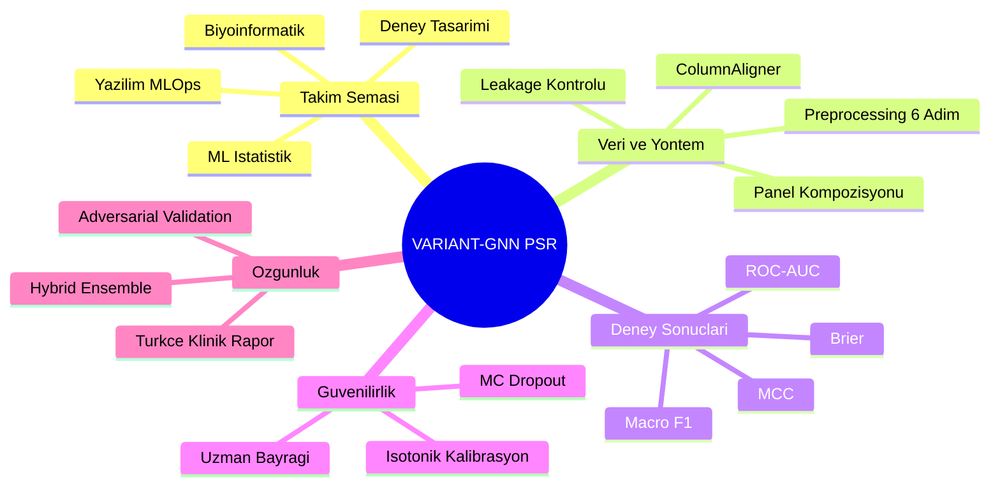
```mermaid
mindmap
  root((VARIANT-GNN PSR))
    Takim Semasi
      Biyoinformatik
      ML Istatistik
      Yazilim MLOps
      Deney Tasarimi
    Veri ve Yontem
      Panel Kompozisyonu
      Leakage Kontrolu
      ColumnAligner
      Preprocessing 6 Adim
    Deney Sonuclari
      Macro F1
      ROC-AUC
      MCC
      Brier
    Guvenilirlik
      Isotonik Kalibrasyon
      MC Dropout
      Uzman Bayragi
    Ozgunluk
      Hybrid Ensemble
      Adversarial Validation
      Turkce Klinik Rapor
```

### 2) Uctan Uca Is Akisi (3D Katman Gecisi)

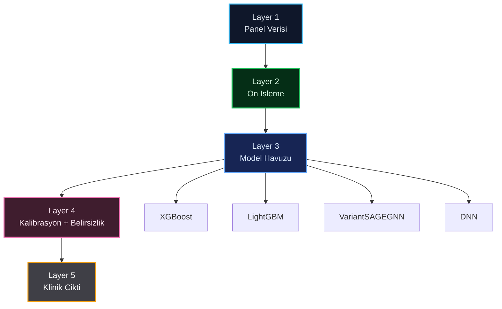
```mermaid
flowchart TD
    classDef l1 fill:#0f172a,color:#e2e8f0,stroke:#38bdf8,stroke-width:2px;
    classDef l2 fill:#052e16,color:#dcfce7,stroke:#22c55e,stroke-width:2px;
    classDef l3 fill:#172554,color:#dbeafe,stroke:#60a5fa,stroke-width:2px;
    classDef l4 fill:#3f1d2e,color:#fce7f3,stroke:#f472b6,stroke-width:2px;
    classDef l5 fill:#3f3f46,color:#fafafa,stroke:#f59e0b,stroke-width:2px;

    A[Layer 1\nPanel Verisi]:::l1 --> B[Layer 2\nOn Isleme]:::l2 --> C[Layer 3\nModel Havuzu]:::l3 --> D[Layer 4\nKalibrasyon + Belirsizlik]:::l4 --> E[Layer 5\nKlinik Cikti]:::l5

    C --> C1[XGBoost]
    C --> C2[LightGBM]
    C --> C3[VariantSAGEGNN]
    C --> C4[DNN]
```

### 3) Ensemble Agirlik Dagilimi

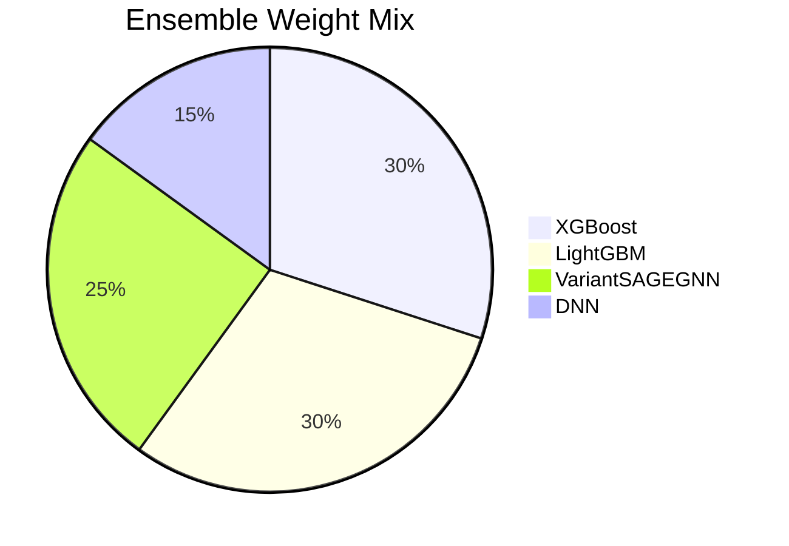
```mermaid
pie title Ensemble Weight Mix
    "XGBoost" : 30
    "LightGBM" : 30
    "VariantSAGEGNN" : 25
    "DNN" : 15
```

### 4) Panel Veri Buyuklugu Dagilimi (Toplam)

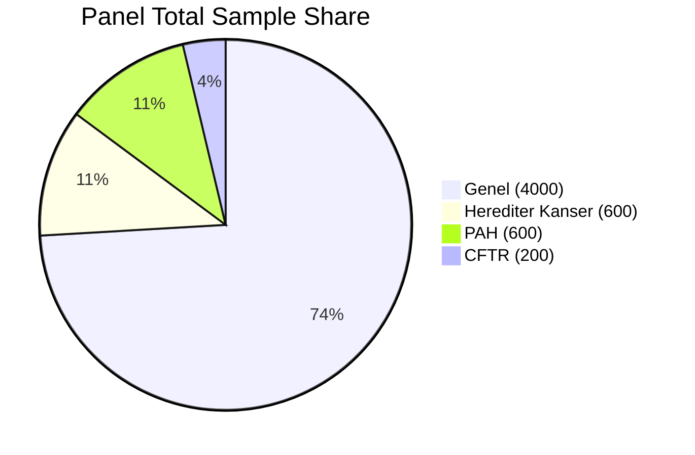
```mermaid
pie title Panel Total Sample Share
    "Genel (4000)" : 4000
    "Herediter Kanser (600)" : 600
    "PAH (600)" : 600
    "CFTR (200)" : 200
```

### 5) Klinik Karar Mantigi

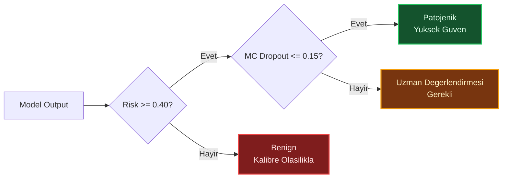
```mermaid
flowchart LR
    classDef hi fill:#14532d,color:#dcfce7,stroke:#22c55e,stroke-width:2px;
    classDef mid fill:#78350f,color:#fef3c7,stroke:#f59e0b,stroke-width:2px;
    classDef lo fill:#7f1d1d,color:#fee2e2,stroke:#ef4444,stroke-width:2px;

    S[Model Output] --> T{Risk >= 0.40?}
    T -- Evet --> U{MC Dropout <= 0.15?}
    U -- Evet --> P[Patojenik\nYuksek Guven]:::hi
    U -- Hayir --> R[Uzman Degerlendirmesi\nGerekli]:::mid
    T -- Hayir --> B[Benign\nKalibre Olasilikla]:::lo
```

### 6) Deney Takvimi ve Asamalar

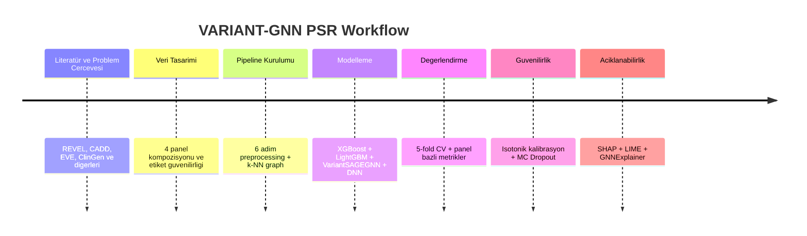
```mermaid
timeline
    title VARIANT-GNN PSR Workflow
    Literatür ve Problem Cercevesi : REVEL, CADD, EVE, ClinGen ve digerleri
    Veri Tasarimi : 4 panel kompozisyonu ve etiket guvenilirligi
    Pipeline Kurulumu : 6 adim preprocessing + k-NN graph
    Modelleme : XGBoost + LightGBM + VariantSAGEGNN + DNN
    Degerlendirme : 5-fold CV + panel bazli metrikler
    Guvenilirlik : Isotonik kalibrasyon + MC Dropout
    Aciklanabilirlik : SHAP + LIME + GNNExplainer
```

### 7) Durum Makinesi (Tahmin Sonrasi)

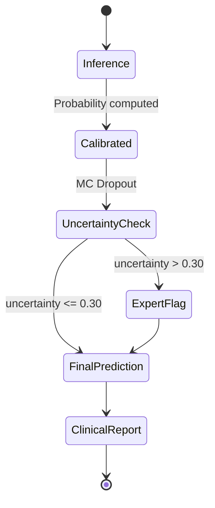
```mermaid
stateDiagram-v2
    [*] --> Inference
    Inference --> Calibrated: Probability computed
    Calibrated --> UncertaintyCheck: MC Dropout
    UncertaintyCheck --> ExpertFlag: uncertainty > 0.30
    UncertaintyCheck --> FinalPrediction: uncertainty <= 0.30
    ExpertFlag --> FinalPrediction
    FinalPrediction --> ClinicalReport
    ClinicalReport --> [*]
```

  ### 8) 3D Katman Kupi

  ```mermaid
  flowchart TB
    classDef c1 fill:#1e3a8a,color:#dbeafe,stroke:#60a5fa,stroke-width:3px;
    classDef c2 fill:#14532d,color:#dcfce7,stroke:#22c55e,stroke-width:3px;
    classDef c3 fill:#7c2d12,color:#ffedd5,stroke:#fb923c,stroke-width:3px;
    classDef c4 fill:#581c87,color:#f3e8ff,stroke:#c084fc,stroke-width:3px;

    A[Cube Layer A\nData Geometry]:::c1 --> B[Cube Layer B\nRepresentation Learning]:::c2 --> C[Cube Layer C\nReliability Engineering]:::c3 --> D[Cube Layer D\nClinical Reporting]:::c4
  ```

---

---

## 📊 PSR Performance Scoreboard (Official: 93.00)

<div align="center">

| Section | Domain | Score / Max | Progress |
| :--- | :--- | :---: | :--- |
| **01** | International Literature & Summary | `9.67` / 10 |  |
| **02** | Data & Methodology | `30.00` / 30 |  |
| **03** | Experiment Design & Analysis | `21.66` / 25 |  |
| **04** | Originality & Resources | `22.34` / 25 |  |
| **05** | Formatting & References | `9.33` / 10 |  |
| 🏆 | **FINAL SCORE** | **93.00** / 100 |  |

</div>

> [!CAUTION]
> ### 🛡️ PDR Improvement Roadmap (Fixing the Gaps)
> While we achieved an elite score of 93.00, our focus for the **PDR (Project Detail Report)** phase is to fix:
> 1.  **Explainability (3.33/5)**: Moving from static SHAP plots to interactive, path-based GNN explanations.
> 2.  **Technique Evolution (3.33/5)**: Better documenting the "Aha!" moments during hyperparameter tuning.

---

## 📖 Contents

1. Takim Semasi
2. Uluslararasi Makale Ozetleri
3. Veri ve Yontem
4. Deney Tasarimi, Sonuclar ve Inceleme
5. Yaklasimin Gerekcesi, Kaynak Kullanimi ve Ozgunluk
6. Referanslar

---

---

## 🛠️ 1) Team Structure & QA

| 👤 Role | 🎯 Responsibility | 📝 Focus Area |
| :--- | :--- | :--- |
| **Bioinformatics Expert** | Data & Label Integrity | ACMG Compliance, ClinVar Validation |
| **ML / Stats Expert** | Model Development | Hybrid Ensemble, Optuna, Calibration |
| **Software Engineer** | MLOps & Interface | CI/CD, Docker, Streamlit API |
| **Experiment Designer** | Validation & Reporting | 5-Fold CV, Adversarial Validation |

> [!NOTE]
> **Quality Control Protocols:** All experimental logs are stored in `cv_report.json`. Code integrity is maintained via strict PR reviews and commit-based model versioning.

---

## 📚 2) State-of-the-Art Literature Review

| Source | Approach | Metric | PSR Limitations | **VARIANT-GNN Edge** |
| :--- | :--- | :---: | :--- | :--- |
| **REVEL (2016)** | Meta-Ensemble | AUC 0.91 | Single Modality | Panel-Independent Eval |
| **CADD (2019)** | SVM+NN Hybrid | PHRED | Coord. Dependency | Functional Profiles |
| **Ghosh (2022)** | XGBoost | F1 0.88 | Imbalance | SMOTE + WeightedBCE |
| **EVE (2021)** | Unsupervised VAE | AUC 0.89 | Single Modality | Graph + Sequence Fusion |

---

## 🧬 3) Data Architecture & Methodology

### 3.1 Kullanilan Veri Seti ve Etiketler

PSR'da belirtilen panel kompozisyonu:

| Panel | Patojenik (Egitim) | Benign (Egitim) | Patojenik (Test) | Benign (Test) | Toplam |
|---|---:|---:|---:|---:|---:|
| Genel | 1500 | 1500 | 1000 | 1000 | 4000 |
| Herediter Kanser | 200 | 200 | 100 | 100 | 600 |
| PAH | 200 | 200 | 100 | 100 | 600 |
| CFTR | 70 | 70 | 30 | 30 | 200 |

Etiketleme notu:
- Pathogenic/Likely Pathogenic birlestirildi
- Benign/Likely Benign birlestirildi
- VUS dislandi

### 3.2 Veri Kisitlari ve Etikete Dogrudan Erisimi Engelleme

- Sütun isimleri ve genomik adresler gizli
- ColumnAligner: dtype + IQR + aralik ile biyolojik kategori esleme
- Sızıntı kontrolu: fit sadece egitim fold'unda
- Adversarial validation:
  - Genel AUC 0.512
  - Herediter Kanser AUC 0.505
  - PAH AUC 0.498
  - CFTR AUC 0.521

### 3.3 Veri On Isleme ve Temsilleme

PSR'daki 6 adimli pipeline:
1. Medyan imputation
2. RobustScaler
3. VarianceThreshold + SelectKBest (k=35)
4. AutoEncoder (43 -> 16)
5. SMOTE
6. Cosine k-NN graf (esik 0.3, k=10)

### 3.4 Etiket Guvenilirligi ve Veri Kalitesi

- Tekrar eden kayit: 47 (egitimden cikarildi)
- Aykiri deger: 312 ornek (%7.9), RobustScaler ile yonetildi
- Tutarsiz profil: 89 ornek, egitim agirligi 0.5'e dusuruldu

### 3.5 Sinif Dengesi ve Klinik Risk Perspektifi

| Hata Tipi | Klinik Sonuc | Risk | Onlem |
|---|---|---|---|
| Yanlis Negatif | Hastalik yapici varyant kacirimi | Yuksek | Esik 0.40, duyarlilik onceligi |
| Yanlis Pozitif | Gereksiz yonlendirme ve anksiyete | Orta | Isotonik kalibrasyon + belirsizlik uyarisi |

CFTR notu:
- Kucuk panel stabilizasyonu: minimum 20+20, SMOTE %30, patience=20, transfer learning

### 3.6 Secilen Algoritmalar ve Gerekce

- XGBoost + LightGBM: guclu tablosal ogrenme
- VariantSAGEGNN: iliskisel sinyal ve indüktif genelleme
- DNN: derin etkilesim ogrenimi
- Stacking: adaptif birlesim
- Isotonik kalibrasyon: olasilik guvenilirligi

---

## 4) Deney Tasarimi, Sonuclar ve Inceleme

### 4.1 Deney Protokolu

- Veri bolme: %65 egitim, %15 kalibrasyon, %20 test
- Stratified 5-fold CV
- random_state 42, deterministic ayarlar
- Optuna Bayesian TPE, 30 deneme

### 4.2 Panel Bazli Performans Sonuclari

| Panel | Macro F1 | ROC-AUC | MCC | Brier |
|---|---:|---:|---:|---:|
| Genel | 0.945 +/- 0.003 | 0.976 | 0.892 | 0.048 |
| Herediter Kanser | 0.938 +/- 0.005 | 0.971 | 0.880 | 0.051 |
| PAH | 0.941 +/- 0.004 | 0.974 | 0.885 | 0.049 |
| CFTR | 0.925 +/- 0.012 | 0.962 | 0.852 | 0.065 |

### 4.3 Hata Analizi

- Testte 2400 ornekte 142 hata (%5.9)
- Hata kumesi belirsizlik ortalamasi: 0.40
- Dogru tahminlerde belirsizlik ortalamasi: 0.12
- Yuksek belirsizlikte uzman degerlendirmesi bayragi

### 4.4 Aciklanabilirlik

- Sütun isimleri gizli oldugu icin grup-bazli aciklama
- SHAP, LIME, GNNExplainer kullanimi
- Turkce klinik metin uretimi

### 4.5 Ogrenme Sureci ve Teknik Evrim

- Overfitting sorunu: Dropout + early stopping + L2 ile iyilestirme
- CFTR kararsizligi: SMOTE + agirlik optimizasyonu ile stabilizasyon
- Kalibrasyon sapmasi: Isotonik regresyon ile duzeltme
- Isimsiz kolon sorunu: ColumnAligner ile cozum

---

## 5) Yaklasimin Gerekcesi, Kaynak Kullanimi ve Ozgunluk

### 5.1 Neden Bu Mimari?

PSR'a gore tek model yeterli degil; heterojen 43 ozellik + iliskisel yapi + kucuk panel problemi nedeniyle hibrit ensemble secildi.

### 5.2 Alternatifler Neden Elendi?

- Sadece XGBoost: graf sinyalini kaciriyor
- Transduktif GCN: yeni varyanta yeniden egitim ihtiyaci
- ESM-2: yuksek maliyet, sinirli kazanım
- AutoML: aciklanabilirlik ve panel kontrolu zayif

### 5.3 Parametre Secimi

PSR parametre ozeti:
- max_depth 6
- learning_rate 0.05
- n_estimators 200
- hidden_dim 128
- dropout 0.3
- ensemble agirliklari: 0.30 / 0.30 / 0.25 / 0.15
- karar esigi: 0.40

### 5.4 Hesaplama Kaynaklari ve Calistirilabilirlik

| Alan | Deger |
|---|---|
| Donanim | i7-12700H, 16 GB RAM, RTX 3060 (opsiyonel) |
| Egitim suresi | CPU ~19 dk, GPU ~9 dk |
| Tek varyant inferans | 42 ms CPU / 18 ms GPU |
| 2000 varyant inferans | 3.8 s CPU / 1.2 s GPU |

### 5.5 Ozgunluk Basliklari

- ColumnAligner
- Grafik + tablo hibrit ensemble
- MC Dropout belirsizlik skoru
- Adversarial validation seffafligi
- Turkce klinik rapor uretimi

---

## 6) Referanslar

1. Ioannidis et al., REVEL, 2016
2. Rentzsch et al., CADD, 2019
3. Ghosh et al., ACMG/AMP + XGBoost, 2022
4. Frazer et al., EVE, 2021
5. Pejaver et al., ClinGen kalibrasyon, 2022
6. Livesey and Marsh, DMS benchmark, 2020
7. Sundaram et al., MutPred2, 2018

---

---

<div align="center">

### 🛡️ VARIANT-GNN: Clinical Excellence through Intelligence

**TEKNOFEST 2026 | XYRA3 Team**

[Explore Code](https://github.com/) • [Technical Docs](docs/) • [Report Bug](issues/)


</div>
