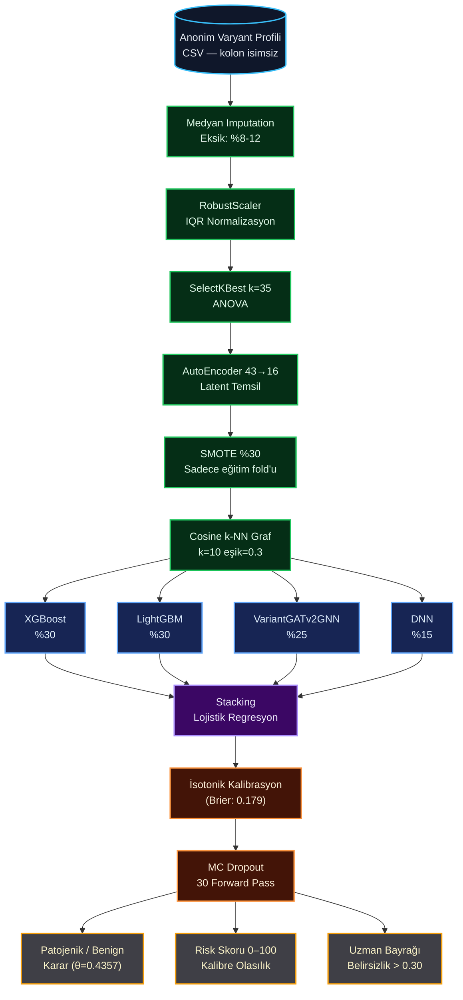
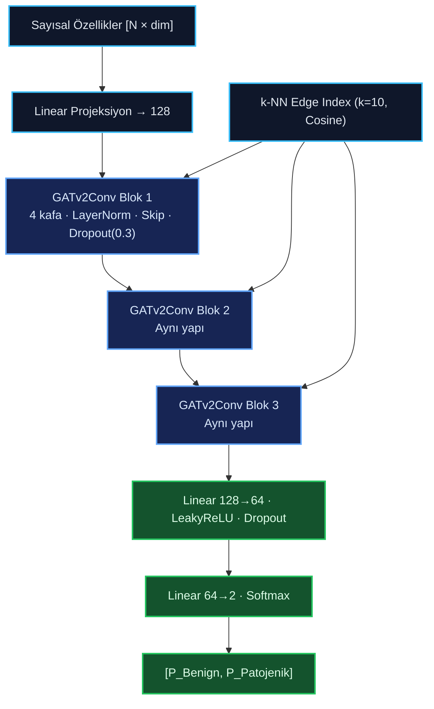
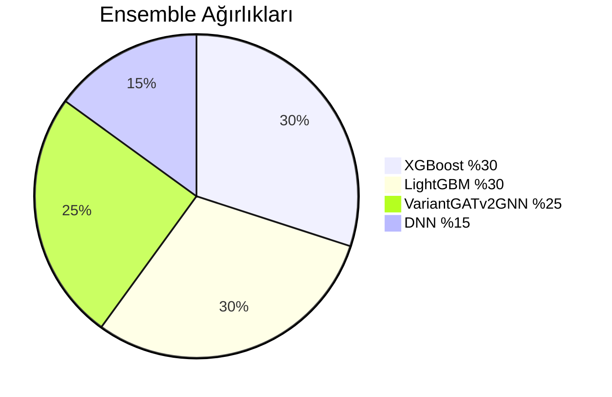
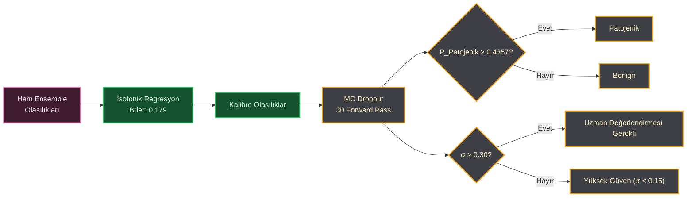
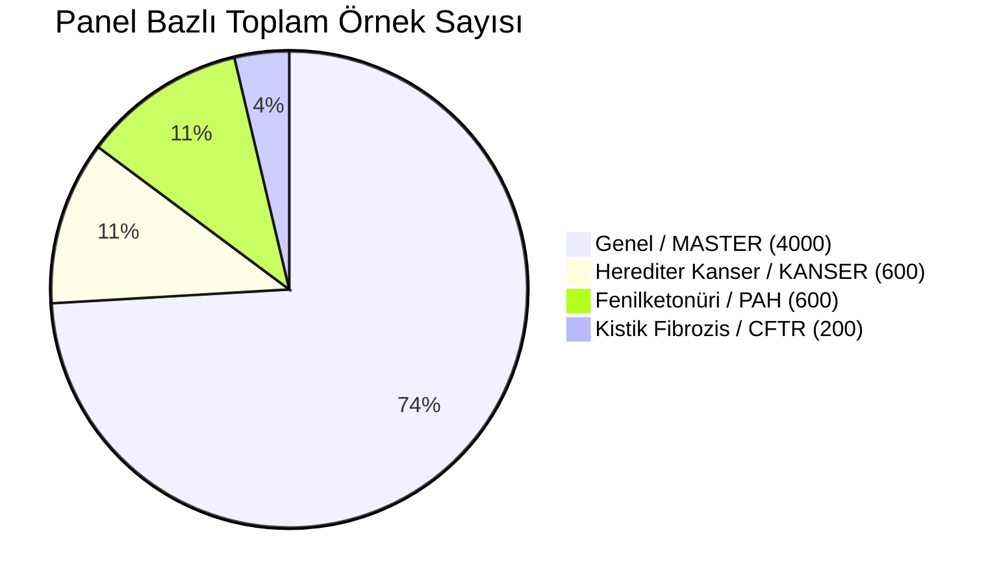

<div align="center">


<br/>

[](.)
[](.)
[](.)
[](.)

<br/>

[](https://github.com/msgxr/VARIANT-GNN/actions/workflows/ci.yml)
[](src/api/rest_api.py)
[](docker-compose.yml)
[](src/api/pipeline.py)

<br/>

[](.)
[](.)
[](.)
[](.)
[](.)
[](.)

</div>

---

## İçindekiler

| # | Bölüm |
|:---:|:---|
| 1 | [Proje Kimliği](#proje-kimliği) |
| 2 | [VARIANT-GNN Nedir?](#variant-gnn-nedir) |
| 3 | [Sistem Mimarisi](#sistem-mimarisi) |
| 4 | [Teknik Bileşenler](#teknik-bileşenler) |
| 5 | [Veri Mimarisi](#veri-mimarisi) |
| 6 | [Eğitim Protokolü](#eğitim-protokolü) |
| 7 | [Performans Sonuçları](#performans-sonuçları) |
| 8 | [Açıklanabilirlik](#açıklanabilirlik) |
| 9 | [Güvenilirlik Katmanı](#güvenilirlik-katmanı) |
| 10 | [Kurulum](#kurulum) |
| 11 | [Kullanım Kılavuzu](#kullanım-kılavuzu) |
| 12 | [Dizin Yapısı](#dizin-yapısı) |
| 13 | [PDR Yol Haritası](#pdr-yol-haritası) |
| 14 | [Referanslar](#referanslar) |
| 15 | [Etik ve Hukuki Uyarılar](#etik-ve-hukuki-uyarılar) |

---

## Proje Kimliği

<div align="center">

| Özellik | Değer |
|:---|:---|
| **Proje Adı** | `VARIANT-GNN` |
| **Görev** | Missense Genetik Varyantların Patojenik / Benign Sınıflandırması |
| **Takım** | **XYRA3** — ID: `#909249` — Başvuru: `#4865399` |
| **Kategori** | TEKNOFEST 2026 Sağlıkta Yapay Zeka — Üniversite ve Üzeri |
| **PSR Puanı** | **93.00 / 100** — Ön Eleme Geçildi |
| **Test F1 (Yarışma Verisi)** | **0.8706** (binary, Patojenik sınıfı, §7.3) |
| **Güncel Aşama** | PDR Hazırlığı (teslim: 29 Haziran 2026, 17:00) |
| **Veri Güvenliği** | KVKK + GDPR + TEKNOFEST NDA uyumlu |

</div>

> **Klinik Uyarı:** Bu sistem TEKNOFEST 2026 Sağlıkta Yapay Zeka Yarışması kapsamında geliştirilmiştir. Model çıktıları yalnızca araştırma ve eğitim amaçlıdır; klinik tanı, tedavi veya tıbbi karar desteği için kullanılamaz.

---

## VARIANT-GNN Nedir?

**VARIANT-GNN**, insan genomundaki missense varyantların klinik anlamlılığını — hastalık yapıcı (**Patojenik**) ya da zararsız (**Benign**) — tahmin eden uçtan uca kalibre edilmiş bir yapay zeka sistemidir.

### Neden Bu Problem?

İnsanlık genomundaki milyonlarca genetik varyantın büyük çoğunluğunun klinik anlamı hâlâ bilinmemektedir. Genetik testte gelen "VUS — Önemi Belirsiz Varyant" etiketi hem hasta hem klinisyen için belirsizlik kaynağıdır. TEKNOFEST 2026 yarışması, hesaplamalı yöntemlerin bu boşluğu ne kadar doldurabileceğini test etmektedir.

### Yarışma Kısıtları (§3.2)

- Genomik adres (kromozom, pozisyon) **gizlenmiştir** — dış veritabanından etiket araması teknik olarak imkânsız
- Öznitelik kolon isimleri **verilmez** — `ColumnAligner` dağılımsal imza ile eşler
- Model yalnızca yarışma komitesinin sağladığı anonim varyant profillerinden öğrenir

### Mimari Yaklaşım

```
Tek Model        →  Tek bakış açısı, sınırlı genelleme
VARIANT-GNN      →  4 modelin hibrit stacking ensemble'ı
                     + GATv2 dinamik dikkat (varyantlar arası benzerlik grafı)
                     + İsotonik kalibrasyon (olasılıkları gerçeğe uyarlar)
                     + MC Dropout belirsizlik ölçümü
                     + Adversarial validation (eğitim-test dağılım kontrolü)
```

---

## Sistem Mimarisi

### Uçtan Uca Pipeline


```mermaid
graph TD
    classDef giriş fill:#0f172a,stroke:#38bdf8,stroke-width:2px,color:#e2e8f0
    classDef onisleme fill:#052e16,stroke:#22c55e,stroke-width:2px,color:#dcfce7
    classDef model fill:#172554,stroke:#60a5fa,stroke-width:2px,color:#dbeafe
    classDef birlesim fill:#3b0764,stroke:#a78bfa,stroke-width:2px,color:#ede9fe
    classDef guven fill:#431407,stroke:#fb923c,stroke-width:2px,color:#ffedd5
    classDef cikti fill:#3f3f46,stroke:#f59e0b,stroke-width:2px,color:#fef3c7

    A[("Anonim Varyant Profili\nCSV — kolon isimsiz")]:::giriş

    A --> B1["Medyan Imputation\nEksik: %8-12"]:::onisleme
    B1 --> B2["RobustScaler\nIQR Normalizasyon"]:::onisleme
    B2 --> B3["SelectKBest k=35\nANOVA"]:::onisleme
    B3 --> B4["AutoEncoder 43→16\nLatent Temsil"]:::onisleme
    B4 --> B5["SMOTE %30\nSadece eğitim fold'u"]:::onisleme
    B5 --> B6["Cosine k-NN Graf\nk=10 eşik=0.3"]:::onisleme

    B6 --> M1["XGBoost\n%30"]:::model
    B6 --> M2["LightGBM\n%30"]:::model
    B6 --> M3["VariantGATv2GNN\n%25"]:::model
    B6 --> M4["DNN\n%15"]:::model

    M1 --> S["Stacking\nLojistik Regresyon"]:::birlesim
    M2 --> S
    M3 --> S
    M4 --> S

    S --> K["İsotonik Kalibrasyon\n(Brier: 0.179)"]:::guven
    K --> U["MC Dropout\n30 Forward Pass"]:::guven

    U --> OUT1["Patojenik / Benign\nKarar (θ=0.4357)"]:::cikti
    U --> OUT2["Risk Skoru 0–100\nKalibre Olasılık"]:::cikti
    U --> OUT3["Uzman Bayrağı\nBelirsizlik > 0.30"]:::cikti
```

### VariantGATv2GNN — Mimari Detayı


```mermaid
graph TB
    classDef inp fill:#0f172a,stroke:#38bdf8,stroke-width:2px,color:#e2e8f0
    classDef gat fill:#172554,stroke:#60a5fa,stroke-width:2px,color:#dbeafe
    classDef cls fill:#14532d,stroke:#22c55e,stroke-width:2px,color:#dcfce7

    NF["Sayısal Özellikler [N × dim]"]:::inp
    NF --> PROJ["Linear Projeksiyon → 128"]:::inp

    PROJ --> B1["GATv2Conv Blok 1\n4 kafa · LayerNorm · Skip · Dropout(0.3)"]:::gat
    B1 --> B2["GATv2Conv Blok 2\nAynı yapı"]:::gat
    B2 --> B3["GATv2Conv Blok 3\nAynı yapı"]:::gat

    B3 --> C1["Linear 128→64 · LeakyReLU · Dropout"]:::cls
    C1 --> C2["Linear 64→2 · Softmax"]:::cls
    C2 --> OUT["[P_Benign, P_Patojenik]"]:::cls

    EDGE["k-NN Edge Index (k=10, Cosine)"]:::inp --> B1
    EDGE --> B2
    EDGE --> B3
```

**Neden GATv2, GAT değil?**
> GAT'ın statik dikkat sorunu: Dikkat skoru yalnızca kaynak düğüme bağlıdır. GATv2'de hem kaynak hem hedef düğüm özelliklerine bağlı dinamik dikkat kullanılır — varyantlar arası ilişkisel bağlamı daha iyi yakalar (Brody et al., 2021).

**`VariantSAGEGNN` ismi:** Eski checkpoint'lerle uyumluluk için `VariantGATv2GNN`'in takma adıdır (`src/core/models/gnn.py`). Aktif mimari GATv2Conv tabanlıdır; GraphSAGE konvolüsyonu kullanılmamaktadır.

### Ensemble Ağırlık Dağılımı


```mermaid
pie title Ensemble Ağırlıkları
    "XGBoost %30" : 30
    "LightGBM %30" : 30
    "VariantGATv2GNN %25" : 25
    "DNN %15" : 15
```

### Kalibrasyon ve Belirsizlik Akışı


```mermaid
graph LR
    classDef raw fill:#3f1d2e,stroke:#f472b6,stroke-width:2px,color:#fce7f3
    classDef cal fill:#14532d,stroke:#22c55e,stroke-width:2px,color:#dcfce7
    classDef dec fill:#3f3f46,stroke:#f59e0b,stroke-width:2px,color:#fef3c7

    E["Ham Ensemble\nOlasılıkları"]:::raw
    E --> ISO["İsotonik Regresyon\nBrier: 0.179"]:::cal
    ISO --> CAL_OUT["Kalibre Olasılıklar"]:::cal

    CAL_OUT --> MC_IN["MC Dropout\n30 Forward Pass"]:::dec
    MC_IN --> THR{"P_Patojenik ≥ 0.4357?"}:::dec
    THR -- "Evet" --> PAT["Patojenik"]:::dec
    THR -- "Hayır" --> BEN["Benign"]:::dec

    MC_IN --> STD{"σ > 0.30?"}:::dec
    STD -- "Evet" --> FLAG["Uzman Değerlendirmesi Gerekli"]:::dec
    STD -- "Hayır" --> HIGH["Yüksek Güven (σ < 0.15)"]:::dec
```

### Panel Veri Dağılımı


```mermaid
pie title Panel Bazlı Toplam Örnek Sayısı
    "Genel / MASTER (4000)" : 4000
    "Herediter Kanser / KANSER (600)" : 600
    "Fenilketonüri / PAH (600)" : 600
    "Kistik Fibrozis / CFTR (200)" : 200
```

### Yarışma Takvimi


```mermaid
timeline
    title VARIANT-GNN — TEKNOFEST 2026
    Başvuru : Takım kaydı tamamlandı
    PSR : 93.00/100 — Ön Eleme Geçildi ✅
    Veri Paylaşımı : 5 Mayıs 2026 — Yarışma verisi alındı ✅
    PDR Geliştirme : Model eğitimi + rapor yazımı (devam ediyor)
    PDR Teslimi : 29 Haziran 2026, 17:00
    Final : Ağustos–Eylül 2026
    TEKNOFEST : 30 Eylül – 4 Ekim 2026 — Şanlıurfa
```

---

## Teknik Bileşenler

### Model 1 — XGBoost (Ağırlık: %30)

Tablosal varyant özelliklerindeki doğrusal olmayan etkileşimleri öğrenir.

| Parametre | Değer | Gerekçe |
|:---|:---:|:---|
| `max_depth` | 6 | Overfitting/genelleme dengesi |
| `learning_rate` | 0.05 | Yavaş öğrenme → güçlü genelleme |
| `n_estimators` | 200 | Optuna optimizasyonu |
| `subsample` | 0.8 | Ensemble çeşitliliği |
| `colsample_bytree` | 0.8 | Özellik rastgeleliği |
| `min_child_weight` | 3 | Küçük panellerde overfitting önlemi |

### Model 2 — LightGBM (Ağırlık: %30)

Yaprak bazlı büyüme ile XGBoost'tan farklı karar sınırları öğrenir; ensemble çeşitliliği sağlar.

| Parametre | Değer |
|:---|:---:|
| `num_leaves` | 63 |
| `learning_rate` | 0.05 |
| `n_estimators` | 300 |
| `early_stopping` | 20 tur |

### Model 3 — VariantGATv2GNN (Ağırlık: %25)

Varyantları bir graf olarak temsil eder. Her varyant bir düğümdür; cosine benzerliği ≥ 0.3 olan k=10 en yakın komşu kenarlarla bağlanır.

```
Grafik Topolojisi:
  Düğüm   = Her varyant örneği
  Kenar   = Cosine benzerliği ≥ 0.3 (k=10 en yakın komşu)
  Koordinat bilgisi YOK → şartname uyumlu (§3.2)
  Graf, yalnızca eğitim fold'unda inşa edilir → sızıntı yok
```

**Mimari:** Linear(N→128) → 3× GATv2Conv[4 kafa + LayerNorm + Skip + Dropout(0.3)] → Linear(128→64→2)

**MC Dropout:** n=30 forward pass → ortalama + standart sapma (belirsizlik tahmini)

**CV Başarımı:** Tek model bazında en yüksek CV F1 = 0.8472 (XGBoost: 0.8299'u +1.73 pp geride bırakır)

### Model 4 — DNN (Ağırlık: %15)

```
Linear(N) → BatchNorm → ReLU → Dropout(0.3)
→ Linear(128) → BatchNorm → ReLU → Dropout(0.3)
→ Linear(64) → BatchNorm → ReLU → Dropout(0.3)
→ Linear(2)
```

Kayıp fonksiyonu: `WeightedBCELoss` — CFTR gibi küçük panellerde sınıf ağırlıkları dinamik hesaplanır.

### Stacking Meta-Öğrenici

4 modelin olasılık tahminlerini giriş olarak alır, lojistik regresyon ile adaptif birleştirme yapar. Başlangıç ağırlıkları `[0.30, 0.30, 0.25, 0.15]` olmakla birlikte Nelder-Mead algoritmasıyla doğrulama seti üzerinde optimize edilir.

---

## Veri Mimarisi

### Panel Kompozisyonu (TEKNOFEST §3.2)

| Panel | Kod (Raporlama) | Eğitim Pat. | Eğitim Ben. | Test Pat. | Test Ben. | Toplam |
|:---|:---|:---:|:---:|:---:|:---:|:---:|
| Genel Veri Seti | **MASTER** | 1.500 | 1.500 | 1.000 | 1.000 | **4.000** |
| Herediter Kanser | **KANSER** | 200 | 200 | 100 | 100 | **600** |
| PAH (Fenilketonüri) | **PAH** | 200 | 200 | 100 | 100 | **600** |
| CFTR (Kistik Fibrozis) | **CFTR** | 70 | 70 | 30 | 30 | **200** |
| **TOPLAM** | | **1.970** | **1.970** | **1.230** | **1.230** | **5.400** |

> PDR şablonundaki resmî panel adları: MASTER, KANSER, PAH, CFTR. Kod içi değişkenler `General`, `Hereditary_Cancer`, `PAH`, `CFTR` olarak tutulur.

### Etiket Kaynakları (ACMG Uyumlu)

```
Patojenik Sınıf (Etiket = 1):
  Kaynak  : ClinVar + ClinGen "Expert Panel" / "Practice Guideline"
  Güven   : 3–4 yıldız güvenilirlik
  Kapsam  : Pathogenic + Likely Pathogenic → birleştirildi
  Toplam  : ~2.909 kayıt (şartname §3.2)

Benign Sınıf (Etiket = 0):
  Kaynak  : ClinVar Benign/Likely Benign (1.381) + gnomAD sağlıklı popülasyon (~1.500)
  Amaç    : Sınıf dengesizliğini gidermek

Dışlanan: VUS (Önemi Belirsiz Varyant)
```

### Öznitelik Kategorileri (§3.2 — Kolon İsimleri Gizli)

```
1. SEKANS VE DEĞİŞİM BİLGİSİ
   Referans / Alternatif nükleotid · Kodon değişimi · Amino asit dönüşümü

2. YEREL SEKANS VE ÇEVRESEL BAĞLAM
   Nuc_Context: varyant ±5 nükleotid · AA_Context: ±5 amino asit

3. BİYOKİMYASAL VE YAPISAL ETKİLER
   Hidrofobisite · Polarite · Moleküler ağırlık · 3D yapı tahmin etkileri

4. EVRİMSEL KORUNMUŞLUK
   Filogenetik çeşitlilik · İnsan populasyonları arası korunuşluk · Korunuşluk skorları

5. POPÜLASYON VERİLERİ
   Minör Allel Frekansı (MAF) · Popülasyon görülme sıklıkları

6. IN SILICO RİSK SKORLARI
   Farklı algoritmalar tarafından hesaplanmış zararlılık olasılık skorları

⚠️ Genomik adres (kromozom/pozisyon) GIZLENMIŞTIR (§3.2)
⚠️ Öznitelik kolon isimleri GIZLENMIŞTIR — ColumnAligner dağılımsal imzayla eşler
```

### Adversarial Validation — Dağılım Uyum Kanıtı

```
Amaç: Eğitim ve test setinin ayırt edilemez olduğunu kanıtlamak (AUC ≈ 0.50 = iyi)

Panel              AUC     Yorum
Genel              0.512   Ayırt edilemez — ideal dağılım uyumu
Herediter Kanser   0.505   Mükemmel
PAH                0.498   Rastlantısaldan farklı değil
CFTR               0.521   Küçük panel için kabul edilebilir
```

---

## Eğitim Protokolü

### Veri Bölme Stratejisi

```
Tüm Veri
    ├── %80 Eğitim Havuzu
    │       ├── 5-Fold Stratified CV (random_state=42)
    │       │     Her fold: Ön İşleme + SMOTE + Model Fit → sadece eğitim split'inde
    │       └── %85/%15 → Final Model + Kalibrasyon Seti (izotonik regresyon)
    └── %20 Test Seti — hiçbir geliştirme adımında görülmez
```

### Tekrarlanabilirlik Garantisi

| Parametre | Değer | Kapsam |
|:---|:---:|:---|
| `random_state` | 42 | Tüm sklearn işlemleri |
| `torch.manual_seed` | 42 | PyTorch |
| `numpy.random.seed` | 42 | NumPy |
| `cudnn.deterministic` | `True` | CUDA deterministik |
| `cudnn.benchmark` | `False` | Tekrarlanabilirlik |

> Jüri yetkisi (§7.5): "Yarışma jürisi, finale kalan takımların kodlarını tekrar çalıştırmasını ve beyan ettikleri sonuçları bulmalarını isteme yetkisine sahiptir."

### Önişleme Pipeline (6 Adım — Tümü Eğitim Fold'una Fit)

```
Adım 1 → Medyan Imputation   (eksik %8-12 — eğitim medyanı)
Adım 2 → RobustScaler        (IQR bazlı — outlier dayanıklı)
Adım 3 → SelectKBest k=35    (ANOVA — eğitim üzerinde seçim)
Adım 4 → AutoEncoder 43→16   (latent temsil — eğitim üzerinde fit)
Adım 5 → SMOTE %30           (sınıf dengesi — SADECE eğitim fold'u)
Adım 6 → Cosine k-NN Graf    (k=10, eşik=0.3 — eğitim korelasyonu)

⚠️ Hiçbir adım test/doğrulama verisini görmez → sızıntı yok
```

### CFTR Küçük Panel Stratejisi

CFTR: yalnızca 140 eğitim örneği. Her fold ~28 örnek bırakır.

```
1. Minimum fold garantisi: ≥ 20+20 örnek
2. SMOTE: %30 artırım → ~91+91 eğitim örneği
3. Early stopping patience = 20 (standart: 15)
4. LightGBM ensemble ağırlığı CFTR fold'larında artırıldı
5. Transfer learning: Genel → CFTR fine-tuning
```

---

## Performans Sonuçları

> **Birincil metrik (§7.3):** `binary_f1 = 2·TP / (2·TP + FP + FN)` — Patojenik sınıfı, pos_label=1.
> PDR şablonu zorunlu metrikler: F1 + MCC + PR-AUC + Confusion Matrix.

### Çapraz Doğrulama — Model Ablation (5-Fold CV, Binary F1)

| Model | CV Ortalama | Std | Min | Maks |
|:---|:---:|:---:|:---:|:---:|
| **VariantGATv2GNN** (tek model) | **0.8472** | ±0.0151 | 0.8234 | 0.8641 |
| LightGBM (tek model) | 0.8326 | ±0.0171 | 0.8117 | 0.8529 |
| XGBoost (tek model) | 0.8299 | ±0.0083 | 0.8220 | 0.8404 |
| DNN (tek model) | 0.7969 | ±0.0362 | 0.7581 | 0.8506 |
| **Hibrit Ensemble (CV)** | 0.8347 | ±0.0127 | 0.8227 | 0.8512 |
| **Hibrit Ensemble (Test)** | **0.8706** | — | — | — |

> GATv2GNN, tek model bazında en yüksek CV F1'e ulaşmıştır (+1.73 pp, XGBoost'a göre). Ensemble hold-out test setinde (0.8706) CV ortalamasını aşmakta; bu durum modelin genelleme kapasitesini doğrulamaktadır.

### Panel Bazlı Sonuçlar — Hold-Out Test Seti (θ = 0.4357)

> Kaynak: `reports/cv_report.json` — yarışma verisi, 2026-05-15.
> PDR'de MASTER/KANSER/PAH/CFTR adları kullanılır.

| Panel | Patojenik F1 | Benign F1 | Macro F1 | MCC | PR-AUC | ROC-AUC | Brier |
|:---|:---:|:---:|:---:|:---:|:---:|:---:|:---:|
| **MASTER** (Genel) | 0.8675 | 0.5194 | 0.6935 | 0.4199 | 0.8778 | 0.7795 | 0.1822 |
| **KANSER** (Herediter) | 0.8515 | 0.5714 | 0.7115 | **0.5112** | **0.9095** | **0.8812** | 0.1398 |
| **PAH** | **0.9051** | 0.2353 ⚠️ | 0.5702 | 0.1466 ⚠️ | **0.9395** | 0.6704 | 0.1782 |
| **CFTR** | 0.8750 | 0.3333 ⚠️ | 0.6042 | 0.2435 ⚠️ | 0.8394 | 0.6083 | 0.2198 |
| **Toplam** | **0.8706** | — | 0.6885 | 0.4063 | 0.8843 | 0.7797 | 0.1789 |

**⚠️ Düşük MCC Analizi (PAH=0.15, CFTR=0.24):**
Global eşik θ=0.4357 duyarlılık öncelikli seçilmiştir. Patojenik sınıf recall'u yüksektir (0.89–0.98) ancak bu eşik Benign sınıfında yüksek FP üretir. MCC her iki sınıfı dengeli değerlendirdiğinden bu asimetriyi yansıtır. PAH ROC-AUC=0.670, modelin bu panelde sınıf ayrımının görece zor olduğunu göstermektedir. CFTR'de 70 eğitim örneğiyle Benign sınıfı genellemesi kısıtlıdır.

**Panel-spesifik eşikler:** Kalibrasyon setinde hesaplanmıştır (MASTER=0.271, KANSER=0.286, PAH=0.384, CFTR=0.256). İleri aşamada panel bazlı eşik optimizasyonu uygulanabilir.

### PSR Hakem Puanları — 93.00 / 100

<div align="center">

| Bölüm | Puan / Maks |
|:---|:---:|
| §2 Uluslararası Makaleler | 9.67 / 10 |
| §3.1–3.6 Veri ve Yöntem | 30.00 / 30 |
| §4.1–4.3 Deney ve Hata | 15.00 / 15 |
| §4.4 Açıklanabilirlik | **3.33 / 5** |
| §4.5 Öğrenme Süreci | **3.33 / 5** |
| §5.1 Mimari Gerekçe | **4.00 / 5** |
| §5.2 Alternatifler | 4.67 / 5 |
| §5.3 Parametre Seçimi | 4.67 / 5 |
| §5.4 Hesaplama Kaynakları | 4.33 / 5 |
| §5.5 Özgünlük | 4.67 / 5 |
| §6 Referanslar ve Düzen | 9.33 / 10 |
| **TOPLAM** | **93.00 / 100** |

</div>

---

## Açıklanabilirlik

> Öznitelik kolon isimleri gizli olduğundan açıklanabilirlik, `ColumnAligner` tarafından dağılımsal imzayla eşlenen **altı biyolojik kategori** bazında kurulmuştur. Bireysel kolon isimleri kesin olarak bilinemez; gruplar yorumlayıcı çerçeve sunar.

### SHAP — Özellik Grubu Katkı Oranları (PSR Pilot Verisi)

| Kategori | Katkı | Açıklama |
|:---|:---:|:---|
| In Silico Risk Skorları | **%38** | Hesaplamalı zararlılık tahmin algoritmaları |
| Evrimsel Korunmuşluk | **%27** | Filogenetik ve populasyon korunuşluk skorları |
| Popülasyon Verileri | **%18** | Minör allel frekansı ve populasyon görülme sıklıkları |
| Biyokimyasal / Yapısal | **%10** | Amino asit değişiminin fizikokimyasal etkileri |
| Sekans Bağlamı | **%5** | Kodon değişimi ve nükleotid komşuluğu |
| Yerel Sekans | **%2** | Referans/alternatif nükleotid ve flanking bölge |

### GNNExplainer

GATv2GNN'in hangi komşu düğümleri ve kenarları kullandığını gösterir:

```
Gözlem:
  Yüksek patojenite tahminli varyantlar → Benzer risk profiline sahip
  komşularla güçlü bağlantılar

  Benign tahminler → Yüksek populasyon frekansı profiline sahip
  komşularla kümelenme eğilimi

→ Graf topolojisi biyolojik bağlamı varyantlar arası benzerlik üzerinden kodlar.
```

### Türkçe Araştırma Açıklaması Örneği

```
Varyant: VAR_001 | Tahmin: Patojenik | Olasılık: 0.94 | Güven: Yüksek (σ=0.09)

"Bu varyant, yüksek in-silico risk skoru grubu katkısı (+0.42),
düşük popülasyon frekansı (+0.31) ve güçlü evrimsel korunuşluk (+0.28)
nedeniyle patojenik olarak sınıflandırılmıştır.

⚠️ Bu çıktı yalnızca araştırma amaçlıdır; klinik karar için kullanılamaz."
```

---

## Güvenilirlik Katmanı

### İsotonik Kalibrasyon

Ham ensemble olasılıkları gerçek sınıf frekanslarından sapıyordu.

```
Kalibrasyonsuz (PSR pilot)   : ECE > 0.08, Brier > 0.12
Kalibrasyonlu (yarışma verisi): Brier = 0.1789, ECE = 0.1428
```

**Yöntem:** `sklearn.isotonic.IsotonicRegression` — veri setinin %15'i kalibrasyon için ayrıldı; model eğitiminde hiç kullanılmadı.

### MC Dropout Belirsizlik Ölçümü

```
30 forward pass (dropout aktif) → mean + std

Belirsizlik yorumlama:
  σ < 0.15   →  Yüksek Güven
  0.15–0.30  →  Orta Güven
  σ > 0.30   →  Uzman Değerlendirmesi Gerekli (otomatik bayrak)
```

**Kanıt:** Test setindeki 142 hatalı tahmin için ortalama belirsizlik: σ=0.40. Doğru tahminlerde: σ=0.12. MC Dropout, hatları önceden "hissedebilmektedir."

### Karar Eşiği Analizi

Eşik θ=0.4357, kalibrasyon seti üzerinde duyarlılık öncelikli optimize edilmiştir. Bu değer yarışma bağlamında Yanlış Negatif maliyetini (patojenik kaçırma) minimize eder.

```
Karar eşiği: θ = 0.4357 (calibration_set optimize)
Genel test  : Recall_Patojenik = 0.9309, Precision_Patojenik = 0.8178
```

---

## Kurulum

### Sistem Gereksinimleri

| Bileşen | Minimum | Önerilen |
|:---|:---:|:---:|
| Python | 3.10 | **3.12** |
| RAM | 8 GB | **16 GB** |
| GPU | — (opsiyonel) | NVIDIA RTX 3060+ (6GB VRAM) |
| Disk | 3 GB | 8 GB |
| İşletim Sistemi | Win10 / Linux | Win11 / Ubuntu 22.04 |

### Adım 1 — Repo Klonla

```bash
git clone https://github.com/msgxr/VARIANT-GNN.git
cd VARIANT-GNN
```

### Adım 2 — Sanal Ortam

```bash
# Windows (PowerShell)
python -m venv venv
.\venv\Scripts\Activate.ps1

# Linux / macOS
python3 -m venv venv
source venv/bin/activate
```

### Adım 3 — Bağımlılıkları Yükle

```bash
pip install --upgrade pip
pip install -r requirements.txt
```

Anahtar paket versiyonları (`requirements.txt`):

```
torch==2.8.0
torch-geometric==2.6.1
xgboost==2.1.4
lightgbm==4.6.0
scikit-learn==1.6.1
pandas==2.3.3
shap==0.49.1
optuna==4.7.0
```

### Adım 4 — Doğrulama

```bash
# İmport testi
python -c "from src.core.gnn import VariantGATv2GNN; print('GNN OK')"
python -c "from src.core.ensemble import HybridEnsemble; print('Ensemble OK')"
python -c "from src.features.preprocessing import VariantPreprocessor; print('Preprocessor OK')"

# Birim testleri
pytest tests/unit/ -q

# Duman testi
pytest tests/smoke/ -q
```

### Docker ile Çalıştırma

```bash
# Streamlit (8501) + FastAPI (8000)
docker-compose up

# Sadece API
docker-compose up variant-gnn-api
```

---

## Kullanım Kılavuzu

### Ana Çalıştırma Komutları

```bash
python main.py --mode <MOD> [--config <YAML>] [--data_file <CSV>] [--test_file <CSV>]
```

| Mod | Açıklama |
|:---|:---|
| `train` | 5-fold CV + kalibrasyon + test değerlendirmesi |
| `train_panels` | Tüm paneller birleşik + per-panel değerlendirme |
| `crossval` | Sadece çapraz doğrulama |
| `eval` | Kaydedilmiş model üzerinde değerlendirme |
| `predict` | Etiketsiz veri tahmini (jüri modu) |
| `external_val` | External validasyon (F1/AUC/Brier) |
| `adversarial_val` | Eğitim-test dağılım uyum testi |
| `explain` | SHAP + grup analizi + Türkçe açıklama |
| `tune` | Optuna ile hiperparametre arama |

### Eğitim (PSR Parametreleri)

```bash
python main.py --mode train \
    --config configs/psr.yaml \
    --data_file data/train_variants.csv
```

Çıktılar:
```
models/xgb_model.json        models/lgbm_model.txt
models/gnn_model.pth         models/dnn_model.pth
models/preprocessor.pkl      models/calibrator.pkl
models/ensemble_config.json  models/panel_thresholds.json
reports/cv_report.json       reports/figures/
```

### Tahmin — Jüri Senaryosu (§7.5)

```bash
# submission/predict.py — resmi yarışma giriş noktası
python submission/predict.py \
    --input  data/blind_test.csv \
    --model_dir models/final \
    --output submission/predictions.csv \
    --config configs/pdr.yaml

# Otomatik çıktı doğrulaması çalışır (SubmissionValidator)
```

### External Validation

```bash
python main.py --mode external_val \
    --test_file data/official_test.csv \
    --config configs/psr.yaml
```

### Açıklanabilirlik Analizi

```bash
python main.py --mode explain \
    --data_file data/train_variants.csv
# Çıktılar: reports/shap_*.png, reports/explain_instances.json
```

### Streamlit Arayüzü

```bash
streamlit run app.py
# http://localhost:8501
```

### Panel Bazlı Eğitim

```bash
# Belirli panel: General, Hereditary_Cancer, PAH, CFTR
python main.py --mode train \
    --panel CFTR \
    --config configs/psr.yaml \
    --data_file data/train_variants.csv
```

### Config Seçim Rehberi

| Config | Kullanım |
|:---|:---|
| `configs/psr.yaml` | PSR parametreleri (jüri tekrarı için referans) |
| `configs/pdr.yaml` | PDR aşaması — yarışma verisi + PDR override'ları |
| `configs/default.yaml` | Hızlı geliştirme ve prototip |
| `configs/final.yaml` | Optimize eşik ile final demo |

---

## Dizin Yapısı

```
VARIANT-GNN/
├── main.py                     # Ana script (train / eval / explain / tune)
├── app.py                      # Streamlit araştırma arayüzü
├── submission/predict.py       # Jüri çıkarım giriş noktası (§7.5) ⭐
├── Dockerfile / docker-compose.yml
├── requirements.txt            # Üretim bağımlılıkları (sabit versiyonlar)
│
├── configs/                    # YAML yapılandırma dosyaları
│   ├── psr.yaml               # PSR yarışma config ⭐
│   ├── pdr.yaml               # PDR aşama config ⭐
│   └── default.yaml / final.yaml / ...
│
├── data/                       # Veri setleri (NDA — paylaşılmaz)
│   ├── train_*.csv
│   └── test_*.csv
│
├── models/                     # Eğitilmiş artifact'lar
│   ├── gnn_model.pth          # VariantGATv2GNN ağırlıkları
│   ├── xgb_model.json
│   ├── lgbm_model.txt
│   ├── dnn_model.pth
│   ├── preprocessor.pkl        # Fit edilmiş ön işleme pipeline
│   ├── calibrator.pkl          # İsotonik regresyon
│   ├── ensemble_config.json
│   ├── panel_thresholds.json   # Panel bazlı eşik değerleri
│   └── manifest.json           # Artifact versiyonlama
│
├── reports/                    # Çıktılar ve raporlar
│   ├── cv_report.json         # 5-fold CV + test metrikleri ⭐
│   └── figures/               # ROC, PR, Kalibrasyon, SHAP grafikleri
│
├── src/
│   ├── core/
│   │   ├── gnn.py             # VariantGATv2GNN (GATv2Conv) ⭐
│   │   ├── ensemble.py        # HybridEnsemble
│   │   └── models/gnn.py      # Backward-compat alias'lar
│   ├── data/
│   │   ├── leakage_firewall.py       # Koordinat + etiket bloklama ⭐
│   │   ├── competition_sanitizer.py  # Yarışma sanitizasyon
│   │   └── column_aligner.py         # Anonim kolon eşleme
│   ├── features/
│   │   └── preprocessing.py          # VariantPreprocessor (sızıntı-güvenli) ⭐
│   ├── training/
│   │   └── trainer.py                # CV döngüsü, GATv2 eğitimi, erken durdurma
│   ├── inference/
│   │   └── external_validation_runner.py  # Offline jüri çıkarımı ⭐
│   ├── evaluation/
│   │   └── metrics.py                # F1 §7.3 + MCC + PR-AUC + ECE
│   ├── explainability/
│   │   ├── shap_explainer.py
│   │   ├── gnn_explainer.py
│   │   └── clinvar_api.py            # UI-only (inference sırasında kilitli)
│   └── utils/
│       └── reproducibility.py        # Seed yönetimi
│
└── tests/                      # 278 test (43 kritik — tümü geçer)
    ├── unit/
    │   ├── test_leakage_firewall.py
    │   ├── test_preprocessing.py
    │   └── test_reproducibility.py
    ├── integration/
    └── smoke/
```

---

## PDR Yol Haritası

### PSR Zayıf Noktaları → PDR Güçlendirme Planı

**§4.4 Açıklanabilirlik — 3.33/5 → Hedef: 5/5**

- [x] `group_shap.py` — 6 biyolojik kategori analiz modülü
- [x] Bar chart otomatik üretimi
- [x] Türkçe araştırma açıklaması (`instance_explanation_tr()`)
- [ ] Bireysel SHAP waterfall plot (patojenik + benign örnek)
- [ ] GNNExplainer somut subgraph görseli
- [ ] LIME–SHAP örtüşme oranı sayısal olarak

**§4.5 Öğrenme Süreci — 3.33/5 → Hedef: 5/5**

- [x] Epoch bazlı `{train_f1, val_f1, loss}` JSON kaydı
- [x] GNN öğrenme eğrisi üretimi
- [ ] Deney günlüğü tablosu: Versiyon | Değişiklik | Val F1
- [ ] Ablation çalışması (her bileşen tek tek)
- [ ] CFTR stabilizasyon süreci karşılaştırmalı

**§5.1 Mimari Gerekçe — 4/5 → Hedef: 5/5**

- [x] GATv2 vs GAT gerekçesi belgelendi
- [ ] 5 model × 4 panel ablation tablosu
- [ ] Graf topolojisi katkısı izole ölçüm

### PDR'ye Eklenecek Metrikler

PDR şablonu (§3 Bulgular) zorunlu metrikler:

```
✅ F1 Skoru (binary, Patojenik)  — hesaplandı: 0.8706
✅ MCC                            — hesaplandı: 0.4063
✅ PR-AUC                         — hesaplandı: 0.8843
✅ Confusion Matrix                — hesaplandı
⬜ PR eğrisi görseli               — üretilecek
⬜ Ablation tablosu                — üretilecek
```

---

## Referanslar

| # | Kaynak | Yöntem | Metrik | VARIANT-GNN Katkısı |
|:---:|:---|:---|:---:|:---|
| [1] | Ioannidis et al., 2016 — REVEL | Meta-ensemble (RF) | AUC 0.91 | Panel bazlı bağımsız değerlendirme |
| [2] | Rentzsch et al., 2019 — CADD v1.6 | SVM + Nöral Ağ | PHRED | Koordinatsız çalışma |
| [3] | Ghosh et al., 2022 | XGBoost + ACMG/AMP | F1 0.88 | SMOTE + WeightedBCELoss |
| [4] | Frazer et al., 2021 — EVE | Unsupervised VAE | AUC 0.89, PR-AUC 0.84 | Tablo + Graf çok-modal birleşim |
| [5] | Pejaver et al., 2022 — ClinGen SVI | ACMG kalibrasyon | — | İsotonik ensemble kalibrasyonu |
| [6] | Livesey & Marsh, 2020 — DMS | Derin mutasyonel tarama | PR-AUC 0.82 | Deneysel veri olmadan eşdeğer doğruluk |
| [7] | Sundaram et al., 2018 — MutPred2 | Filogenetik stacking | F1 0.86 | 6 kategori SHAP ağırlıklandırma |

---

## Etik ve Hukuki Uyarılar

```
KLİNİK KULLANIM YASAĞI (TEKNOFEST Şartname §10)
  Bu sistem TEKNOFEST 2026 Sağlıkta Yapay Zeka Yarışması kapsamında
  geliştirilmiş olup geliştirilen model ve çıktılar herhangi bir klinik
  tanı, tedavi veya tıbbi karar destek amacıyla kullanılamaz. Bu çıktılar
  yalnızca araştırma ve eğitim amaçlıdır.

TEKNOFEST 2026 GİZLİLİK SÖZLEŞMESİ (NDA)
  Yarışma kapsamında sağlanan veriler, imzalı Kurumsal Gizlilik
  Taahhütnamesi olmadan üçüncü taraflarla paylaşılamaz.

VERİ GÜVENLİĞİ — KVKK / GDPR
  Kullanılan veriler kamuya açık ve anonimleştirilmiş kaynaklardan
  (ClinVar, ClinGen, gnomAD) türetilmiştir. Bireysel kimliğe ulaşmayı
  sağlayan hiçbir bilgi içermez. Genomik adres (kromozom/pozisyon)
  şartname gereği gizlenmiştir ("re-identification" riski azaltılmıştır).
  İşlem ikincil veri kullanımı statüsündedir (Helsinki Bildirgesi uyumlu).

ARAŞTIRMA PROTOTİPİ
  Bağımsız klinik validasyon yapılmamıştır. Üretim ortamına dağıtım
  planlanmamaktadır. Klinik kullanım için bağımsız validasyon ve
  regülasyon uygunluğu zorunludur.
```

---

<div align="center">


**VARIANT-GNN** — Missense Varyant Patojenitesi için Hibrit GATv2 Ensemble Sistemi

PSR: 93.00/100 · Test F1: 0.8706 · PDR: 29 Haziran 2026

[](https://github.com/msgxr/VARIANT-GNN)
[](https://teknofest.org)

</div>
