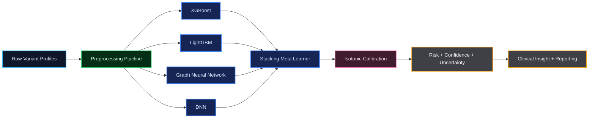
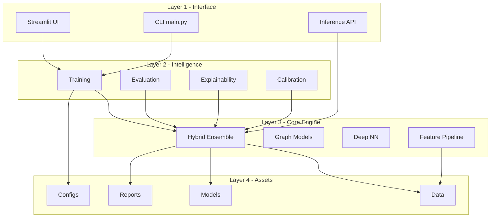

<div align="center">


<br/>

[](https://www.python.org/)
[](https://pytorch.org/)
[](https://pyg.org/)
[](https://xgboost.readthedocs.io/)
[](https://lightgbm.readthedocs.io/)
[](https://streamlit.io/)
[](https://www.docker.com/)
[](#hizli-baslangic)

</div>

---

## VARIANT-GNN Nedir?

VARIANT-GNN, missense genetik varyantlari Patojenik veya Benign olarak siniflandirmak icin gelistirilmis hibrit bir yarisma sistemidir.

Sistemin odagi:
- Koordinat bagimsiz ogrenme
- Panel bazli genelleme
- Kalibrasyon ve belirsizlik farkindaligi
- Klinik anlatimi guclu aciklanabilirlik

Kullandigi cekirdek model bileşenleri:
- XGBoost
- LightGBM
- VariantSAGEGNN / VariantGATv2GNN
- DNN
- Stacking ve post-hoc kalibrasyon

---

## Takim ve Yarisma Bilgisi

| Alan | Deger |
|---|---|
| Proje | VARIANT-GNN |
| Takim | XYRA3 |
| Takim ID | #909249 |
| Basvuru ID | #4865399 |
| Yarisma | TEKNOFEST 2026 - Saglikta Yapay Zeka |
| Seviye | Universite ve Uzeri |

---

## Canli Mimari Gorunumu


```mermaid
flowchart LR
    classDef data fill:#0f172a,color:#e2e8f0,stroke:#38bdf8,stroke-width:2px;
    classDef prep fill:#052e16,color:#dcfce7,stroke:#22c55e,stroke-width:2px;
    classDef model fill:#172554,color:#dbeafe,stroke:#3b82f6,stroke-width:2px;
    classDef eval fill:#3f1d2e,color:#fce7f3,stroke:#f472b6,stroke-width:2px;
    classDef out fill:#3f3f46,color:#fafafa,stroke:#f59e0b,stroke-width:2px;

    A[Raw Variant Profiles]:::data --> B[Preprocessing Pipeline]:::prep
    B --> C1[XGBoost]:::model
    B --> C2[LightGBM]:::model
    B --> C3[Graph Neural Network]:::model
    B --> C4[DNN]:::model

    C1 --> D[Stacking Meta Learner]:::model
    C2 --> D
    C3 --> D
    C4 --> D

    D --> E[Isotonic Calibration]:::eval
    E --> F[Risk + Confidence + Uncertainty]:::out
    F --> G[Clinical Insight + Reporting]:::out
```

### Katmanli Iskelet (3D hissiyatli)


```mermaid
flowchart TB
    subgraph L1[Layer 1 - Interface]
      UI[Streamlit UI]
      CLI[CLI main.py]
      API[Inference API]
    end

    subgraph L2[Layer 2 - Intelligence]
      TR[Training]
      EV[Evaluation]
      XA[Explainability]
      CAL[Calibration]
    end

    subgraph L3[Layer 3 - Core Engine]
      ENS[Hybrid Ensemble]
      GNN[Graph Models]
      DNN[Deep NN]
      FEAT[Feature Pipeline]
    end

    subgraph L4[Layer 4 - Assets]
      DATA[Data]
      MODELS[Models]
      REPORTS[Reports]
      CFG[Configs]
    end

    UI --> TR
    CLI --> TR
    API --> ENS
    TR --> ENS
    EV --> ENS
    XA --> ENS
    CAL --> ENS
    ENS --> DATA
    ENS --> MODELS
    ENS --> REPORTS
    FEAT --> DATA
    TR --> CFG
```

---

## Hedeflenen Klinik Davranis

| Senaryo | Sistem Davranisi |
|---|---|
| Belirgin patojenik profil | Yuksek risk + yuksek guven |
| Belirsiz profil | Risk skoru + belirsizlik etiketi |
| Kucuk panel (CFTR gibi) | Panel-temelli dengeleme ve robust raporlama |
| Raporlama ihtiyaci | SHAP destekli aciklayici cikti + PDF |

Klinik sorumluluk notu:
- Bu sistem karar destek amaclidir.
- Klinik tani ve tedavide tek basina kullanilamaz.

---

## Hizli Baslangic

### 1) Kurulum

```bash
git clone https://github.com/msgxr/VARIANT-GNN.git
cd VARIANT-GNN
python -m venv .venv
# Windows
.venv\Scripts\activate
# Linux/macOS
# source .venv/bin/activate
pip install -r requirements.txt
```

### 2) Egitim

```bash
python main.py --mode train --data_file data/train_variants.csv
```

### 3) Tahmin

```bash
python main.py --mode predict --test_file data/test_variants_blind.csv --output_dir reports/
```

### 4) Arayuz

```bash
streamlit run app.py --server.port 8502
```

### 5) Testler

```bash
pytest -q
```

---

## Guncel Proje Iskeleti

```text
VARIANT-GNN/
├─ app.py
├─ main.py
├─ build_notebook.py
├─ configs/
├─ data/
├─ data_contracts/
├─ docs/
├─ models/
├─ reports/
│  ├─ figures/
│  └─ *.pdf, *.png, *.json
├─ scripts/
│  ├─ data_generation/
│  │  └─ generate_realistic_data.py
│  ├─ notebook/
│  │  └─ build_notebook.py
│  ├─ reporting/
│  │  ├─ generate_activity_report.py
│  │  ├─ generate_competition_plots.py
│  │  └─ generate_report_pdf.py
│  └─ uyumluluk wrapper scriptleri
├─ src/
│  ├─ api/
│  ├─ calibration/
│  ├─ config/
│  ├─ core/
│  ├─ data/
│  ├─ evaluation/
│  ├─ explainability/
│  ├─ features/
│  ├─ graph/
│  ├─ inference/
│  ├─ models/
│  ├─ scientific/
│  ├─ training/
│  ├─ ui/
│  └─ utils/
└─ tests/
   ├─ unit/
   ├─ integration/
   └─ smoke/
```

---

## Raporlama ve Gorsel Uretim

Rapor ve grafik scriptleri:
- scripts/reporting/generate_competition_plots.py
- scripts/reporting/generate_activity_report.py
- scripts/reporting/generate_report_pdf.py

Ciktilar:
- reports/figures/
- reports/VARIANT_GNN_24h_Activity_Report.pdf
- reports/VARIANT_GNN_Rapor_TEKNOFEST2026.pdf

---

## Kalite ve Guvenilirlik

- 116 test geciyor
- Panel bazli metrikleme aktif
- Kalibrasyon ve belirsizlik mekanizmasi mevcut
- Reproducibility odakli sabit tohum ve pipeline disiplini uygulanmis

---

## Lisans ve Atif

Lisans: MIT

Atif:

```bibtex
@software{variant_gnn_2026,
  title   = {VARIANT-GNN: Hybrid Graph Neural Network System for Genetic Variant Pathogenicity Prediction},
  author  = {XYRA3 Team},
  year    = {2026},
  url     = {https://github.com/msgxr/VARIANT-GNN}
}
```

---

<div align="center">

Made for TEKNOFEST 2026 | Built with scientific rigor and engineering discipline

</div>
