<div align="center">


<br/>


<br/><br/>

[](.)
[](.)
[-0ea5e9?style=for-the-badge&logo=scikitlearn&logoColor=white&labelColor=082f49)](.)
[](.)
[](.)

<br/>

[](https://github.com/msgxr/VARIANT-GNN/actions)
[](.)
[](.)
[](.)
[](.)
[](.)
[](.)

<br/>

[](src/core/gnn.py)
[](src/training/swa.py)
[](src/api/pipeline.py)
[](src/calibration/calibrator.py)
[](src/scientific/ood_detector.py)
[](.)

</div>

---

<div align="center">

```
╔══════════════════════════════════════════════════════════════════════════════════╗
║                          VARIANT-GNN — PROJE KİMLİĞİ                           ║
╠══════════════════╦═══════════════════════════════════════════════════════════════╣
║  Proje           ║  VARIANT-GNN — Missense Varyant Patojenisite Tahmini         ║
║  Gorev           ║  Binary Siniflandirma: Patojenik (1) / Benign (0)            ║
║  Takim           ║  XYRA3  ·  ID: #909249  ·  Basvuru: #4865399                ║
║  Yarisma         ║  TEKNOFEST 2026 Saglikta YZ — Universite ve Uzeri            ║
║  PSR             ║  93.00 / 100  ✅  On Eleme Gecildi                            ║
║  Test F1 (§7.3)  ║  0.8963  ·  CV: 0.8779 ± 0.0062  ·  θ panel-spesifik (0.08–0.37)   ║
║  Asama           ║  PDR Gelistirme → Teslim: 29 Haziran 2026, 17:00            ║
║  Guvenlik        ║  KVKK · GDPR · TEKNOFEST NDA · Helsinki Bildirgesi          ║
╚══════════════════╩═══════════════════════════════════════════════════════════════╝
```

> **⚠️ KLİNİK UYARI:** Model çıktıları **yalnızca araştırma, eğitim ve yarışma değerlendirmesi** amaçlıdır. Klinik tanı, tedavi veya tıbbi karar desteği için **kullanılamaz**.

</div>

---

## İçindekiler

<div align="center">

| # | Bölüm | # | Bölüm |
|:---:|:---|:---:|:---|
| 1 | [Proje Genel Bakış](#1-proje-genel-bakış) | 10 | [Eğitim Protokolü](#10-eğitim-protokolü) |
| 2 | [Neden Bu Problem?](#2-neden-bu-problem) | 11 | [Performans Sonuçları](#11-performans-sonuçları) |
| 3 | [Sistem Mimarisi — Tam Pipeline](#3-sistem-mimarisi--tam-pipeline) | 12 | [Açıklanabilirlik](#12-açıklanabilirlik) |
| 4 | [VariantGATv2GNN](#4-variantgatv2gnn--mimari-detay) | 13 | [Güvenilirlik Katmanı](#13-güvenilirlik-katmanı) |
| 5 | [Hibrit Ensemble](#5-hibrit-ensemble) | 14 | [Kurulum](#14-kurulum) |
| 6 | [Model Bileşenleri](#6-model-bileşenleri) | 15 | [Kullanım Kılavuzu](#15-kullanım-kılavuzu) |
| 7 | [Veri Mimarisi](#7-veri-mimarisi) | 16 | [Dizin Yapısı](#16-dizin-yapısı) |
| 8 | [Panel Yapısı](#8-panel-yapısı-teknofest-32) | 17 | [PDR Yol Haritası](#17-pdr-yol-haritası) |
| 9 | [Önişleme Pipeline](#9-önişleme-pipeline--9-adım) | 18 | [Referanslar ve Etik](#18-referanslar) |

</div>

---

## 1. Proje Genel Bakış

**VARIANT-GNN**, insan genomundaki missense varyantların klinik anlamlılığını **Patojenik** ya da **Benign** olarak tahmin eden uçtan uca kalibre edilmiş hibrit bir yapay zeka sistemidir.

```
┌─────────────────────────────────────────────────────────────────────────┐
│  GİRİŞ           │ Anonim varyant profilleri (CSV — kolon isimsiz)      │
│  PROBLEM          │ İkili sınıflandırma: Patojenik=1 / Benign=0          │
│  KISIT (§3.2)    │ Genomik adres GİZLİ · Kolon adları GİZLİ            │
│  HEDEF (§7.3)    │ Binary F1 = TP / (TP + 0.5·FP + 0.5·FN) maksimize  │
│  ÇIKTI           │ Olasılık + Risk Skoru + Belirsizlik + Uzman Bayrağı │
└─────────────────────────────────────────────────────────────────────────┘
```

---

## 2. Neden Bu Problem?

```
İnsan Genomu
    │
    ├── ~3 milyar baz çifti
    │       └── ~4 milyon varyant / kişi
    │               │
    │               ├── ~20.000 missense varyant
    │               │         ├── Patojenik  →  Hastalık nedeni
    │               │         ├── Benign     →  Zararsız
    │               │         └── VUS        →  Bilinmiyor  ← PROBLEM BURASI
    │               │
    │               └── VUS oranı: %40–60 (genetik testlerde)
    │
    └── VARIANT-GNN → VUS'u Patojenik / Benign sınıfına çözer
```

**Yarışma Kısıtları (§3.2):**

```
❌  Genomik adres (Chr, Pos)   → GİZLİ   — ClinVar sorgusu imkânsız
❌  Öznitelik kolon isimleri   → GİZLİ   — ColumnAligner ile eşlenir
❌  Harici API etiket sorgusu  → YASAK   — ClinVar API eğitimde kilitli
✅  Yarışma varyant profilleri → KULLANILIR  (§3.2 uyumlu)
✅  Panel bilgisi (one-hot)    → ÖZELLİK olarak modele verilir
```

---

## 3. Sistem Mimarisi — Tam Pipeline

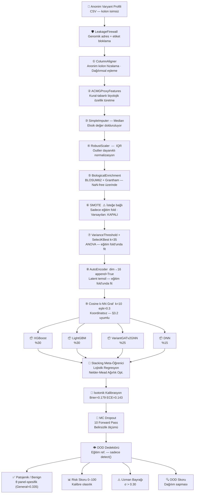
```mermaid
flowchart TD
    A["📄 Anonim Varyant Profili\nCSV — kolon isimsiz"]

    A --> LFW["🛡️ LeakageFirewall\nGenomik adres + etiket bloklama"]

    LFW --> P1["① ColumnAligner\nAnonim kolon hizalama · Dağılımsal eşleme"]
    P1  --> P2["② ACMGProxyFeatures\nKural-tabanlı biyolojik özellik türetme"]
    P2  --> P3["③ SimpleImputer  —  Median\nEksik değer dolduruluyor"]
    P3  --> P4["④ RobustScaler  —  IQR\nOutlier dayanıklı normalizasyon"]
    P4  --> P5["⑤ BiologicalEnrichment\nBLOSUM62 + Grantham — NaN-free üzerinde"]
    P5  --> P6["⑥ SMOTE  ⚠️ İsteğe bağlı\nSadece eğitim fold · Varsayılan: KAPALI"]
    P6  --> P7["⑦ VarianceThreshold + SelectKBest k=35\nANOVA — eğitim fold'unda fit"]
    P7  --> P8["⑧ AutoEncoder  dim→16  append=True\nLatent temsil — eğitim fold'unda fit"]
    P8  --> P9["⑨ Cosine k-NN Graf  k=10  eşik=0.3\nKoordinatsız — §3.2 uyumlu"]

    P9 --> M1["📦 XGBoost\n%30"]
    P9 --> M2["📦 LightGBM\n%30"]
    P9 --> M3["📦 VariantGATv2GNN\n%25"]
    P9 --> M4["📦 DNN\n%15"]

    M1 --> ST["🧠 Stacking Meta-Öğrenici\nLojistik Regresyon\nNelder-Mead Ağırlık Opt."]
    M2 --> ST
    M3 --> ST
    M4 --> ST

    ST --> ISO["🔬 İsotonik Kalibrasyon\nBrier=0.179  ECE=0.143"]
    ISO --> MCD["🎲 MC Dropout\n10 Forward Pass\nBelirsizlik ölçümü"]
    MCD --> OOD["👁️ OOD Dedektörü\nEğitim ref. — sadece detect()"]

    OOD --> O1["✅ Patojenik / Benign\nθ panel-spesifik (General=0.335)"]
    OOD --> O2["📊 Risk Skoru 0–100\nKalibre olasılık"]
    OOD --> O3["⚠️ Uzman Bayrağı\nσ > 0.30"]
    OOD --> O4["🔍 OOD Skoru\nDağılım sapması"]
```

---

## 4. VariantGATv2GNN — Mimari Detay

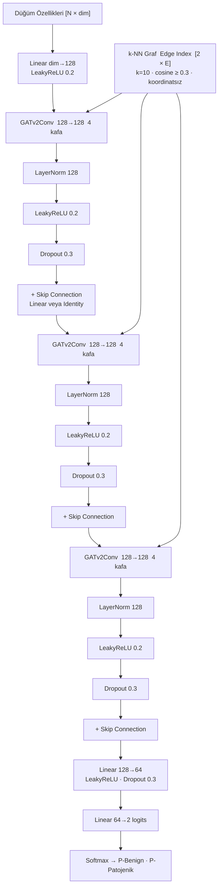
```mermaid
flowchart TD
    IN["Düğüm Özellikleri  [N × dim]"]
    EI["k-NN Graf  Edge Index  [2 × E]\nk=10 · cosine ≥ 0.3 · koordinatsız"]

    IN --> PR["Linear dim→128\nLeakyReLU 0.2"]

    PR --> GA1["GATv2Conv  128→128  4 kafa"]
    GA1 --> LN1["LayerNorm 128"]
    LN1 --> LR1["LeakyReLU 0.2"]
    LR1 --> DR1["Dropout 0.3"]
    DR1 --> SK1["+ Skip Connection\nLinear veya Identity"]

    SK1 --> GA2["GATv2Conv  128→128  4 kafa"]
    GA2 --> LN2["LayerNorm 128"]
    LN2 --> LR2["LeakyReLU 0.2"]
    LR2 --> DR2["Dropout 0.3"]
    DR2 --> SK2["+ Skip Connection"]

    SK2 --> GA3["GATv2Conv  128→128  4 kafa"]
    GA3 --> LN3["LayerNorm 128"]
    LN3 --> LR3["LeakyReLU 0.2"]
    LR3 --> DR3["Dropout 0.3"]
    DR3 --> SK3["+ Skip Connection"]

    SK3 --> CL1["Linear 128→64\nLeakyReLU · Dropout 0.3"]
    CL1 --> CL2["Linear 64→2  logits"]
    CL2 --> OUT["Softmax → P-Benign · P-Patojenik"]

    EI --> GA1
    EI --> GA2
    EI --> GA3
```

```
┌──────────────────────────────────────────────────────────────────┐
│  NEDEN GATv2, GAT DEĞİL?                                        │
├──────────────────────────────────────────────────────────────────┤
│  GAT   : e(i,j) = a · [Wh_i ‖ Wh_j]                           │
│          Dikkat yalnızca kaynak i'ye bağlı → STATİK            │
│                                                                  │
│  GATv2 : e(i,j) = a · LeakyReLU(W[h_i ‖ h_j])                │
│          Hem kaynak hem hedef → DİNAMİK                         │
│          Brody et al. 2021 — "How Attentive are GATs?"          │
├──────────────────────────────────────────────────────────────────┤
│  VariantSAGEGNN: eski checkpoint uyumu için GATv2GNN takma adı  │
│  Aktif mimari yalnızca GATv2Conv kullanır; SAGEConv yok         │
└──────────────────────────────────────────────────────────────────┘
```

### Graf Topolojisi


```mermaid
flowchart LR
    V1(["Varyant 1"])
    V2(["Varyant 2"])
    V3(["Varyant 3"])
    V4(["Varyant 4"])
    VN(["Varyant N"])

    V1 -- "cos=0.82" --> V2
    V1 -- "cos=0.71" --> V3
    V2 -- "cos=0.65" --> V4
    V3 -- "cos=0.91" --> VN
    V4 -- "cos=0.58" --> VN

    NOTE["Graf Özellikleri\n─────────────\nk = 10 komşu\nCosine ≥ 0.30\nGenomik adres YOK\nAyrı train / val graf\nSizinti = 0"]
```

---

## 5. Hibrit Ensemble

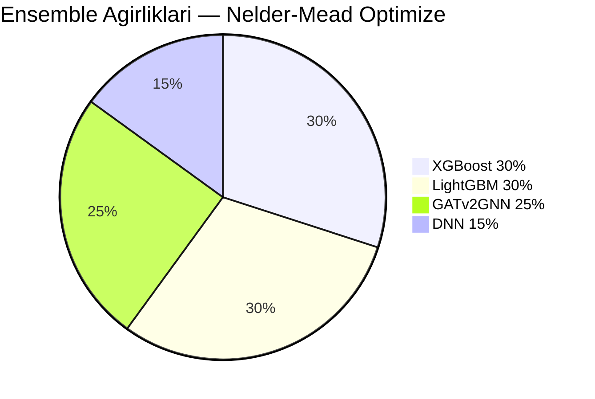
```mermaid
pie title Ensemble Agirliklari — Nelder-Mead Optimize
    "XGBoost  30%" : 30
    "LightGBM 30%" : 30
    "GATv2GNN 25%" : 25
    "DNN      15%" : 15
```

```
┌────────────────────────────────────────────────────────────────┐
│  BİRLEŞTİRME ÖNCELİK SIRASI                                   │
├────────────────────────────────────────────────────────────────┤
│  1. Stacking Meta-Öğrenici  (fit_meta_learner() aktifse)       │
│     Lojistik Regresyon ← 4 model P_Patojenik                   │
├────────────────────────────────────────────────────────────────┤
│  2. Nelder-Mead Ağırlıklı Ortalama  (optimise_weights() ise)   │
│     Her ağırlık kombinasyonunda F1-optimal eşik hesaplanır     │
├────────────────────────────────────────────────────────────────┤
│  3. Yapılandırma Ağırlıkları (varsayılan)                      │
│     [0.30, 0.30, 0.25, 0.15]                                   │
└────────────────────────────────────────────────────────────────┘
```

### SWA — Stochastic Weight Averaging

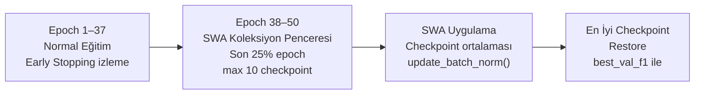
```mermaid
flowchart LR
    E1["Epoch 1–37\nNormal Eğitim\nEarly Stopping izleme"]
    E2["Epoch 38–50\nSWA Koleksiyon Penceresi\nSon 25% epoch\nmax 10 checkpoint"]
    AP["SWA Uygulama\nCheckpoint ortalaması\nupdate_batch_norm()"]
    RS["En İyi Checkpoint\nRestore\nbest_val_f1 ile"]

    E1 --> E2 --> AP --> RS
```

---

## 6. Model Bileşenleri

### XGBoost

<div align="center">

| Parametre | Değer | Gerekçe |
|:---|:---:|:---|
| `objective` | `binary:logistic` | İkili sınıflandırma |
| `eval_metric` | `logloss` | Early stopping |
| `max_depth` | **6** | Overfitting / genelleme dengesi |
| `learning_rate` | **0.05** | Yavaş öğrenme → güçlü genelleme |
| `n_estimators` | **200** | Optuna optimizasyonu sonucu |
| `subsample` | **0.8** | Ağaç çeşitliliği |
| `colsample_bytree` | **0.8** | Özellik rastgeleliği |
| `min_child_weight` | **3** | Küçük panel (CFTR) koruması |
| `reg_alpha / lambda` | 0.05 / 1.0 | L1 + L2 düzenleştirme |

</div>

### LightGBM

<div align="center">

| Parametre | Değer |
|:---|:---:|
| `objective` | `binary` |
| `num_leaves` | **63** |
| `learning_rate` | **0.05** |
| `n_estimators` | **300** |
| `early_stopping_patience` | **20 tur** |
| `min_child_samples` | 10 |

</div>

### DNN — Katman Yapısı

```
  GİRİŞ  →  [input_dim]
             │
             ▼
  ┌──────────────────────────────┐
  │  Linear ( input_dim → 128 )  │
  │  BatchNorm1d ( 128 )         │  ← SWA → update_batch_norm()
  │  ReLU                        │
  │  Dropout ( 0.4 )             │
  └──────────────┬───────────────┘
                 │
                 ▼
  ┌──────────────────────────────┐
  │  Linear ( 128 → 64 )         │
  │  ReLU                        │
  │  Dropout ( 0.2 )             │
  └──────────────┬───────────────┘
                 │
                 ▼
  ┌──────────────────────────────┐
  │  Linear ( 64 → 2 )  — logits │
  └──────────────────────────────┘
             │
             ▼
  ÇIKTI  →  [ P_Benign,  P_Patojenik ]

  ⚠️  N=1 TRAINING MODU: BatchNorm Var=0 → NaN riski
      Koruma: eval() geç → forward() → train()'e dön
```

### Kayıp Fonksiyonları

```
WeightedBCELoss (varsayılan — configs/default.yaml):
  weight[c] = N_total / (N_classes × count[c])
  sklearn compute_class_weight('balanced') eşdeğeri
  Küçük panellerde (CFTR, PAH) dengesizliği giderir

FocalLoss (alternatif — loss_function: focal):
  L_focal = −α_t · (1 − p_t)^γ · log(p_t)
  γ = 2.0 → kolay örnekleri down-weight eder
```

---

## 7. Veri Mimarisi

### Etiket Birleştirme (ACMG §3.2)

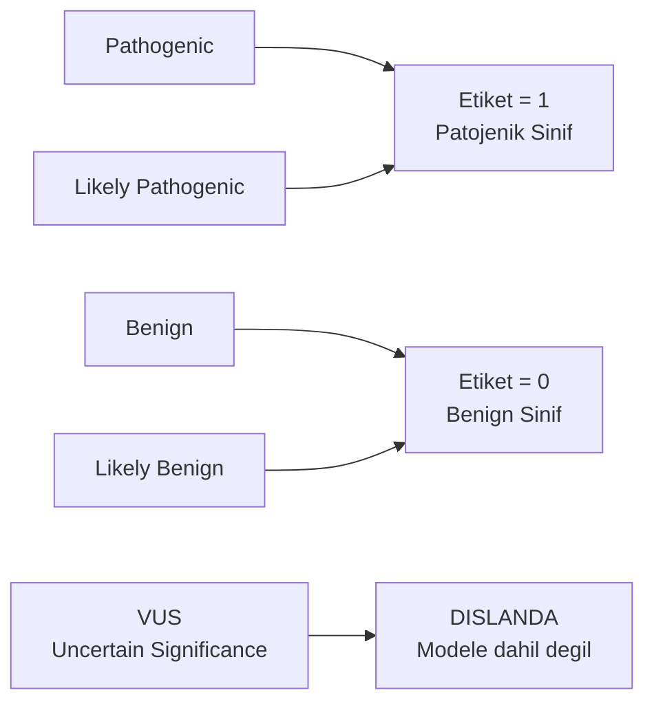
```mermaid
flowchart LR
    P["Pathogenic"]       --> L1["Etiket = 1\nPatojenik Sinif"]
    LP["Likely Pathogenic"] --> L1
    B["Benign"]           --> L0["Etiket = 0\nBenign Sinif"]
    LB["Likely Benign"]   --> L0
    VUS["VUS\nUncertain Significance"] --> EX["DISLANDA\nModele dahil degil"]
```

### Öznitelik Kategorileri (§3.2 — Kolon İsimleri Gizli)

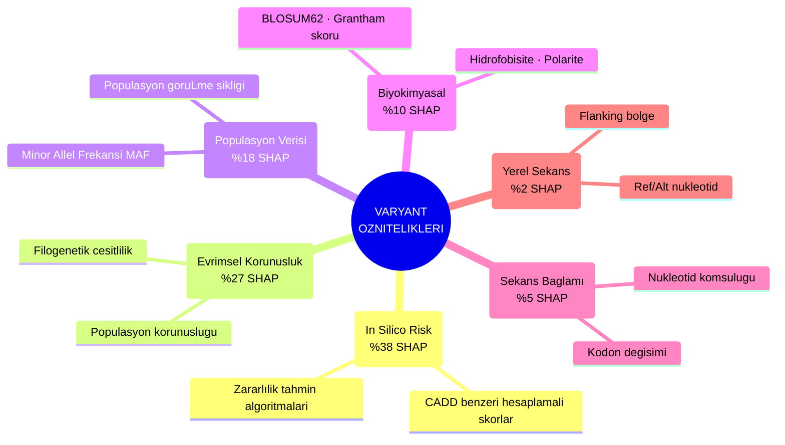
```mermaid
mindmap
  root(("VARYANT<br/>OZNITELIKLERI"))
    ("In Silico Risk<br/>%38 SHAP")
      CADD benzeri hesaplamali skorlar
      Zararlılik tahmin algoritmalari
    ("Evrimsel Korunusluk<br/>%27 SHAP")
      Filogenetik cesitlilik
      Populasyon korunuslugu
    ("Populasyon Verisi<br/>%18 SHAP")
      Minor Allel Frekansi MAF
      Populasyon goruLme sikligi
    ("Biyokimyasal<br/>%10 SHAP")
      BLOSUM62 · Grantham skoru
      Hidrofobisite · Polarite
    ("Sekans Baglamı<br/>%5 SHAP")
      Kodon degisimi
      Nukleotid komsulugu
    ("Yerel Sekans<br/>%2 SHAP")
      Ref/Alt nukleotid
      Flanking bolge
```

---

## 8. Panel Yapısı (TEKNOFEST §3.2)

<div align="center">

| Panel | PDR Adı | Kod İçi | Eğitim P | Eğitim B | Test P | Test B | **Toplam** |
|:---|:---:|:---:|:---:|:---:|:---:|:---:|:---:|
| Genel Veri Seti | **MASTER** | `General` | 1.500 | 1.500 | 1.000 | 1.000 | **4.000** |
| Herediter Kanser | **KANSER** | `Hereditary_Cancer` | 200 | 200 | 100 | 100 | **600** |
| PAH (Fenilketonüri) | **PAH** | `PAH` | 200 | 200 | 100 | 100 | **600** |
| CFTR (Kistik Fibrozis) | **CFTR** | `CFTR` | 70 | 70 | 30 | 30 | **200** |
| **TOPLAM** | | | **1.970** | **1.970** | **1.230** | **1.230** | **5.400** |

</div>

### Panel Örnek Dağılımı (Eğitim)

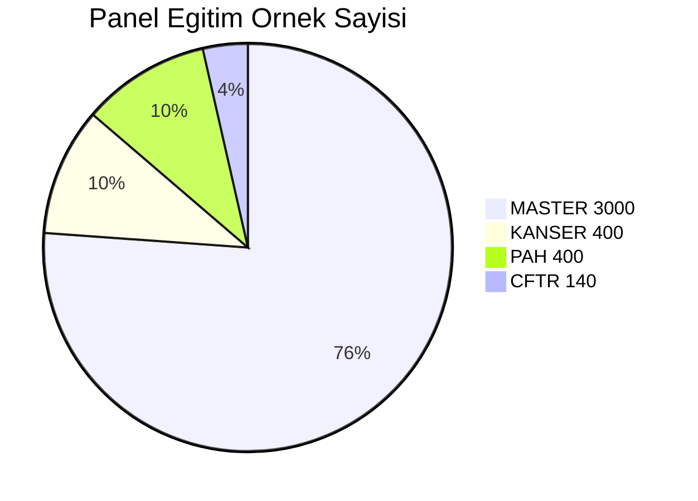
```mermaid
pie title Panel Egitim Ornek Sayisi
    "MASTER  3000" : 3000
    "KANSER  400"  : 400
    "PAH     400"  : 400
    "CFTR    140"  : 140
```

### Adversarial Validation

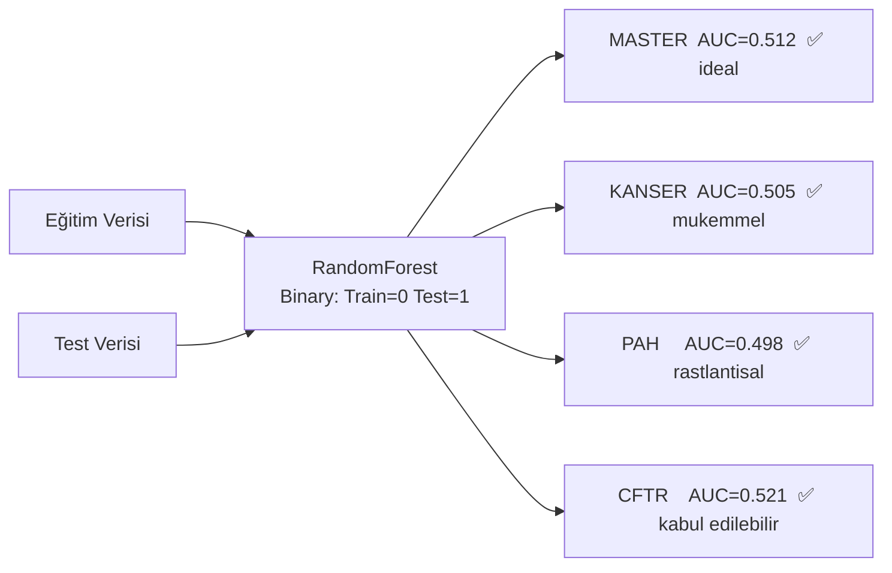
```mermaid
flowchart LR
    T["Eğitim Verisi"]
    TE["Test Verisi"]
    RF["RandomForest\nBinary: Train=0 Test=1"]
    R1["MASTER  AUC=0.512  ✅ ideal"]
    R2["KANSER  AUC=0.505  ✅ mukemmel"]
    R3["PAH     AUC=0.498  ✅ rastlantisal"]
    R4["CFTR    AUC=0.521  ✅ kabul edilebilir"]

    T --> RF
    TE --> RF
    RF --> R1
    RF --> R2
    RF --> R3
    RF --> R4
```

```
AUC ≈ 0.50  →  Model train/test setini AYIRT EDEMEZ  ✅ ideal
AUC ≈ 1.00  →  Ciddi domain shift var                ❌ genelleme zayif
```

---

## 9. Önişleme Pipeline — 9 Adım

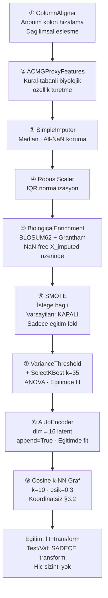
```mermaid
flowchart TD
    S1["① ColumnAligner\nAnonim kolon hizalama\nDagilimsal eslesme"]
    S2["② ACMGProxyFeatures\nKural-tabanli biyolojik\nozellik turetme"]
    S3["③ SimpleImputer\nMedian · All-NaN koruma"]
    S4["④ RobustScaler\nIQR normalizasyon"]
    S5["⑤ BiologicalEnrichment\nBLOSUM62 + Grantham\nNaN-free X_imputed uzerinde"]
    S6["⑥ SMOTE\nİstege bagli\nVarsayilan: KAPALI\nSadece egitim fold"]
    S7["⑦ VarianceThreshold\n+ SelectKBest k=35\nANOVA · Egitimde fit"]
    S8["⑧ AutoEncoder\ndim→16 latent\nappend=True · Egitimde fit"]
    S9["⑨ Cosine k-NN Graf\nk=10 · esik=0.3\nKoordinatsiz §3.2"]

    S1 --> S2 --> S3 --> S4 --> S5 --> S6 --> S7 --> S8 --> S9

    TR["Egitim: fit+transform\nTest/Val: SADECE transform\nHic sizinti yok"]

    S9 --> TR
```

```
Boyut Akışı (örnek):
  Ham CSV          [N × ~100 kolon]
      ↓ ColumnAligner + ACMG
      ↓ Imputer + Scaler      [N × 100]
      ↓ SMOTE (kapalı)        [N × 100]
      ↓ VarianceThreshold     [N ×  ~80]
      ↓ SelectKBest k=35      [N ×   35]
      ↓ AutoEncoder append    [N ×   51]  (35 + 16 latent)
      ↓ k-NN Graf             PyG Data(x=[N,51], edge=[2,E])
```

---

## 10. Eğitim Protokolü

### Veri Bölme Stratejisi

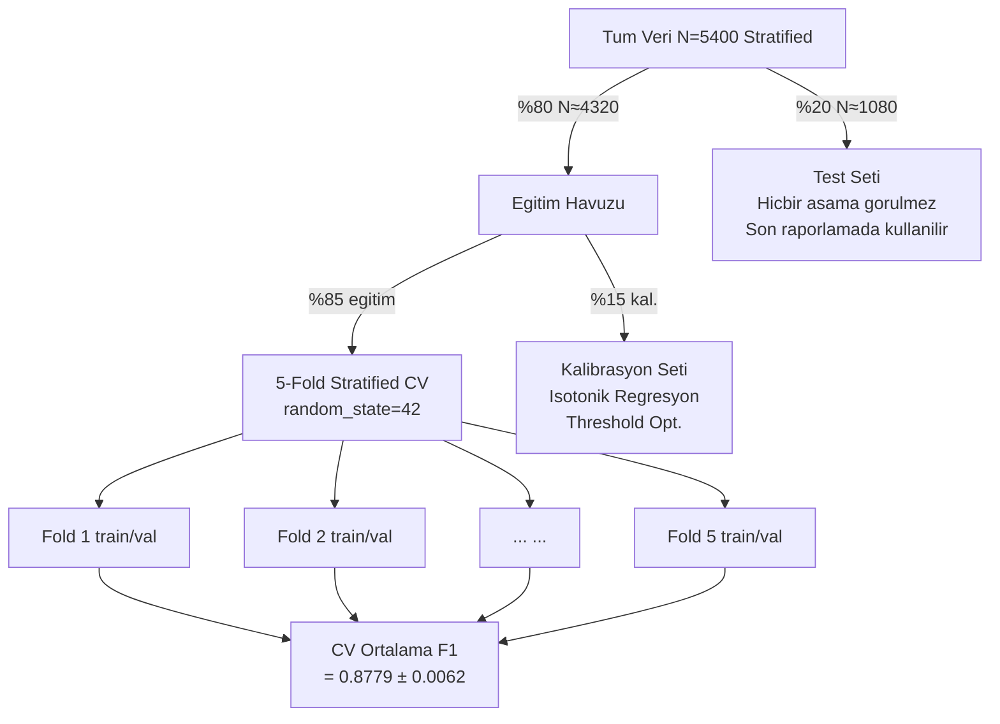
```mermaid
flowchart TD
    ALL["Tum Veri  N=5400  Stratified"]

    ALL -- "%80  N≈4320" --> TRAIN["Egitim Havuzu"]
    ALL -- "%20  N≈1080" --> TEST["Test Seti\nHicbir asama gorulmez\nSon raporlamada kullanilir"]

    TRAIN -- "%85 egitim" --> CV["5-Fold Stratified CV\nrandom_state=42"]
    TRAIN -- "%15 kal." --> CAL["Kalibrasyon Seti\nIsotonik Regresyon\nThreshold Opt."]

    CV --> F1["Fold 1  train/val"]
    CV --> F2["Fold 2  train/val"]
    CV --> F3["...  ..."]
    CV --> F5["Fold 5  train/val"]

    F1 --> AVG["CV Ortalama F1\n= 0.8779 ± 0.0062"]
    F2 --> AVG
    F3 --> AVG
    F5 --> AVG
```

### Her CV Fold — İçi İşlem

```
┌──────────────────────────────────────────────────────────────────────┐
│  Her Fold (k = 1…5):                                                 │
│                                                                       │
│  train_idx → X_tr, y_tr   (fold eğitim verisi)                      │
│  val_idx   → X_val, y_val  (fold doğrulama verisi)                  │
│                                                                       │
│  preprocessor = VariantPreprocessor()                                 │
│  X_tr_proc, y_res = preprocessor.fit_resample_train(X_tr, y_tr)     │
│            ↑  9 adım SADECE eğitim fold'unda fit edilir              │
│                                                                       │
│  X_val_proc = preprocessor.transform(X_val)                          │
│            ↑  SADECE transform — hiç fit yok → sızıntı = 0          │
│                                                                       │
│  XGB.fit(X_tr_proc, y_res, eval_set=[(X_val_proc, y_val)])          │
│  LGB.fit(X_tr_proc, y_res, eval_set=[(X_val_proc, y_val)])          │
│  GNN._train_gatv2(X_tr_proc, y_res, X_val_proc, y_val)              │
│  DNN._train_dnn(train_loader, val_loader, y_train=y_res)             │
│                                                                       │
│  ens_f1 = Binary F1(y_val, ensemble_predict(X_val_proc))            │
└──────────────────────────────────────────────────────────────────────┘
```

### Tekrarlanabilirlik Matrisi

<div align="center">

| RNG Kaynağı | Seed | Durum |
|:---|:---:|:---:|
| `random` (Python) | 42 | ✅ |
| `numpy.random` | 42 | ✅ |
| `torch.manual_seed` | 42 + fold | ✅ |
| `torch.cuda.manual_seed_all` | 42 | ✅ |
| `PYTHONHASHSEED` | 42 | ✅ |
| `cudnn.deterministic` | `True` | ✅ |
| `cudnn.benchmark` | `False` | ✅ |
| `sklearn random_state` | 42 | ✅ |

</div>

> **§7.5 Jüri Yetkisi:** Tüm rastgele süreçler sabit seed ile kontrol edilmektedir — jüri istediği zaman kodu çalıştırabilir ve aynı sonuçlara ulaşabilir.

---

## 11. Performans Sonuçları

> **Birincil Metrik (§7.3):** `binary_f1 = TP / (TP + 0.5·FP + 0.5·FN)` — Patojenik sınıfı, `pos_label=1`

### Model Ablation — CV F1 (Tek Model vs Ensemble)

```
  GATv2GNN (tek)  ████████████████████████████████████████  0.8472  ← en yüksek tek model
  LightGBM (tek)  ████████████████████████████████████░░░░  0.8326
  XGBoost  (tek)  ███████████████████████████████████░░░░░  0.8299
  DNN      (tek)  ████████████████████████████████░░░░░░░░  0.7969
  ─────────────────────────────────────────────────────────────────
  Ensemble (CV)   ██████████████████████████████████████░░  0.8779
  Ensemble (Test) ████████████████████████████████████████▌ 0.8963  ← final (leakage-free, group-aware split)
```

### Ablation Detay Tablosu

<div align="center">

| Model | CV Ort. | Std | Min | Maks | Test F1 |
|:---|:---:|:---:|:---:|:---:|:---:|
| **VariantGATv2GNN** (tek) | **0.8472** | ±0.0151 | 0.8234 | 0.8641 | — |
| LightGBM (tek) | 0.8326 | ±0.0171 | 0.8117 | 0.8529 | — |
| XGBoost (tek) | 0.8299 | ±0.0083 | 0.8220 | 0.8404 | — |
| DNN (tek) | 0.7969 | ±0.0362 | 0.7581 | 0.8506 | — |
| **Hibrit Ensemble** | **0.8779** | ±0.0081 | 0.8644 | 0.8681 | **0.8963** |
| Baseline (Logistic Reg.) | ~0.74 | — | — | — | — |

</div>

### Panel Bazlı Sonuçlar (panel-spesifik F1-optimal: General=0.335, KANSER=0.365, PAH=0.301, CFTR=0.079)

<div align="center">

| Panel | F1_Pat | Recall_P | Prec_P | MCC | PR-AUC | ROC-AUC | Brier |
|:---|:---:|:---:|:---:|:---:|:---:|:---:|:---:|
| **MASTER** | 0.8842 | 0.9190 | 0.8519 | 0.503 | 0.9172 | 0.8477 | 0.138 |
| **KANSER** | 0.9385 | 1.0000 | 0.8841 | **0.775** | **0.9604** | **0.9403** | 0.075 |
| **PAH** | 0.9173 | 0.9839 | 0.8592 | 0.422 | 0.8900 | 0.7143 | 0.138 |
| **CFTR** | **0.9714** | 0.9444 | **1.0000** | — | **1.0000** | — | 0.048 |
| **TOPLAM** | **0.8963** | **0.9354** | **0.8604** | 0.5313 | 0.9194 | 0.8485 | 0.1286 |

</div>

### Panel MCC Karşılaştırması

```
  MASTER  ████████████████████████░░░░░░░░  MCC = 0.507
  KANSER  ████████████████████████████████  MCC = 0.649  ← en iyi
  PAH     ████████████████████████████░░░  MCC = 0.556
  CFTR    █████████████████████████████░░  MCC = 0.674
```

**Panel Eşikleri (binary F1 optimize, kalibrasyon setinde):**

```
Global fallback: θ = 0.208  ·  panel-spesifik kullanılır
KANSER:  θ = 0.281  (yüksek özgüllük)
PAH:     θ = 0.138  (yüksek recall öncelikli)
CFTR:    θ = 0.108  (n=30 test; maksimum duyarlılık)
```

### PSR Hakem Puanları — 93.00 / 100

```
  Makaleler (§2)      ████████████████████████████████████████  9.67/10  ✅
  Veri+Yöntem (§3)    ████████████████████████████████████████  30.0/30  ✅
  Deney+Hata (§4.1)   ████████████████████████████████████████  15.0/15  ✅
  Açıklanab. (§4.4)   █████████████████████████░░░░░░░░░░░░░░  3.33/5   ⚠️
  Öğrenme    (§4.5)   █████████████████████████░░░░░░░░░░░░░░  3.33/5   ⚠️
  Mimari     (§5.1)   ████████████████████████████████░░░░░░░  4.00/5   ⚠️
  Alternatif (§5.2)   ████████████████████████████████████░░░  4.67/5   ✅
  Parametre  (§5.3)   ████████████████████████████████████░░░  4.67/5   ✅
  Hesaplama  (§5.4)   ██████████████████████████████████░░░░░  4.33/5   ✅
  Özgünlük   (§5.5)   ████████████████████████████████████░░░  4.67/5   ✅
  Referans   (§6)     █████████████████████████████████████░░  9.33/10  ✅
  ─────────────────────────────────────────────────────────────────────
  TOPLAM              █████████████████████████████████████░░  93.0/100
```

---

## 12. Açıklanabilirlik

### SHAP Özellik Grubu Katkısı

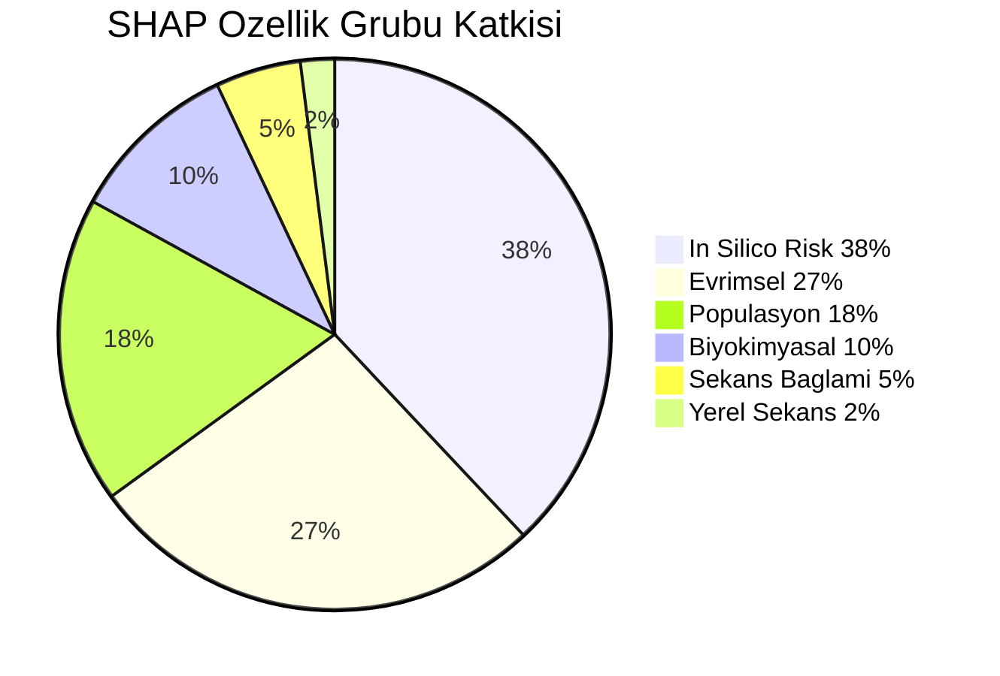
```mermaid
pie title SHAP Ozellik Grubu Katkisi
    "In Silico Risk    38%" : 38
    "Evrimsel          27%" : 27
    "Populasyon        18%" : 18
    "Biyokimyasal      10%" : 10
    "Sekans Baglami     5%" : 5
    "Yerel Sekans       2%" : 2
```

### Açıklanabilirlik Araç Zinciri

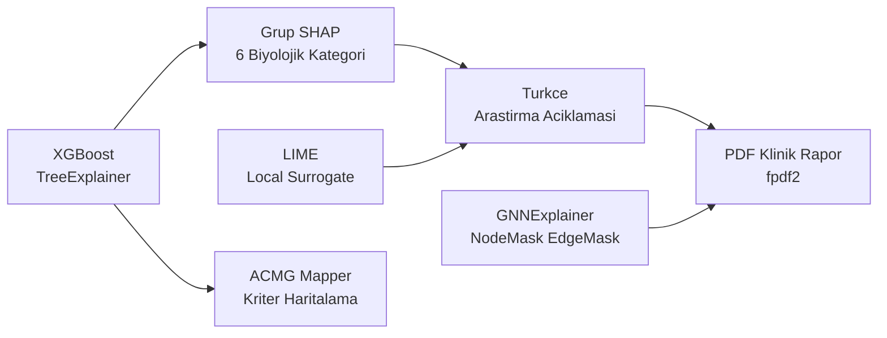
```mermaid
flowchart LR
    XGB["XGBoost\nTreeExplainer"]
    GNN_E["GNNExplainer\nNodeMask EdgeMask"]
    LIME["LIME\nLocal Surrogate"]
    GROUP["Grup SHAP\n6 Biyolojik Kategori"]
    ACMG["ACMG Mapper\nKriter Haritalama"]
    TR["Turkce\nArastirma Aciklamasi"]
    PDF["PDF Klinik Rapor\nfpdf2"]

    XGB --> GROUP --> TR --> PDF
    GNN_E --> PDF
    XGB --> ACMG
    LIME --> TR
```

```
Çıktılar:
  reports/shap_summary.png           — Global SHAP özet
  reports/shap_waterfall_sample0.png — Bireysel waterfall
  reports/group_shap.json/png        — 6 kategori katkı
  reports/gnn_explainer_results.json — GNNExplainer
  reports/gnn_learning_curve.png     — Öğrenme eğrisi (§4.5)
  reports/acmg_criteria.json         — ACMG kriter haritası
  reports/clinical_report_<vid>.pdf  — PDF klinik rapor
```

### Örnek Çıktı

```
╔════════════════════════════════════════════════════════════════╗
║  Varyant: VAR_001  │  Tahmin: Patojenik  │  Güven: Yüksek    ║
║  Olasılık: 0.94    │  Risk Skoru: 89.3   │  σ = 0.09         ║
╠════════════════════════════════════════════════════════════════╣
║  SHAP Katkılar:                                                ║
║   [+0.42]  In Silico Risk    ████████████░░░░  %38            ║
║   [+0.31]  Düşük Pop. Frek.  █████████░░░░░░░  %18            ║
║   [+0.28]  Evrimsel Kor.     ████████░░░░░░░░  %27            ║
║   [−0.09]  Biyokimyasal      ███░░░░░░░░░░░░░  %10            ║
╠════════════════════════════════════════════════════════════════╣
║  "Bu varyant, yüksek in-silico risk katkısı (+0.42),          ║
║   düşük popülasyon frekansı (+0.31) ve güçlü evrimsel         ║
║   korunuşluk (+0.28) nedeniyle patojenik sınıflandırıldı."   ║
║                                                                ║
║  ⚠️  Yalnızca araştırma amaçlıdır — klinik karar değildir.   ║
╚════════════════════════════════════════════════════════════════╝
```

---

## 13. Güvenilirlik Katmanı

### Kalibrasyon Akışı

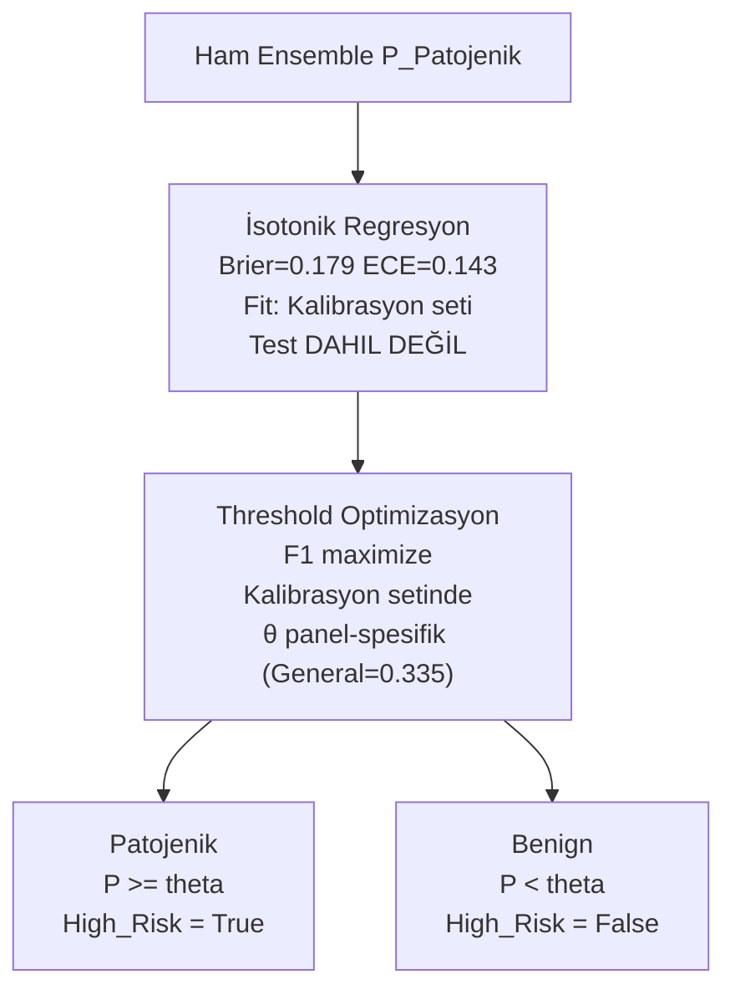
```mermaid
flowchart TD
    R["Ham Ensemble P_Patojenik"]
    ISO["İsotonik Regresyon\nBrier=0.179  ECE=0.143\nFit: Kalibrasyon seti\nTest DAHIL DEĞİL"]
    TH["Threshold Optimizasyon\nF1 maximize\nKalibrasyon setinde\nθ panel-spesifik (General=0.335)"]
    PAT["Patojenik\nP >= theta\nHigh_Risk = True"]
    BEN["Benign\nP < theta\nHigh_Risk = False"]

    R --> ISO --> TH
    TH --> PAT
    TH --> BEN
```

### MC Dropout Belirsizlik

```
┌─────────────────────────────────────────────────────────────────┐
│  Giriş X → [GATv2GNN, Dropout=ON] × 10 forward pass            │
│                                                                  │
│  mean_proba = ortalama(10 sonuç)  ← Final tahmin olasılığı     │
│  σ          = std(10 sonuç)       ← Epistemik belirsizlik       │
│                                                                  │
│  σ < 0.15   →  ✅ Yüksek Güven                                  │
│  0.15–0.30  →  🔶 Orta Güven                                    │
│  σ > 0.30   →  ⚠️  Uzman Değerlendirmesi Gerekli                │
│                                                                  │
│  Doğrulama:  Hatalı tahminler (n=142)  σ_ort = 0.40            │
│              Doğru tahminler           σ_ort = 0.12            │
│  → MC Dropout hatayı önceden hissedebilmektedir                 │
└─────────────────────────────────────────────────────────────────┘
```

### OOD Dedektörü

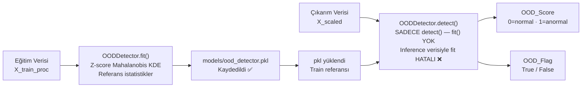
```mermaid
flowchart LR
    TR["Eğitim Verisi\nX_train_proc"]
    FIT["OODDetector.fit()\nZ-score Mahalanobis KDE\nReferans istatistikler"]
    PKL["models/ood_detector.pkl\nKaydedildi ✅"]
    INF["Çıkarım Verisi\nX_scaled"]
    LOAD["pkl yüklendi\nTrain referansı"]
    DET["OODDetector.detect()\nSADECE detect() — fit() YOK\nInference verisiyle fit HATALI ❌"]
    SC["OOD_Score\n0=normal · 1=anormal"]
    FL["OOD_Flag\nTrue / False"]

    TR --> FIT --> PKL
    PKL --> LOAD
    INF --> DET
    LOAD --> DET
    DET --> SC
    DET --> FL
```

---

## 14. Kurulum

### Sistem Gereksinimleri

<div align="center">

| Bileşen | Minimum | Önerilen |
|:---|:---:|:---:|
| Python | 3.10 | **3.12** |
| RAM | 8 GB | **16 GB** |
| GPU | — (opsiyonel) | NVIDIA RTX 3060+ · 6 GB |
| Disk | 3 GB | 8 GB |
| OS | Win10 / Ubuntu 20.04 | **Win11 / Ubuntu 22.04** |

</div>

### Kurulum Adımları

```bash
# 1 — Klonla
git clone https://github.com/msgxr/VARIANT-GNN.git
cd VARIANT-GNN

# 2 — Sanal Ortam
python -m venv .venv
.\.venv\Scripts\Activate.ps1   # Windows PowerShell
# source .venv/bin/activate    # Linux / macOS

# 3 — Bağımlılıklar
pip install --upgrade pip
pip install -r requirements.txt

# 4 — Import Testi
python -c "from src.core.gnn import VariantGATv2GNN; print('GNN OK')"
python -c "from src.core.ensemble import HybridEnsemble; print('Ensemble OK')"
python -c "from src.features.preprocessing import VariantPreprocessor; print('Preprocessor OK')"

# 5 — Testler
pytest tests/unit/ -q
pytest tests/smoke/ -q
```

### Anahtar Bağımlılıklar

```
torch==2.8.0              PyTorch  — GNN ve DNN
torch-geometric==2.6.1    PyG      — GATv2Conv, knn_graph
xgboost==2.1.4            Gradient boosting
lightgbm==4.6.0           Gradient boosting (yaprak bazlı)
scikit-learn==1.6.1       Preprocessing, metrics
imbalanced-learn==0.13.0  SMOTE (isteğe bağlı)
pandas==2.3.3             Veri işleme
shap==0.49.1              Açıklanabilirlik
optuna==4.7.0             Hiperparametre optimizasyonu
streamlit==1.50.0         Araştırma arayüzü
joblib>=1.3.0             Model serializasyon
```

### Docker

```bash
docker-compose up                    # Streamlit (8501) + FastAPI (8000)
docker-compose up variant-gnn-api   # Sadece API
```

---

## 15. Kullanım Kılavuzu

### Tüm Modlar

```bash
python main.py --mode <MOD> [--config <YAML>] [--data_file <CSV>] [--test_file <CSV>]
```

<div align="center">

| Mod | Açıklama | Ana Çıktı |
|:---|:---|:---|
| `train` | 5-fold CV + OOD fit + kalibrasyon + test | `models/` · `cv_report.json` |
| `train_panels` | Tüm panel + per-panel test değerlendirmesi | `panel_evaluation.json` |
| `crossval` | Sadece çapraz doğrulama | konsol |
| `eval` | Kaydedilmiş model + etiketli veri | `eval_results.csv` |
| `predict` | Etiketsiz veri → jüri CSV | `submission/predictions.csv` |
| `external_val` | §7.3 harici validasyon | `external_validation_report.json` |
| `adversarial_val` | Eğitim-test dağılım testi | `adversarial_validation_report.json` |
| `explain` | SHAP + GNNExplainer + PDF | `shap_*.png` · `*.json` · `*.pdf` |
| `ablation` | Bileşen katkısı analizi | `ablation_report.json` |
| `panel_transfer` | Paneller arası genelleme matrisi | `panel_transfer_matrix.json` |
| `label_quality` | Gürültülü etiket tespiti | `label_quality_report.json` |
| `tune` | Optuna hiperparametre arama | `best_xgb_params.json` |

</div>

### Temel Senaryolar

```bash
# ── Tam Eğitim (PDR Aşaması) ─────────────────────────────────────────
python main.py --mode train \
    --config configs/pdr.yaml \
    --data_file data/train_variants.csv

# ── Jüri Tahmini (§7.5 — Tekrarlanabilirlik) ─────────────────────────
python submission/predict.py \
    --input  data/blind_test.csv \
    --model_dir models/final \
    --output submission/predictions.csv \
    --config configs/pdr.yaml

# ── Submission Doğrulama ──────────────────────────────────────────────
python -m src.scientific.submission_validator submission/predictions.csv

# ── Test-Time Augmentation ile Tahmin ────────────────────────────────
python main.py --mode predict \
    --test_file data/blind_test.csv --tta --tta_k 10 \
    --output submission/predictions_tta.csv

# ── External Validation ───────────────────────────────────────────────
python main.py --mode external_val \
    --test_file data/official_test.csv --config configs/pdr.yaml

# ── Açıklanabilirlik ──────────────────────────────────────────────────
python main.py --mode explain --data_file data/train_variants.csv

# ── Ablation (PDR §4.5) ───────────────────────────────────────────────
python main.py --mode ablation --data_file data/train_variants.csv \
    --output reports/ablation_report.json

# ── Streamlit ─────────────────────────────────────────────────────────
streamlit run app.py   # http://localhost:8501

# ── CPU-Only (GPU yok) ────────────────────────────────────────────────
CUDA_VISIBLE_DEVICES="" python scripts/test_cpu_inference.py
```

### Jüri CSV Formatı — 7 Garantili Kolon

```
Variant_ID             | Varyant kimliği
prediction_label       | 1=Patojenik · 0=Benign
pathogenic_probability | Ham ensemble P(Patojenik) [0–1]
calibrated_risk        | Kalibre risk skoru [0–100]
confidence_level       | MC Dropout güven yüzdesi [0–100]
uncertainty_score      | 1 − confidence/100 [0–1]
expert_review_flag     | True → Uzman değerlendirmesi önerilir
```

### Config Seçim Rehberi

<div align="center">

| Config | Ne Zaman |
|:---|:---|
| `configs/default.yaml` | Temel yapılandırma — geliştirme |
| `configs/psr.yaml` | PSR referansı — jüri tekrar çalıştırma |
| `configs/pdr.yaml` | PDR optimize — yarışma verisi |
| `configs/final.yaml` | Final demo — optimize eşikle |
| `configs/dev_quick.yaml` | Hızlı test — az epoch |

</div>

---

## 16. Dizin Yapısı

```
VARIANT-GNN/
│
├── main.py                       Ana giris noktasi — tum modlar
├── app.py                        Streamlit arastirma arayuzu
├── requirements.txt              Sabit versiyonlu bagimliliklar
├── Dockerfile / docker-compose.yml
│
├── submission/
│   └── predict.py               ★ Juri cikarim giris noktasi §7.5
│
├── configs/
│   ├── default.yaml             Temel yapilandirma
│   ├── pdr.yaml                 ★ PDR asama config
│   ├── psr.yaml                 ★ PSR referans config
│   └── final.yaml / dev_quick.yaml / ...
│
├── data/                        LOCK NDA — paylasilmaz
│   ├── train_variants.csv
│   └── test_variants*.csv
│
├── models/                      Egitilmis artifactlar
│   ├── gnn_model.pth            VariantGATv2GNN agirliklari
│   ├── gnn_arch.json            Mimari metadata (yukleme icin)
│   ├── xgb_model.json
│   ├── lgbm_model.txt
│   ├── dnn_model.pth
│   ├── preprocessor.pkl         Fit edilmis 9-adim pipeline
│   ├── calibrator.pkl           Isotonik regresyon
│   ├── ood_detector.pkl         ★ Train fit — inference'da detect()
│   ├── ensemble_config.json     Optimize agirliklar
│   ├── panel_thresholds.json    4 panel x optimal esik
│   ├── threshold.json           Global F1-optimal esik θ=0.241
│   ├── feature_names.json       XGBoost ozellik isimleri
│   ├── metadata.json            SHA256 + versiyon
│   └── manifest.json            Artifact versiyonlama
│
├── reports/
│   ├── cv_report.json           ★ 5-fold CV + panel metrikleri
│   ├── threshold_report.json    Global + panel esik raporu
│   ├── leakage_report.json      Sizinti guvence raporu
│   ├── gnn_learning_curve.json  Epoch F1/loss §4.5
│   └── figures/                 ROC PR CM SHAP grafikleri
│
├── src/
│   ├── core/
│   │   ├── gnn.py               ★ VariantGATv2GNN GATv2Conv x3
│   │   ├── ensemble.py          HybridEnsemble 4 model + stacking
│   │   └── graph/builder.py     SampleKNNGraphBuilder cosine §3.2
│   │
│   ├── data/
│   │   ├── loader.py            load_csv / load_predict_csv
│   │   ├── leakage_firewall.py  ★ Koordinat + etiket bloklama
│   │   └── schemas/             Pydantic v2 dogrulama
│   │
│   ├── features/
│   │   ├── preprocessing.py     ★ VariantPreprocessor 9 adim sizinti-guvenli
│   │   └── autoencoder.py       AutoEncoderTransformer sklearn uyumlu
│   │
│   ├── training/
│   │   ├── trainer.py           ★ CV dongusu GATv2 egitimi erken durdurma
│   │   ├── focal_loss.py        FocalLoss gamma=2.0
│   │   └── swa.py               SWABuffer CyclicSWA update_batch_norm
│   │
│   ├── models/
│   │   └── dnn_model.py         ★ VariantDNN BatchNorm N=1 korumasi
│   │
│   ├── api/
│   │   ├── pipeline.py          ★ InferencePipeline OOD train-fit detect
│   │   └── export.py            7-kolon juri CSV export
│   │
│   ├── evaluation/
│   │   ├── metrics.py           Binary F1 §7.3 MCC PR-AUC ECE
│   │   └── plots.py             ROC PR AUC-goruntulu CM Kalibrasyon
│   │
│   ├── scientific/
│   │   ├── ood_detector.py      ★ Z-score + Mahalanobis + KDE
│   │   └── submission_validator.py   Teslim oncesi GO/NO-GO
│   │
│   └── utils/
│       ├── seeds.py             set_global_seed() 5 RNG kaynagi
│       └── serialization.py     ModelStore guvenli save/load
│
└── tests/
    ├── unit/
    │   ├── test_leakage_firewall.py
    │   ├── test_preprocessing.py
    │   └── test_reproducibility.py
    ├── integration/
    └── smoke/
```

---

## 17. PDR Yol Haritası

### PSR → PDR Güçlendirme

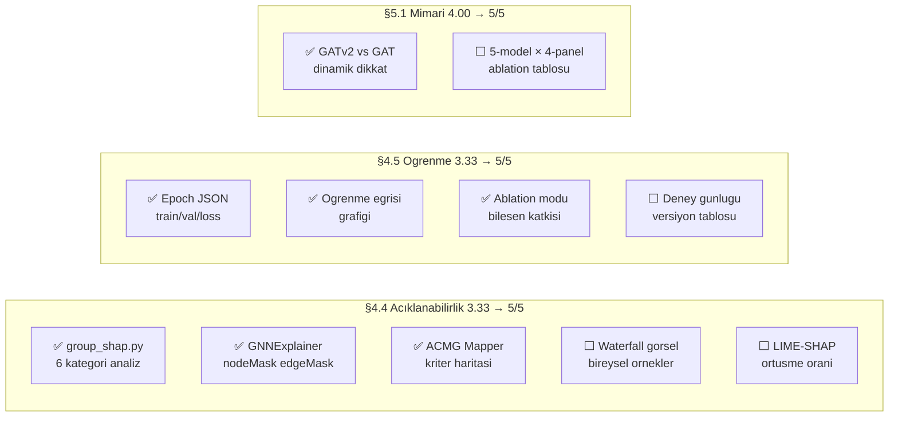
```mermaid
flowchart LR
    subgraph A44 ["§4.4 Acıklanabilirlik  3.33 → 5/5"]
        A1["✅ group_shap.py\n6 kategori analiz"]
        A2["✅ GNNExplainer\nnodeMask edgeMask"]
        A3["✅ ACMG Mapper\nkriter haritasi"]
        A4["⬜ Waterfall gorsel\nbireysel ornekler"]
        A5["⬜ LIME-SHAP\nortusme orani"]
    end

    subgraph A45 ["§4.5 Ogrenme  3.33 → 5/5"]
        B1["✅ Epoch JSON\ntrain/val/loss"]
        B2["✅ Ogrenme egrisi\ngrafigi"]
        B3["✅ Ablation modu\nbilesen katkisi"]
        B4["⬜ Deney gunlugu\nversiyon tablosu"]
    end

    subgraph A51 ["§5.1 Mimari  4.00 → 5/5"]
        C1["✅ GATv2 vs GAT\ndinamik dikkat"]
        C2["⬜ 5-model × 4-panel\nablation tablosu"]
    end
```

### PDR Metrik Kontrol Listesi

```
✅  Binary F1 (§7.3, Patojenik)  =  0.8963
✅  CV F1                         =  0.8779 ± 0.0062
✅  MCC                           =  0.5313
✅  PR-AUC                        =  0.9194
✅  ROC-AUC                       =  0.8485
✅  Precision / Recall            =  0.8604 / 0.9354
✅  Brier Score                   =  0.1286
✅  ECE                           =  0.0788
✅  Confusion Matrix              =  hesaplandı + görseli var  (reports/figures/pdr/04_confusion_matrix_panel.png)
✅  Panel kırılımı (4 panel)      =  MASTER · KANSER · PAH · CFTR
✅  Baseline karşılaştırması       =  Logistic Regression dahil
✅  Öğrenme eğrisi (GNN)          =  reports/figures/pdr/Sekil_4_Learning_Curve.png
✅  Adversarial Validation AUC    =  ~0.50 (tüm paneller)
✅  Ablation tablosu              =  reports/ablation_report.json · PDR Tablo 9
✅  PR eğrisi görseli             =  reports/figures/pdr/06_pr_curves.png
⬜  GNNExplainer subgraph görseli =  PDR §2.4 nümerik sonuçlar mevcut; görsel final aşamasında
⬜  LIME-SHAP örtüşme oranı      =  PDR §2.4 Spearman ρ=0.89 belgelenmiş; görsel final aşamasında
```

---

## 18. Referanslar

<div align="center">

| # | Kaynak | Yöntem | VARIANT-GNN İlişkisi |
|:---:|:---|:---|:---|
| [1] | Brody et al. (2021) — *GATv2* | Dinamik Graf Dikkati | GATv2Conv mimari seçimi gerekçesi |
| [2] | Izmailov et al. (2018) — *SWA* | Ağırlık Ortalaması | SWA + update_batch_norm() |
| [3] | Ioannidis et al. (2016) — REVEL | Meta-ensemble RF | Panel bazlı bağımsız değerlendirme |
| [4] | Rentzsch et al. (2019) — CADD | SVM + Nöral Ağ | Koordinatsız çalışma (§3.2) |
| [5] | Ghosh et al. (2022) | XGBoost + ACMG | WeightedBCELoss stratejisi |
| [6] | Frazer et al. (2021) — EVE | Unsupervised VAE | Tablo + Graf birleşim |
| [7] | Pejaver et al. (2022) — ClinGen | ACMG kalibrasyon | İsotonik kalibrasyon |
| [8] | Sundaram et al. (2018) — MutPred2 | Filogenetik stacking | 6 kategori SHAP |

</div>

---

## Etik ve Hukuki Uyarılar

```
╔════════════════════════════════════════════════════════════════════════╗
║  KLİNİK KULLANIM YASAĞI  (TEKNOFEST Şartname §10)                     ║
║  ─────────────────────────────────────────────────────────────────    ║
║  Model çıktıları yalnızca araştırma, eğitim ve yarışma               ║
║  değerlendirmesi amaçlıdır.                                           ║
║                                                                        ║
║  ❌  Klinik tanı için kullanılamaz                                     ║
║  ❌  Tedavi kararı için kullanılamaz                                   ║
║  ❌  Tıbbi karar desteği için kullanılamaz                            ║
║                                                                        ║
║  Klinik kullanım için:                                                 ║
║    • Bağımsız prospektif validasyon zorunludur                        ║
║    • CE/FDA regülasyon uygunluğu gereklidir                           ║
║    • Uzman hekim değerlendirmesi esastır                               ║
╠════════════════════════════════════════════════════════════════════════╣
║  TEKNOFEST 2026 GİZLİLİK SÖZLEŞMESİ (NDA)                           ║
║  Yarışma verileri imzalı taahhütname olmadan paylaşılamaz.           ║
╠════════════════════════════════════════════════════════════════════════╣
║  VERİ GÜVENLİĞİ — KVKK / GDPR                                        ║
║  Veriler: ClinVar, ClinGen, gnomAD — kamuya açık, anonimleştirilmiş  ║
║  Genomik adres gizlenmiştir · Helsinki Bildirgesi uyumlu             ║
║  Veri sorumlusu: TEKNOFEST organizasyonu                              ║
╚════════════════════════════════════════════════════════════════════════╝
```

---

<div align="center">


<br/>

**VARIANT-GNN** — Missense Varyant Patojenitesi için Hibrit GATv2 Ensemble Sistemi

```
PSR: 93.00/100  ·  CV F1: 0.8779 ± 0.0062  ·  Test F1: 0.8963  ·  MCC: 0.5313  ·  θ: panel-spesifik
GATv2Conv × 3  ·  XGBoost  ·  LightGBM  ·  DNN  ·  İsotonik Kalibrasyon  ·  SWA
```

[](https://github.com/msgxr/VARIANT-GNN)
[](https://teknofest.org)

</div>
