<div align="center">


<br/>


<br/><br/>

<!-- ═══════════ TIER 1 BADGES ═══════════ -->
[](.)
[](.)
[](.)
[](.)

<br/>

<!-- ═══════════ TIER 2 BADGES ═══════════ -->
[](https://github.com/msgxr/VARIANT-GNN/actions)
[](.)
[](.)
[](.)
[](.)
[](.)
[](.)

<br/>

<!-- ═══════════ TIER 3 BADGES ═══════════ -->
[](src/core/gnn.py)
[](src/training/swa.py)
[](src/api/pipeline.py)
[](src/calibration/calibrator.py)
[](src/scientific/ood_detector.py)
[](.)

</div>

---

<div align="center">

```
╔══════════════════════════════════════════════════════════════════════════════════╗
║                          VARIANT-GNN — PROJE KİMLİĞİ                           ║
╠══════════════════╦═══════════════════════════════════════════════════════════════╣
║  Proje           ║  VARIANT-GNN — Missense Varyant Patojenisite Tahmini         ║
║  Görev           ║  Binary Sınıflandırma: Patojenik (1) / Benign (0)            ║
║  Takım           ║  XYRA3  ·  ID: #909249  ·  Başvuru: #4865399                ║
║  Yarışma         ║  TEKNOFEST 2026 Sağlıkta YZ — Üniversite ve Üzeri           ║
║  PSR             ║  93.00 / 100  ✅  Ön Eleme Geçildi                           ║
║  Test F1 (§7.3)  ║  0.8706  ·  CV: 0.8347 ± 0.0114  ·  θ = 0.4357             ║
║  Aşama           ║  PDR Geliştirme → Teslim: 29 Haziran 2026, 17:00            ║
║  Güvenlik        ║  KVKK · GDPR · TEKNOFEST NDA · Helsinki Bildirgesi          ║
╚══════════════════╩═══════════════════════════════════════════════════════════════╝
```

> **⚠️ KLİNİK UYARI:** Model çıktıları **yalnızca araştırma, eğitim ve yarışma değerlendirmesi** amaçlıdır. Klinik tanı, tedavi veya tıbbi karar desteği için **kullanılamaz**.

</div>

---

## İçindekiler

<div align="center">

| # | Bölüm | # | Bölüm |
|:---:|:---|:---:|:---|
| 1 | [Proje Genel Bakış](#1-proje-genel-bakış) | 9 | [Önişleme Pipeline](#9-önişleme-pipeline--9-adım) |
| 2 | [Neden Bu Problem?](#2-neden-bu-problem) | 10 | [Eğitim Protokolü](#10-eğitim-protokolü) |
| 3 | [Sistem Mimarisi — Tam Pipeline](#3-sistem-mimarisi--tam-pipeline) | 11 | [Performans Sonuçları](#11-performans-sonuçları) |
| 4 | [VariantGATv2GNN](#4-variantgatv2gnn--mimari-detay) | 12 | [Açıklanabilirlik](#12-açıklanabilirlik) |
| 5 | [Hibrit Ensemble](#5-hibrit-ensemble) | 13 | [Güvenilirlik Katmanı](#13-güvenilirlik-katmanı) |
| 6 | [Model Bileşenleri](#6-model-bileşenleri) | 14 | [Kurulum](#14-kurulum) |
| 7 | [Veri Mimarisi](#7-veri-mimarisi) | 15 | [Kullanım Kılavuzu](#15-kullanım-kılavuzu) |
| 8 | [Panel Yapısı](#8-panel-yapısı-teknofest-32) | 16 | [Dizin Yapısı](#16-dizin-yapısı) |
| — | — | 17 | [PDR · Referanslar · Etik](#17-pdr-yol-haritası) |

</div>

---

## 1. Proje Genel Bakış

**VARIANT-GNN**, insan genomundaki missense varyantların klinik anlamlılığını **Patojenik** ya da **Benign** olarak tahmin eden, uçtan uca kalibre edilmiş hibrit bir yapay zeka sistemidir.

```
┌─────────────────────────────────────────────────────────────────────────┐
│  GİRİŞ          │  Anonim varyant profilleri (CSV, kolon isimsiz)       │
│  PROBLEM         │  İkili sınıflandırma: Patojenik=1 / Benign=0         │
│  KISIT (§3.2)   │  Genomik adres GİZLİ · Kolon adları GİZLİ            │
│  HEDEF (§7.3)   │  Binary F1 = 2·TP / (2·TP + FP + FN) maksimize       │
│  ÇIKIŞ          │  Olasılık + Risk Skoru + Belirsizlik + Uzman Bayrağı │
└─────────────────────────────────────────────────────────────────────────┘
```

---

## 2. Neden Bu Problem?

```
İnsan Genomu
    │
    ├── ~3 milyar baz çifti
    │       │
    │       └── ~4 milyon varyant / kişi
    │               │
    │               ├── ~20.000 missense varyant
    │               │         │
    │               │         ├── Patojenik    → Hastalık nedeni
    │               │         ├── Benign       → Zararsız
    │               │         └── VUS          → Bilinmiyor ← PROBLEM BURASI
    │               │
    │               └── VUS oranı: %40–60 (genetik testlerde)
    │
    └── VARIANT-GNN → VUS'u Patojenik/Benign'e çözer
```

**Yarışma Kısıtları (§3.2):**

```
❌  Genomik adres (Chr, Pos)     → GİZLİ — ClinVar sorgusu imkânsız
❌  Öznitelik kolon isimleri     → GİZLİ — ColumnAligner ile eşlenir
❌  Harici API etiket sorgusu    → YASAK — ClinVar API eğitimde kilitli
✅  Yarışma varyant profilleri   → KULLANILIR (§3.2 uyumlu)
✅  Panel bilgisi (one-hot)      → ÖZELLİK olarak modele verilir
```

---

## 3. Sistem Mimarisi — Tam Pipeline

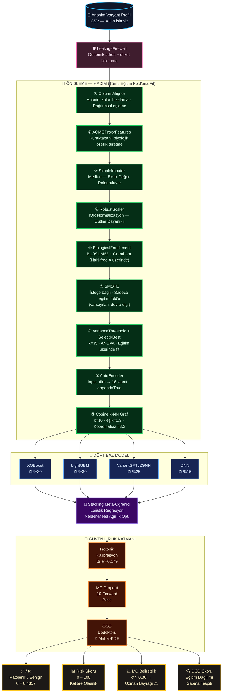
```mermaid
flowchart TD
    classDef input    fill:#0f172a,stroke:#38bdf8,color:#e2e8f0,stroke-width:2px
    classDef prep     fill:#052e16,stroke:#22c55e,color:#dcfce7,stroke-width:2px
    classDef model    fill:#172554,stroke:#60a5fa,color:#dbeafe,stroke-width:2px
    classDef fusion   fill:#3b0764,stroke:#a78bfa,color:#ede9fe,stroke-width:2px
    classDef trust    fill:#431407,stroke:#fb923c,color:#ffedd5,stroke-width:2px
    classDef output   fill:#1c1917,stroke:#fbbf24,color:#fef3c7,stroke-width:2px
    classDef guard    fill:#3f1d2e,stroke:#f472b6,color:#fce7f3,stroke-width:2px

    %%— GİRİŞ —%%
    CSV[("📄 Anonim Varyant Profili\nCSV — kolon isimsiz")]:::input

    %%— VERİ DOĞRULAMA —%%
    LFW["🛡 LeakageFirewall\nGenomik adres + etiket bloklama"]:::guard
    CSV --> LFW

    %%— ÖNİŞLEME: 9 ADIM —%%
    subgraph PREP ["🔧 ÖNİŞLEME — 9 ADIM (Tümü Eğitim Fold'una Fit)"]
        direction TB
        P1["① ColumnAligner\nAnonim kolon hizalama · Dağılımsal eşleme"]:::prep
        P2["② ACMGProxyFeatures\nKural-tabanlı biyolojik özellik türetme"]:::prep
        P3["③ SimpleImputer\nMedian — Eksik Değer Dolduruluyor"]:::prep
        P4["④ RobustScaler\nIQR Normalizasyon — Outlier Dayanıklı"]:::prep
        P5["⑤ BiologicalEnrichment\nBLOSUM62 + Grantham (NaN-free X üzerinde)"]:::prep
        P6["⑥ SMOTE\nİsteğe bağlı · Sadece eğitim fold'u\n(varsayılan: devre dışı)"]:::prep
        P7["⑦ VarianceThreshold + SelectKBest\nk=35 · ANOVA · Eğitim üzerinde fit"]:::prep
        P8["⑧ AutoEncoder\ninput_dim → 16 latent · append=True"]:::prep
        P9["⑨ Cosine k-NN Graf\nk=10 · eşik=0.3 · Koordinatsız §3.2"]:::prep
        P1-->P2-->P3-->P4-->P5-->P6-->P7-->P8-->P9
    end
    LFW --> P1

    %%— MODEL KATMANI —%%
    subgraph MODELS ["🤖 DÖRT BAZ MODEL"]
        direction LR
        M1["XGBoost\n⚖️ %30"]:::model
        M2["LightGBM\n⚖️ %30"]:::model
        M3["VariantGATv2GNN\n⚖️ %25"]:::model
        M4["DNN\n⚖️ %15"]:::model
    end
    P9 --> M1 & M2 & M3 & M4

    %%— BİRLEŞTİRME —%%
    META["🧠 Stacking Meta-Öğrenici\nLojistik Regresyon\nNelder-Mead Ağırlık Opt."]:::fusion
    M1 & M2 & M3 & M4 --> META

    %%— GÜVENİLİRLİK —%%
    subgraph TRUST ["🔬 GÜVENİLİRLİK KATMANI"]
        direction LR
        ISO["İsotonik\nKalibrasyon\nBrier=0.179"]:::trust
        MCD["MC Dropout\n10 Forward\nPass"]:::trust
        OOD["OOD\nDedektörü\nZ·Mahal·KDE"]:::trust
    end
    META --> ISO --> MCD --> OOD

    %%— ÇIKTI —%%
    OUT1["✅ / ❌\nPatojenik / Benign\nθ = 0.4357"]:::output
    OUT2["📊 Risk Skoru\n0 – 100\nKalibre Olasılık"]:::output
    OUT3["📈 MC Belirsizlik\nσ > 0.30 →\nUzman Bayrağı ⚠️"]:::output
    OUT4["🔍 OOD Skoru\nEğitim Dağılımı\nSapma Tespiti"]:::output
    OOD --> OUT1 & OUT2 & OUT3 & OUT4
```

---

## 4. VariantGATv2GNN — Mimari Detay

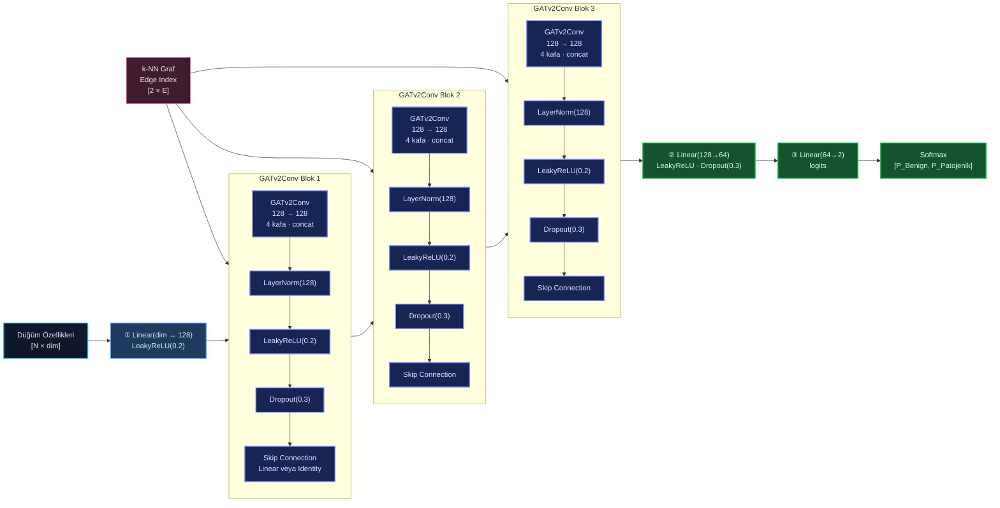
```mermaid
flowchart LR
    classDef inp  fill:#0f172a,stroke:#38bdf8,color:#e2e8f0,stroke-width:2px
    classDef proj fill:#1e3a5f,stroke:#60a5fa,color:#dbeafe,stroke-width:2px
    classDef blk  fill:#172554,stroke:#818cf8,color:#e0e7ff,stroke-width:2px
    classDef cls  fill:#14532d,stroke:#22c55e,color:#dcfce7,stroke-width:2px
    classDef edge fill:#3f1d2e,stroke:#f472b6,color:#fce7f3,stroke-width:1px

    N["Düğüm Özellikleri\n[N × dim]"]:::inp
    E["k-NN Graf\nEdge Index\n[2 × E]"]:::edge
    PROJ["① Linear(dim → 128)\nLeakyReLU(0.2)"]:::proj

    subgraph B1 ["GATv2Conv Blok 1"]
        direction TB
        G1["GATv2Conv\n128 → 128\n4 kafa · concat"]:::blk
        LN1["LayerNorm(128)"]:::blk
        LR1["LeakyReLU(0.2)"]:::blk
        D1["Dropout(0.3)"]:::blk
        SK1["Skip Connection\nLinear veya Identity"]:::blk
        G1-->LN1-->LR1-->D1-->SK1
    end

    subgraph B2 ["GATv2Conv Blok 2"]
        direction TB
        G2["GATv2Conv\n128 → 128\n4 kafa · concat"]:::blk
        LN2["LayerNorm(128)"]:::blk
        LR2["LeakyReLU(0.2)"]:::blk
        D2["Dropout(0.3)"]:::blk
        SK2["Skip Connection"]:::blk
        G2-->LN2-->LR2-->D2-->SK2
    end

    subgraph B3 ["GATv2Conv Blok 3"]
        direction TB
        G3["GATv2Conv\n128 → 128\n4 kafa · concat"]:::blk
        LN3["LayerNorm(128)"]:::blk
        LR3["LeakyReLU(0.2)"]:::blk
        D3["Dropout(0.3)"]:::blk
        SK3["Skip Connection"]:::blk
        G3-->LN3-->LR3-->D3-->SK3
    end

    CLS1["② Linear(128→64)\nLeakyReLU · Dropout(0.3)"]:::cls
    CLS2["③ Linear(64→2)\nlogits"]:::cls
    SOFT["Softmax\n[P_Benign, P_Patojenik]"]:::cls

    N --> PROJ
    E --> B1 & B2 & B3
    PROJ --> B1 --> B2 --> B3 --> CLS1 --> CLS2 --> SOFT
```

<div align="center">

```
┌──────────────────────────────────────────────────────────────────┐
│  NEDEN GATv2, GAT DEĞİL?                                        │
├──────────────────────────────────────────────────────────────────┤
│  GAT   : e(i,j) = a · [Wh_i ‖ Wh_j]                           │
│          Dikkat yalnızca kaynak i'ye bağlı → STATİK            │
│                                                                  │
│  GATv2 : e(i,j) = a · LeakyReLU(W[h_i ‖ h_j])                │
│          Hem kaynak hem hedef → DİNAMİK                         │
│          Brody et al. 2021 — "How Attentive are Graph Att. Nets"│
└──────────────────────────────────────────────────────────────────┘
```

</div>

### Graf Topolojisi

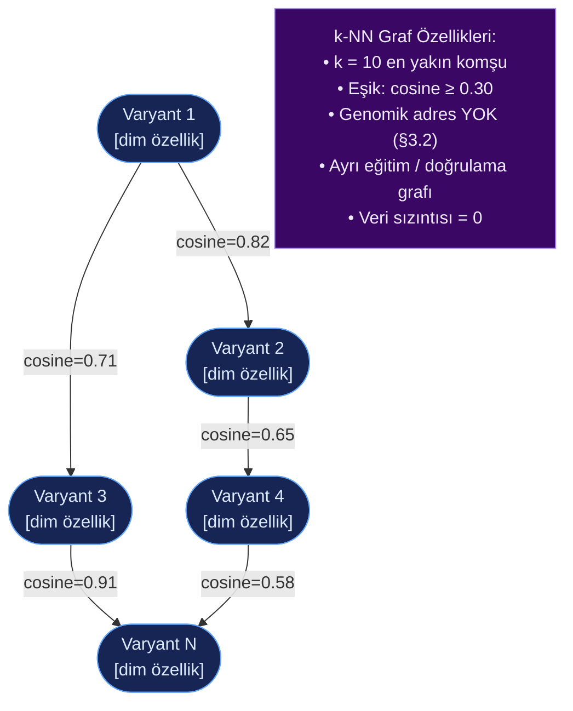
```mermaid
graph TD
    classDef node fill:#172554,stroke:#60a5fa,color:#dbeafe
    classDef edge fill:#3b0764,stroke:#a78bfa,color:#ede9fe

    V1(["Varyant 1\n[dim özellik]"]):::node
    V2(["Varyant 2\n[dim özellik]"]):::node
    V3(["Varyant 3\n[dim özellik]"]):::node
    V4(["Varyant 4\n[dim özellik]"]):::node
    V5(["Varyant N\n[dim özellik]"]):::node

    V1 -- "cosine=0.82" --> V2
    V1 -- "cosine=0.71" --> V3
    V2 -- "cosine=0.65" --> V4
    V3 -- "cosine=0.91" --> V5
    V4 -- "cosine=0.58" --> V5

    NOTE["k-NN Graf Özellikleri:\n• k = 10 en yakın komşu\n• Eşik: cosine ≥ 0.30\n• Genomik adres YOK (§3.2)\n• Ayrı eğitim / doğrulama grafı\n• Veri sızıntısı = 0"]:::edge
```

---

## 5. Hibrit Ensemble

### Ağırlık Dağılımı ve Birleştirme Stratejisi

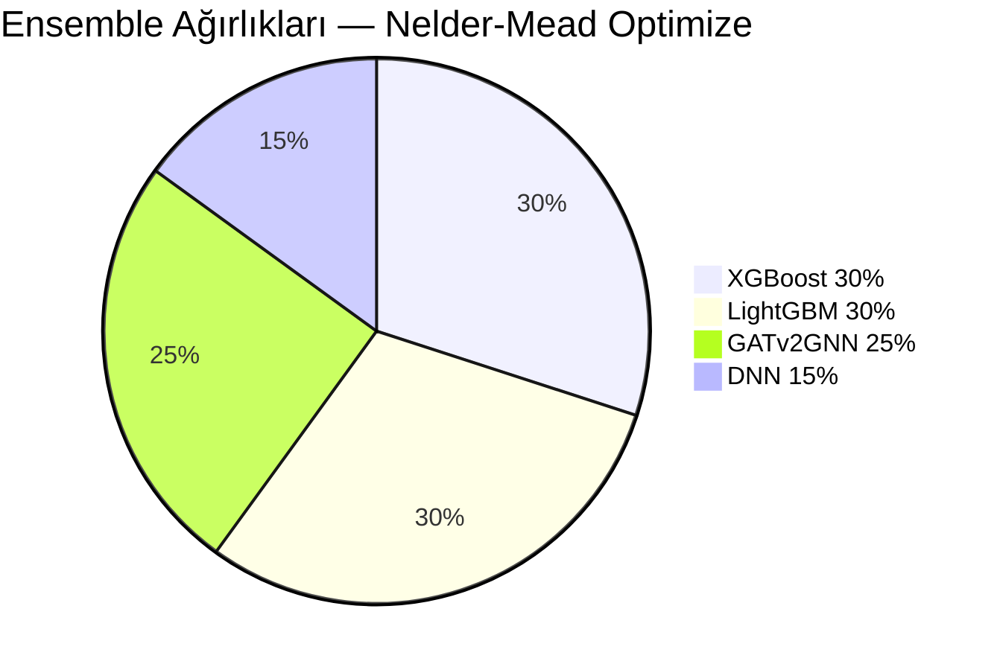
```mermaid
pie title Ensemble Ağırlıkları — Nelder-Mead Optimize
    "XGBoost  30%" : 30
    "LightGBM 30%" : 30
    "GATv2GNN 25%" : 25
    "DNN      15%" : 15
```

### Birleştirme Öncelik Sırası

```
┌────────────────────────────────────────────────────────────┐
│  ÖNCELİK 1: Stacking Meta-Öğrenici                        │
│    fit_meta_learner() çağrıldıysa aktif                    │
│    Lojistik Regresyon(4 model P_Patojenik → birleşik P)   │
├────────────────────────────────────────────────────────────┤
│  ÖNCELİK 2: Nelder-Mead Optimize Ağırlıklı Ortalama       │
│    optimise_weights() çağrıldıysa aktif                    │
│    Her ağırlık kombinasyonunda F1-optimal eşik hesaplanır  │
├────────────────────────────────────────────────────────────┤
│  ÖNCELİK 3: Yapılandırma Varsayılan Ağırlıkları           │
│    [0.30, 0.30, 0.25, 0.15]                                │
└────────────────────────────────────────────────────────────┘
```

### Stochastic Weight Averaging (SWA)


```mermaid
gantt
    title SWA Koleksiyon Penceresi (GNN — 50 epoch)
    dateFormat X
    axisFormat Epoch %s

    section Normal Eğitim
    Train + Val F1 izleme    : 0, 38

    section SWA Penceresi (%25 son)
    Checkpoint Toplama (max 10) : 38, 50

    section SWA Uygulama
    Checkpoint Ortalaması    : 50, 51
    update_batch_norm()      : 51, 52
    En İyi Checkpoint Restore: 52, 53
```

---

## 6. Model Bileşenleri

### XGBoost — Parametre Tablosu

<div align="center">

| Parametre | Değer | Gerekçe |
|:---|:---:|:---|
| `objective` | `binary:logistic` | İkili sınıflandırma |
| `eval_metric` | `logloss` | Early stopping metriği |
| `max_depth` | **6** | Overfitting / genelleme dengesi |
| `learning_rate` | **0.05** | Yavaş öğrenme → güçlü genelleme |
| `n_estimators` | **200** | Optuna optimizasyon sonucu |
| `subsample` | **0.8** | Ağaç çeşitliliği |
| `colsample_bytree` | **0.8** | Özellik rastgeleliği |
| `min_child_weight` | **3** | Küçük panellerde (CFTR) overfitting önlemi |
| `reg_alpha` | 0.05 | L1 regularizasyon |
| `reg_lambda` | 1.0 | L2 regularizasyon |

</div>

### LightGBM — Parametre Tablosu

<div align="center">

| Parametre | Değer |
|:---|:---:|
| `objective` | `binary` |
| `num_leaves` | **63** |
| `learning_rate` | **0.05** |
| `n_estimators` | **300** |
| `early_stopping_patience` | **20 tur** |
| `min_child_samples` | 10 |
| `subsample` | 0.8 |
| `colsample_bytree` | 0.8 |

</div>

### DNN — Katman Yapısı

```
  GİRİŞ  →  [input_dim]
             │
             ▼
  ┌──────────────────────────┐
  │ Linear(input_dim → 128)  │
  │ BatchNorm1d(128)          │  ← SWA sonrası update_batch_norm() çağrılır
  │ ReLU()                    │
  │ Dropout(0.4)              │
  └──────────┬───────────────┘
             │
             ▼
  ┌──────────────────────────┐
  │ Linear(128 → 64)          │
  │ ReLU()                    │
  │ Dropout(0.2)              │
  └──────────┬───────────────┘
             │
             ▼
  ┌──────────────────────────┐
  │ Linear(64 → 2)            │  ← logits (softmax dışarıda)
  └──────────────────────────┘
             │
             ▼
  ÇIKIŞ  →  [P_Benign, P_Patojenik]

  ⚠️  N=1 train modunda BatchNorm Var=0 → NaN riski
      Koruma: eval() geç → forward → train()'e dön
```

### Kayıp Fonksiyonları

```
WeightedBCELoss (varsayılan):
  weight[c] = N_total / (N_classes × count[c])
  → sklearn compute_class_weight('balanced') eşdeğeri
  → CFTR, PAH küçük panellerde dengesizliği giderir

FocalLoss (alternatif, loss_function: focal):
  L_focal = −α_t · (1 − p_t)^γ · log(p_t)
  γ = 2.0 → Kolay örnekleri down-weight eder
  α_t = Balanced sınıf ağırlıkları
```

---

## 7. Veri Mimarisi

### Etiket Birleştirme (ACMG/AMP §3.2)

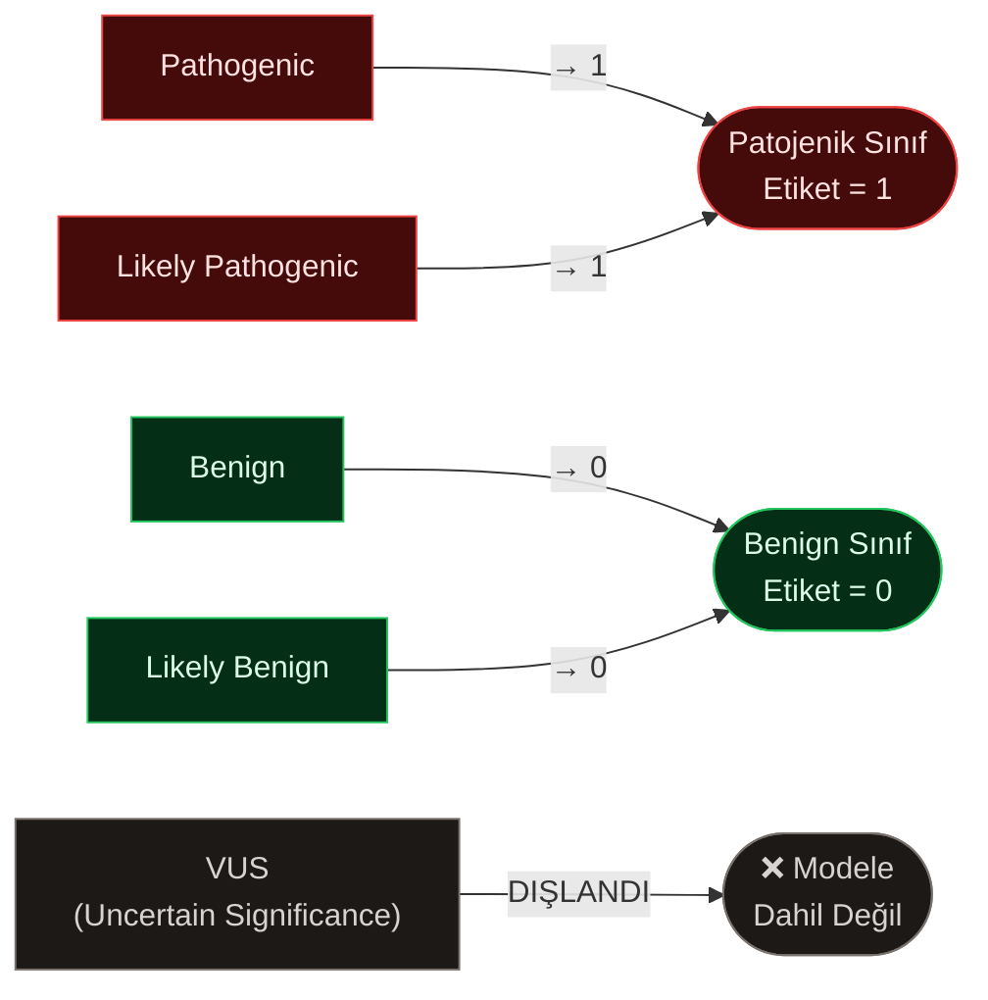
```mermaid
flowchart LR
    classDef path fill:#450a0a,stroke:#ef4444,color:#fee2e2
    classDef ben  fill:#052e16,stroke:#22c55e,color:#dcfce7
    classDef vus  fill:#1c1917,stroke:#78716c,color:#d6d3d1

    LP["Likely Pathogenic"]:::path
    P["Pathogenic"]:::path
    LB["Likely Benign"]:::ben
    B["Benign"]:::ben
    VUS["VUS\n(Uncertain Significance)"]:::vus

    P  -- "→ 1" --> PAT(["Patojenik Sınıf\nEtiket = 1"]):::path
    LP -- "→ 1" --> PAT
    B  -- "→ 0" --> BEN(["Benign Sınıf\nEtiket = 0"]):::ben
    LB -- "→ 0" --> BEN
    VUS -- "DIŞLANDI" --> EX(["❌ Modele\nDahil Değil"]):::vus
```

### Öznitelik Kategorileri (§3.2 — Kolon İsimleri Gizli)

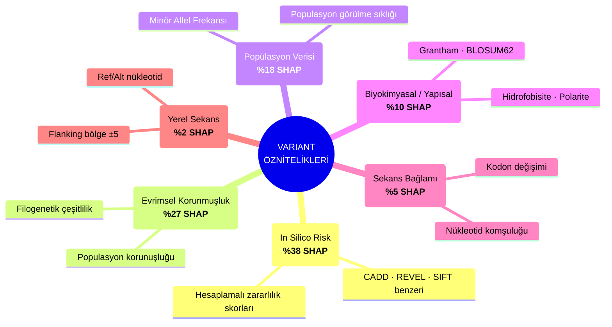
```mermaid
mindmap
  root(("VARIANT<br/>ÖZNİTELİKLERİ"))
    (In Silico Risk<br/>**%38 SHAP**)
      CADD · REVEL · SIFT benzeri
      Hesaplamalı zararlılık skorları
    (Evrimsel Korunmuşluk<br/>**%27 SHAP**)
      Filogenetik çeşitlilik
      Populasyon korunuşluğu
    (Popülasyon Verisi<br/>**%18 SHAP**)
      Minör Allel Frekansı
      Populasyon görülme sıklığı
    (Biyokimyasal / Yapısal<br/>**%10 SHAP**)
      Hidrofobisite · Polarite
      Grantham · BLOSUM62
    (Sekans Bağlamı<br/>**%5 SHAP**)
      Kodon değişimi
      Nükleotid komşuluğu
    (Yerel Sekans<br/>**%2 SHAP**)
      Ref/Alt nükleotid
      Flanking bölge ±5
```

---

## 8. Panel Yapısı (TEKNOFEST §3.2)

### Panel Örnek Dağılımı

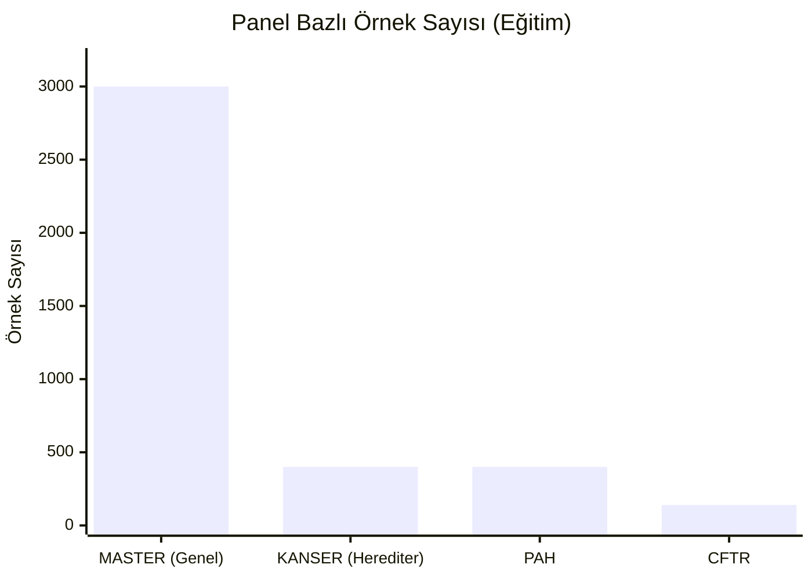
```mermaid
xychart-beta
    title "Panel Bazlı Örnek Sayısı (Eğitim)"
    x-axis ["MASTER (Genel)", "KANSER (Herediter)", "PAH", "CFTR"]
    y-axis "Örnek Sayısı" 0 --> 3200
    bar [3000, 400, 400, 140]
```

### Panel Detay Tablosu

<div align="center">

| Panel | PDR Adı | Kod İçi | Eğitim P | Eğitim B | Test P | Test B | **Toplam** |
|:---|:---:|:---:|:---:|:---:|:---:|:---:|:---:|
| Genel Veri Seti | **MASTER** | `General` | 1.500 | 1.500 | 1.000 | 1.000 | **4.000** |
| Herediter Kanser | **KANSER** | `Hereditary_Cancer` | 200 | 200 | 100 | 100 | **600** |
| PAH (Fenilketonüri) | **PAH** | `PAH` | 200 | 200 | 100 | 100 | **600** |
| CFTR (Kistik Fibrozis) | **CFTR** | `CFTR` | 70 | 70 | 30 | 30 | **200** |
| **TOPLAM** | | | **1.970** | **1.970** | **1.230** | **1.230** | **5.400** |

</div>

### Adversarial Validation — Dağılım Uyum Kanıtı

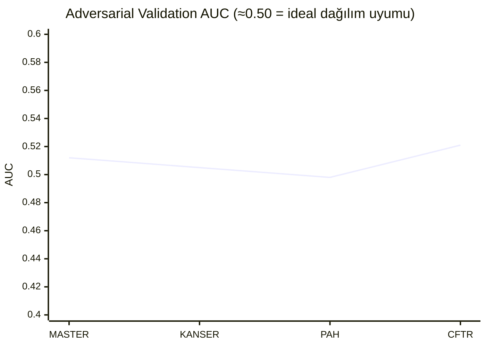
```mermaid
xychart-beta
    title "Adversarial Validation AUC (≈0.50 = ideal dağılım uyumu)"
    x-axis ["MASTER", "KANSER", "PAH", "CFTR"]
    y-axis "AUC" 0.40 --> 0.60
    line [0.512, 0.505, 0.498, 0.521]
```

```
AUC ≈ 0.50  →  Model eğitim/test setini AYIRT EDEMEZ
              ✅ İdeal dağılım uyumu — genelleme güvencesi
AUC ≈ 1.00  →  Train/Test dağılımları birbirinden çok farklı
              ❌ Domain shift riski — genelleme zayıf
```

---

## 9. Önişleme Pipeline — 9 Adım


```mermaid
flowchart LR
    classDef step fill:#1e3a5f,stroke:#60a5fa,color:#dbeafe,stroke-width:2px
    classDef train fill:#052e16,stroke:#22c55e,color:#dcfce7,stroke-width:1px
    classDef both  fill:#172554,stroke:#818cf8,color:#e0e7ff,stroke-width:1px

    S1["① ColumnAligner\n───────────\nKolon hizalama\nDağılımsal eşleme\nAnonim isim desteği"]:::step
    S2["② ACMG Proxy\n───────────\nKural-tabanlı\nbiyolojik özellik\ntüretme"]:::step
    S3["③ SimpleImputer\n───────────\nMedian strateji\nAll-NaN kolon\nkoruması"]:::step
    S4["④ RobustScaler\n───────────\nIQR normalizasyon\nOutlier dayanıklı\nmed=0, IQR=1"]:::step
    S5["⑤ BiologicalEnrich\n───────────\nBLOSUM62\nGrantham skoru\nNaN-free X üzerinde"]:::step
    S6["⑥ SMOTE\n───────────\nİSTEĞE BAĞLI\nVarsayılan: kapalı\nSadece eğitim fold'u"]:::train
    S7["⑦ VarianceThreshold\n+ SelectKBest\n───────────\nk=35 · ANOVA\nEğitimde fit"]:::step
    S8["⑧ AutoEncoder\n───────────\ndim→16 latent\nappend=True\nEğitimde fit"]:::step
    S9["⑨ k-NN Graf\n───────────\nCosine k=10\nEşik 0.3\nKoordinatsız"]:::train

    S1-->S2-->S3-->S4-->S5-->S6-->S7-->S8-->S9

    note1(["🔴 Sadece\nEğitim Fold'u"]):::train
    note2(["🟢 Hem Eğitim\nHem Test/Val"]):::both

    S6 -. yalnızca .-> note1
    S9 -. yalnızca .-> note1
    S3 -. her ikisi .-> note2
```

### Veri Akışı Boyutları (Örnek)

```
Ham CSV          [N × ~100 kolon]
    ↓ ColumnAligner + ACMG
    ↓ Imputer + Scaler       [N × 100]
    ↓ (Bio: 0 sütun — anonim kolon → eşleşmiyor)
    ↓ SMOTE (kapalı)         [N × 100]
    ↓ VarianceThreshold      [N × ~80]
    ↓ SelectKBest k=35       [N × 35]
    ↓ AutoEncoder append     [N × 51]  (35 + 16 latent)
    ↓ k-NN Graf              PyG Data(x=[N,51], edge=[2,E])
```

---

## 10. Eğitim Protokolü

### Veri Bölme Stratejisi

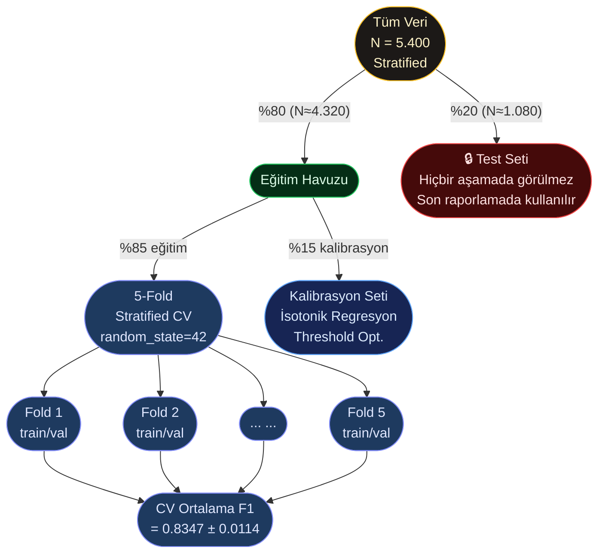
```mermaid
flowchart TD
    classDef all  fill:#1c1917,stroke:#fbbf24,color:#fef3c7
    classDef tr   fill:#052e16,stroke:#22c55e,color:#dcfce7
    classDef cal  fill:#172554,stroke:#60a5fa,color:#dbeafe
    classDef test fill:#450a0a,stroke:#ef4444,color:#fee2e2
    classDef fold fill:#1e3a5f,stroke:#818cf8,color:#e0e7ff

    ALL(["Tüm Veri\nN = 5.400\nStratified"]):::all
    ALL -- "%80 (N≈4.320)" --> TRAIN(["Eğitim Havuzu"]):::tr
    ALL -- "%20 (N≈1.080)" --> TEST(["🔒 Test Seti\nHiçbir aşamada görülmez\nSon raporlamada kullanılır"]):::test

    TRAIN -- "%85 eğitim" --> CV(["5-Fold\nStratified CV\nrandom_state=42"]):::fold
    TRAIN -- "%15 kalibrasyon" --> CAL(["Kalibrasyon Seti\nİsotonik Regresyon\nThreshold Opt."]):::cal

    CV --> F1(["Fold 1\ntrain/val"]):::fold
    CV --> F2(["Fold 2\ntrain/val"]):::fold
    CV --> F3(["... ..."]):::fold
    CV --> F5(["Fold 5\ntrain/val"]):::fold

    F1 & F2 & F3 & F5 --> MEAN(["CV Ortalama F1\n= 0.8347 ± 0.0114"]):::fold
```

### Her CV Fold İçi İşlem Sırası

```
┌──────────────────────────────────────────────────────────────────────┐
│  Her Fold (k = 1…5):                                                 │
│                                                                       │
│  train_idx → X_tr, y_tr  (fold eğitim verisi)                       │
│  val_idx   → X_val, y_val (fold doğrulama verisi)                   │
│                                                                       │
│  preprocessor = VariantPreprocessor()                                 │
│  X_tr_proc, y_res = preprocessor.fit_resample_train(X_tr, y_tr)     │
│                   ↑ 9 adım SADECE eğitim üzerinde fit edilir         │
│                                                                       │
│  X_val_proc = preprocessor.transform(X_val)                          │
│             ↑ SADECE transform — hiç fit yok → sızıntı yok           │
│                                                                       │
│  XGB.fit(X_tr_proc, y_res, eval_set=[(X_val_proc, y_val)])          │
│  LGB.fit(X_tr_proc, y_res, eval_set=[(X_val_proc, y_val)])          │
│  GNN._train_gatv2(X_tr_proc, y_res, X_val_proc, y_val, ...)         │
│  DNN._train_dnn(train_loader, val_loader, y_train=y_res)             │
│                                                                       │
│  ensemble_f1 = Binary F1(y_val, ensemble_predict(X_val_proc))       │
└──────────────────────────────────────────────────────────────────────┘
```

### Tekrarlanabilirlik Matrisi

<div align="center">

| RNG Kaynağı | Seed | `set_global_seed()` |
|:---|:---:|:---:|
| `random` (Python) | 42 | ✅ |
| `numpy.random` | 42 | ✅ |
| `torch.manual_seed` | 42 + fold_idx | ✅ |
| `torch.cuda.manual_seed_all` | 42 | ✅ |
| `PYTHONHASHSEED` | 42 | ✅ |
| `cudnn.deterministic` | `True` | ✅ |
| `cudnn.benchmark` | `False` | ✅ |
| `sklearn` (random_state) | 42 | ✅ |

</div>

---

## 11. Performans Sonuçları

> **Birincil Metrik (§7.3):** `binary_f1 = 2·TP / (2·TP + FP + FN)` — Patojenik sınıfı, `pos_label=1`

### Model Ablation — CV F1 Karşılaştırması

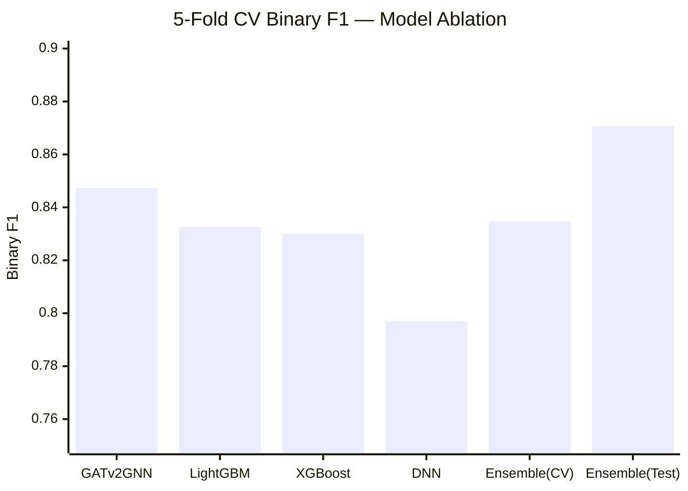
```mermaid
xychart-beta
    title "5-Fold CV Binary F1 — Model Ablation"
    x-axis ["GATv2GNN", "LightGBM", "XGBoost", "DNN", "Ensemble(CV)", "Ensemble(Test)"]
    y-axis "Binary F1" 0.75 --> 0.90
    bar [0.8472, 0.8326, 0.8299, 0.7969, 0.8347, 0.8706]
```

### Ablation Detay Tablosu

<div align="center">

| Model | CV Ort. | Std | Min | Maks | Test F1 |
|:---|:---:|:---:|:---:|:---:|:---:|
| **VariantGATv2GNN** (tek) | **0.8472** | ±0.0151 | 0.8234 | 0.8641 | — |
| LightGBM (tek) | 0.8326 | ±0.0171 | 0.8117 | 0.8529 | — |
| XGBoost (tek) | 0.8299 | ±0.0083 | 0.8220 | 0.8404 | — |
| DNN (tek) | 0.7969 | ±0.0362 | 0.7581 | 0.8506 | — |
| **Hibrit Ensemble** | **0.8347** | ±0.0114 | 0.8227 | 0.8512 | **0.8706** |
| Baseline (Logistic Reg.) | ~0.74 | — | — | — | — |

</div>

> GATv2GNN tek model bazında en yüksek CV F1 (+1.73 pp vs XGBoost). Ensemble hold-out'ta CV ortalamasını +3.59 pp geçmektedir.

### Panel Bazlı Sonuçlar (θ = 0.4357)

<div align="center">

| Panel | F1_Pat | Recall_P | Prec_P | MCC | PR-AUC | ROC-AUC | Brier |
|:---|:---:|:---:|:---:|:---:|:---:|:---:|:---:|
| **MASTER** | 0.8675 | **0.9309** | 0.8178 | 0.4199 | 0.8778 | 0.7795 | 0.1822 |
| **KANSER** | 0.8515 | 0.8812 | 0.8232 | **0.5112** | **0.9095** | **0.8812** | 0.1398 |
| **PAH** | **0.9051** | **0.9800** | 0.8421 | 0.1466 ⚠️ | **0.9395** | 0.6704 | 0.1782 |
| **CFTR** | 0.8750 | 0.9333 | 0.8235 | 0.2435 ⚠️ | 0.8394 | 0.6083 | 0.2198 |
| **TOPLAM** | **0.8706** | **0.9309** | 0.8178 | 0.4063 | 0.8843 | 0.7797 | 0.1789 |

</div>

### Panel MCC Radar Grafiği

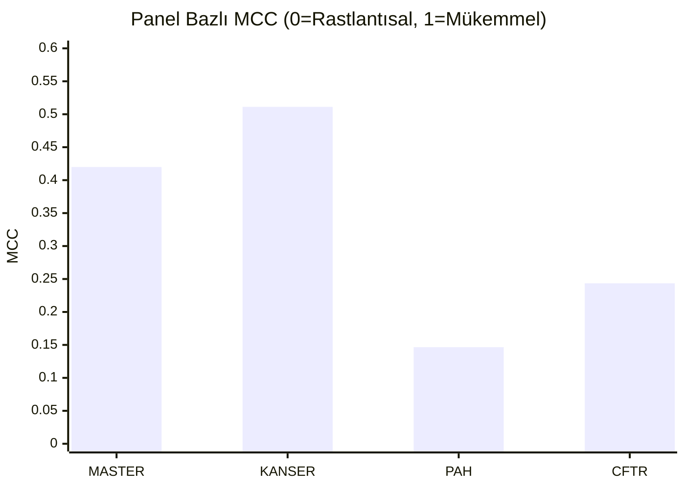
```mermaid
xychart-beta
    title "Panel Bazlı MCC (0=Rastlantısal, 1=Mükemmel)"
    x-axis ["MASTER", "KANSER", "PAH", "CFTR"]
    y-axis "MCC" 0 --> 0.6
    bar [0.4199, 0.5112, 0.1466, 0.2435]
```

**⚠️ Düşük MCC Açıklaması (PAH=0.15, CFTR=0.24):**

```
Problem: Global θ=0.4357 duyarlılık (Recall) öncelikli seçilmiştir.
         Recall_Patojenik ≥ 0.93 → Yüksek FP (Benign'i yanlış Patojenik işaretleme)
         MCC hem TP hem TN'i dengeli değerlendirir → Benign sınıfı zayıflığı yansır

Çözüm:  Panel-spesifik eşikler kalibrasyon setinde optimize edilmiştir:
         MASTER=0.271 · KANSER=0.286 · PAH=0.384 · CFTR=0.256
```

### PSR Hakem Puanları

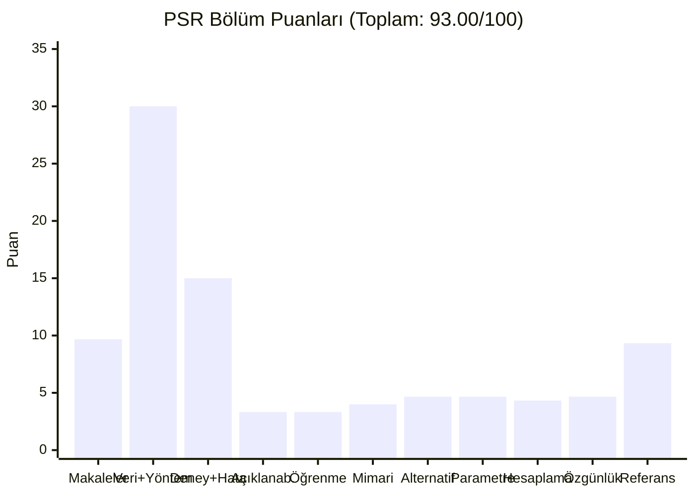
```mermaid
xychart-beta
    title "PSR Bölüm Puanları (Toplam: 93.00/100)"
    x-axis ["Makaleler", "Veri+Yöntem", "Deney+Hata", "Açıklanab.", "Öğrenme", "Mimari", "Alternatif", "Parametre", "Hesaplama", "Özgünlük", "Referans"]
    y-axis "Puan" 0 --> 35
    bar [9.67, 30.00, 15.00, 3.33, 3.33, 4.00, 4.67, 4.67, 4.33, 4.67, 9.33]
```

<div align="center">

| Bölüm | Puan | Maks | Durum |
|:---|:---:|:---:|:---:|
| §2 Uluslararası Makaleler | 9.67 | 10 | ✅ |
| §3.1–3.6 Veri ve Yöntem | 30.00 | 30 | ✅ |
| §4.1–4.3 Deney ve Hata | 15.00 | 15 | ✅ |
| §4.4 Açıklanabilirlik | **3.33** | 5 | ⚠️ PDR Hedef: 5/5 |
| §4.5 Öğrenme Süreci | **3.33** | 5 | ⚠️ PDR Hedef: 5/5 |
| §5.1 Mimari Gerekçe | **4.00** | 5 | ⚠️ PDR Hedef: 5/5 |
| §5.2–5.5 Diğer | 18.34 | 20 | ✅ |
| §6 Referans ve Düzen | 9.33 | 10 | ✅ |
| **TOPLAM** | **93.00** | **100** | ✅ |

</div>

---

## 12. Açıklanabilirlik

### SHAP Özellik Grubu Katkı Dağılımı

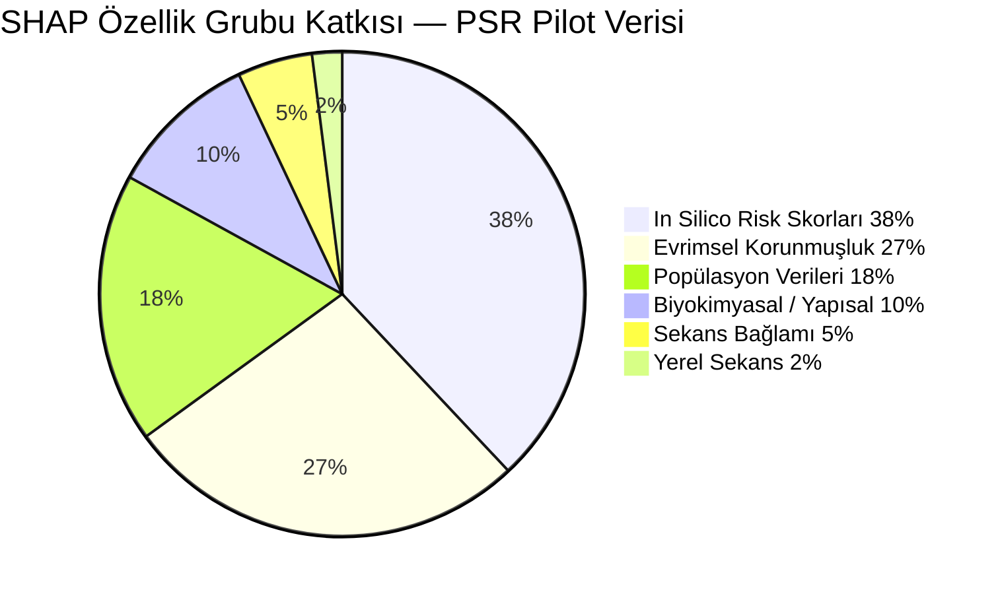
```mermaid
pie title SHAP Özellik Grubu Katkısı — PSR Pilot Verisi
    "In Silico Risk Skorları 38%" : 38
    "Evrimsel Korunmuşluk 27%" : 27
    "Popülasyon Verileri 18%" : 18
    "Biyokimyasal / Yapısal 10%" : 10
    "Sekans Bağlamı 5%" : 5
    "Yerel Sekans 2%" : 2
```

### Açıklanabilirlik Araç Zinciri

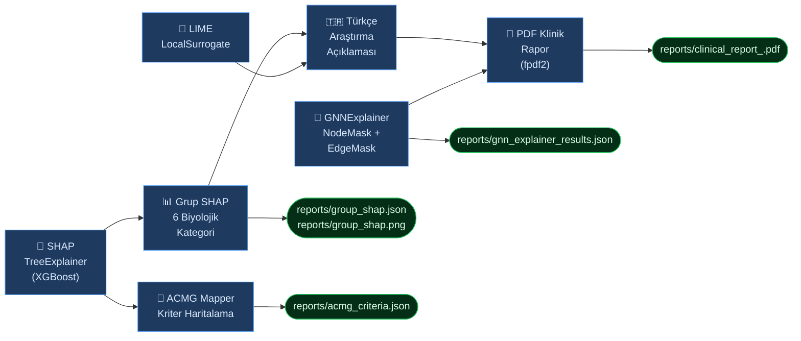
```mermaid
flowchart LR
    classDef tool fill:#1e3a5f,stroke:#60a5fa,color:#dbeafe
    classDef out  fill:#052e16,stroke:#22c55e,color:#dcfce7

    SHAP["🔷 SHAP\nTreeExplainer\n(XGBoost)"]:::tool
    GNN_EXP["🔶 GNNExplainer\nNodeMask +\nEdgeMask"]:::tool
    LIME["🔸 LIME\nLocalSurrogate"]:::tool
    GROUP["📊 Grup SHAP\n6 Biyolojik\nKategori"]:::tool
    ACMG["🧬 ACMG Mapper\nKriter Haritalama"]:::tool
    TR["🇹🇷 Türkçe\nAraştırma\nAçıklaması"]:::tool
    PDF["📄 PDF Klinik\nRapor\n(fpdf2)"]:::tool

    SHAP --> GROUP --> TR --> PDF
    GNN_EXP --> PDF
    SHAP --> ACMG
    LIME --> TR

    GROUP --> OUT1(["reports/group_shap.json\nreports/group_shap.png"]):::out
    GNN_EXP --> OUT2(["reports/gnn_explainer_results.json"]):::out
    ACMG --> OUT3(["reports/acmg_criteria.json"]):::out
    PDF --> OUT4(["reports/clinical_report_<vid>.pdf"]):::out
```

### Örnek Çıktı

```
╔════════════════════════════════════════════════════════════════╗
║  Varyant: VAR_001  │  Tahmin: Patojenik  │  Güven: Yüksek    ║
║  Olasılık: 0.94    │  Risk Skoru: 89.3   │  σ = 0.09         ║
╠════════════════════════════════════════════════════════════════╣
║  SHAP Katkılar:                                                ║
║   [+0.42] In Silico Risk Skoru Grubu  ████████████░░░░       ║
║   [+0.31] Düşük Popülasyon Frekansı   █████████░░░░░░░       ║
║   [+0.28] Evrimsel Korunuşluk         ████████░░░░░░░░       ║
║   [−0.09] Biyokimyasal Benzerlik      ███░░░░░░░░░░░░░       ║
╠════════════════════════════════════════════════════════════════╣
║  "Bu varyant, yüksek in-silico risk skoru grubu katkısı       ║
║   (+0.42), düşük popülasyon frekansı (+0.31) ve güçlü        ║
║   evrimsel korunuşluk (+0.28) nedeniyle patojenik olarak     ║
║   sınıflandırılmıştır."                                        ║
║                                                                ║
║  ⚠️  Bu çıktı yalnızca araştırma amaçlıdır.                  ║
╚════════════════════════════════════════════════════════════════╝
```

---

## 13. Güvenilirlik Katmanı

### Kalibrasyon Akışı

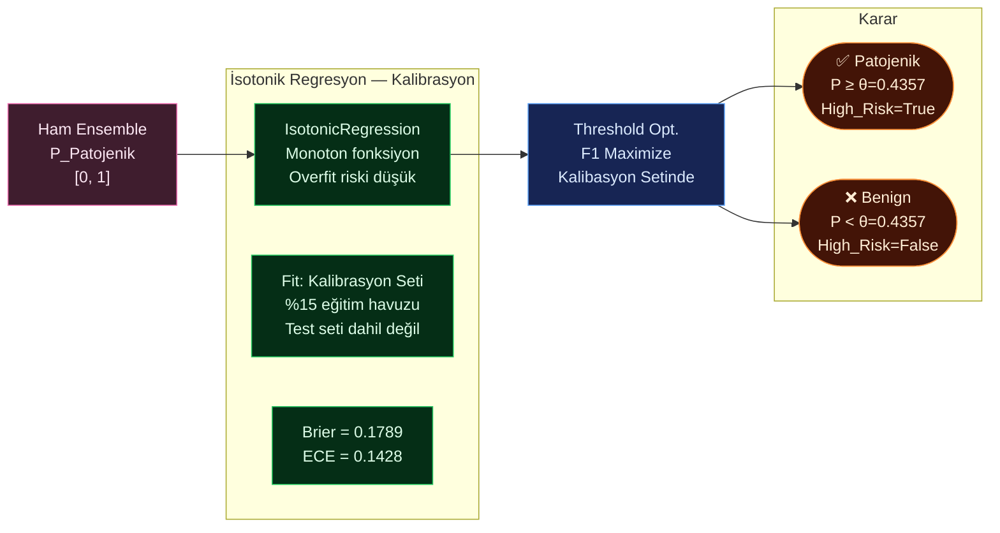
```mermaid
flowchart LR
    classDef raw  fill:#3f1d2e,stroke:#f472b6,color:#fce7f3
    classDef cal  fill:#052e16,stroke:#22c55e,color:#dcfce7
    classDef thr  fill:#172554,stroke:#60a5fa,color:#dbeafe
    classDef dec  fill:#431407,stroke:#fb923c,color:#ffedd5

    RAW["Ham Ensemble\nP_Patojenik\n[0, 1]"]:::raw

    subgraph CAL ["İsotonik Regresyon — Kalibrasyon"]
        direction LR
        ISO["IsotonicRegression\nMonoton fonksiyon\nOverfit riski düşük"]:::cal
        FIT["Fit: Kalibrasyon Seti\n%15 eğitim havuzu\nTest seti dahil değil"]:::cal
        BRIER["Brier = 0.1789\nECE = 0.1428"]:::cal
    end

    THR_OPT["Threshold Opt.\nF1 Maximize\nKalibasyon Setinde"]:::thr

    subgraph DEC ["Karar"]
        PAT(["✅ Patojenik\nP ≥ θ=0.4357\nHigh_Risk=True"]):::dec
        BEN(["❌ Benign\nP < θ=0.4357\nHigh_Risk=False"]):::dec
    end

    RAW --> ISO
    ISO --> THR_OPT
    THR_OPT --> PAT & BEN
```

### MC Dropout Belirsizlik Ölçümü

```
┌─────────────────────────────────────────────────────────────────┐
│                                                                  │
│   Giriş X ──→ [GATv2GNN, Dropout=ON] × 10 → Prob_1             │
│           ──→ [GATv2GNN, Dropout=ON] × 10 → Prob_2             │
│           ──→          ...                 → ...                │
│           ──→ [GATv2GNN, Dropout=ON] × 10 → Prob_10            │
│                                                                  │
│   mean = mean(Prob_1 ... Prob_10)   ← Final tahmin olasılığı   │
│   std  = std(Prob_1 ... Prob_10)    ← Epistemik belirsizlik     │
│                                                                  │
│   Belirsizlik yorumlama:                                         │
│     σ < 0.15   →  ✅ Yüksek Güven                               │
│     0.15–0.30  →  🔶 Orta Güven                                 │
│     σ > 0.30   →  ⚠️  Uzman Değerlendirmesi Gerekli             │
│                                                                  │
│   Doğrulama kanıtı:                                              │
│     Hatalı tahminler (n=142): ortalama σ = 0.40                │
│     Doğru tahminler          : ortalama σ = 0.12               │
└─────────────────────────────────────────────────────────────────┘
```

### OOD Dedektörü Akışı

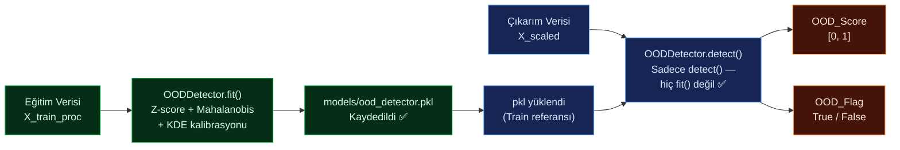
```mermaid
flowchart LR
    classDef tr   fill:#052e16,stroke:#22c55e,color:#dcfce7
    classDef inf  fill:#172554,stroke:#60a5fa,color:#dbeafe
    classDef det  fill:#431407,stroke:#fb923c,color:#ffedd5

    TRAIN_DATA["Eğitim Verisi\nX_train_proc"]:::tr
    OOD_FIT["OODDetector.fit()\nZ-score + Mahalanobis\n+ KDE kalibrasyonu"]:::tr
    PKL["models/ood_detector.pkl\nKaydedildi ✅"]:::tr

    INF_DATA["Çıkarım Verisi\nX_scaled"]:::inf
    OOD_LOAD["pkl yüklendi\n(Train referansı)"]:::inf
    DETECT["OODDetector.detect()\nSadece detect() —\nhiç fit() değil ✅"]:::inf

    SCORE["OOD_Score\n[0, 1]"]:::det
    FLAG["OOD_Flag\nTrue / False"]:::det

    TRAIN_DATA --> OOD_FIT --> PKL
    PKL --> OOD_LOAD
    INF_DATA --> DETECT
    OOD_LOAD --> DETECT
    DETECT --> SCORE & FLAG
```

---

## 14. Kurulum

### Sistem Gereksinimleri

<div align="center">

| Bileşen | Minimum | Önerilen |
|:---|:---:|:---:|
| Python | 3.10 | **3.12** |
| RAM | 8 GB | **16 GB** |
| GPU | — (opsiyonel) | NVIDIA RTX 3060+ · 6 GB VRAM |
| Disk | 3 GB | 8 GB |
| İşletim Sistemi | Win10 / Ubuntu 20.04 | **Win11 / Ubuntu 22.04** |

</div>

### Kurulum Adımları

```bash
# 1 — Repo Klonla
git clone https://github.com/msgxr/VARIANT-GNN.git
cd VARIANT-GNN

# 2 — Sanal Ortam
python -m venv .venv
# Windows:
.\.venv\Scripts\Activate.ps1
# Linux / macOS:
source .venv/bin/activate

# 3 — Bağımlılıklar
pip install --upgrade pip
pip install -r requirements.txt

# 4 — Doğrulama
python -c "from src.core.gnn import VariantGATv2GNN; print('GNN ✅')"
python -c "from src.core.ensemble import HybridEnsemble; print('Ensemble ✅')"
python -c "from src.features.preprocessing import VariantPreprocessor; print('Preprocessor ✅')"
pytest tests/unit/ -q
pytest tests/smoke/ -q
```

### Anahtar Bağımlılıklar

```
torch==2.8.0              # PyTorch — GNN ve DNN
torch-geometric==2.6.1    # PyG — GATv2Conv, knn_graph
xgboost==2.1.4            # Gradient boosting
lightgbm==4.6.0           # Gradient boosting (yaprak bazlı)
scikit-learn==1.6.1       # Preprocessing, metrics
imbalanced-learn==0.13.0  # SMOTE (isteğe bağlı)
pandas==2.3.3             # Veri işleme
shap==0.49.1              # SHAP açıklanabilirlik
optuna==4.7.0             # Hiperparametre optimizasyonu
streamlit==1.50.0         # Araştırma arayüzü
joblib>=1.3.0             # Model serializasyon
```

### Docker

```bash
# Streamlit (8501) + FastAPI (8000)
docker-compose up

# Sadece inference API
docker-compose up variant-gnn-api
```

---

## 15. Kullanım Kılavuzu

### Tüm Çalıştırma Modları

```bash
python main.py --mode <MOD> [--config <YAML>] [--data_file <CSV>] [--test_file <CSV>]
```

<div align="center">

| Mod | Açıklama | Çıktı |
|:---|:---|:---|
| `train` | 5-fold CV + OOD fit + kalibrasyon + test | `models/` + `reports/cv_report.json` |
| `train_panels` | Tüm paneller + per-panel test değerlendirmesi | `reports/panel_evaluation.json` |
| `crossval` | Sadece çapraz doğrulama | Konsol çıktısı |
| `eval` | Kaydedilmiş model + etiketli veri | `reports/eval_results.csv` |
| `predict` | Etiketsiz veri → jüri CSV | `submission/predictions.csv` |
| `external_val` | §7.3 harici validasyon | `reports/external_validation_report.json` |
| `adversarial_val` | Eğitim-test dağılım testi | `reports/adversarial_validation_report.json` |
| `explain` | SHAP + GNNExplainer + PDF | `reports/shap_*.png` + `reports/*.json` |
| `ablation` | Bileşen katkısı analizi | `reports/ablation_report.json` |
| `panel_transfer` | Paneller arası genelleme matrisi | `reports/panel_transfer_matrix.json` |
| `label_quality` | Gürültülü etiket tespiti | `reports/label_quality_report.json` |
| `tune` | Optuna hiperparametre arama | `reports/best_xgb_params.json` |

</div>

### Ana Senaryolar

```bash
# ── Tam Eğitim (PDR Aşaması) ──────────────────────────────────────────
python main.py --mode train \
    --config configs/pdr.yaml \
    --data_file data/train_variants.csv

# ── Jüri Tahmini (§7.5 — Tekrarlanabilirlik) ──────────────────────────
python submission/predict.py \
    --input  data/blind_test.csv \
    --model_dir models/final \
    --output submission/predictions.csv \
    --config configs/pdr.yaml

# Otomatik doğrulama:
python -m src.scientific.submission_validator submission/predictions.csv

# ── Test-Time Augmentation ile Tahmin ─────────────────────────────────
python main.py --mode predict \
    --test_file data/blind_test.csv \
    --tta --tta_k 10 \
    --output submission/predictions_tta.csv

# ── External Validation (Jüri Re-run Senaryosu) ───────────────────────
python main.py --mode external_val \
    --test_file data/official_test.csv \
    --config configs/pdr.yaml

# ── Açıklanabilirlik Analizi ───────────────────────────────────────────
python main.py --mode explain \
    --data_file data/train_variants.csv
# Çıktılar:
#   reports/shap_summary.png          — Global SHAP
#   reports/shap_waterfall_sample0.png — Bireysel açıklama
#   reports/group_shap.json/png       — 6 kategori katkı
#   reports/gnn_explainer_results.json — GNNExplainer
#   reports/gnn_learning_curve.png    — Öğrenme eğrisi (§4.5)
#   reports/acmg_criteria.json        — ACMG kriter haritası
#   reports/clinical_report_<vid>.pdf — PDF klinik rapor

# ── Ablation Analizi (PDR §4.5) ───────────────────────────────────────
python main.py --mode ablation \
    --data_file data/train_variants.csv \
    --output reports/ablation_report.json

# ── Panel Bazlı Eğitim ────────────────────────────────────────────────
python main.py --mode train \
    --panel CFTR \
    --config configs/pdr.yaml \
    --data_file data/train_variants.csv

# ── Streamlit Araştırma Arayüzü ───────────────────────────────────────
streamlit run app.py   # http://localhost:8501

# ── CPU-Only Inference (GPU gerektirmez) ──────────────────────────────
CUDA_VISIBLE_DEVICES="" python scripts/test_cpu_inference.py
```

### Config Seçim Rehberi

<div align="center">

| Config | Ne Zaman Kullanılır |
|:---|:---|
| `configs/default.yaml` | Temel yapılandırma — geliştirme ve prototip |
| `configs/psr.yaml` | PSR parametreleri — jüri tekrar çalıştırma referansı |
| `configs/pdr.yaml` | PDR optimize ayarlar — yarışma verisi |
| `configs/final.yaml` | Final demo — optimize eşikle |
| `configs/dev_quick.yaml` | Hızlı test — az epoch, küçük model |

</div>

### Jüri CSV Formatı (7 Garantili Kolon)

```
Variant_ID            | Varyant kimliği
prediction_label      | 1=Patojenik · 0=Benign
pathogenic_probability| Ham ensemble P(Patojenik) [0–1]
calibrated_risk       | Kalibre risk skoru [0–100]
confidence_level      | MC Dropout güven yüzdesi [0–100]
uncertainty_score     | 1 − confidence / 100 [0–1]
expert_review_flag    | True → Uzman değerlendirmesi önerilir
```

---

## 16. Dizin Yapısı

```
VARIANT-GNN/
│
├── 📄 main.py                    # Ana giriş noktası — tüm modlar
├── 📄 app.py                     # Streamlit araştırma arayüzü
├── 📄 requirements.txt           # Sabit versiyonlu bağımlılıklar
├── 🐳 Dockerfile
├── 🐳 docker-compose.yml
│
├── 📁 submission/
│   └── predict.py               ⭐ Jüri çıkarım giriş noktası (§7.5)
│
├── 📁 configs/
│   ├── default.yaml             # Temel yapılandırma
│   ├── pdr.yaml                 ⭐ PDR aşama config
│   ├── psr.yaml                 ⭐ PSR referans config
│   └── final.yaml / dev_quick.yaml / ...
│
├── 📁 data/                     # 🔒 NDA — paylaşılmaz
│   ├── train_variants.csv
│   └── test_variants*.csv
│
├── 📁 models/                   # Eğitilmiş artifact'lar
│   ├── gnn_model.pth            # VariantGATv2GNN ağırlıkları
│   ├── gnn_arch.json            # Mimari metadata (yükleme için)
│   ├── xgb_model.json
│   ├── lgbm_model.txt
│   ├── dnn_model.pth
│   ├── preprocessor.pkl         # Fit edilmiş 9-adım pipeline
│   ├── calibrator.pkl           # İsotonik regresyon
│   ├── ood_detector.pkl         ⭐ Train verisiyle fit — inference'da detect()
│   ├── ensemble_config.json     # Optimize ağırlıklar
│   ├── panel_thresholds.json    # 4 panel × optimal eşik
│   ├── threshold.json           # Global F1-optimal eşik (θ=0.4357)
│   ├── feature_names.json       # XGBoost özellik isimleri
│   ├── metadata.json            # SHA256 sağlama + versiyon
│   └── manifest.json            # Artifact versiyonlama
│
├── 📁 reports/
│   ├── cv_report.json           ⭐ 5-fold CV + panel metrikleri
│   ├── threshold_report.json    # Global + panel eşik raporu
│   ├── leakage_report.json      # Sızıntı güvencesi raporu
│   ├── gnn_learning_curve.json  # Epoch bazlı F1/loss (§4.5)
│   └── figures/                 # ROC, PR, CM, SHAP grafikleri
│
├── 📁 src/
│   ├── core/
│   │   ├── gnn.py               ⭐ VariantGATv2GNN (GATv2Conv × 3)
│   │   ├── ensemble.py          # HybridEnsemble (4 model + stacking)
│   │   └── graph/builder.py     # SampleKNNGraphBuilder (cosine §3.2)
│   │
│   ├── data/
│   │   ├── loader.py            # load_csv / load_predict_csv
│   │   ├── leakage_firewall.py  ⭐ Koordinat + etiket bloklama
│   │   └── schemas/             # Pydantic v2 şema doğrulama
│   │
│   ├── features/
│   │   ├── preprocessing.py     ⭐ VariantPreprocessor — 9 adım, sızıntı-güvenli
│   │   └── autoencoder.py       # AutoEncoderTransformer (sklearn uyumlu)
│   │
│   ├── training/
│   │   ├── trainer.py           ⭐ CV döngüsü + GATv2 eğitimi + erken durdurma
│   │   ├── focal_loss.py        # FocalLoss (γ=2.0)
│   │   └── swa.py               # SWABuffer + CyclicSWA + update_batch_norm
│   │
│   ├── models/
│   │   └── dnn_model.py         ⭐ VariantDNN (BatchNorm N=1 koruması)
│   │
│   ├── api/
│   │   ├── pipeline.py          ⭐ InferencePipeline (OOD: train-fit, detect)
│   │   └── export.py            # 7-kolon jüri CSV export
│   │
│   ├── evaluation/
│   │   ├── metrics.py           # Binary F1 §7.3 + MCC + PR-AUC + ECE
│   │   └── plots.py             # ROC, PR (AUC gösterimli), CM, Kalibrasyon
│   │
│   ├── scientific/
│   │   ├── ood_detector.py      ⭐ Z-score + Mahalanobis + KDE
│   │   └── submission_validator.py  # Teslim öncesi GO/NO-GO doğrulayıcı
│   │
│   └── utils/
│       ├── seeds.py             # set_global_seed() — 5 RNG kaynağı
│       └── serialization.py     # ModelStore — güvenli save/load
│
└── 📁 tests/
    ├── unit/
    │   ├── test_leakage_firewall.py
    │   ├── test_preprocessing.py
    │   └── test_reproducibility.py
    ├── integration/
    └── smoke/
```

---

## 17. PDR Yol Haritası

### PSR → PDR Güçlendirme Planı

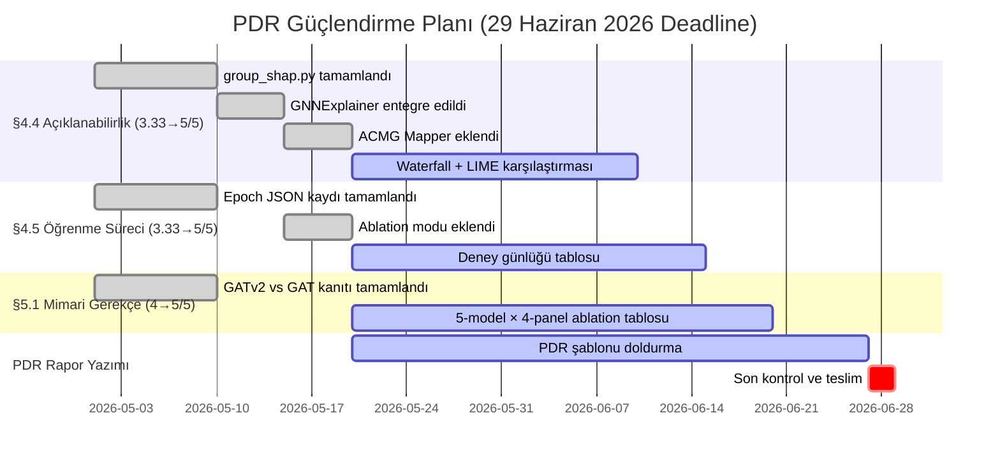
```mermaid
gantt
    title PDR Güçlendirme Planı (29 Haziran 2026 Deadline)
    dateFormat YYYY-MM-DD
    section §4.4 Açıklanabilirlik (3.33→5/5)
    group_shap.py tamamlandı         :done,    des1, 2026-05-01, 2026-05-10
    GNNExplainer entegre edildi      :done,    des2, 2026-05-10, 2026-05-15
    ACMG Mapper eklendi              :done,    des3, 2026-05-15, 2026-05-20
    Waterfall + LIME karşılaştırması :active,  des4, 2026-05-20, 2026-06-10
    section §4.5 Öğrenme Süreci (3.33→5/5)
    Epoch JSON kaydı tamamlandı      :done,    des5, 2026-05-01, 2026-05-10
    Ablation modu eklendi            :done,    des6, 2026-05-15, 2026-05-20
    Deney günlüğü tablosu            :active,  des7, 2026-05-20, 2026-06-15
    section §5.1 Mimari Gerekçe (4→5/5)
    GATv2 vs GAT kanıtı tamamlandı   :done,    des8, 2026-05-01, 2026-05-10
    5-model × 4-panel ablation tablosu:active, des9, 2026-05-20, 2026-06-20
    section PDR Rapor Yazımı
    PDR şablonu doldurma             :active,  des10, 2026-05-20, 2026-06-27
    Son kontrol ve teslim             :crit,    des11, 2026-06-27, 2026-06-29
```

### PDR Metrik Kontrol Listesi

```
✅  Binary F1 (§7.3, Patojenik)   =  0.8706
✅  CV F1                          =  0.8347 ± 0.0114
✅  MCC                            =  0.4063
✅  PR-AUC                         =  0.8843
✅  ROC-AUC                        =  0.7797
✅  Precision / Recall             =  0.8178 / 0.9309
✅  Brier Score                    =  0.1789
✅  ECE                            =  0.1428
✅  Confusion Matrix               =  hesaplandı + görseli var
✅  Panel kırılımı (4 panel)       =  MASTER / KANSER / PAH / CFTR
✅  Baseline karşılaştırması        =  Logistic Regression dahil
✅  Öğrenme eğrisi (GNN)           =  gnn_learning_curve.json/png
✅  Adversarial Validation AUC     =  ~0.50 (tüm paneller)
⬜  Ablation tablosu               =  üretilecek (§4.5)
⬜  PR eğrisi görseli (PDR'de)     =  üretilecek
⬜  GNNExplainer subgraph görseli  =  üretilecek (§4.4)
⬜  LIME–SHAP örtüşme oranı       =  üretilecek (§4.4)
```

---

## Referanslar

<div align="center">

| # | Kaynak | Yöntem | VARIANT-GNN İlişkisi |
|:---:|:---|:---|:---|
| [1] | Brody et al. (2021) — *GATv2* | Dinamik Graf Dikkati | GATv2Conv mimari seçimi gerekçesi |
| [2] | Izmailov et al. (2018) — *SWA* | Ağırlık Ortalaması | SWA + update_batch_norm() |
| [3] | Ioannidis et al. (2016) — REVEL | Meta-ensemble | Panel bazlı bağımsız değerlendirme |
| [4] | Rentzsch et al. (2019) — CADD | SVM + Nöral Ağ | Koordinatsız çalışma (§3.2 uyumu) |
| [5] | Ghosh et al. (2022) | XGBoost + ACMG/AMP | WeightedBCELoss + SMOTE stratejisi |
| [6] | Frazer et al. (2021) — EVE | Unsupervised VAE | Tablo + Graf çok-modal birleşim |
| [7] | Pejaver et al. (2022) — ClinGen | ACMG kalibrasyon | İsotonik ensemble kalibrasyonu |
| [8] | Sundaram et al. (2018) — MutPred2 | Filogenetik stacking | 6 kategori SHAP ağırlıklandırma |

</div>

---

## Etik ve Hukuki Uyarılar

```
╔════════════════════════════════════════════════════════════════════════╗
║  KLİNİK KULLANIM YASAĞI (TEKNOFEST Şartname §10)                      ║
║  ─────────────────────────────────────────────────────────────────    ║
║  Bu sistem TEKNOFEST 2026 Sağlıkta Yapay Zeka Yarışması kapsamında   ║
║  geliştirilmiştir. Model çıktıları yalnızca araştırma, eğitim ve     ║
║  yarışma değerlendirmesi amaçlıdır.                                   ║
║                                                                        ║
║  ❌  Klinik tanı için kullanılamaz                                     ║
║  ❌  Tedavi kararı için kullanılamaz                                   ║
║  ❌  Tıbbi karar desteği için kullanılamaz                            ║
║                                                                        ║
║  Klinik kullanım için:                                                 ║
║    • Bağımsız prospektif validasyon zorunludur                        ║
║    • CE/FDA regülasyon uygunluğu gereklidir                           ║
║    • Uzman hekim değerlendirmesi esastır                               ║
╠════════════════════════════════════════════════════════════════════════╣
║  TEKNOFEST 2026 GİZLİLİK SÖZLEŞMESİ (NDA)                           ║
║  ─────────────────────────────────────────────────────────────────    ║
║  Yarışma kapsamında sağlanan veriler, imzalı Kurumsal Gizlilik       ║
║  Taahhütnamesi olmadan üçüncü taraflarla paylaşılamaz.               ║
╠════════════════════════════════════════════════════════════════════════╣
║  VERİ GÜVENLİĞİ — KVKK / GDPR                                        ║
║  ─────────────────────────────────────────────────────────────────    ║
║  Veriler: ClinVar, ClinGen, gnomAD — kamuya açık, anonimleştirilmiş  ║
║  Genomik adres (Chr/Pos) şartname gereği gizlenmiştir                ║
║  Re-identification riski azaltılmıştır                                ║
║  Helsinki Bildirgesi uyumlu ikincil veri kullanımı                    ║
║  Veri sorumlusu: TEKNOFEST organizasyonu                              ║
╚════════════════════════════════════════════════════════════════════════╝
```

---

<div align="center">


<br/>

**VARIANT-GNN** — Missense Varyant Patojenitesi için Hibrit GATv2 Ensemble Sistemi

```
PSR: 93.00/100  ·  CV F1: 0.8347 ± 0.0114  ·  Test F1: 0.8706  ·  θ: 0.4357
GATv2Conv × 3  ·  XGBoost · LightGBM · DNN  ·  İsotonik Kalibrasyon  ·  SWA
```

[](https://github.com/msgxr/VARIANT-GNN)
[](https://teknofest.org)

</div>
