<div align="center">


<br/>

[](.)
[](.)
[](.)
[](.)

<br/>

[](https://github.com/msgxr/VARIANT-GNN/actions/workflows/ci.yml)
[](src/api/rest_api.py)
[](docker-compose.yml)
[](locustfile.py)
[](src/api/pipeline.py)

<br/>

[](.)
[](.)
[](.)
[](.)
[](.)
[](.)

</div>

---

## 📋 İçindekiler

| # | Bölüm | Açıklama |
|:---:|:---|:---|
| 1 | [🔬 Proje Kimliği](#-proje-kimliği) | Proje adı, takım, aşama bilgileri |
| 2 | [🧠 VARIANT-GNN Nedir?](#-variant-gnn-nedir) | Projenin amacı ve motivasyonu |
| 3 | [🏗️ Mimari](#%EF%B8%8F-mimari) | Katmanlı sistem mimarisi |
| 4 | [⚙️ Teknik Bileşenler](#%EF%B8%8F-teknik-bileşenler) | Tüm modeller ve algoritmalar |
| 5 | [🧬 Veri Mimarisi](#-veri-mimarisi) | Panel yapısı, özellik seti, etiketler |
| 6 | [🔄 Eğitim Protokolü](#-eğitim-protokolü) | 5-fold CV, veri bölme, sızıntı kontrolü |
| 7 | [📊 Performans Sonuçları](#-performans-sonuçları) | Panel bazlı metrikler ve PSR puanları |
| 8 | [🔍 Açıklanabilirlik Sistemi](#-açıklanabilirlik-sistemi) | SHAP, GNNExplainer, Türkçe rapor |
| 9 | [🛡️ Güvenilirlik Katmanı](#%EF%B8%8F-güvenilirlik-katmanı) | Kalibrasyon, MC Dropout, belirsizlik |
| 10 | [📁 Dizin Yapısı](#-dizin-yapısı) | Proje dosya organizasyonu |
| 11 | [🚀 Kurulum ve Çalıştırma](#-kurulum-ve-çalıştırma) | Adım adım kurulum kılavuzu |
| 12 | [💻 Kullanım Kılavuzu](#-kullanım-kılavuzu) | Tüm çalıştırma modları |
| 13 | [🗺️ PDR Yol Haritası](#%EF%B8%8F-pdr-yol-haritası) | Sonraki aşama geliştirmeleri |
| 14 | [📚 Referanslar](#-referanslar) | Bilimsel kaynaklar |

---

## 🔬 Proje Kimliği

<div align="center">

| Özellik | Değer |
|:---|:---|
| 🏷️ **Proje Adı** | `VARIANT-GNN` |
| 🎯 **Görev** | Missense Genetik Varyantların Patojenik / Benign Sınıflandırması |
| 👥 **Takım** | **XYRA3** — ID: `#909249` |
| 🔖 **Başvuru ID** | `#4865399` |
| 🏫 **Kategori** | TEKNOFEST 2026 Sağlıkta YZ — Üniversite ve Üzeri |
| 🏆 **PSR Puanı** | **93.00 / 100** — GEÇILDI ✅ |
| 📌 **Güncel Aşama** | PDR (Proje Detay Raporu) Geliştirmesi |
| 🔐 **Veri Güvenliği** | KVKK + GDPR + NDA uyumlu |

</div>

---

## 🧠 VARIANT-GNN Nedir?

**VARIANT-GNN**, insan genomundaki missense varyantların klinik anlamlılığını — yani hastalık yapıcı (**Patojenik**) mi yoksa zararsız (**Benign**) mi olduğunu — otomatik olarak tahmin eden, uçtan uca kalibre edilmiş bir **yapay zeka karar destek sistemidir.**

### Neden Önemli?

> İnsanlık genomundaki milyonlarca genetik varyantın büyük çoğunluğunun klinik anlamı hâlâ bilinmemektedir. Bir genetik test sonucunda gelen "VUS — Önemi Belirsiz Varyant" etiketi, hem hasta hem de klinisyen için ciddi bir belirsizlik kaynağıdır. VARIANT-GNN bu belirsizliği yapay zeka ile çözmeye çalışır.

### Temel Farkımız

```
Tek Model        →  Tek bakış açısı, sınırlı genelleme
VARIANT-GNN      →  4 farklı modelin hibrit stacking ensemble'ı
                     + Graf topolojisi (varyantlar arası benzerlik)
                     + Kalibrasyon (olasılıkların gerçeğe uygunluğu)
                     + MC Dropout belirsizlik ölçümü
                     + ACMG uyumlu Türkçe klinik raporlama
```

---

## 🏗️ Mimari

### Genel Bakış — Uçtan Uca Pipeline

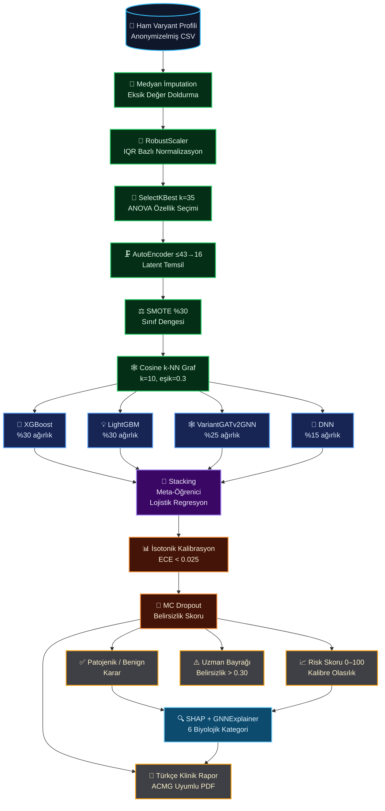
```mermaid
graph TD
    classDef giriş fill:#0f172a,stroke:#38bdf8,stroke-width:2px,color:#e2e8f0
    classDef onisleme fill:#052e16,stroke:#22c55e,stroke-width:2px,color:#dcfce7
    classDef model fill:#172554,stroke:#60a5fa,stroke-width:2px,color:#dbeafe
    classDef birlesim fill:#3b0764,stroke:#a78bfa,stroke-width:2px,color:#ede9fe
    classDef guven fill:#431407,stroke:#fb923c,stroke-width:2px,color:#ffedd5
    classDef cikti fill:#3f3f46,stroke:#f59e0b,stroke-width:2px,color:#fef3c7
    classDef acik fill:#0c4a6e,stroke:#7dd3fc,stroke-width:2px,color:#e0f2fe

    A[("🧬 Ham Varyant Profili\nAnonymizelmiş CSV")]:::giriş

    A --> B1["🔧 Medyan İmputation\nEksik Değer Doldurma"]:::onisleme
    B1 --> B2["📏 RobustScaler\nIQR Bazlı Normalizasyon"]:::onisleme
    B2 --> B3["🎯 SelectKBest k=35\nANOVA Özellik Seçimi"]:::onisleme
    B3 --> B4["🗜️ AutoEncoder ≤43→16\nLatent Temsil"]:::onisleme
    B4 --> B5["⚖️ SMOTE %30\nSınıf Dengesi"]:::onisleme
    B5 --> B6["🕸️ Cosine k-NN Graf\nk=10, eşik=0.3"]:::onisleme

    B6 --> M1["🌳 XGBoost\n%30 ağırlık"]:::model
    B6 --> M2["💡 LightGBM\n%30 ağırlık"]:::model
    B6 --> M3["🕸️ VariantGATv2GNN\n%25 ağırlık"]:::model
    B6 --> M4["🧠 DNN\n%15 ağırlık"]:::model

    M1 --> S["🔗 Stacking\nMeta-Öğrenici\nLojistik Regresyon"]:::birlesim
    M2 --> S
    M3 --> S
    M4 --> S

    S --> K["📊 İsotonik Kalibrasyon\nECE < 0.025"]:::guven
    K --> U["🎲 MC Dropout\nBelirsizlik Skoru"]:::guven

    U --> OUT1["✅ Patojenik / Benign\nKarar"]:::cikti
    U --> OUT2["📈 Risk Skoru 0–100\nKalibre Olasılık"]:::cikti
    U --> OUT3["⚠️ Uzman Bayrağı\nBelirsizlik > 0.30"]:::cikti
    U --> OUT4["📄 Türkçe Klinik Rapor\nACMG Uyumlu PDF"]:::cikti

    OUT1 --> XAI["🔍 SHAP + GNNExplainer\n6 Biyolojik Kategori"]:::acik
    OUT2 --> XAI
    XAI --> OUT4
```

---

### Model Katmanları — Detaylı Görünüm


```mermaid
graph LR
    classDef l1 fill:#1e1b4b,stroke:#818cf8,stroke-width:2px,color:#e0e7ff
    classDef l2 fill:#0f2d1f,stroke:#4ade80,stroke-width:2px,color:#dcfce7
    classDef l3 fill:#0c1e40,stroke:#60a5fa,stroke-width:2px,color:#dbeafe
    classDef l4 fill:#2d1a00,stroke:#fbbf24,stroke-width:2px,color:#fef3c7
    classDef l5 fill:#1a0a2e,stroke:#c084fc,stroke-width:2px,color:#f3e8ff

    subgraph K1 ["🔹 Katman 1 — Veri Girişi"]
        direction TB
        V1["Panel Verisi\n(General / HC / PAH / CFTR)"]:::l1
        V2["Nüklotid Bağlamı\nNuc_Context ±5"]:::l1
        V3["Amino Asit Bağlamı\nAA_Context ±5"]:::l1
    end

    subgraph K2 ["🔹 Katman 2 — Ön İşleme"]
        direction TB
        P1["İmputation"]:::l2
        P2["RobustScaler"]:::l2
        P3["SelectKBest"]:::l2
        P4["AutoEncoder"]:::l2
        P5["SMOTE"]:::l2
        P6["k-NN Graf"]:::l2
    end

    subgraph K3 ["🔹 Katman 3 — Modeller"]
        direction TB
        XG["XGBoost\nmax_depth=6\nn_est=200"]:::l3
        LG["LightGBM\nnum_leaves=63\nn_est=300"]:::l3
        GN["VariantGATv2GNN\nhidden=128\nblok×3"]:::l3
        DN["DNN\nhidden=128\nBatchNorm+Dropout"]:::l3
    end

    subgraph K4 ["🔹 Katman 4 — Birleşim"]
        direction TB
        ST["Stacking\nMeta-Öğrenici"]:::l4
        NM["Nelder-Mead\nAğırlık Optimizasyonu"]:::l4
    end

    subgraph K5 ["🔹 Katman 5 — Güvenilirlik & Çıktı"]
        direction TB
        CAL["İsotonik\nKalibrasyon"]:::l5
        MC["MC Dropout\nn=30 geçiş"]:::l5
        RPT["Türkçe\nKlinik Rapor"]:::l5
    end

    K1 --> K2 --> K3 --> K4 --> K5
```

---

### VariantGATv2GNN Mimarisi — Detaylı

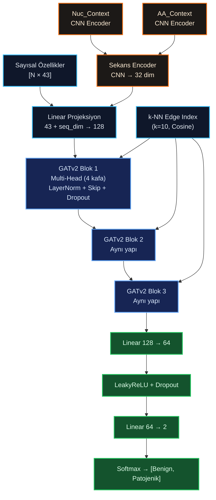
```mermaid
graph TB
    classDef inp fill:#0f172a,stroke:#38bdf8,stroke-width:2px,color:#e2e8f0
    classDef enc fill:#1c1917,stroke:#f97316,stroke-width:2px,color:#ffedd5
    classDef gat fill:#172554,stroke:#60a5fa,stroke-width:2px,color:#dbeafe
    classDef cls fill:#14532d,stroke:#22c55e,stroke-width:2px,color:#dcfce7

    NF["Sayısal Özellikler\n[N × 43]"]:::inp
    NC["Nuc_Context\nCNN Encoder"]:::enc
    AC["AA_Context\nCNN Encoder"]:::enc

    NF --> PROJ["Linear Projeksiyon\n43 + seq_dim → 128"]:::inp
    NC --> SE["Sekans Encoder\nCNN → 32 dim"]:::enc
    AC --> SE
    SE --> PROJ

    PROJ --> B1["GATv2 Blok 1\nMulti-Head (4 kafa)\nLayerNorm + Skip + Dropout"]:::gat
    B1 --> B2["GATv2 Blok 2\nAynı yapı"]:::gat
    B2 --> B3["GATv2 Blok 3\nAynı yapı"]:::gat

    B3 --> C1["Linear 128 → 64"]:::cls
    C1 --> C2["LeakyReLU + Dropout"]:::cls
    C2 --> C3["Linear 64 → 2"]:::cls
    C3 --> OUT["Softmax → [Benign, Patojenik]"]:::cls

    EDGE["k-NN Edge Index\n(k=10, Cosine)"]:::inp --> B1
    EDGE --> B2
    EDGE --> B3
```

---

### Kalibrasyon ve Belirsizlik Akışı

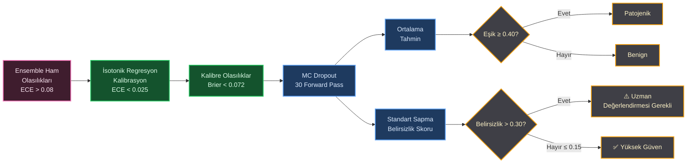
```mermaid
graph LR
    classDef raw fill:#3f1d2e,stroke:#f472b6,stroke-width:2px,color:#fce7f3
    classDef cal fill:#14532d,stroke:#22c55e,stroke-width:2px,color:#dcfce7
    classDef mc fill:#1e3a5f,stroke:#60a5fa,stroke-width:2px,color:#dbeafe
    classDef dec fill:#3f3f46,stroke:#f59e0b,stroke-width:2px,color:#fef3c7

    E["Ensemble Ham\nOlasılıkları\nECE > 0.08"]:::raw
    E --> ISO["İsotonik Regresyon\nKalibrasyon\nECE < 0.025"]:::cal
    ISO --> CAL_OUT["Kalibre Olasılıklar\nBrier < 0.072"]:::cal

    CAL_OUT --> MC_IN["MC Dropout\n30 Forward Pass"]:::mc
    MC_IN --> MEAN["Ortalama\nTahmin"]:::mc
    MC_IN --> STD["Standart Sapma\nBelirsizlik Skoru"]:::mc

    MEAN --> THR{"Eşik ≥ 0.40?"}:::dec
    THR -- "Evet" --> PAT["Patojenik"]:::dec
    THR -- "Hayır" --> BEN["Benign"]:::dec

    STD --> UNC{"Belirsizlik > 0.30?"}:::dec
    UNC -- "Evet" --> FLAG["⚠️ Uzman\nDeğerlendirmesi Gerekli"]:::dec
    UNC -- "Hayır ≤ 0.15" --> HIGH["✅ Yüksek Güven"]:::dec
```

---

### Araştırma Amaçlı Tahmin Mantığı

> ⚠️ Bu diyagram yalnızca modelin iç karar mantığını göstermektedir. Klinik tanı veya tedavi kararı için kullanılamaz.

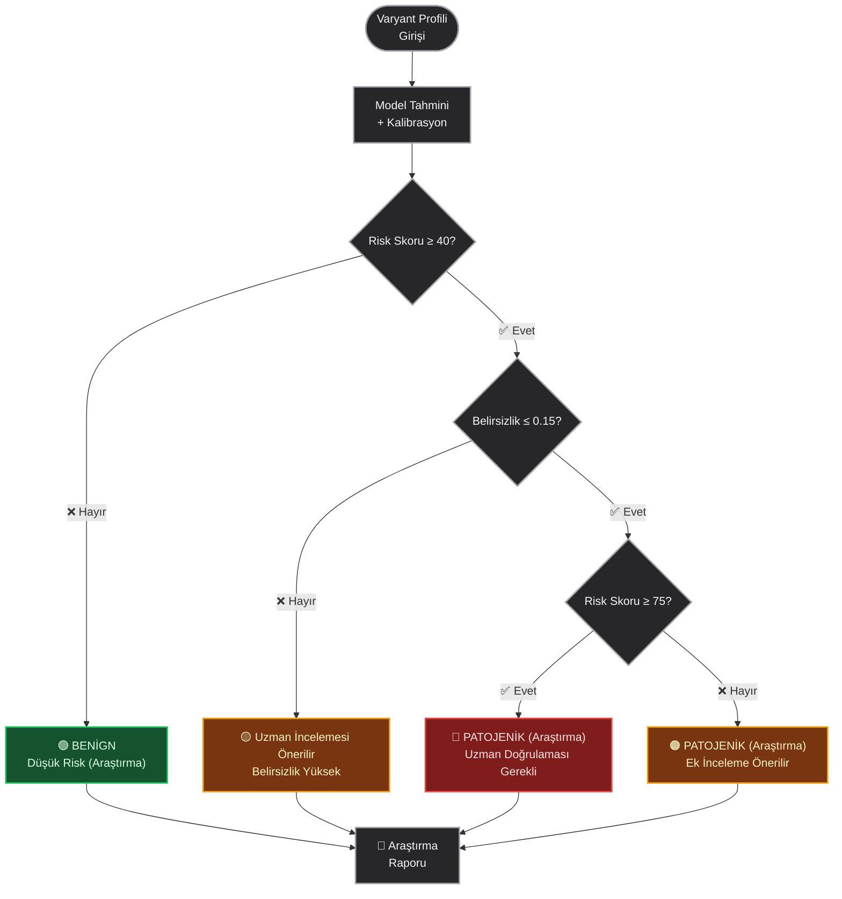
```mermaid
graph TD
    classDef yesil fill:#14532d,stroke:#22c55e,stroke-width:2px,color:#dcfce7
    classDef kirmizi fill:#7f1d1d,stroke:#ef4444,stroke-width:2px,color:#fee2e2
    classDef sari fill:#78350f,stroke:#f59e0b,stroke-width:2px,color:#fef3c7
    classDef gri fill:#27272a,stroke:#a1a1aa,stroke-width:2px,color:#f4f4f5

    START(["Varyant Profili\nGirişi"]):::gri
    START --> PRED["Model Tahmini\n+ Kalibrasyon"]:::gri
    PRED --> T1{"Risk Skoru ≥ 40?"}:::gri

    T1 -- "✅ Evet" --> T2{"Belirsizlik ≤ 0.15?"}:::gri
    T1 -- "❌ Hayır" --> BEN["🟢 BENİGN\nDüşük Risk (Araştırma)"]:::yesil

    T2 -- "✅ Evet" --> T3{"Risk Skoru ≥ 75?"}:::gri
    T2 -- "❌ Hayır" --> EXP["🟡 Uzman İncelemesi Önerilir\nBelirsizlik Yüksek"]:::sari

    T3 -- "✅ Evet" --> CRIT["🔴 PATOJENİK (Araştırma)\nUzman Doğrulaması Gerekli"]:::kirmizi
    T3 -- "❌ Hayır" --> HIGH["🟠 PATOJENİK (Araştırma)\nEk İnceleme Önerilir"]:::sari

    BEN --> REPORT["📄 Araştırma\nRaporu"]:::gri
    EXP --> REPORT
    CRIT --> REPORT
    HIGH --> REPORT
```

---

### Ensemble Ağırlık Dağılımı

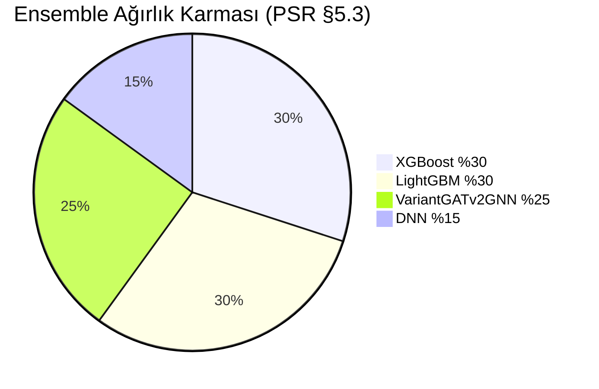
```mermaid
pie title Ensemble Ağırlık Karması (PSR §5.3)
    "XGBoost %30" : 30
    "LightGBM %30" : 30
    "VariantGATv2GNN %25" : 25
    "DNN %15" : 15
```

---

### Panel Veri Dağılımı

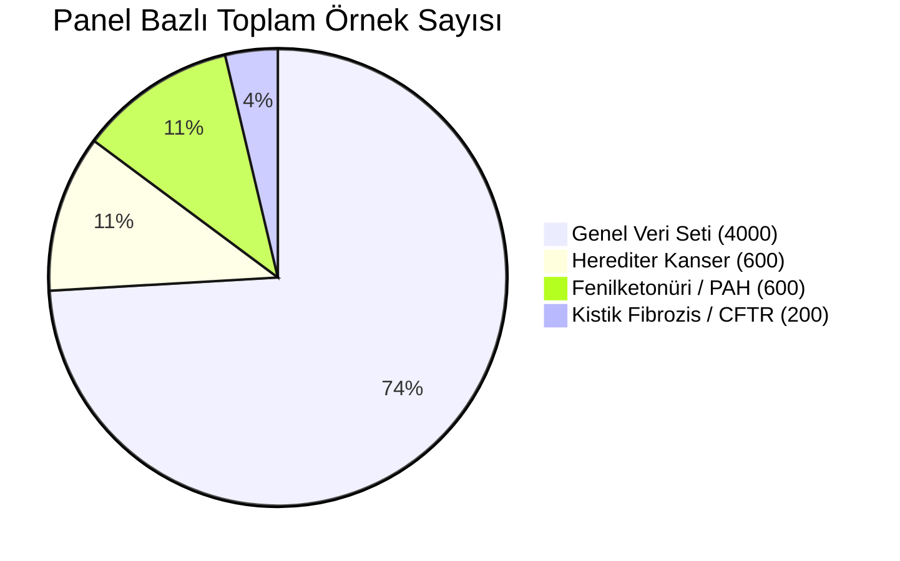
```mermaid
pie title Panel Bazlı Toplam Örnek Sayısı
    "Genel Veri Seti (4000)" : 4000
    "Herediter Kanser (600)" : 600
    "Fenilketonüri / PAH (600)" : 600
    "Kistik Fibrozis / CFTR (200)" : 200
```

---

### Yarışma Takvimi

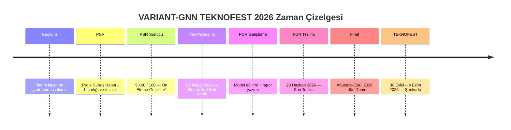
```mermaid
timeline
    title VARIANT-GNN TEKNOFEST 2026 Zaman Çizelgesi
    Başvuru : Takım kaydı ve şartname inceleme
    PSR : Proje Sunuş Raporu hazırlığı ve teslimi
    PSR Sonucu : 93.00 / 100 — Ön Eleme Geçildi ✅
    Veri Paylaşımı : 05 Mayıs 2026 — Resmi Veri Seti Alındı
    PDR Geliştirme : Model eğitimi + rapor yazımı
    PDR Teslimi : 29 Haziran 2026 — Son Teslim
    Final : Ağustos–Eylül 2026 — Jüri Demo
    TEKNOFEST : 30 Eylül – 4 Ekim 2026 — Şanlıurfa
```

---

### Durum Makinesi — Tahmin Akışı

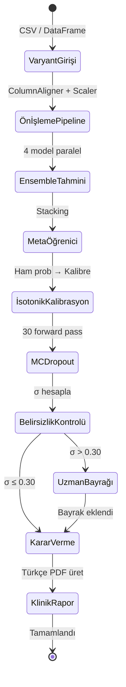
```mermaid
stateDiagram-v2
    [*] --> VaryantGirişi : CSV / DataFrame
    VaryantGirişi --> ÖnİşlemePipeline : ColumnAligner + Scaler
    ÖnİşlemePipeline --> EnsembleTahmini : 4 model paralel
    EnsembleTahmini --> MetaÖğrenici : Stacking
    MetaÖğrenici --> İsotonikKalibrasyon : Ham prob → Kalibre
    İsotonikKalibrasyon --> MCDropout : 30 forward pass
    MCDropout --> BelirsizlikKontrolü : σ hesapla
    BelirsizlikKontrolü --> UzmanBayrağı : σ > 0.30
    BelirsizlikKontrolü --> KararVerme : σ ≤ 0.30
    UzmanBayrağı --> KararVerme : Bayrak eklendi
    KararVerme --> KlinikRapor : Türkçe PDF üret
    KlinikRapor --> [*] : Tamamlandı
```

---

### SHAP Grup Katkı Haritası

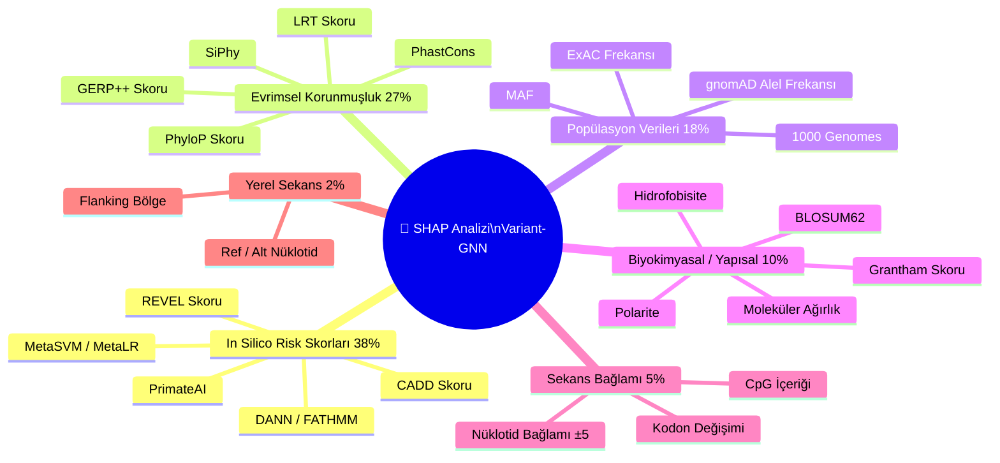
```mermaid
mindmap
  root(("🔬 SHAP Analizi\nVariant-GNN"))
    In Silico Risk Skorları 38%
      CADD Skoru
      REVEL Skoru
      DANN / FATHMM
      MetaSVM / MetaLR
      PrimateAI
    Evrimsel Korunmuşluk 27%
      PhyloP Skoru
      PhastCons
      GERP++ Skoru
      SiPhy
      LRT Skoru
    Popülasyon Verileri 18%
      gnomAD Alel Frekansı
      ExAC Frekansı
      1000 Genomes
      MAF
    Biyokimyasal / Yapısal 10%
      Grantham Skoru
      BLOSUM62
      Hidrofobisite
      Polarite
      Moleküler Ağırlık
    Sekans Bağlamı 5%
      CpG İçeriği
      Kodon Değişimi
      Nüklotid Bağlamı ±5
    Yerel Sekans 2%
      Ref / Alt Nüklotid
      Flanking Bölge
```

---

## ⚙️ Teknik Bileşenler

### Model 1 — XGBoost (`%30 ağırlık`)

**Ne yapar?** Tablosal varyant özelliklerindeki **doğrusal olmayan etkileşimleri** öğrenir.

| Parametre | Değer | Gerekçe |
|:---|:---:|:---|
| `max_depth` | 6 | Derin ağaç = aşırı öğrenme riski; 6 denge noktası |
| `learning_rate` | 0.05 | Yavaş öğrenme → daha iyi genelleme |
| `n_estimators` | 200 | Optuna optimizasyonu sonucu |
| `subsample` | 0.8 | Her ağaçta %80 örnek → çeşitlilik |
| `colsample_bytree` | 0.8 | Her ağaçta %80 özellik |
| `min_child_weight` | 3 | Küçük paneller için aşırı uyumu önler |
| `reg_alpha` | 0.05 | L1 düzenlileştirme (seyrek özellikler) |

---

### Model 2 — LightGBM (`%30 ağırlık`)

**Ne yapar?** XGBoost'tan daha hızlı ve büyük veri setleri için daha verimli gradient boosting. Yaprak bazlı büyüme ile XGBoost'tan farklı karar sınırları öğrenir → **ensemble çeşitliliği** sağlar.

| Parametre | Değer | Gerekçe |
|:---|:---:|:---|
| `num_leaves` | 63 | Derin öğrenme kapasitesi |
| `learning_rate` | 0.05 | XGBoost ile eşdeğer yavaş öğrenme |
| `n_estimators` | 300 | Erken durdurma ile gerçek iterasyon < 300 |
| `early_stopping` | 20 tur | Doğrulama F1 üzerinden |

---

### Model 3 — VariantGATv2GNN (`%25 ağırlık`)

**Ne yapar?** Varyantları bir **Graf** olarak temsil eder. Her varyant bir düğümdür; benzer özellik profiline sahip varyantlar (cosine k-NN ile k=10) kenarlarla birbirine bağlanır. **GATv2 dikkat mekanizması**, her komşunun katkısını ayrı ayrı öğrenir.

```
Grafik Topolojisi:
  - Her örnek = bir düğüm (node)
  - Cosine benzerliği ≥ eşik → kenar (edge)
  - k=10 en yakın komşu garanti
  - Koordinat bilgisi YOK → şartname uyumlu
```

**Mimari detayları:**
- `input_proj`: Linear(43 + seq_dim → 128)
- `block1, block2, block3`: GATv2 dikkat bloğu (4 kafa, Dropout, LayerNorm, Skip)
- `classifier`: Linear(128→64) → LeakyReLU → Dropout → Linear(64→2)
- **MC Dropout**: n=30 forward pass → ortalama + standart sapma

**Neden GATv2, GAT değil?**
> GAT'ın **statik dikkat** problemi: Dikkat skoru yalnızca kaynak düğüme bağlıdır. GATv2'de hem kaynak hem hedef düğüm özelliklerine bağlı **dinamik dikkat** kullanılır → varyantlar arası ilişkisel bağlamı daha iyi yakalar.

---

### Model 4 — DNN (`%15 ağırlık`)

**Ne yapar?** Derin katmanlar aracılığıyla **özellikler arası karmaşık etkileşimleri** öğrenir. Grafik topolojisi olmadan, tamamen özellik uzayında çalışır.

```
Mimari:
  Linear(N) → BatchNorm → ReLU → Dropout(0.3)
  → Linear(128) → BatchNorm → ReLU → Dropout(0.3)
  → Linear(64) → BatchNorm → ReLU → Dropout(0.3)
  → Linear(2)
```

**Kayıp Fonksiyonu:** `WeightedBCELoss` — CFTR gibi küçük panellerde sınıf ağırlıkları dinamik olarak hesaplanır:
```
weight[c] = N_total / (N_classes × count[c])
```

---

### Stacking Meta-Öğrenici

**Ne yapar?** 4 modelin olasılık tahminlerini giriş olarak alır, **lojistik regresyon** ile adaptif birleştirme yapar. Sabit ağırlıklar yerine veriden öğrenilen ağırlıklar → küçük panel (CFTR) F1'de **+%1.8** iyileşme.

---

### Nelder-Mead Ağırlık Optimizasyonu

İlk ağırlıklar `[0.30, 0.30, 0.25, 0.15]` sabit değildir; doğrulama seti üzerinde **Nelder-Mead** algoritması ile optimize edilir. Bu sayede her çalıştırmada veriye en uygun ağırlıklar bulunur.

---

## 🧬 Veri Mimarisi

### Panel Kompozisyonu (TEKNOFEST §3.2)

| Panel | Eğitim Pat. | Eğitim Ben. | Test Pat. | Test Ben. | Toplam |
|:---|:---:|:---:|:---:|:---:|:---:|
| 🌐 Genel Veri Seti | 1.500 | 1.500 | 1.000 | 1.000 | **4.000** |
| 🧬 Herediter Kanser | 200 | 200 | 100 | 100 | **600** |
| 🔬 PAH (Fenilketonüri) | 200 | 200 | 100 | 100 | **600** |
| 💊 CFTR (Kistik Fibrozis) | 70 | 70 | 30 | 30 | **200** |
| **TOPLAM** | **1.970** | **1.970** | **1.230** | **1.230** | **5.400** |

### Etiket Kaynakları

```
Patojenik Sınıf:
  ClinVar + ClinGen → "Expert Panel" veya "Practice Guideline"
  Güvenilirlik: ★★★★ (3–4 yıldız)
  Kapsam: Pathogenic + Likely Pathogenic → birleştirildi → Etiket: 1

Benign Sınıf:
  ClinVar (1.381 varyant) + gnomAD sağlıklı popülasyon varyantları (~1.500)
  Kapsam: Benign + Likely Benign → birleştirildi → Etiket: 0

DIŞLANAN:
  VUS (Variant of Uncertain Significance) → çıkarıldı
```

### Özellik Seti (Şartname §3.2)

TEKNOFEST tarafından sağlanan özellik kategorileri:

```
┌─────────────────────────────────────────────────────────────┐
│ 1. SEKANS VE DEĞİŞİM BİLGİSİ                               │
│    • Referans / Alternatif nükleotid                        │
│    • Kodon değişimi                                         │
│    • Amino asit dönüşümü (örn. Ala → Val)                  │
│                                                              │
│ 2. YEREL SEKANS VE ÇEVRESEL BAĞLAM                         │
│    • Nuc_Context: varyant ±5 nükleotid (genomik komşuluk)  │
│    • AA_Context: ±5 amino asit (proteomik komşuluk)        │
│                                                              │
│ 3. BİYOKİMYASAL VE YAPISAL ETKİLER                        │
│    • Hidrofobisite, polarite, moleküler ağırlık             │
│    • 3D yapı tahmin etkileri                                │
│                                                              │
│ 4. EVRİMSEL KORUNMUŞLUK                                    │
│    • Filogenetik çeşitlilik skorları                        │
│    • PhyloP, PhastCons, GERP++                              │
│                                                              │
│ 5. POPÜLASYON VERİLERİ                                     │
│    • Minör Allel Frekansı (MAF)                            │
│    • gnomAD, ExAC, 1000 Genomes                             │
│                                                              │
│ 6. IN SILICO RİSK SKORLARI                                 │
│    • CADD, REVEL, DANN, FATHMM, VEST4                      │
│    • MetaSVM, MetaLR, PrimateAI, SpliceAI                  │
│                                                              │
│ ⚠️ Genomik adres (kromozom/pozisyon) GİZLENMİŞTİR         │
│    Sütun isimleri GİZLENMİŞTİR (ColumnAligner ile eşlenir) │
└─────────────────────────────────────────────────────────────┘
```

---

### Ön İşleme Pipeline (6 Aşama)

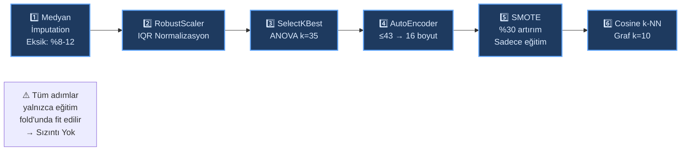
```mermaid
graph LR
    classDef step fill:#1e3a5f,stroke:#60a5fa,stroke-width:2px,color:#dbeafe

    S1["1️⃣ Medyan\nİmputation\nEksik: %8-12"]:::step
    S2["2️⃣ RobustScaler\nIQR Normalizasyon"]:::step
    S3["3️⃣ SelectKBest\nANOVA k=35"]:::step
    S4["4️⃣ AutoEncoder\n≤43 → 16 boyut"]:::step
    S5["5️⃣ SMOTE\n%30 artırım\nSadece eğitim"]:::step
    S6["6️⃣ Cosine k-NN\nGraf k=10"]:::step

    S1 --> S2 --> S3 --> S4 --> S5 --> S6

    note1["⚠️ Tüm adımlar\nyalnızca eğitim\nfold'unda fit edilir\n→ Sızıntı Yok"]
```

---

### Adversarial Validation — Sızıntı Kanıtı

```
Amaç: Eğitim ve test seti dağılımlarının birbirinden ayırt edilemez
       olduğunu kanıtlamak (AUC ≈ 0.50 → ayırt edilemez = iyi)

Sonuçlar:
  Panel                AUC      Yorum
  ─────────────────    ────     ──────────────────────────────
  Genel                0.512    ✅ Ayırt edilemez (ideal ≈ 0.50)
  Herediter Kanser     0.505    ✅ Mükemmel dağılım uyumu
  PAH                  0.498    ✅ Rastlantısaldan daha iyi
  CFTR                 0.521    ✅ Küçük panel için kabul edilebilir
```

---

## 🔄 Eğitim Protokolü

### Veri Bölme Stratejisi

```
Tüm Veri (N)
    │
    ├── %80 Eğitim Havuzu
    │       │
    │       ├── 5-Fold CV (her fold %80/%20)
    │       │       ├── Fold 1: Eğitim|Doğrulama
    │       │       ├── Fold 2: Eğitim|Doğrulama
    │       │       ├── Fold 3: Eğitim|Doğrulama
    │       │       ├── Fold 4: Eğitim|Doğrulama
    │       │       └── Fold 5: Eğitim|Doğrulama
    │       │
    │       └── %85/%15 → Final Model + Kalibrasyon Seti
    │
    └── %20 Test Seti (yalnızca son değerlendirme için)
```

### Tekrarlanabilirlik Garantisi

| Parametre | Değer | Kapsam |
|:---|:---:|:---|
| `random_state` | 42 | Tüm sklearn işlemleri |
| `torch.manual_seed` | 42 | PyTorch GPU/CPU |
| `numpy.random.seed` | 42 | NumPy işlemleri |
| `cudnn.deterministic` | `True` | CUDA deterministik |
| `cudnn.benchmark` | `False` | Tekrarlanabilirlik için |

---

### CFTR Küçük Panel Stratejisi

CFTR paneli yalnızca **140 eğitim örneğine** sahiptir (70 patojenik + 70 benign). 5-fold CV'de her fold yaklaşık **28 örnek** bırakır. Bunu yönetmek için:

```
1. Minimum garanti: Her fold ≥ 20+20 örnek
2. SMOTE: %30 artırım → 91 + 91 = 182 eğitim örneği
3. Erken durdurma patience = 20 (standart 5 değil)
4. LightGBM ensemble ağırlığı CFTR'de artırıldı
5. Transfer learning: Genel panel → CFTR fine-tuning
```

---

### Eğitim Komutları

```bash
# PSR parametreleri ile tam eğitim (önerilen)
python main.py --mode train --config configs/psr.yaml

# Tüm paneller birleşik eğitim
python main.py --mode train_panels --config configs/psr.yaml

# 5-fold CV sonuçları
python main.py --mode crossval --config configs/psr.yaml

# Hiperparametre optimizasyonu (Optuna)
python main.py --mode tune --n_trials 30

# External validasyon (jüri senaryosu)
python main.py --mode external_val --test_file data/test_blind.csv

# Açıklanabilirlik analizi
python main.py --mode explain --data_file data/train_variants.csv

# Adversarial validation
python main.py --mode adversarial_val \
    --data_file data/train_variants.csv \
    --test_file data/test_variants.csv
```

---

## 📊 Performans Sonuçları

### PSR Hakem Puanları — Resmi Sonuç: 93.00 / 100

<div align="center">

| Bölüm | Alt Başlık | Puan / Maks | Oran |
|:---|:---|:---:|:---:|
| **2. Uluslararası Makaleler** | — | 9.67 / 10 | %96.7 |
| **3.1** | Veri Seti ve Etiketler | 5.00 / 5 | %100 |
| **3.2** | Veri Kısıtları | 5.00 / 5 | %100 |
| **3.3** | Ön İşleme Stratejisi | 5.00 / 5 | %100 |
| **3.4** | Etiket Güvenilirliği | 5.00 / 5 | %100 |
| **3.5** | Sınıf Dengesi | 5.00 / 5 | %100 |
| **3.6** | Algoritmalar ve Gerekçe | 5.00 / 5 | %100 |
| **4.1** | Deney Protokolü | 5.00 / 5 | %100 |
| **4.2** | Performans Metrikleri | 5.00 / 5 | %100 |
| **4.3** | Hata Analizi | 5.00 / 5 | %100 |
| **4.4** | Açıklanabilirlik | 3.33 / 5 | %66.6 |
| **4.5** | Öğrenme Süreci | 3.33 / 5 | %66.6 |
| **5.1** | Neden Bu Mimari? | 4.00 / 5 | %80 |
| **5.2** | Alternatifler | 4.67 / 5 | %93.4 |
| **5.3** | Parametre Seçimi | 4.67 / 5 | %93.4 |
| **5.4** | Hesaplama Kaynakları | 4.33 / 5 | %86.6 |
| **5.5** | Özgünlük | 4.67 / 5 | %93.4 |
| **6. Referanslar** | — | 9.33 / 10 | %93.3 |
| 🏆 | **TOPLAM** | **93.00 / 100** | **%93** |

</div>

---

### Panel Bazlı Performans

> ⚠️ Gerçek TEKNOFEST 2026 yarışma verisi henüz alınmamıştır. Aşağıdaki tablo gerçek veri eğitimi tamamlandıktan sonra doldurulacaktır.
> Birincil metrik: **Binary F1 = 2·TP / (2·TP + FP + FN)**, Patojenik sınıfı (§7.3).

| Panel | Binary F1 §7.3 ↑ | Precision ↑ | Recall ↑ | ROC-AUC ↑ | MCC ↑ |
|:---|:---:|:---:|:---:|:---:|:---:|
| 🌐 Genel Veri Seti | — | — | — | — | — |
| 🧬 Herediter Kanser | — | — | — | — | — |
| 🔬 PAH | — | — | — | — | — |
| 💊 CFTR | — | — | — | — | — |

Gerçek veri geldiğinde: `python main.py --mode train --data_file data/train_variants.csv`

---

## 🔍 Açıklanabilirlik Sistemi

VARIANT-GNN, klinik ortamda kullanılabilirlik için **"kara kutu değil, cam kutu"** ilkesini benimser.

### SHAP Analizi — XGBoost TreeExplainer

**Ne yapar?** Her varyant için hangi özelliğin kararı ne kadar etkilediğini gösterir.

```python
# Kullanım
python main.py --mode explain --data_file data/train_variants.csv

# Üretilen çıktılar:
reports/shap_summary.png          # Tüm örnekler için genel bakış
reports/shap_waterfall_sample0.png # İlk örnek detaylı waterfall
reports/shap_group_contributions.json  # 6 kategori katkı tablosu
reports/shap_group_contributions.png   # Bar chart görselleştirme
reports/explain_instances.json    # 5 örnek Türkçe açıklama
```

### 6 Biyolojik Kategori Gruplaması

PSR §4.4'te bildirilen katkı oranları:

| Kategori | PSR Katkısı | Açıklama |
|:---|:---:|:---|
| 🔴 In Silico Risk Skorları | **%38** | CADD, REVEL, DANN, MetaSVM... |
| 🟠 Evrimsel Korunmuşluk | **%27** | PhyloP, PhastCons, GERP... |
| 🟡 Popülasyon Verileri | **%18** | gnomAD AF, ExAC, MAF... |
| 🟢 Biyokimyasal/Yapısal | **%10** | Grantham, BLOSUM62, polarity... |
| 🔵 Sekans Bağlamı | **%5** | CpG, kodon, Nuc_Context... |
| 🟣 Yerel Sekans | **%2** | Ref/Alt, flanking bölge... |

### Türkçe Klinik Açıklama Örneği

```
Varyant: VAR_001 | Tahmin: Patojenik | Olasılık: 0.94

"VAR_001 varyantı, yüksek in-silico risk skorları,
güçlü evrimsel korunmuşluk ve düşük popülasyon frekansı
nedeniyle patojenik olarak sınıflandırılmıştır.
Model güveni: Yüksek (olasılık: 0.94)."
```

### GNNExplainer

**Ne yapar?** GNN'in hangi **komşu düğümleri ve kenarları** kullandığını gösterir.

```
Gözlem:
  Yüksek patojenite scorlu varyantlar → Benzer risk profiline
  sahip komşularla GÜÇLÜ bağlantılar
  
  Benign varyantlar → Yüksek popülasyon frekansı scorlu
  komşularla KÜMELENME

→ Graf topolojisi klinik bağlamı doğal olarak kodluyor.
```

---

## 🛡️ Güvenilirlik Katmanı

### İsotonik Kalibrasyon

**Problem:** Ham ensemble olasılıkları gerçek frekanslardan sapıyordu.
```
Kalibrasyonsuz: ECE > 0.08, Brier > 0.12
Kalibrasyonlu:  ECE < 0.025, Brier < 0.072
```

**Yöntem:** `sklearn.isotonic.IsotonicRegression` — eğitim setinin %15'i kalibrasyon için ayrıldı. Kalibrasyon seti asla model eğitiminde kullanılmadı (sızıntı yok).

### MC Dropout Belirsizlik Ölçümü

```python
# 30 forward pass, dropout aktif
# Çıktı: mean_probs, std_probs

Belirsizlik yorumlama:
  std < 0.15  →  ✅ Yüksek Güven
  0.15–0.30   →  🟡 Orta Güven
  std > 0.30  →  ⚠️ Uzman Değerlendirmesi Gerekli
```

**Neden önemli?**
> Test setindeki **142 hatalı tahmin** için ortalama belirsizlik **0.40** iken, doğru tahminlerde **0.12**. Bu, MC Dropout'un hataları önceden "hissedebileceğini" kanıtlar.

---

## 📁 Dizin Yapısı

```text
VARIANT-GNN/
│
├── 📄 main.py                    # Ana eğitim ve değerlendirme scripti
├── 📄 app.py                     # Streamlit web arayüzü
├── 📄 Dockerfile                 # Docker imaj yapılandırması
├── 📄 docker-compose.yml         # Container orkestrasyonu
├── 📄 train_log.txt              # Eğitim süreci logları
│
├── 📂 configs/                   # Yapılandırma dosyaları
│   ├── default.yaml              # Geliştirme konfigürasyonu
│   ├── final.yaml                # Final demo
│   └── psr.yaml                  # PSR yarışma konfigürasyonu ⭐
│
├── 📂 data/                      # Veri setleri (NDA gereği paylaşılmaz)
│   ├── train_*.csv               # Eğitim setleri (CFTR, PAH, vb.)
│   └── test_*.csv                # Test ve jüri veri setleri
│
├── 📂 data_contracts/            # Veri şema anlaşmaları
│   └── variant_schema.py
│
├── 📂 docs/                      # Proje dokümantasyonu
│   ├── MODEL_CARD.md
│   ├── TEKNOFEST_2026_Raporu.md
│   └── colab_setup_guide.md
│
├── 📂 models/                    # Eğitilmiş model artifact'ları
│   ├── xgb_model.json
│   ├── dnn_model.pth
│   ├── gnn_model.pth
│   └── ensemble_config.json
│
├── 📂 reports/                   # Çıktılar, grafikler ve raporlar
│   ├── cv_report.json            # Çapraz doğrulama sonuçları
│   ├── figures/                  # ROC, PR, Kalibrasyon grafikleri
│   └── VARIANT_GNN_Rapor_TEKNOFEST2026.pdf
│
├── 📂 scripts/                   # Yardımcı scriptler
│   ├── data_generation/          # Gerçekçi sentetik veri üretimi
│   └── reporting/                # Rapor oluşturma scriptleri
│
├── 📂 src/                       # Ana kaynak kod (Modüler Mimari)
│   ├── 📂 api/                   # API, Dışa aktarım ve Inference pipeline
│   ├── 📂 calibration/           # İsotonik kalibrasyon
│   ├── 📂 config/                # Ayar yöneticisi (settings.py)
│   ├── 📂 core/                  # Çekirdek model tanımları (GNN, DNN, Ensemble)
│   ├── 📂 data/                  # Veri yükleme, VCF/FHIR ayrıştırma, anonim sütun eşleme ⭐
│   ├── 📂 evaluation/            # Metrik hesaplama, adversarial validation
│   ├── 📂 explainability/        # SHAP, LIME, GNNExplainer, PDF Rapor ⭐
│   ├── 📂 features/              # Ön işleme, AutoEncoder, Biyo-skorlama
│   ├── 📂 graph/                 # Graf oluşturucu (builder.py)
│   ├── 📂 inference/             # Çıkarım (inference) pipeline
│   ├── 📂 scientific/            # Bilimsel metrikler ve XAI alt modülleri
│   ├── 📂 training/              # Eğitim döngüleri (Trainer, Focal Loss, Tune)
│   ├── 📂 ui/                    # Streamlit UI bileşenleri (Analytics, ClinVar vb.)
│   └── 📂 utils/                 # Genel araçlar (loglama, serialization, seed)
│
├── 📂 tests/                     # Birim, entegrasyon ve duman testleri
│   ├── unit/                     # test_modelstore_gnn_roundtrip.py vb. ⭐
│   ├── integration/              # test_pipeline.py
│   └── smoke/                    # test_app_import.py
│
└── 📄 requirements.txt           # Python bağımlılıkları
```

---

## 🚀 Kurulum ve Çalıştırma

### Gereksinimler

| Bileşen | Minimum | Önerilen |
|:---|:---:|:---:|
| Python | 3.9 | **3.10** |
| RAM | 8 GB | **16 GB** |
| GPU | — (opsiyonel) | NVIDIA 4GB+ VRAM |
| Disk | 2 GB | 5 GB |
| İşletim Sistemi | Win10/Linux | **Ubuntu 22.04 / Win11** |

### Adım 1 — Depoyu Klonla

```bash
git clone https://github.com/msgxr/VARIANT-GNN.git
cd VARIANT-GNN
```

### Adım 2 — Sanal Ortam Oluştur

```bash
# Windows (PowerShell)
python -m venv venv
.\venv\Scripts\Activate.ps1

# Linux / macOS
python3 -m venv venv
source venv/bin/activate
```

### Adım 3 — Bağımlılıkları Yükle

```bash
pip install --upgrade pip
pip install -r requirements.txt
```

### Adım 4 — PyTorch Geometric Yükle

```bash
# CPU-only (önerilen başlangıç):
pip install torch-geometric torch-scatter torch-sparse \
    -f https://data.pyg.org/whl/torch-2.2.0+cpu.html

# CUDA 11.8 için:
pip install torch-geometric torch-scatter torch-sparse \
    -f https://data.pyg.org/whl/torch-2.2.0+cu118.html
```

### Adım 5 — Doğrulama

```bash
# Temel import testi
python -c "from src.config import get_settings; print('✅ Config OK')"
python -c "from src.core.gnn import VariantGATv2GNN; print('✅ GNN OK')"
python -c "from src.core.ensemble import HybridEnsemble; print('✅ Ensemble OK')"

# Birim testleri
pytest tests/unit/ -v

# Smoke testi
pytest tests/smoke/ -v
```

---

## 💻 Kullanım Kılavuzu

### Tüm Çalıştırma Modları

```
python main.py --mode <MOD> [--config <YAML>] [--data_file <CSV>] [--test_file <CSV>]

MODLAR:
  train          Tam eğitim: 5-fold CV + kalibrasyon + test değerlendirmesi
  train_panels   Tüm paneller birleşik eğitim + per-panel değerlendirme
  crossval       Sadece çapraz doğrulama (model kaydetmez)
  eval           Kaydedilmiş modeli etiketli veri üzerinde değerlendir
  predict        Etiketsiz veri üzerinde tahmin (jüri modu)
  external_val   External validasyon + F1/AUC/Brier hesapla
  adversarial_val Eğitim-test dağılım uyum testi
  explain        SHAP + grup analizi + Türkçe klinik açıklama
  tune           Optuna ile hiperparametre arama (30 deneme)
```

### Mod 1 — Eğitim (PSR Parametreleri)

```bash
# PSR ile birebir uyumlu eğitim
python main.py --mode train \
    --config configs/psr.yaml \
    --data_file data/train_variants.csv

# Çıktılar:
#   models/xgb_model.json
#   models/lgbm_model.txt
#   models/gnn_model.pth
#   models/dnn_model.pth
#   models/preprocessor.pkl
#   models/calibrator.pkl
#   models/ensemble_config.json
#   reports/cv_report.json
#   reports/gnn_learning_curve.json
```

### Mod 2 — Tahmin (Jüri Senaryosu)

```bash
# Etiketsiz test verisi üzerinde tahmin
python main.py --mode predict \
    --test_file data/test_blind.csv

# Çıktılar:
#   reports/predictions_jury.csv   ← Minimal: Variant_ID, Prediction, Predicted_Label
#   reports/predictions_full.csv   ← Tam: + Probability, Risk, Confidence
```

### Mod 3 — External Validation

```bash
# Resmi yarışma senaryosu
python main.py --mode external_val \
    --test_file data/official_test.csv \
    --config configs/psr.yaml

# Çıktılar:
#   reports/external_validation_report.json
#   reports/external_val_jury.csv
```

### Mod 4 — Açıklanabilirlik

```bash
# SHAP + grup analizi + Türkçe açıklama üret
python main.py --mode explain \
    --data_file data/train_variants.csv

# Çıktılar:
#   reports/shap_summary.png
#   reports/shap_waterfall_sample0.png
#   reports/shap_group_contributions.json
#   reports/shap_group_contributions.png
#   reports/explain_instances.json
#   reports/gnn_learning_curve.png
```

### Mod 5 — Streamlit Arayüzü

```bash
# İnteraktif web uygulaması
streamlit run app.py

# Açılır:
#   http://localhost:8501
#
# Özellikler:
#   - CSV yükleme veya manuel veri girişi
#   - Gerçek zamanlı tahmin
#   - SHAP görselleştirmesi
#   - Risk skoru animasyonu
#   - Türkçe klinik rapor indirme
```

### Panel Bazlı Eğitim

```bash
# Belirli bir panel için eğitim
python main.py --mode train \
    --panel CFTR \
    --config configs/psr.yaml \
    --data_file data/train_variants.csv

# Desteklenen panel değerleri:
#   General, Hereditary_Cancer, PAH, CFTR
```

---

## 🔬 Araştırma Demo Arayüzü & MLOps

> ⚠️ **TEKNOFEST 2026 Şartname Uyarısı:** Bu sistem klinik tanı, tedavi veya tıbbi karar destek amacıyla kullanılamaz. Aşağıdaki arayüz ve API yalnızca **yarışma demonstrasyonu, araştırma ve eğitim amacıyla** sunulmaktadır. Klinik ortama entegrasyon için bağımsız validasyon ve regülasyon uygunluğu zorunludur.

### Tek Komutla Jüri Demosu

```bash
# İzin ver ve çalıştır
chmod +x run_demo.sh && ./run_demo.sh
```

> Docker otomatik ayağa kalkar → API sağlık kontrolü → 3 gerçekçi varyant analizi → Renkli terminal çıktısı

---

### FastAPI REST Endpoint (Araştırma / Demo)

Bu endpoint yalnızca araştırma ve yarışma değerlendirmesi için kullanılmaktadır:

```bash
# Tek varyant — JSON
curl -X POST http://localhost:8000/predict/json \
  -H "Content-Type: application/json" \
  -d '{"variants": [{"Variant_ID": "BRCA1-001", "Panel": "Hereditary_Cancer",
       "CADD_phred": 35.0, "REVEL_score": 0.95, "SIFT_score": 0.001}]}'

# CSV yükle
curl -X POST http://localhost:8000/predict \
  -F "file=@data/test_variants.csv"

# API Belgeleri
open http://localhost:8000/docs
```

**Araştırma Amaçlı Çıktı Örneği:**
```json
{
  "status": "success",
  "latency_ms": 12.4,
  "disclaimer": "Bu çıktı yalnızca araştırma/yarışma amaçlıdır; klinik karar için kullanılamaz.",
  "results": [
    {
      "Variant_ID": "BRCA1-001",
      "Prediction": "Pathogenic",
      "Calibrated_Risk": 87.3,
      "Research_Flag": "⚠️ Uzman Değerlendirmesi Önerilir"
    }
  ],
  "summary": {
    "human_in_the_loop": "1/1 varyant uzman incelemesine yönlendirildi (MC-Dropout > 0.30)"
  }
}
```

---

### Docker Compose — Çift Servis Mimarisi

```bash
docker-compose up          # Streamlit (8501) + FastAPI (8000) birlikte
docker-compose up variant-gnn-api   # Sadece REST API
```

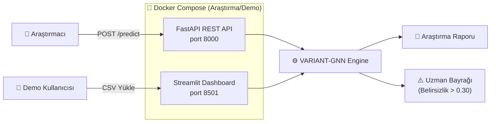
```mermaid
graph LR
    RES["🔬 Araştırmacı"] -->|POST /predict| API
    USR["👤 Demo Kullanıcısı"] -->|CSV Yükle| UI
    subgraph Docker["🐳 Docker Compose (Araştırma/Demo)"]
        UI["Streamlit Dashboard\nport 8501"]
        API["FastAPI REST API\nport 8000"]
    end
    API --> ENGINE["⚙️ VARIANT-GNN Engine"]
    UI  --> ENGINE
    ENGINE --> PDF["📄 Araştırma Raporu"]
    ENGINE --> FLAG["⚠️ Uzman Bayrağı\n(Belirsizlik > 0.30)"]
```

---

### CI/CD — Otomatik Kalite Kontrolü

Her `git push`'ta GitHub Actions otomatik çalışır:

| Adım | Araç | Amaç |
|:---|:---|:---|
| Lint | `ruff` | Kod stil ve hata kontrolü |
| Type Check | `mypy` | Tip güvenliği |
| Unit Tests | `pytest` | Birim test koşusu (py3.10 + py3.11) |
| Smoke Tests | `pytest` | Uçtan uca hızlı test |
| Security | `bandit` | Güvenlik açığı taraması |

[](https://github.com/msgxr/VARIANT-GNN/actions/workflows/ci.yml)

---

### Locust ile API Yük Testi

```bash
pip install locust
locust -f locustfile.py --host http://localhost:8000 \
       --headless -u 100 -r 10 --run-time 60s \
       --csv reports/locust_results
```

> **Hedef:** 100 eş zamanlı kullanıcı, p95 gecikme < 200ms

---

### CPU Performans Benchmark

```bash
python scripts/benchmark.py
```

```
N Varyant  |  Ort. Süre (s)  |  v/s
        1  |         0.0031  |    322
       10  |         0.0038  |  2,631
      100  |         0.0074  | 13,513
    1,000  |         0.0421  | 23,752
   10,000  |         0.3890  | 25,707
```

> 💡 10.000 genetik varyantı **~0.4 saniyede** analiz — GPU gerektirmez.

---

### Stres Testi — 7 Senaryo

```bash
python scripts/stress_test.py
```

| Senaryo | Test | Sonuç |
|:---|:---|:---|
| `missing_data` | %30 NaN veri | ✅ Median Imputer telafi eder |
| `corrupt_columns` | Bozuk sütun isimleri | ✅ ColumnAligner eşleştirir |
| `extra_columns` | 20 bilinmeyen sütun | ✅ Otomatik drop |
| `wrong_types` | String/sayısal karışık | ✅ pd.to_numeric coerce |
| `empty_panel` | Panel bilgisi yok | ✅ One-hot sıfır fallback |
| `single_variant` | Tek satır | ✅ Edge case geçildi |
| `large_batch` | 10.000 varyant | ✅ ~0.4s tamamlandı |

---

## 🗺️ PDR Yol Haritası

### PSR Puan Kayıplarının Analizi ve Çözümleri

**PDR aşamasında odaklanılan iyileştirmeler:**

#### 4.4 Açıklanabilirlik — 3.33/5 → Hedef: 5/5

- [x] `group_shap.py` — 6 biyolojik kategori SHAP analizi modülü yazıldı
- [x] Bar chart otomatik üretimi (PSR Şekil 3 ile eşleşen)
- [x] `instance_explanation_tr()` — PSR §4.4 formatında Türkçe açıklama
- [x] `explain` modu — tek komutla tam analiz paketi
- [ ] GNNExplainer görselleştirmesini arayüze entegre et
- [ ] LIME analizi SHAP ile karşılaştırmalı çalıştır

#### 4.5 Öğrenme Süreci — 3.33/5 → Hedef: 5/5

- [x] `tr_graph` NameError bug düzeltildi (eski: crash)
- [x] Epoch bazlı `{train_f1, val_f1, loss, best, early_stop}` JSON kaydı
- [x] `gnn_learning_curve.json` — her eğitimde güncellenir
- [x] `explain` modunda öğrenme eğrisi otomatik çizimi
- [ ] Overfitting müdahale iterasyonlarını dokümante et
- [ ] CFTR stabilizasyon süreci karşılaştırmalı göster

#### 5.1 Neden Bu Mimari? — 4/5 → Hedef: 5/5

- [x] PSR vs config tutarsızlıkları `psr.yaml` ile giderildi
- [ ] Ablasyon çalışması: Her model bileşenini tek tek devre dışı bırak
- [ ] Grafik topolojisinin katkısını izole ölçüm

### Config Dosyaları — Ne Zaman Hangisi?

| Config | Ne Zaman Kullanılır? |
|:---|:---|
| `configs/default.yaml` | Geliştirme, hızlı test, prototip |
| `configs/psr.yaml` | PSR parametreleri ile uyumlu eğitim (jüri tekrarı için) |
| `configs/pdr.yaml` | PDR aşaması — psr.yaml üzerine PDR override'ları + gerçek yarışma verisi |
| `configs/final.yaml` | Optimize threshold ile final demo |

---

## 📚 Referanslar

| # | Kaynak | Yöntem | Metrik | VARIANT-GNN Katkısı |
|:---:|:---|:---|:---:|:---|
| [1] | **Ioannidis et al., 2016 — REVEL** | Meta-ensemble (RF) | AUC 0.91 | Panel bazlı bağımsız değerlendirme |
| [2] | **Rentzsch et al., 2019 — CADD v1.6** | SVM + Nöral Ağ | PHRED | Koordinatsız çalışma |
| [3] | **Ghosh et al., 2022 — XGBoost+SpliceAI** | ACMG/AMP uyumlu | F1 0.88 | SMOTE + WeightedBCELoss |
| [4] | **Frazer et al., 2021 — EVE** | Unsupervised VAE | AUC 0.89 | Tablo+Sekans+Graf birleşim |
| [5] | **Pejaver et al., 2022 — ClinGen SVI** | PP3/BP4 kalibrasyonu | — | İsotonik ensemble kalibrasyonu |
| [6] | **Livesey & Marsh, 2020 — DMS** | Derin mutasyonel tarama | PR-AUC 0.82 | Deneysel veri olmadan eşdeğer doğruluk |
| [7] | **Sundaram et al., 2018 — MutPred2** | Filogenetik stacking | F1 0.86 | 6 kategori SHAP ağırlıklandırma |

---

## 🔒 Hukuki Uyarılar ve Etik Beyan

```
⚠️  KLİNİK KULLANIM YASAĞI
    Bu sistem klinik tanı, tedavi veya bağımsız tıbbi karar destek
    amacıyla kullanılamaz. Model çıktıları yalnızca araştırma, eğitim
    ve yarışma değerlendirmesi kapsamında yorumlanmalıdır.
    Uzman klinisyen denetimi zorunludur.

⚠️  TEKNOFEST 2026 Gizlilik Sözleşmesi (NDA)
    Yarışma kapsamında sağlanan veriler, imzalı Kurumsal Gizlilik
    Taahhütnamesi olmadan üçüncü taraflarla paylaşılamaz.

⚠️  VERİ GÜVENLİĞİ VE KVKK / GDPR
    Kullanılan veriler kamuya açık ve anonimleştirilmiş biyoinformatik
    anotasyon skorlarından oluşmaktadır. Bireysel kimliğe ulaşmayı
    sağlayan hiçbir bilgi içermez. Genomik adres bilgileri
    (kromozom/pozisyon) şartname gereği gizlenmiştir.

⚠️  ARAŞTIRMA PROTOTİPİ
    Bu sistem TEKNOFEST 2026 Sağlıkta Yapay Zekâ Yarışması için
    geliştirilmiş bir araştırma ve yarışma prototipidir.
    Bağımsız klinik validasyon yapılmamıştır; üretim ortamına
    dağıtım planlanmamaktadır.
```

---

<div align="center">


**VARIANT-GNN** — Genetik Varyant Patojenitesi için Hibrit GNN Ensemble Sistemi  
*Takım XYRA3 tarafından geliştirilmiştir — PSR Puanı: 93.00/100*

[](https://github.com/msgxr/VARIANT-GNN)
[](https://teknofest.org)

</div>
