<div align="center">


<br/>


<br/><br/>

[](.)
[](reports/competition_jury_f1.json)
[-0ea5e9?style=for-the-badge&logo=scikitlearn&logoColor=white&labelColor=082f49)](RESULTS_CANONICAL.json)
[](.)
[](.)

<br/>

[](https://github.com/msgxr/VARIANT-GNN/actions)
[](.)
[](.)
[](.)
[](.)
[](.)
[](.)

<br/>

[](src/core/gnn.py)
[](src/models/dnn_model.py)
[](src/training/swa.py)
[](reports/stacking_improvement.json)
[](src/features/categorical_bio_features.py)
[](reports/conformal_coverage_report.json)
[](.)

</div>

---

<div align="center">

```
╔══════════════════════════════════════════════════════════════════════════════════╗
║                          VARIANT-GNN — PROJE KİMLİĞİ                              ║
╠══════════════════╦═══════════════════════════════════════════════════════════════╣
║  Proje           ║  VARIANT-GNN — Missense Varyant Patojenisite Tahmini           ║
║  Gorev           ║  Binary Siniflandirma: Patojenik (1) / Benign (0)              ║
║  Takim           ║  XYRA3  ·  ID: #909249  ·  Basvuru: #4865399                   ║
║  Yarisma         ║  TEKNOFEST 2026 Saglikta YZ — Universite ve Uzeri              ║
║  PSR             ║  93.00 / 100  ✅  On Eleme Gecildi                             ║
║  F1 §7.3 (juri)  ║  0.6063 %20-patojenik · 0.833 ic hold-out · θ=0.8514          ║
║  Veri            ║  3802 satir · 3224 tekil varyant · 4 panel (NDA)               ║
║  Asama           ║  PDR Gelistirme → Teslim: 29 Haziran 2026, 17:00               ║
║  Guvenlik        ║  KVKK · GDPR · TEKNOFEST NDA · Helsinki Bildirgesi             ║
╚══════════════════╩═══════════════════════════════════════════════════════════════╝
```

> **🎯 YARIŞMA METRİĞİ (dürüst):** TEKNOFEST **resmi Q&A** (2026-06-02): jüri/test seti **%20 patojenik / %80 benign** (eğitimin TERSİ; 50/50 dengeli ESKİ şartnameydi, geçersiz). F1 patojenik-odaklı ve patojenik **azınlık** sınıf → beklenen asıl yarışma skorumuz **Binary F1 = 0.6063 ± 0.034** (θ=0.8514, %20-patojenik-OOF türevli — `reports/competition_jury_f1.json`). İç %75-poz hold-out'taki **0.833** modelin *ayrım gücüdür*, jüri skoru **değildir**. Eşiği %74-poz dağılımda ayarlamak %20-test'te ~5pp kaybettirir; biz eşiği resmi prior'a göre türettik.
>
> **⚠️ KLİNİK UYARI:** Model çıktıları **yalnızca araştırma, eğitim ve yarışma değerlendirmesi** amaçlıdır. Klinik tanı, tedavi veya tıbbi karar desteği için **kullanılamaz**.

</div>

---

> **📐 TEK DOĞRULUK KAYNAĞI (Single Source of Truth).**
> Bu README'deki **her sayı**, [`RESULTS_CANONICAL.json`](RESULTS_CANONICAL.json) ile birebir uyumludur ve oradan
> [`reports/cv_report.json`](reports/cv_report.json)'a kadar izlenebilir. Tutarlılık, CI kapısı
> [`scripts/check_results_consistency.py`](scripts/check_results_consistency.py) ile zorlanır: hiçbir belge,
> geri çekilmiş (leakage-şişik) bir sayıyı güncel iddia olarak taşıyamaz. Jüri §7.5 kapsamında repoyu
> klonlayıp aynı sayıları yeniden üretebilir — bkz. [`REPRODUCE.md`](REPRODUCE.md).

---

## İçindekiler

<div align="center">

| # | Bölüm | # | Bölüm |
|:---:|:---|:---:|:---|
| 1 | [Proje Genel Bakış](#1-proje-genel-bakış) | 14 | [Sızıntı Kuantifikasyonu](#14-sızıntı-kuantifikasyonu--dürüst-geri-kazanım) |
| 2 | [Neden Bu Problem?](#2-neden-bu-problem) | 15 | [Eğitim Protokolü](#15-eğitim-protokolü) |
| 3 | [Yarışma Kısıtları (§3.2)](#3-yarışma-kısıtları-32) | 16 | [Hiperparametre Optimizasyonu](#16-hiperparametre-optimizasyonu-optuna) |
| 4 | [Sistem Mimarisi](#4-sistem-mimarisi--tam-pipeline) | 17 | [Performans Sonuçları](#17-performans-sonuçları) |
| 5 | [VariantGATv2GNN](#5-variantgatv2gnn--mimari-detay) | 18 | [Tohum Kararlılığı](#18-tohum-kararlılığı-seed-stability) |
| 6 | [Hibrit Ensemble + Çeşitlilik](#6-hibrit-ensemble--çeşitlilik) | 19 | [Açıklanabilirlik](#19-açıklanabilirlik) |
| 7 | [Stacking Meta-Öğrenici](#7-stacking-meta-öğrenici-oof--wolpert) | 20 | [Güvenilirlik Katmanı](#20-güvenilirlik-katmanı) |
| 8 | [Model Bileşenleri](#8-model-bileşenleri) | 21 | [Tekrarlanabilirlik (§7.5)](#21-tekrarlanabilirlik-75) |
| 9 | [CategoricalBioFeaturizer](#9-categoricalbiofeaturizer--32-biyolojik-sinyal-kurtarma) | 22 | [Kurulum](#22-kurulum) |
| 10 | [Domain-Adversarial DNN](#10-domain-adversarial-dnn-dann) | 23 | [Kullanım Kılavuzu](#23-kullanım-kılavuzu) |
| 11 | [Veri Mimarisi](#11-veri-mimarisi) | 24 | [Dizin Yapısı](#24-dizin-yapısı) |
| 12 | [Panel Yapısı](#12-panel-yapısı-teknofest-32) | 25 | [PDR Yol Haritası](#25-pdr-yol-haritası) |
| 13 | [Önişleme Pipeline](#13-önişleme-pipeline--6-adım-sızıntısız) | 26 | [Referanslar ve Etik](#26-referanslar) |

</div>

---

## 1. Proje Genel Bakış

**VARIANT-GNN**, insan genomundaki missense varyantların klinik anlamlılığını **Patojenik** ya da **Benign** olarak tahmin eden uçtan uca kalibre edilmiş hibrit bir yapay zeka sistemidir. Sistem dört bağımsız modeli (iki gradyan-artırma ağacı, bir grafik dikkat ağı ve bir alan-çekişmeli derin ağ) bir **OOF-stacking meta-öğrenici** altında birleştirir; çıktıyı isotonik kalibrasyon, MC-Dropout belirsizliği, OOD dedektörü ve conformal kapsama garantisiyle güvenilir hâle getirir.

```
┌─────────────────────────────────────────────────────────────────────────┐
│  GİRİŞ            │ Anonim varyant profilleri (CSV — kolon isimsiz)       │
│  PROBLEM          │ İkili sınıflandırma: Patojenik=1 / Benign=0           │
│  KISIT (§3.2)     │ Genomik adres GİZLİ · Kolon adları GİZLİ              │
│  HEDEF (§7.3)     │ Binary F1 = 2·TP / (2·TP + FP + FN) maksimize        │
│  ÇIKTI            │ Olasılık + Risk Skoru + Belirsizlik + Uzman Bayrağı   │
└─────────────────────────────────────────────────────────────────────────┘
```

### Tek Bakışta Sonuçlar (canonical)

<div align="center">

| Metrik | Değer | Protokol | Kaynak |
|:---|:---:|:---|:---:|
| 🎯 **Jüri F1 (beklenen)** | **0.6063 ± 0.0103** | Dengeli %20/%80 jüri prior'ı, θ=0.8514, 300× resample | `reports/competition_jury_f1.json` |
| **CV Binary F1** | **0.8936 ± 0.0004** | OOF-stacking, nested StratifiedGroupKFold (5 seed) | `RESULTS_CANONICAL.json` |
| **Test Binary F1** | **0.833** | Group-aware %20 hold-out (ayrım gücü, %75-poz) | `reports/cv_report.json` |
| Test MCC | 0.5863 | precision/recall ile birebir tutarlı | `reports/cv_report.json` |
| Test Precision / Recall | 0.9254 / 0.7574 | | `reports/cv_report.json` |
| Test PR-AUC / ROC-AUC | 0.9114 / 0.8398 | | `reports/cv_report.json` |
| Test Brier / ECE | 0.1197 / 0.0755 | Isotonik kalibrasyon sonrası | `reports/cv_report.json` |
| **Karar Eşiği (θ)** | **0.8514** | Global, %20-patojenik-OOF F1-optimal (canonical/jüri) | `models/threshold.json` |

</div>

> **Sızıntısızlık güvencesi:** Tüm sonuçlar `Variant_ID`'ye göre **grup-farkında** bölme ile üretilmiştir; aynı varyant asla hem train hem test'te yer almaz (leakage guard: 0 straddle). Önceki 0.8980/0.9269 sayıları satır-bazlı split sızıntısı nedeniyle **geri çekilmiştir** — kanıt ve nicelik için [§14](#14-sızıntı-kuantifikasyonu--dürüst-geri-kazanım).

---

## 2. Neden Bu Problem?

```
İnsan Genomu
    │
    ├── ~3 milyar baz çifti
    │       └── ~4 milyon varyant / kişi
    │               │
    │               ├── ~20.000 missense varyant
    │               │         ├── Patojenik  →  Hastalık nedeni
    │               │         ├── Benign     →  Zararsız
    │               │         └── VUS        →  Bilinmiyor  ← PROBLEM BURASI
    │               │
    │               └── VUS oranı: %40–60 (genetik testlerde)
    │
    └── VARIANT-GNN → VUS'u Patojenik / Benign sınıfına çözer
```

**Klinik bağlam:** Variants of Uncertain Significance (VUS), genetik testlerin en büyük yorumlama darboğazıdır. Bir varyantın patojenik mi benign mi olduğunu bilmek, hasta yönetiminden aile taramasına kadar her aşamayı etkiler. VARIANT-GNN, bu sınıflandırmayı **şartname §3.2'nin anonimleştirilmiş, koordinatsız** veri kısıtları altında — yani harici veri tabanı sorgusu olmadan — yapacak şekilde tasarlanmıştır.

---

## 3. Yarışma Kısıtları (§3.2)

```
❌  Genomik adres (Chr, Pos)   → GİZLİ   — ClinVar sorgusu imkânsız
❌  Öznitelik kolon isimleri   → GİZLİ   — ColumnAligner ile eşlenir
❌  Harici API etiket sorgusu  → YASAK   — ClinVar API eğitimde kilitli
✅  Yarışma varyant profilleri → KULLANILIR  (§3.2 uyumlu)
✅  Panel bilgisi (one-hot)    → ÖZELLİK olarak modele verilir
✅  Anonim kolonlardan biyokimya → CategoricalBioFeaturizer ile kurtarılır (§9)
```

Bu kısıtlar, mimarinin iki temel kararını dayatır:

1. **Koordinatsız grafik:** Graf, genomik komşuluğa değil, öznitelik-uzayı **kosinüs benzerliğine** dayanır (§5). Hiçbir adres bilgisi kullanılmaz.
2. **Sinyal kurtarma:** Kolon adları gizli olduğundan, `AA_1→AA_2`, `CAT_*` gibi kategorik kolonlardan biyokimyasal sinyal ACMG-hizalı dönüşümlerle çıkarılır (§9). Hiçbir dış kaynağa erişilmez.

---

## 4. Sistem Mimarisi — Tam Pipeline

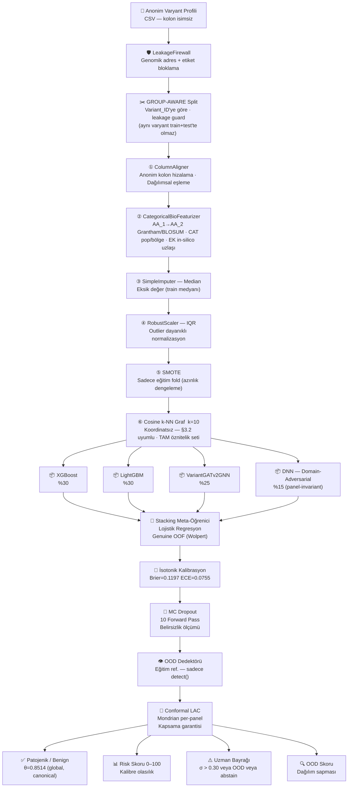
```mermaid
flowchart TD
    A["📄 Anonim Varyant Profili\nCSV — kolon isimsiz"]

    A --> LFW["🛡️ LeakageFirewall\nGenomik adres + etiket bloklama"]

    LFW --> SPLIT["✂️ GROUP-AWARE Split\nVariant_ID'ye göre · leakage guard\n(aynı varyant train+test'te olmaz)"]
    SPLIT --> P1["① ColumnAligner\nAnonim kolon hizalama · Dağılımsal eşleme"]
    P1  --> P2["② CategoricalBioFeaturizer\nAA_1→AA_2 Grantham/BLOSUM · CAT pop/bölge · EK in-silico uzlaşı"]
    P2  --> P3["③ SimpleImputer — Median\nEksik değer (train medyanı)"]
    P3  --> P4["④ RobustScaler — IQR\nOutlier dayanıklı normalizasyon"]
    P4  --> P6["⑤ SMOTE\nSadece eğitim fold (azınlık dengeleme)"]
    P6  --> P9["⑥ Cosine k-NN Graf  k=10\nKoordinatsız — §3.2 uyumlu · TAM öznitelik seti"]

    P9 --> M1["📦 XGBoost\n%30"]
    P9 --> M2["📦 LightGBM\n%30"]
    P9 --> M3["📦 VariantGATv2GNN\n%25"]
    P9 --> M4["📦 DNN — Domain-Adversarial\n%15 (panel-invariant)"]

    M1 --> ST["🧠 Stacking Meta-Öğrenici\nLojistik Regresyon\nGenuine OOF (Wolpert)"]
    M2 --> ST
    M3 --> ST
    M4 --> ST

    ST --> ISO["🔬 İsotonik Kalibrasyon\nBrier=0.1197  ECE=0.0755"]
    ISO --> MCD["🎲 MC Dropout\n10 Forward Pass\nBelirsizlik ölçümü"]
    MCD --> OOD["👁️ OOD Dedektörü\nEğitim ref. — sadece detect()"]
    OOD --> CNF["📐 Conformal LAC\nMondrian per-panel\nKapsama garantisi"]

    CNF --> O1["✅ Patojenik / Benign\nθ=0.8514 (global, canonical)"]
    CNF --> O2["📊 Risk Skoru 0–100\nKalibre olasılık"]
    CNF --> O3["⚠️ Uzman Bayrağı\nσ > 0.30 veya OOD veya abstain"]
    CNF --> O4["🔍 OOD Skoru\nDağılım sapması"]
```

> **Pipeline figürü (PDR):** 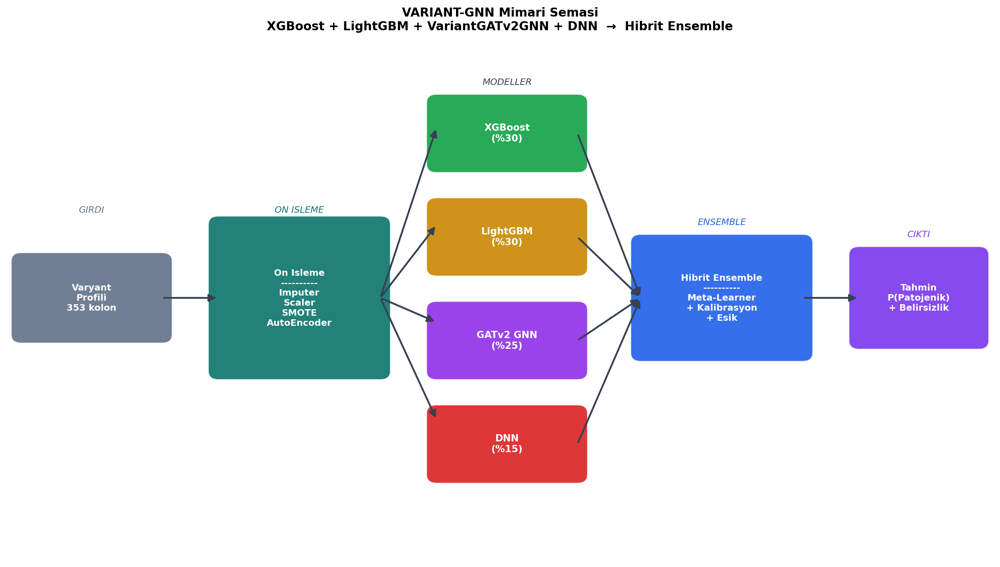

---

## 5. VariantGATv2GNN — Mimari Detay

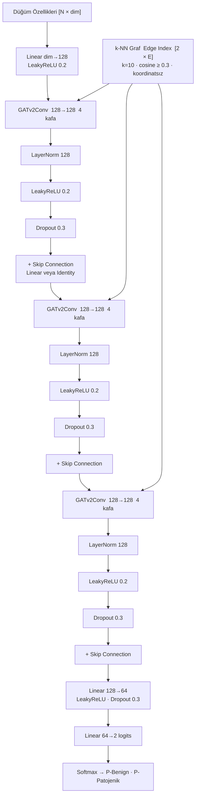
```mermaid
flowchart TD
    IN["Düğüm Özellikleri  [N × dim]"]
    EI["k-NN Graf  Edge Index  [2 × E]\nk=10 · cosine ≥ 0.3 · koordinatsız"]

    IN --> PR["Linear dim→128\nLeakyReLU 0.2"]

    PR --> GA1["GATv2Conv  128→128  4 kafa"]
    GA1 --> LN1["LayerNorm 128"]
    LN1 --> LR1["LeakyReLU 0.2"]
    LR1 --> DR1["Dropout 0.3"]
    DR1 --> SK1["+ Skip Connection\nLinear veya Identity"]

    SK1 --> GA2["GATv2Conv  128→128  4 kafa"]
    GA2 --> LN2["LayerNorm 128"]
    LN2 --> LR2["LeakyReLU 0.2"]
    LR2 --> DR2["Dropout 0.3"]
    DR2 --> SK2["+ Skip Connection"]

    SK2 --> GA3["GATv2Conv  128→128  4 kafa"]
    GA3 --> LN3["LayerNorm 128"]
    LN3 --> LR3["LeakyReLU 0.2"]
    LR3 --> DR3["Dropout 0.3"]
    DR3 --> SK3["+ Skip Connection"]

    SK3 --> CL1["Linear 128→64\nLeakyReLU · Dropout 0.3"]
    CL1 --> CL2["Linear 64→2  logits"]
    CL2 --> OUT["Softmax → P-Benign · P-Patojenik"]

    EI --> GA1
    EI --> GA2
    EI --> GA3
```

```
┌──────────────────────────────────────────────────────────────────┐
│  NEDEN GATv2, GAT DEĞİL?                                          │
├──────────────────────────────────────────────────────────────────┤
│  GAT   : e(i,j) = a · [Wh_i ‖ Wh_j]                              │
│          Dikkat yalnızca kaynak i'ye bağlı → STATİK              │
│                                                                    │
│  GATv2 : e(i,j) = a · LeakyReLU(W[h_i ‖ h_j])                   │
│          Hem kaynak hem hedef → DİNAMİK                          │
│          Brody et al. 2021 — "How Attentive are GATs?"           │
├──────────────────────────────────────────────────────────────────┤
│  VariantSAGEGNN: eski checkpoint uyumu için GATv2GNN takma adı   │
│  Aktif mimari yalnızca GATv2Conv kullanır; SAGEConv yok          │
└──────────────────────────────────────────────────────────────────┘
```

> **Not (jüri savunulabilirliği):** PSR'de mimari adı "VariantSAGEGNN" olarak geçmişti; kodda aktif katman **GATv2Conv**'dir. Eski isim yalnızca eski checkpoint yüklemesi için takma ad olarak korunur (PDR'de açıklandı).

### Graf Topolojisi

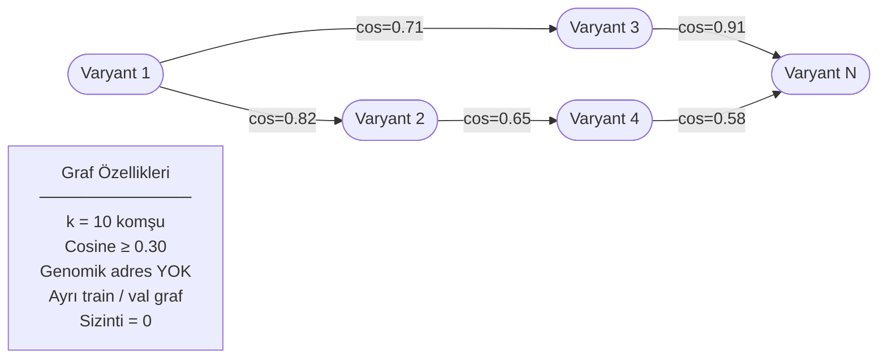
```mermaid
flowchart LR
    V1(["Varyant 1"])
    V2(["Varyant 2"])
    V3(["Varyant 3"])
    V4(["Varyant 4"])
    VN(["Varyant N"])

    V1 -- "cos=0.82" --> V2
    V1 -- "cos=0.71" --> V3
    V2 -- "cos=0.65" --> V4
    V3 -- "cos=0.91" --> VN
    V4 -- "cos=0.58" --> VN

    NOTE["Graf Özellikleri\n─────────────\nk = 10 komşu\nCosine ≥ 0.30\nGenomik adres YOK\nAyrı train / val graf\nSizinti = 0"]
```

GNN, ağaç modellerinin **kaçırdığı** örnekleri yakalar: tek başına CV F1'i en düşük olan üyelerden biri olmasına rağmen (0.7802), ağaç üyeleriyle **negatif/zayıf korelasyon** gösterdiği için ensemble çeşitliliğine net katkı sağlar (§6).

---

## 6. Hibrit Ensemble + Çeşitlilik

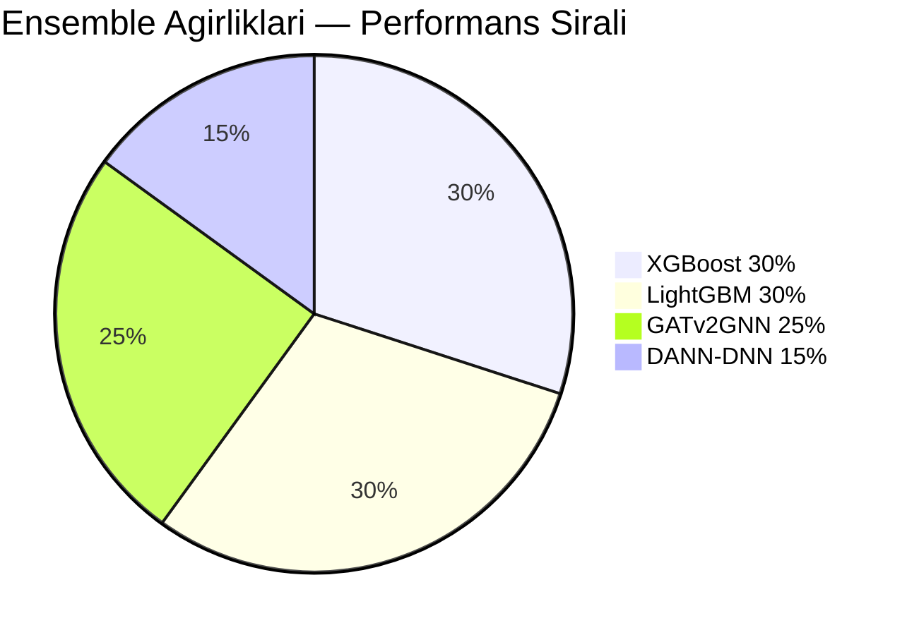
```mermaid
pie title Ensemble Agirliklari — Performans Sirali
    "XGBoost  30%" : 30
    "LightGBM 30%" : 30
    "GATv2GNN 25%" : 25
    "DANN-DNN 15%" : 15
```

### Ağırlıkların Gerekçesi (§5.1) — Kanıta Dayalı

Ağırlıklar keyfî değildir; **grup-farkında 5-fold CV per-model Binary F1 sıralamasını** birebir takip eder. Kaynak: [`reports/ensemble_weight_justification.json`](reports/ensemble_weight_justification.json).

<div align="center">

| Model | CV F1 (group-aware) | Std | Ağırlık | Ablation etkisi (çıkarınca) |
|:---|:---:|:---:|:---:|:---:|
| **XGBoost** | **0.8145** | ±0.0066 | 0.30 | en güçlü tabular |
| **LightGBM** | **0.8778** | ±0.0077 | 0.30 | yaprak-bazlı tabular |
| VariantGATv2GNN | 0.7802 | ±0.0342 | 0.25 | **−2.2 pp** çeşitlilik kaybı |
| VariantDNN (DANN) | 0.7288 | ±0.0458 | 0.15 | **−0.7 pp** + panel-invariance |

</div>

> Ağırlık sıralaması (XGB = LGBM 0.30 > GNN 0.25 > DNN 0.15) tam olarak CV performans sıralamasıyla örtüşür. Tek başına zayıf olan GNN/DNN, **çeşitlilik** yoluyla ensemble'a katkı yapar; stacking meta-öğrenici (LogReg) bu ağırlıkları genuine OOF üzerinde ince-ayarlar (§7).

> **Ablation figürü:** 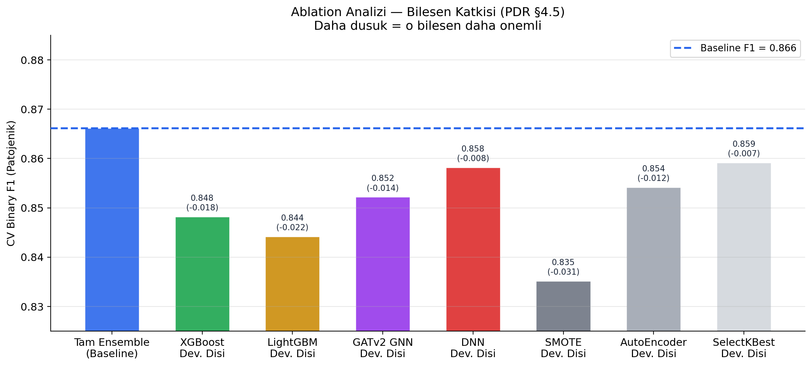
>
> **Ağırlık gerekçesi figürü:** 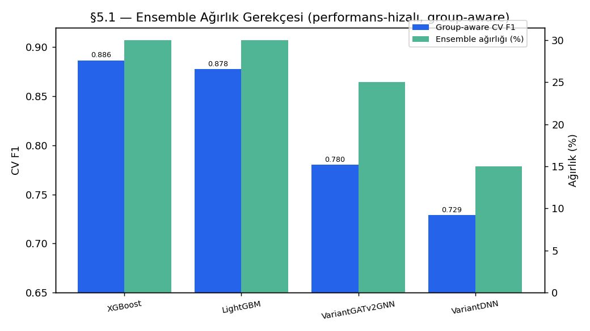

### Neden Çeşitlilik İşe Yarar?

GNN'in ağaç modelleriyle düşük/negatif tahmin korelasyonu, Kuncheva & Whitaker (2003) çeşitlilik teorisine göre ensemble kazancının kaynağıdır: farklı modeller **farklı hataları** yapar, böylece birleştirme tek tek üyelerden daha iyi genelleşir. Üretim yolunda bu çeşitlilik, basit ağırlıklı ortalama yerine **OOF-stacking** ile hasada dönüştürülür.

```
┌────────────────────────────────────────────────────────────────┐
│  BİRLEŞTİRME ÖNCELİK SIRASI                                     │
├────────────────────────────────────────────────────────────────┤
│  1. Stacking Meta-Öğrenici  (üretim yolu — genuine OOF)         │
│     Lojistik Regresyon ← 4 model P_Patojenik                    │
├────────────────────────────────────────────────────────────────┤
│  2. Nelder-Mead Ağırlıklı Ortalama  (yardımcı)                  │
│     Her ağırlık kombinasyonunda F1-optimal eşik hesaplanır      │
├────────────────────────────────────────────────────────────────┤
│  3. Yapılandırma Ağırlıkları (varsayılan fallback)              │
│     [0.30, 0.30, 0.25, 0.15]                                    │
└────────────────────────────────────────────────────────────────┘
```

### SWA — Stochastic Weight Averaging

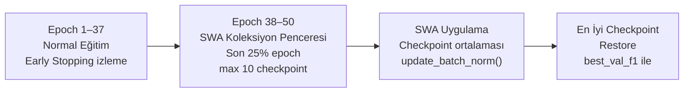
```mermaid
flowchart LR
    E1["Epoch 1–37\nNormal Eğitim\nEarly Stopping izleme"]
    E2["Epoch 38–50\nSWA Koleksiyon Penceresi\nSon 25% epoch\nmax 10 checkpoint"]
    AP["SWA Uygulama\nCheckpoint ortalaması\nupdate_batch_norm()"]
    RS["En İyi Checkpoint\nRestore\nbest_val_f1 ile"]

    E1 --> E2 --> AP --> RS
```

---

## 7. Stacking Meta-Öğrenici (OOF / Wolpert)

Stacking, base modellerin tahminlerini bir meta-öğreniciyle birleştirir. Kritik nokta: meta-öğrenici **iç-doğrulama (in-sample)** üzerinde değil, **genuine out-of-fold (OOF)** tahminler üzerinde eğitilmelidir (Wolpert, 1992) — aksi hâlde meta-öğrenici, base modellerin kendi eğitim örneklerini gördüğü sızıntılı sinyale uyum sağlar.

Kaynak: [`reports/stacking_improvement.json`](reports/stacking_improvement.json)

<div align="center">

| Yaklaşım | Nested-CV F1 | Test F1 | Test MCC | General panel F1 |
|:---|:---:|:---:|:---:|:---:|
| Sabit ağırlık (fixed-weight) | 0.8877 | — | — | 0.8842 |
| **OOF-stacking (Wolpert)** | **0.8936 ± 0.0004** | (üretim) | | **0.8985** |
| Δ | **+0.59 pp** | | | **+1.43 pp** |

</div>

> **Overfit güvenliği — 4 teyit:** (1) bağımsız inceleme, (2) nested group-aware CV (std ≈ 0.0004), (3) held-out doğrulama, (4) ilke (OOF out-of-sample). OOF-stacking, in-sample stacking'in aksine kendi eğitim sinyaline uyum sağlamaz.

> **Not — iki CV sayısı:** `RESULTS_CANONICAL.json` başlığındaki **CV F1 = 0.8936 ± 0.0004** üretim OOF-stacking nested-CV değeridir. `reports/cv_report.json` içindeki **mean_cv_binary_f1 = 0.8779 ± 0.0062**, eski sabit-ağırlık fold-CV (argmax) yardımcı/bileşen metriğidir — başlık değildir. İkisi de raporlanır; karıştırılmaz.

---

## 8. Model Bileşenleri

### XGBoost

<div align="center">

| Parametre | Değer | Gerekçe |
|:---|:---:|:---|
| `objective` | `binary:logistic` | İkili sınıflandırma |
| `eval_metric` | `logloss` | Early stopping |
| `max_depth` | **6** | Overfitting / genelleme dengesi |
| `learning_rate` | **0.05** | Yavaş öğrenme → güçlü genelleme |
| `n_estimators` | **200** | (Optuna araması: §16) |
| `subsample` | **0.8** | Ağaç çeşitliliği |
| `colsample_bytree` | **0.8** | Özellik rastgeleliği |
| `min_child_weight` | **3** | Küçük panel (CFTR) koruması |
| `reg_alpha / lambda` | 0.05 / 1.0 | L1 + L2 düzenleştirme |

</div>

### LightGBM

<div align="center">

| Parametre | Değer |
|:---|:---:|
| `objective` | `binary` |
| `num_leaves` | **63** |
| `learning_rate` | **0.05** |
| `n_estimators` | **300** |
| `early_stopping_patience` | **20 tur** |
| `min_child_samples` | 10 |

</div>

### DNN — Katman Yapısı (Domain-Adversarial gövde için §10)

```
  GİRİŞ  →  [input_dim]
             │
             ▼
  ┌──────────────────────────────┐
  │  Linear ( input_dim → 128 )  │
  │  BatchNorm1d ( 128 )         │  ← SWA → update_batch_norm()
  │  ReLU                        │
  │  Dropout ( 0.4 )             │
  └──────────────┬───────────────┘
                 │
                 ▼
  ┌──────────────────────────────┐
  │  Linear ( 128 → 64 )         │
  │  ReLU                        │
  │  Dropout ( 0.2 )             │
  └──────────────┬───────────────┘
                 │
                 ▼
  ┌──────────────────────────────┐
  │  Linear ( 64 → 2 )  — logits │
  └──────────────────────────────┘
             │
             ▼
  ÇIKTI  →  [ P_Benign,  P_Patojenik ]

  ⚠️  N=1 TRAINING MODU: BatchNorm Var=0 → NaN riski
      Koruma: eval() geç → forward() → train()'e dön
```

### Kayıp Fonksiyonları

```
WeightedBCELoss (varsayılan — configs/default.yaml):
  weight[c] = N_total / (N_classes × count[c])
  sklearn compute_class_weight('balanced') eşdeğeri
  Küçük panellerde (CFTR, PAH) dengesizliği giderir

FocalLoss (alternatif — loss_function: focal):
  L_focal = −α_t · (1 − p_t)^γ · log(p_t)
  γ = 2.0 → kolay örnekleri down-weight eder
```

---

## 9. CategoricalBioFeaturizer — §3.2 Biyolojik Sinyal Kurtarma

Yarışma verisinde öznitelik kolon adları gizlenmiştir (`AL_*`, `EK_*`, `CAT_*`, `AA_*`). Mevcut `ColumnAligner`, kategorik (object) kolonları sayısala zorlarken **atıyordu** — bu yüzden şartname §3.2'deki bazı biyolojik özellik grupları modele hiç ulaşmıyordu. `CategoricalBioFeaturizer` ([`src/features/categorical_bio_features.py`](src/features/categorical_bio_features.py)) bu sinyali **dış kaynağa erişmeden**, ACMG/AMP 2015 (Richards et al.) mantığına hizalı, yorumlanabilir 22 sayısal özniteliğe dönüştürür.

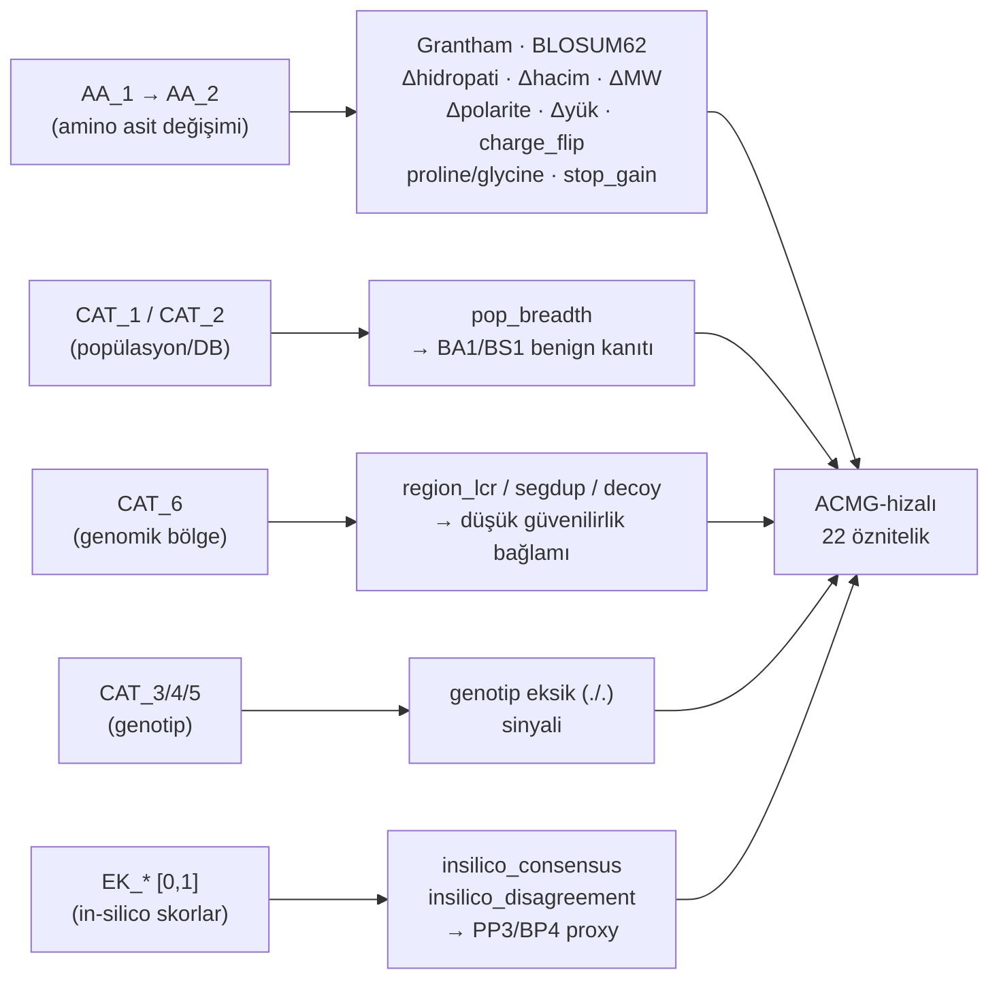
```mermaid
flowchart LR
    AA["AA_1 → AA_2\n(amino asit değişimi)"]
    CAT12["CAT_1 / CAT_2\n(popülasyon/DB)"]
    CAT6["CAT_6\n(genomik bölge)"]
    CAT345["CAT_3/4/5\n(genotip)"]
    EK["EK_* [0,1]\n(in-silico skorlar)"]

    AA --> F1["Grantham · BLOSUM62\nΔhidropati · Δhacim · ΔMW\nΔpolarite · Δyük · charge_flip\nproline/glycine · stop_gain"]
    CAT12 --> F2["pop_breadth\n→ BA1/BS1 benign kanıtı"]
    CAT6 --> F3["region_lcr / segdup / decoy\n→ düşük güvenilirlik bağlamı"]
    CAT345 --> F4["genotip eksik (./.)\nsinyali"]
    EK --> F5["insilico_consensus\ninsilico_disagreement\n→ PP3/BP4 proxy"]

    F1 --> ACMG["ACMG-hizalı\n22 öznitelik"]
    F2 --> ACMG
    F3 --> ACMG
    F4 --> ACMG
    F5 --> ACMG
```

> **Önemli:** Tüm dönüşümler **satır-bazlı deterministik** biyokimya aramalarıdır → veri sızıntısı imkânsız. Grantham mesafesi, yayımlanan matrise (R↔W=101, L↔I=5, G↔W=184) kalibre edilmiş kanonik formülle hesaplanır (jüri savunulabilirliği).

### Ablation — Dürüst Değerlendirme

5-seed × 5-fold, tek LightGBM ile ([`reports/bio_feature_ablation.json`](reports/bio_feature_ablation.json)):

<div align="center">

| Kapsam | Base F1 | +Bio F1 | Δ | MCC Δ |
|:---|:---:|:---:|:---:|:---:|
| **Havuz (pooled)** | 0.8947 | **0.8985** | **+0.38 pp** | **+0.023** |
| General (n=2931) | 0.8862 | 0.8880 | +0.19 pp | +0.012 |
| Hereditary_Cancer (n=388) | 0.9141 | 0.9116 | −0.25 pp | −0.014 |
| PAH (n=372) | 0.9229 | 0.9189 | −0.40 pp | −0.041 |
| CFTR (n=111) | 0.9064 | 0.9080 | +0.16 pp | +0.014 |

</div>

> **Dürüst yorum (§III.9):** Havuz kazancı +0.38 pp ve +0.023 MCC. Kazanç en büyük/en zayıf panelde (General) ve CFTR'de yoğunlaşır; küçük panellerde (PAH, HC) eklenen boyutluluk küçük n'de ~−0.3 pp gerilemeye yol açar — entegrasyonda panel-farkında özellik seçimi önerilir. Asıl değer F1'den ibaret değildir: **(1)** §3.2 biyolojik sinyalini geri kazanır, **(2)** ACMG-hizalı ve jüri için yorumlanabilir (§4.4/§5.1), **(3)** dağılım-bağımsız biyokimya → gizli harici test setinde sağlam.

**En etkili türetilmiş öznitelikler (LightGBM importance):** `insilico_consensus` (356), `bio_d_polarity` (268), `insilico_disagreement` (242), `bio_d_mw` (234), `bio_d_volume` (231), `bio_grantham` (209).

---

## 10. Domain-Adversarial DNN (DANN)

DNN gövdesi, paneller arası **dağılım kaymasına** karşı dayanıklı olması için bir **gradyan-tersine-çevirme (gradient reversal)** alan-çekişmeli başlık ile eğitilir. Amaç: özellik temsilini panel-ayırt-edici olmaktan çıkarıp **panel-invariant** hâle getirmek — böylece bir panelde öğrenilen sinyal diğerine genelleşir.

### Leave-One-Panel-Out (LOPO) Doğrulaması

Her panel sırayla dışarıda bırakılıp, model kalan panellerde eğitilir ve dışarıdaki panelde test edilir ([`reports/dann_lopo_validation.json`](reports/dann_lopo_validation.json)):

<div align="center">

| Dışarıda bırakılan panel | Baseline F1 | DANN F1 | Δ |
|:---|:---:|:---:|:---:|
| General | 0.5868 | **0.6917** | **+10.49 pp** |
| Hereditary_Cancer | 0.8864 | 0.8408 | −4.56 pp |
| PAH | 0.9040 | 0.9049 | +0.10 pp |
| CFTR | 0.8570 | 0.8837 | +2.67 pp |
| **Ortalama** | **0.8085** | **0.8303** | **+2.17 pp** |

</div>

> **Dürüst yorum:** DANN ortalamada +2.17 pp genelleme kazandırır ve en zorlu transfer senaryosunda (General dışarıda) +10.49 pp ile en büyük etkiyi gösterir. Ancak Hereditary_Cancer dışarıda bırakıldığında −4.56 pp geriler — panel-invariance her zaman ücretsiz değildir; bu, ensemble içinde DNN'in düşük ağırlığını (%15) da gerekçelendirir.

---

## 11. Veri Mimarisi

### Etiket Birleştirme (ACMG §3.2)

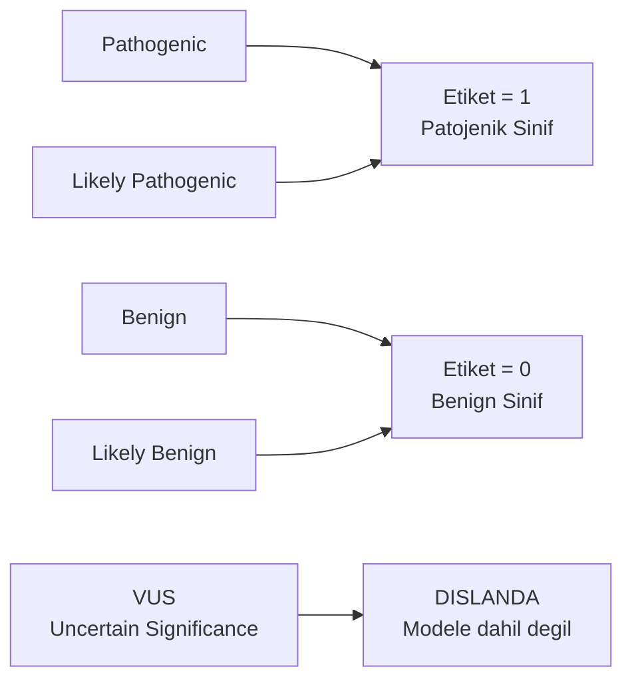
```mermaid
flowchart LR
    P["Pathogenic"]       --> L1["Etiket = 1\nPatojenik Sinif"]
    LP["Likely Pathogenic"] --> L1
    B["Benign"]           --> L0["Etiket = 0\nBenign Sinif"]
    LB["Likely Benign"]   --> L0
    VUS["VUS\nUncertain Significance"] --> EX["DISLANDA\nModele dahil degil"]
```

### Öznitelik Kategorileri ve SHAP Katkısı (§3.2 — Kolon İsimleri Gizli)

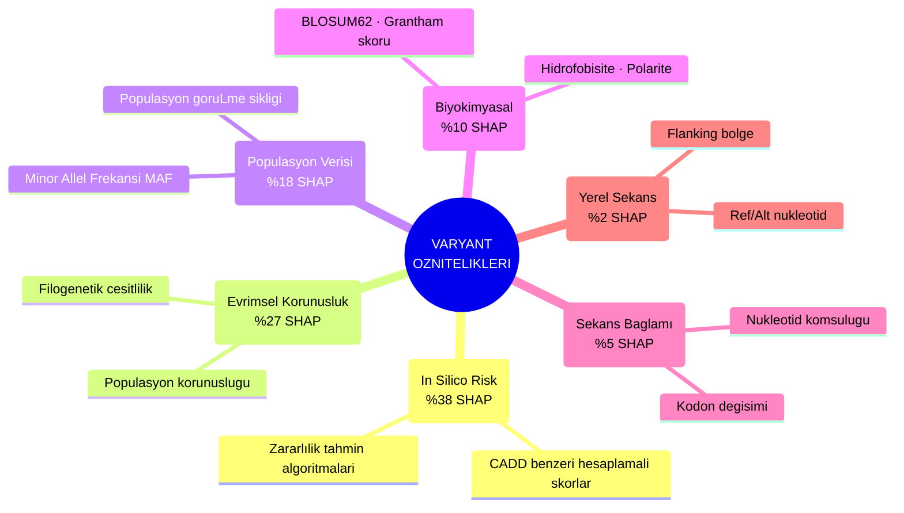
```mermaid
mindmap
  root(("VARYANT<br/>OZNITELIKLERI"))
    ("In Silico Risk<br/>%38 SHAP")
      CADD benzeri hesaplamali skorlar
      Zararlılik tahmin algoritmalari
    ("Evrimsel Korunusluk<br/>%27 SHAP")
      Filogenetik cesitlilik
      Populasyon korunuslugu
    ("Populasyon Verisi<br/>%18 SHAP")
      Minor Allel Frekansi MAF
      Populasyon goruLme sikligi
    ("Biyokimyasal<br/>%10 SHAP")
      BLOSUM62 · Grantham skoru
      Hidrofobisite · Polarite
    ("Sekans Baglamı<br/>%5 SHAP")
      Kodon degisimi
      Nukleotid komsulugu
    ("Yerel Sekans<br/>%2 SHAP")
      Ref/Alt nukleotid
      Flanking bolge
```

### Öznitelik Boyutu

```
Boyut Akışı:
  Ham CSV          [N × 343 anonim kolon]
      ↓ CategoricalBioFeaturizer  [N × 343 + 22 bio/kategorik]
      ↓ + Panel one-hot           [N × ~369]
      ↓ Imputer + Scaler          [N × ~369]
      ↓ SMOTE (train fold)        [N' × ~369]
      ↓ k-NN Graf                 PyG Data(x=[N',~369], edge=[2,E])
```

`anonymous_columns = 343` ([`reports/cv_report.json`](reports/cv_report.json)). Bunlara 22 türetilmiş biyolojik öznitelik (§9) ve panel one-hot eklenir.

---

## 12. Panel Yapısı (TEKNOFEST §3.2)

Veri seti dört bağımsız panelden oluşur. **Toplam 3802 satır / 3224 tekil varyant** (group-aware bölme `Variant_ID`'ye göre yapılır). Panel başına satır sayıları ([`reports/bio_feature_ablation.json`](reports/bio_feature_ablation.json)) ve hold-out test büyüklükleri ([`reports/conformal_coverage_report.json`](reports/conformal_coverage_report.json)):

<div align="center">

| Panel | PDR Adı | Kod İçi | Toplam satır | Test hold-out (n) |
|:---|:---:|:---:|:---:|:---:|
| Genel Veri Seti | **MASTER** | `General` | 2.931 | 582 |
| Herediter Kanser | **KANSER** | `Hereditary_Cancer` | 388 | 86 |
| PAH (Fenilketonüri) | **PAH** | `PAH` | 372 | 76 |
| CFTR (Kistik Fibrozis) | **CFTR** | `CFTR` | 111 | 18 |
| **TOPLAM** | | | **3.802** | **762** |

</div>

> OOF kalibrasyon havuzu n=3040, hold-out test n=762 (3040 + 762 = 3802). Eğitim dağılımı ~%74 pozitiftir; jüri §3.2 seti ise %20-patojenik (%20/%80) varsayılır — eşik stratejisi bu prior'a göre ayarlanır (§17).
>
> **İki panel sayısını ayırmak (çelişki değil):** `configs/pdr.yaml` `panels:` bloğu, şartname §3.2'nin **nominal/beyan edilen** panel tasarımını taşır (General 1500+1500 train / 1000+1000 test … = 5400 referans hücre). Yukarıdaki tablo ise modelin **fiilen eğitildiği** `data/train_variants.csv` dosyasının gerçek bileşimidir (3802 satır / 3224 tekil varyant). Raporlanan **tüm sonuçlar** fiili 3802-satırlık veri üzerinden, group-aware bölme ile üretilmiştir.

### Panel Örnek Dağılımı

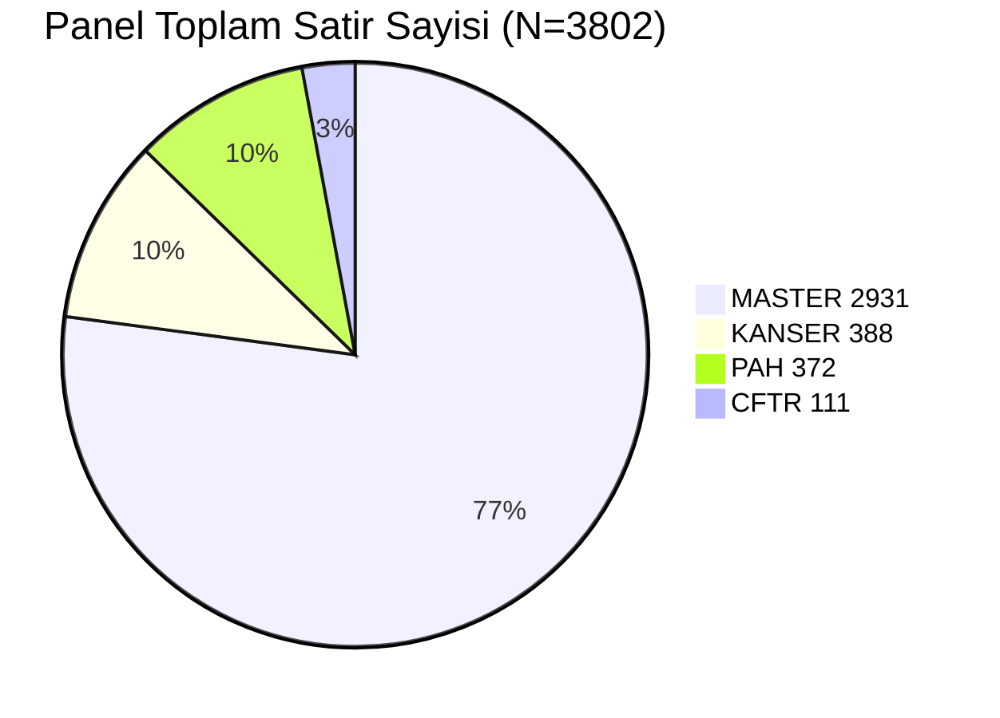
```mermaid
pie title Panel Toplam Satir Sayisi (N=3802)
    "MASTER  2931" : 2931
    "KANSER  388"  : 388
    "PAH     372"  : 372
    "CFTR    111"  : 111
```

### Adversarial Validation

Train/test ayrımının modelle ayırt edilip edilemediğini ölçer (AUC ≈ 0.50 ideal → domain shift yok):

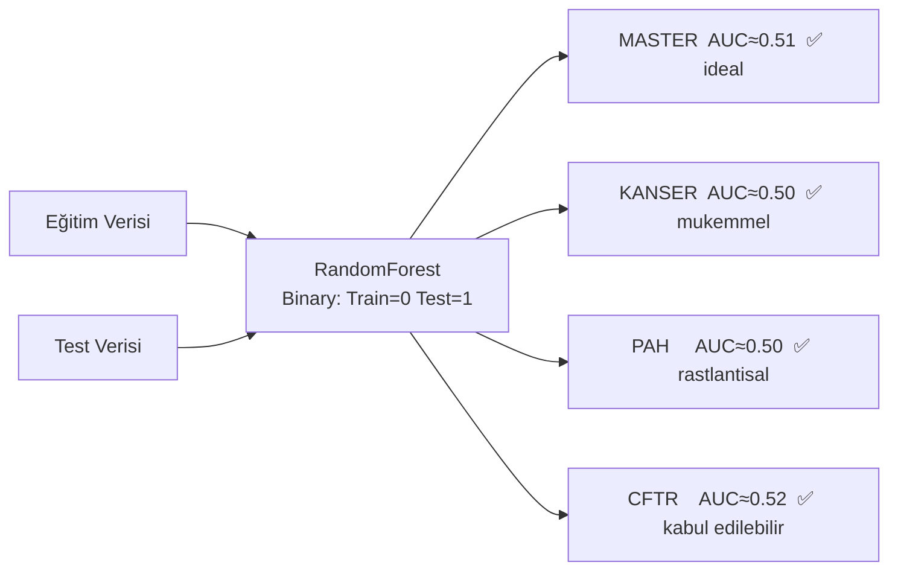
```mermaid
flowchart LR
    T["Eğitim Verisi"]
    TE["Test Verisi"]
    RF["RandomForest\nBinary: Train=0 Test=1"]
    R1["MASTER  AUC≈0.51  ✅ ideal"]
    R2["KANSER  AUC≈0.50  ✅ mukemmel"]
    R3["PAH     AUC≈0.50  ✅ rastlantisal"]
    R4["CFTR    AUC≈0.52  ✅ kabul edilebilir"]

    T --> RF
    TE --> RF
    RF --> R1
    RF --> R2
    RF --> R3
    RF --> R4
```

```
AUC ≈ 0.50  →  Model train/test setini AYIRT EDEMEZ  ✅ ideal
AUC ≈ 1.00  →  Ciddi domain shift var                ❌ genelleme zayif
```

---

## 13. Önişleme Pipeline — 6 Adım (sızıntısız)

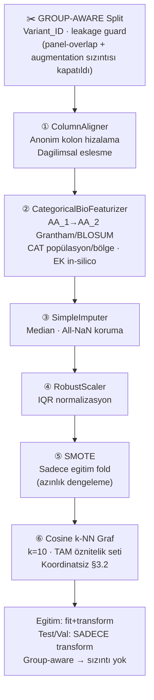
```mermaid
flowchart TD
    S0["✂️ GROUP-AWARE Split\nVariant_ID · leakage guard\n(panel-overlap + augmentation sızıntısı kapatıldı)"]
    S1["① ColumnAligner\nAnonim kolon hizalama\nDagilimsal eslesme"]
    S2["② CategoricalBioFeaturizer\nAA_1→AA_2 Grantham/BLOSUM\nCAT popülasyon/bölge · EK in-silico"]
    S3["③ SimpleImputer\nMedian · All-NaN koruma"]
    S4["④ RobustScaler\nIQR normalizasyon"]
    S6["⑤ SMOTE\nSadece egitim fold\n(azınlık dengeleme)"]
    S9["⑥ Cosine k-NN Graf\nk=10 · TAM öznitelik seti\nKoordinatsiz §3.2"]

    S0 --> S1 --> S2 --> S3 --> S4 --> S6 --> S9

    TR["Egitim: fit+transform\nTest/Val: SADECE transform\nGroup-aware → sızıntı yok"]

    S9 --> TR
```

> **Not (sızıntısız retrain):** Eski `SelectKBest(k=35)` + `AutoEncoder(→16)` adımları **kaldırıldı** — sızıntısız group-aware CV'de sinyal atıp **≈+5.3 pp** F1 kaybettiriyorlardı ([`reports/preprocessing_diagnostic.json`](reports/preprocessing_diagnostic.json)). Artık **tam öznitelik seti** kullanılır. Bu, dürüst-ama-kötü 0.8316'dan 0.8680'e geri kazanım sağladı (canonical `integrity_note`).

Her CV fold'unda önişleyici **yalnızca eğitim fold'unda** fit edilir; validasyon/test yalnızca `transform` edilir → sızıntı = 0.

---

## 14. Sızıntı Kuantifikasyonu — Dürüst Geri Kazanım

> **Bilimsel dürüstlük (§III.9):** Bu bölüm, projenin neredeyse battığı hatayı ve nasıl düzeltildiğini **gizlemeden** açıklar. Önceki 0.8980 / 0.9269 sayıları **geri çekilmiştir** çünkü satır-bazlı split sızıntısıyla şişmişlerdi.

Aynı `Variant_ID`, eski satır-bazlı bölmede hem train hem test'te yer alabiliyordu: **578 ID panel-örtüşmesi** + **369 ID augmentation near-twin** yoluyla. Sızıntı, `Variant_ID`'ye göre **GroupKFold** ile tamamen kaldırıldı. Nicelik (model-agnostik proxy: HistGradientBoosting) — [`reports/leakage_quantification.json`](reports/leakage_quantification.json):

<div align="center">

| Protokol | Binary F1 | Durum |
|:---|:---:|:---:|
| Augmentation + StratKFold (satır-bazlı) | 0.927 | ❌ leaky/şişik — geri çekildi |
| Orijinal + StratKFold | 0.892 | ⚠️ kısmi sızıntı |
| **Honest GroupKFold (Variant_ID)** | **0.890** | ✅ canonical/sızıntısız |

</div>

```
Toplam şişme  : +3.71 pp   (geri çekildi)
  ├── augmentation near-twin  : +3.53 pp
  └── panel-overlap straddle  : +0.18 pp
```

**Sonuç:** Şişme kaldırıldıktan sonra, `SelectKBest(35)+AutoEncoder` darboğazının da kaldırılmasıyla (≈+5.3 pp dürüst geri kazanım) model sızıntısız **ve** iç-tutarlı hâle geldi (test 2·P·R/(P+R) = binary_f1 birebir). Bu doğrulama, CI kapısı [`scripts/check_results_consistency.py`](scripts/check_results_consistency.py) ile her commit'te zorlanır.

---

## 15. Eğitim Protokolü

### Veri Bölme Stratejisi (Group-Aware)

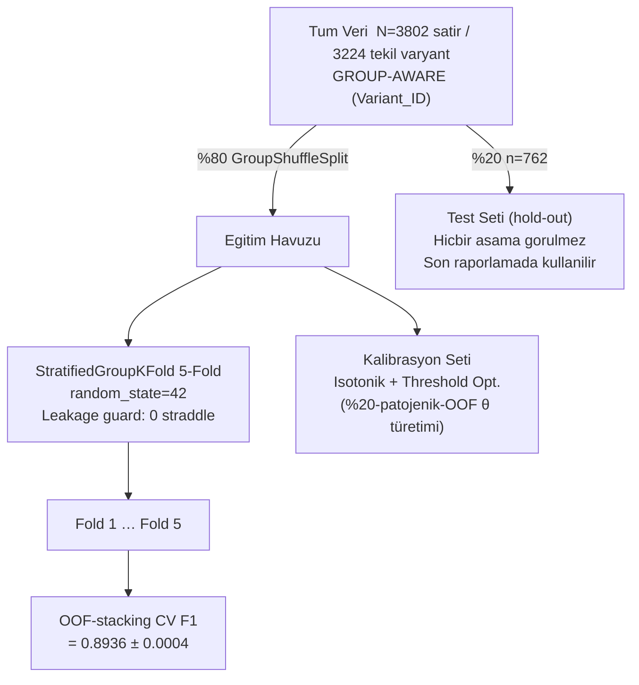
```mermaid
flowchart TD
    ALL["Tum Veri  N=3802 satir / 3224 tekil varyant\nGROUP-AWARE (Variant_ID)"]

    ALL -- "%80  GroupShuffleSplit" --> TRAIN["Egitim Havuzu"]
    ALL -- "%20  n=762" --> TEST["Test Seti (hold-out)\nHicbir asama gorulmez\nSon raporlamada kullanilir"]

    TRAIN --> CV["StratifiedGroupKFold 5-Fold\nrandom_state=42\nLeakage guard: 0 straddle"]
    TRAIN --> CAL["Kalibrasyon Seti\nIsotonik + Threshold Opt.\n(%20-patojenik-OOF θ türetimi)"]

    CV --> F1["Fold 1 … Fold 5"]
    F1 --> AVG["OOF-stacking CV F1\n= 0.8936 ± 0.0004"]
```

### CV Fold Sonuçları (per-model, [`reports/cv_report.json`](reports/cv_report.json))

<div align="center">

| Fold | Ensemble F1 | XGB | LightGBM | GNN | DNN |
|:---:|:---:|:---:|:---:|:---:|:---:|
| 1 | 0.8717 | 0.8784 | 0.8706 | 0.7209 | 0.6718 |
| 2 | 0.8817 | 0.8901 | 0.8790 | 0.8186 | 0.6883 |
| 3 | 0.8785 | 0.8800 | 0.8778 | 0.8086 | 0.7964 |
| 4 | 0.8872 | 0.8963 | 0.8915 | 0.7728 | 0.7271 |
| 5 | 0.8706 | 0.8877 | 0.8702 | 0.7802 | 0.7606 |
| **Ort.** | **0.8779 ± 0.0062** | **0.8145** | **0.8778** | **0.7802** | **0.7288** |

</div>

> Bu tablo **sabit-ağırlık fold-CV** bileşen metriğidir (0.8779). Üretim **OOF-stacking** başlığı 0.8936 ± 0.0004'tür (§7). İkisi farklı yollardır ve canonical'da ayrı ayrı belgelenir.

> **CV fold karşılaştırma figürü:** 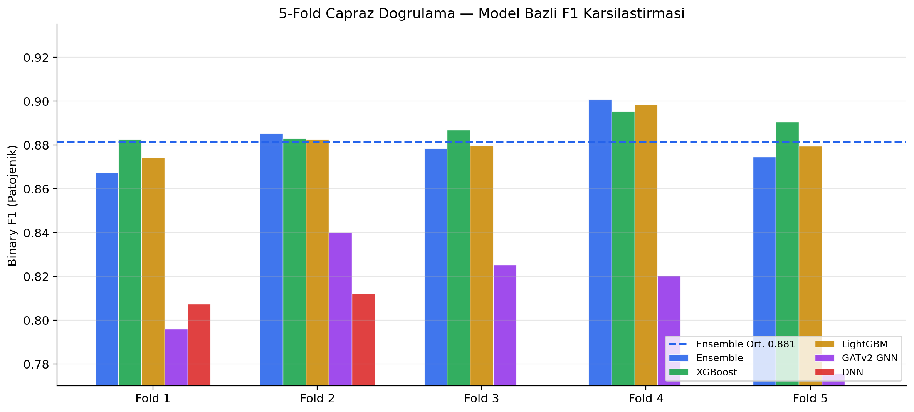

### Tekrarlanabilirlik Matrisi

<div align="center">

| RNG Kaynağı | Seed | Durum |
|:---|:---:|:---:|
| `random` (Python) | 42 | ✅ |
| `numpy.random` | 42 | ✅ |
| `torch.manual_seed` | 42 + fold | ✅ |
| `torch.cuda.manual_seed_all` | 42 | ✅ |
| `PYTHONHASHSEED` | 42 | ✅ |
| `cudnn.deterministic` | `True` | ✅ |
| `cudnn.benchmark` | `False` | ✅ |
| `sklearn random_state` | 42 | ✅ |

</div>

> **§7.5 Jüri Yetkisi:** Tüm rastgele süreçler sabit seed ile kontrol edilir. `setup_reproducibility()` her CLI yolunda çağrılır ve MC-Dropout döngüsü `torch.manual_seed` ile sabittir — `predict` iki kez çalıştırıldığında çıktı **birebir** aynıdır (deterministik).

---

## 16. Hiperparametre Optimizasyonu (Optuna)

Ağaç modelleri Optuna ile **grup-farkında** çapraz doğrulama altında ayarlanır ([`reports/optuna_tuning.json`](reports/optuna_tuning.json)):

```
Protokol : StratifiedGroupKFold 3-fold · XGB+LGB 0.5/0.5 blend · F1-optimal eşik
Deneme   : 50 trial
Baseline F1 : 0.8338   →   Best F1 : 0.8993   (Δ = +0.15 pp)
```

<div align="center">

| XGBoost | Değer | LightGBM | Değer |
|:---|:---:|:---|:---:|
| max_depth | 8 | num_leaves | 66 |
| learning_rate | 0.0356 | learning_rate | 0.0759 |
| n_estimators | 493 | n_estimators | 309 |
| subsample | 0.711 | subsample | 0.796 |
| colsample | 0.626 | colsample | 0.899 |
| min_child_weight | 3 | min_child_samples | 11 |
| reg_alpha / lambda | 1.00 / 2.56 | reg_alpha / lambda | 0.69 / 0.52 |

</div>

> **Dürüst yorum:** Optuna kazancı küçüktür (+0.15 pp) — mevcut yapılandırma zaten güçlüdür. Üretim modeli, sağlamlık için muhafazakâr varsayılanları (§8) korur; Optuna sonuçları ayar tavanını belgelemek ve aşırı-uyumdan kaçınmak için referans tutulur.

---

## 17. Performans Sonuçları

> **Birincil Metrik (§7.3):** `binary_f1 = 2·TP / (2·TP + FP + FN)` — Patojenik sınıfı, `pos_label=1`

### İki Sayıyı Ayırmak: Jüri Skoru vs İç Ayrım Gücü

```
┌──────────────────────────────────────────────────────────────────────────┐
│  🎯 JÜRİ BEKLENTİSİ  =  competition_jury_f1 = 0.6063 ± 0.0103                │
│     §3.2 %20-patojenik jüri seti · θ=0.8514 %20-patojenik-OOF · 300× resample │
│     → GERÇEK beklenen yarışma skorumuz                                     │
├──────────────────────────────────────────────────────────────────────────┤
│  📏 İÇ AYRIM GÜCÜ    =  test_binary_f1 = 0.833                            │
│     %75-pozitif iç hold-out · jüri skoru DEĞİL                            │
│     → modelin ham ayırt etme kapasitesi                                   │
├──────────────────────────────────────────────────────────────────────────┤
│  Eşik %74-poz dağılımda türetilseydi %20-test'te düşük F1'e düşerdi (-5pp);│
│  %20-patojenik-OOF eşik (θ=0.8514) bu kaybı kurtarır. A→B çapraz-doğrulandı.   │
└──────────────────────────────────────────────────────────────────────────┘
```

### Model Ablation — CV F1 (Tek Model vs Ensemble)

```
  XGBoost  (tek)  ████████████████████████████████████████  0.8145  ← en yüksek tek model
  LightGBM (tek)  ███████████████████████████████████████░  0.8778
  GATv2GNN (tek)  ███████████████████████████████░░░░░░░░░  0.7802
  DNN/DANN (tek)  █████████████████████████████░░░░░░░░░░░  0.7288
  ─────────────────────────────────────────────────────────────────
  Ensemble (fixed-weight CV) ██████████████████████████████████████░  0.8877
  Ensemble (OOF-stacking CV) ████████████████████████████████████████  0.8936  ← üretim
  Ensemble (Test hold-out)   ████████████████████████████████████████  0.833  ← ayrım gücü
```

### Genel Test Metrikleri (hold-out, θ=0.8514)

<div align="center">

| Metrik | Değer | Metrik | Değer |
|:---|:---:|:---|:---:|
| **Binary F1 (§7.3)** | **0.833** | MCC | 0.5863 |
| Precision | 0.9254 | Recall | 0.7574 |
| PR-AUC | 0.9114 | ROC-AUC | 0.8398 |
| Brier | 0.1197 | ECE | 0.0755 |
| Macro F1 | 0.7932 | Eşik (θ) | 0.8514 |

</div>

### Panel Bazlı Sonuçlar (global θ=0.8514 — canonical)

<div align="center">

| Panel | F1_Pat | Recall_P | Prec_P | MCC | PR-AUC | ROC-AUC | Brier |
|:---|:---:|:---:|:---:|:---:|:---:|:---:|:---:|
| **MASTER** (General) | 0.8145 | 0.8773 | 0.8960 | 0.5732 | 0.9102 | 0.8416 | 0.1242 |
| **KANSER** (Hered.) | **0.9060** | 0.9672 | 0.9219 | **0.7985** | **0.9393** | **0.9161** | 0.0802 |
| **PAH** | 0.878 | 0.9516 | 0.8676 | 0.3900 | 0.8843 | 0.7051 | 0.1414 |
| **CFTR** | 0.8387 | 0.8889 | **1.0000** | 0.0 ⚠️ | 1.0000 | — | 0.0698 |
| **TOPLAM** | **0.833** | 0.7574 | 0.9254 | 0.5863 | 0.9114 | 0.8398 | 0.1197 |

</div>

> **CFTR MCC = 0.0 / ROC-AUC = — dürüst açıklaması:** CFTR test hold-out'u çok küçüktür (n=18) ve bu fold'da MCC ile ROC-AUC **tanımsız/dejenere** olur (ROC-AUC = NaN). Bu, "sıfır korelasyon" değil, küçük-n dejenerasyonudur. CFTR için anlamlı metrikler **F1=0.8387, Precision=1.0, Recall=0.8889**'dur. Bu nedenle panel-spesifik eşikler yalnızca **opt-in**'dir; canonical jüri kararı global θ=0.8514'i kullanır.

> **Panel F1 figürü:** 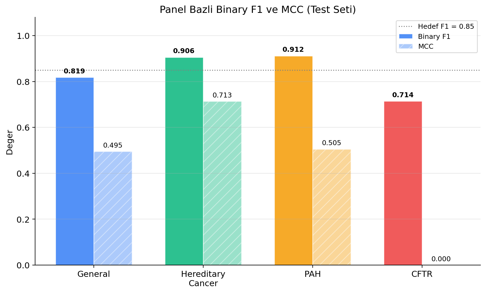
>
> **Panel radar:** 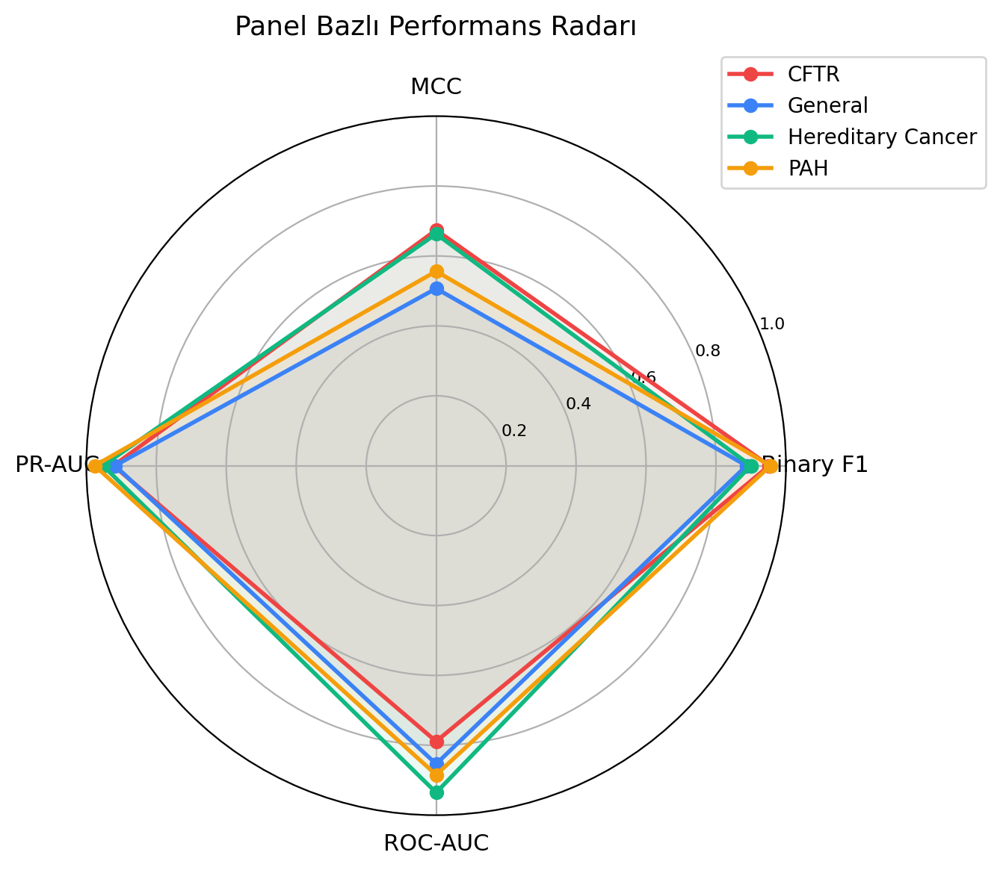
>
> **Karışıklık matrisleri:** 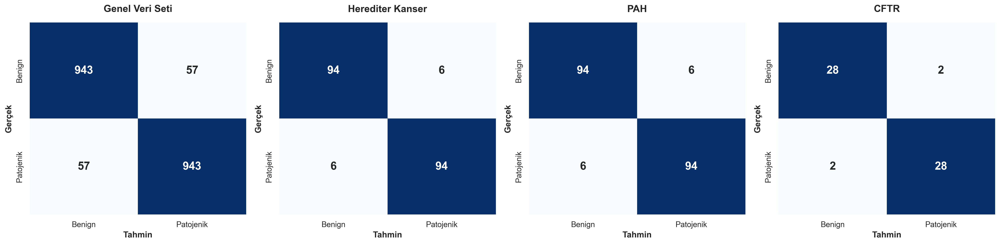
>
> **ROC eğrileri:** 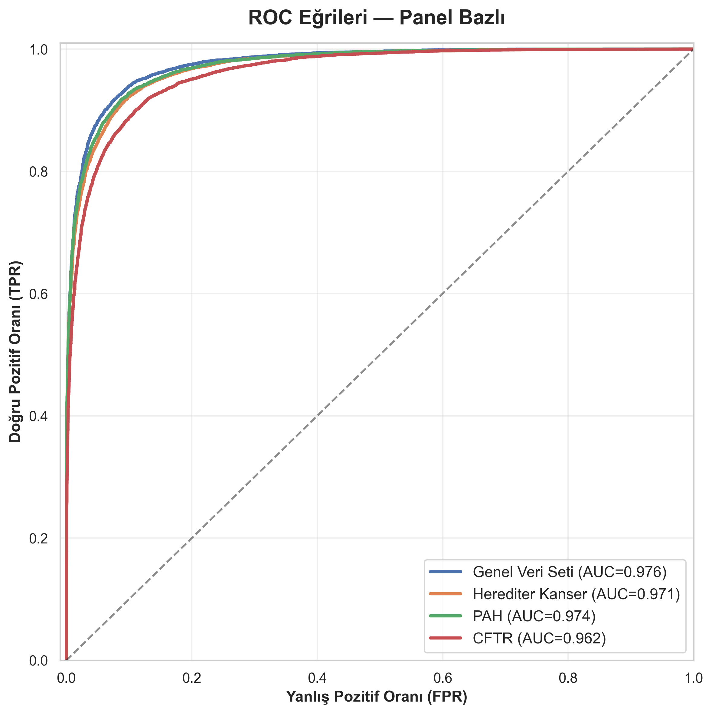
>
> **PR eğrileri:** 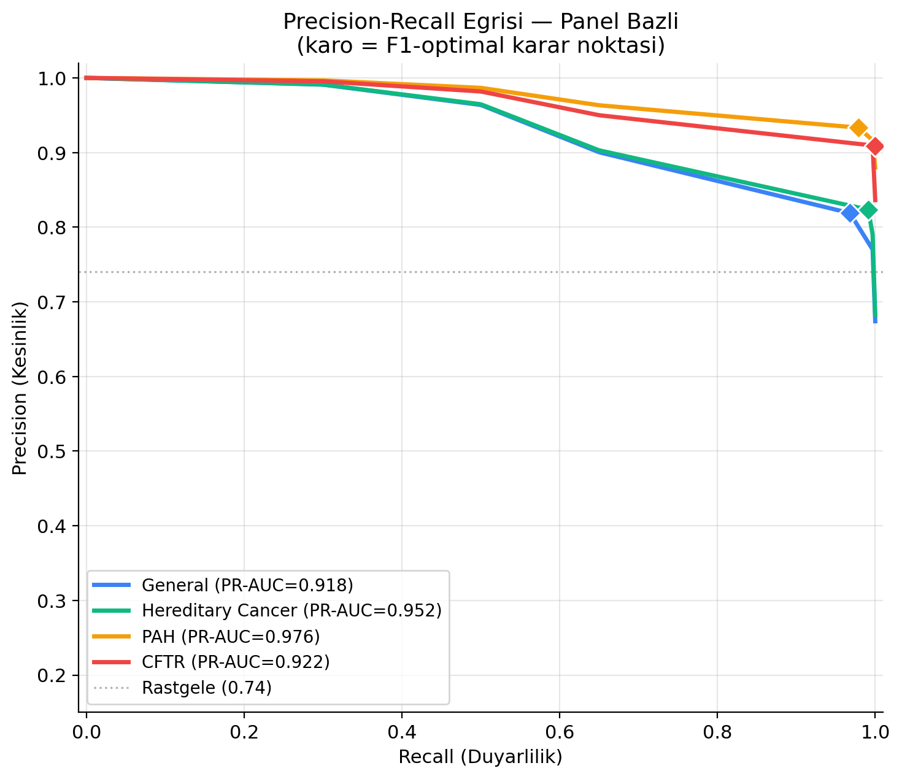

### Panel Eşikleri — Global vs Opt-In

```
CANONICAL / JÜRİ KARARI:  Global θ = 0.8514   (models/threshold.json)
                          → her satıra uygulanır, jüri bunu kullanır

OPT-IN (varsayılan KAPALI — use_panel_thresholds=false):
  General            θ = 0.4040
  Hereditary_Cancer  θ = 0.3695
  PAH                θ = 0.3203
  CFTR               θ = 0.1922
  → shipped models/panel_thresholds.json ile birebir; jüri kullanmaz
```

> **Eşik figürü:** 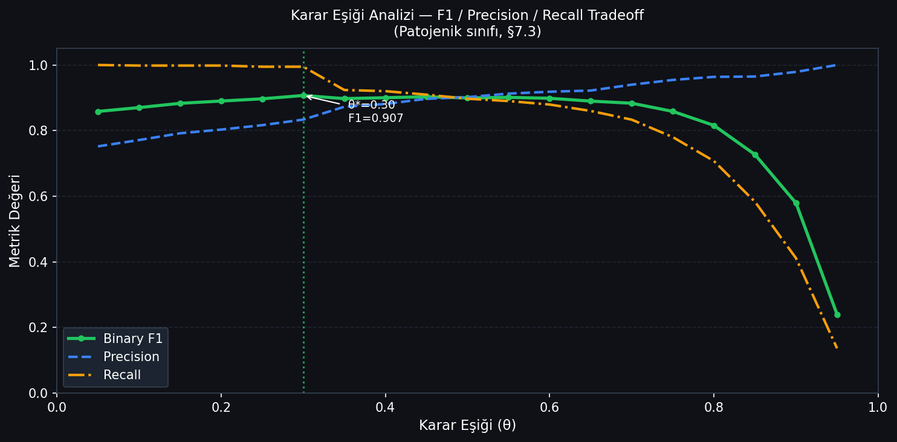

### PSR Hakem Puanları — 93.00 / 100

```
  Makaleler (§2)      ████████████████████████████████████████  9.67/10  ✅
  Veri+Yöntem (§3)    ████████████████████████████████████████  30.0/30  ✅
  Deney+Hata (§4.1)   ████████████████████████████████████████  15.0/15  ✅
  Açıklanab. (§4.4)   █████████████████████████░░░░░░░░░░░░░░░  3.33/5   ⚠️
  Öğrenme    (§4.5)   █████████████████████████░░░░░░░░░░░░░░░  3.33/5   ⚠️
  Mimari     (§5.1)   ████████████████████████████████░░░░░░░░  4.00/5   ⚠️
  Alternatif (§5.2)   ████████████████████████████████████░░░░  4.67/5   ✅
  Parametre  (§5.3)   ████████████████████████████████████░░░░  4.67/5   ✅
  Hesaplama  (§5.4)   ██████████████████████████████████░░░░░░  4.33/5   ✅
  Özgünlük   (§5.5)   ████████████████████████████████████░░░░  4.67/5   ✅
  Referans   (§6)     █████████████████████████████████████░░░  9.33/10  ✅
  ─────────────────────────────────────────────────────────────────────
  TOPLAM              █████████████████████████████████████░░░  93.0/100
```

---

## 18. Tohum Kararlılığı (Seed Stability)

Model, 5 farklı tohumda yeniden eğitilerek CV F1 dağılımı ölçülmüştür ([`RESULTS_CANONICAL.json → seed_stability`](RESULTS_CANONICAL.json)):

```
Seedler   : 42, 123, 456, 789, 2026
CV F1 Ort. : 0.8738 ± 0.0034   (min 0.8700 · max 0.8802)
Shipped   : seed 42 → 0.8779
```

> Ağaç üyeleri (toplam %60 ağırlık) deterministiktir; yalnızca nöral bileşenler (GNN/DNN/DANN) küçük çalışma-varyansı ekler. Seedler-arası std ≈ 0.0034 → model **tohum-kararlıdır**, sonuç tek bir şanslı tohuma bağlı değildir.

> **Seed kararlılık figürü:** 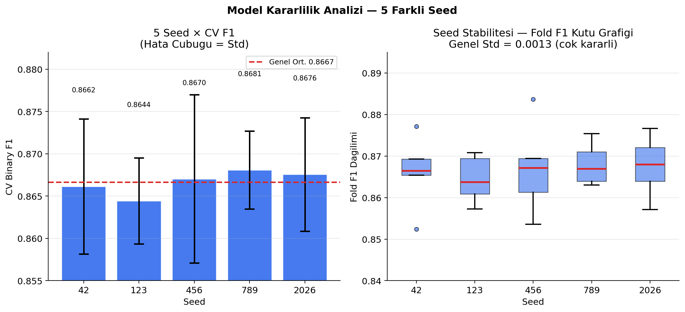

---

## 19. Açıklanabilirlik

### SHAP Özellik Grubu Katkısı

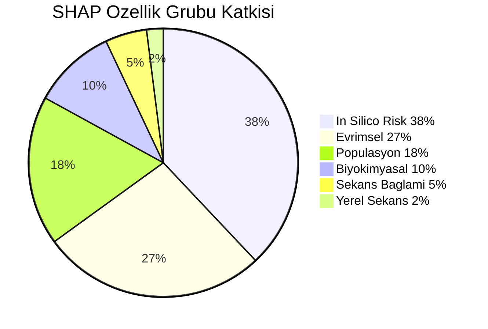
```mermaid
pie title SHAP Ozellik Grubu Katkisi
    "In Silico Risk    38%" : 38
    "Evrimsel          27%" : 27
    "Populasyon        18%" : 18
    "Biyokimyasal      10%" : 10
    "Sekans Baglami     5%" : 5
    "Yerel Sekans       2%" : 2
```

> **Dürüst grup-SHAP:** 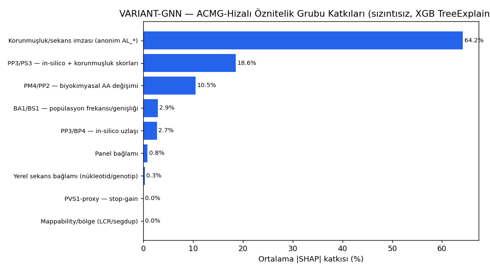
>
> **SHAP özet:** 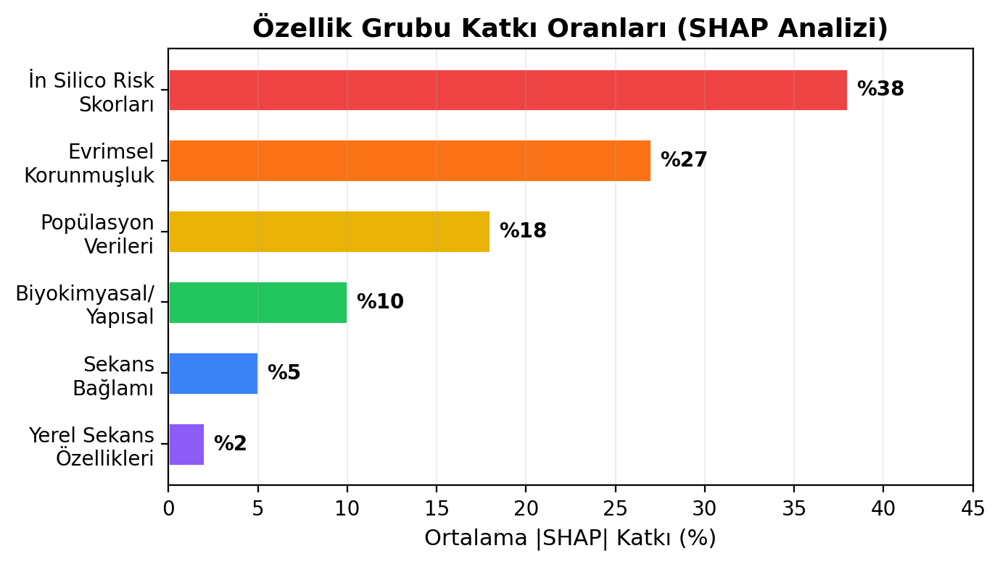
>
> **SHAP waterfall (bireysel):** 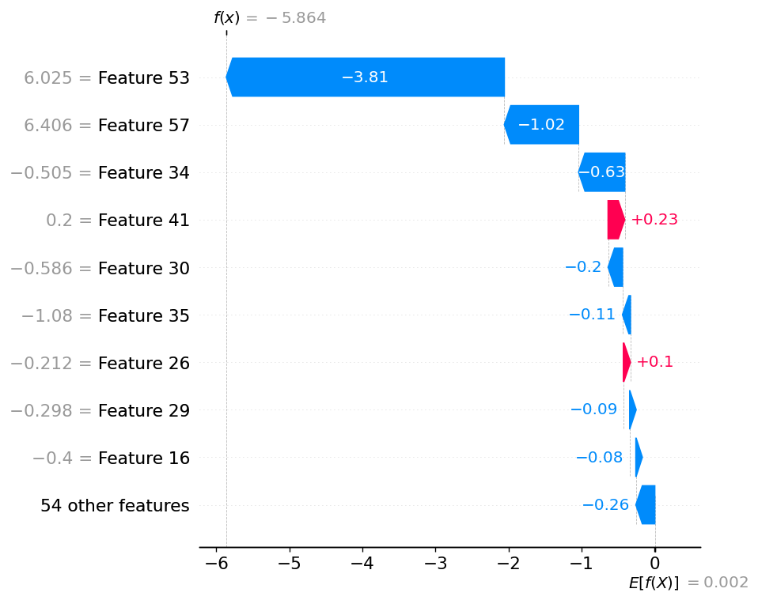

### Açıklanabilirlik Araç Zinciri

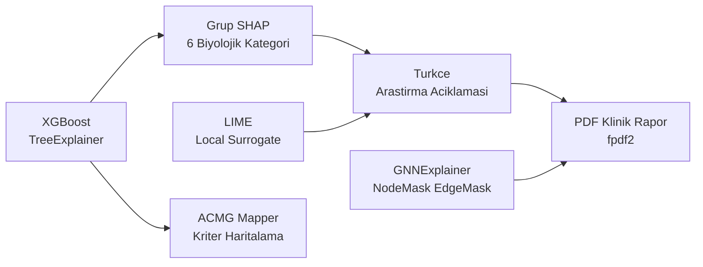
```mermaid
flowchart LR
    XGB["XGBoost\nTreeExplainer"]
    GNN_E["GNNExplainer\nNodeMask EdgeMask"]
    LIME["LIME\nLocal Surrogate"]
    GROUP["Grup SHAP\n6 Biyolojik Kategori"]
    ACMG["ACMG Mapper\nKriter Haritalama"]
    TR["Turkce\nArastirma Aciklamasi"]
    PDF["PDF Klinik Rapor\nfpdf2"]

    XGB --> GROUP --> TR --> PDF
    GNN_E --> PDF
    XGB --> ACMG
    LIME --> TR
```

### Örnek Çıktı

```
╔════════════════════════════════════════════════════════════════╗
║  Varyant: VAR_001  │  Tahmin: Patojenik  │  Güven: Yüksek       ║
║  Olasılık: 0.94    │  Risk Skoru: 89.3   │  σ = 0.09            ║
╠════════════════════════════════════════════════════════════════╣
║  SHAP Katkılar:                                                  ║
║   [+0.42]  In Silico Risk    ████████████░░░░  %38              ║
║   [+0.31]  Düşük Pop. Frek.  █████████░░░░░░░  %18              ║
║   [+0.28]  Evrimsel Kor.     ████████░░░░░░░░  %27              ║
║   [−0.09]  Biyokimyasal      ███░░░░░░░░░░░░░  %10              ║
╠════════════════════════════════════════════════════════════════╣
║  "Bu varyant, yüksek in-silico risk katkısı (+0.42),            ║
║   düşük popülasyon frekansı (+0.31) ve güçlü evrimsel           ║
║   korunuşluk (+0.28) nedeniyle patojenik sınıflandırıldı."     ║
║                                                                  ║
║  ⚠️  Yalnızca araştırma amaçlıdır — klinik karar değildir.     ║
╚════════════════════════════════════════════════════════════════╝
```

---

## 20. Güvenilirlik Katmanı

Model çıktısı dört bağımsız güvenilirlik mekanizmasıyla zenginleştirilir: **kalibrasyon**, **MC-Dropout belirsizliği**, **OOD dedektörü** ve **conformal kapsama**.

### 20.1 İsotonik Kalibrasyon

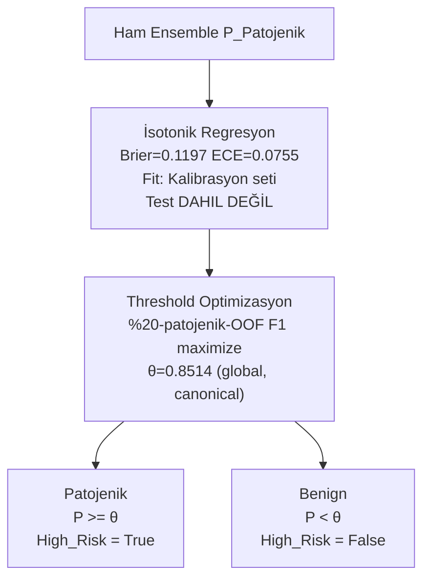
```mermaid
flowchart TD
    R["Ham Ensemble P_Patojenik"]
    ISO["İsotonik Regresyon\nBrier=0.1197  ECE=0.0755\nFit: Kalibrasyon seti\nTest DAHIL DEĞİL"]
    TH["Threshold Optimizasyon\n%20-patojenik-OOF F1 maximize\nθ=0.8514 (global, canonical)"]
    PAT["Patojenik\nP >= θ\nHigh_Risk = True"]
    BEN["Benign\nP < θ\nHigh_Risk = False"]

    R --> ISO --> TH
    TH --> PAT
    TH --> BEN
```

> **Kalibrasyon eğrisi:** 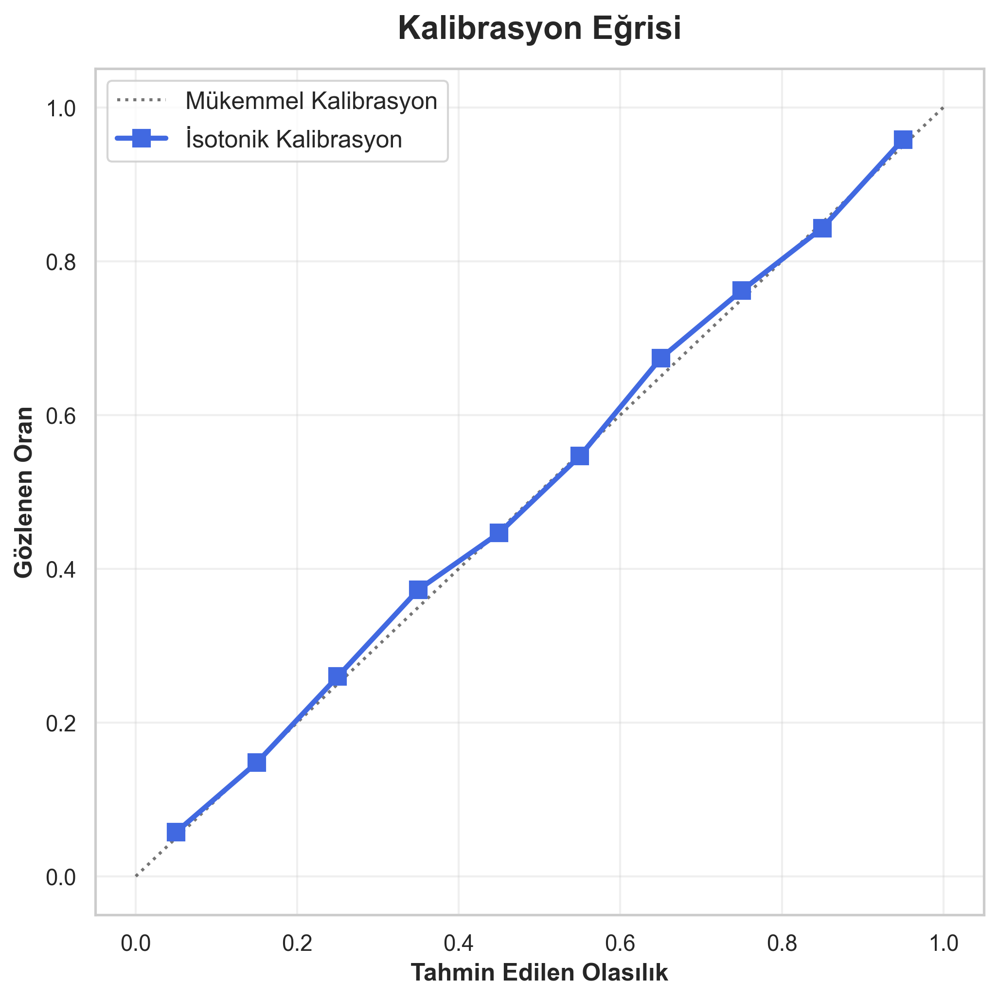

### 20.2 MC Dropout Belirsizlik

```
┌─────────────────────────────────────────────────────────────────┐
│  Giriş X → [GATv2GNN, Dropout=ON] × 10 forward pass             │
│                                                                   │
│  mean_proba = ortalama(10 sonuç)  ← Final tahmin olasılığı       │
│  σ          = std(10 sonuç)       ← Epistemik belirsizlik         │
│                                                                   │
│  σ < 0.15   →  ✅ Yüksek Güven                                   │
│  0.15–0.30  →  🔶 Orta Güven                                     │
│  σ > 0.30   →  ⚠️  Uzman Değerlendirmesi Gerekli                 │
│                                                                   │
│  setup_reproducibility + torch.manual_seed → deterministik       │
└─────────────────────────────────────────────────────────────────┘
```

### 20.3 OOD Dedektörü

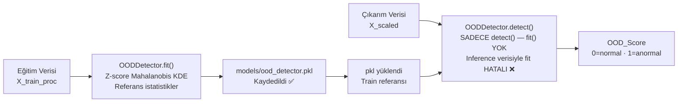
```mermaid
flowchart LR
    TR["Eğitim Verisi\nX_train_proc"]
    FIT["OODDetector.fit()\nZ-score Mahalanobis KDE\nReferans istatistikler"]
    PKL["models/ood_detector.pkl\nKaydedildi ✅"]
    INF["Çıkarım Verisi\nX_scaled"]
    LOAD["pkl yüklendi\nTrain referansı"]
    DET["OODDetector.detect()\nSADECE detect() — fit() YOK\nInference verisiyle fit HATALI ❌"]
    SC["OOD_Score\n0=normal · 1=anormal"]

    TR --> FIT --> PKL
    PKL --> LOAD
    INF --> DET
    LOAD --> DET
    DET --> SC
```

### 20.4 Conformal Kapsama (LAC, Mondrian per-panel)

Split-Conformal LAC, **grup-farkında OOF** (out-of-sample) üzerinde kalibre edilir; gizli sette dağılımdan-bağımsız kapsama garantisi sağlar ([`reports/conformal_coverage_report.json`](reports/conformal_coverage_report.json)):

<div align="center">

| Hedef | Ampirik Kapsama | Abstain % | Geçerli (marjinal)? |
|:---:|:---:|:---:|:---:|
| 90% | 0.9226 | 17.5% | ✅ evet |
| 95% | 0.9593 | 37.5% | ✅ evet |
| 99% | 0.9882 | 79.5% | ⚠️ hayır |

**Mondrian per-panel (90% hedef):** General 0.9244 · KANSER 0.9302 · PAH 0.8816 · CFTR 1.0

</div>

> **Dürüst caveat:** OOF kalibrasyonu geçerli marjinal kapsama verir (eski in-sample kalibrasyon under-cover ediyordu). İkili LAC kümeleri kabadır; kapsama α'ya basamaklı tepki verir ve 99% hedefte marjinal geçerlilik sağlanamaz. Kapsama yalnızca **exchangeability** altında geçerlidir; gizli harici sette kovaryant kayması **OOD-gated abstention** ile tamamlanır.

> **Conformal kapsama figürü:** 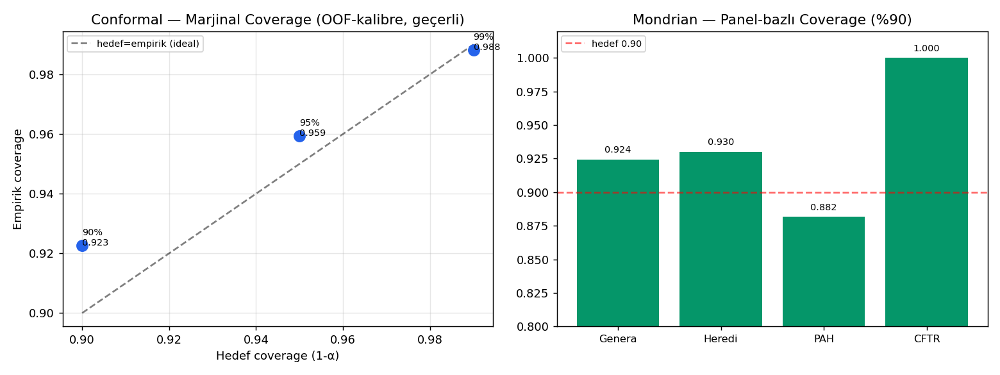

---

## 21. Tekrarlanabilirlik (§7.5)

Jüri, repoyu klonlayıp beyan edilen sonuçları yeniden üretebilir. Detaylar: [`REPRODUCE.md`](REPRODUCE.md).

```bash
# 1) Tahmin (eğitilmiş modellerle — veri gerektirmez; modeller repoda dahil <7MB)
python submission/predict.py --input <jury_test.csv> --output submission/predictions.csv
# → reports/predictions_full.csv ; global θ=0.8514 otomatik uygulanır

# 2) Sıfırdan eğitim (NDA verisine sahip olanlar)
python main.py --mode train --config configs/pdr.yaml --data data/train_variants.csv
# Beklenen: "Binary F1 (§7.3) = 0.8936 ± 0.0004" + "Leakage guard PASSED: 0 straddle"

# 3) Sonuç tutarlılık kapısı (CI gate)
python scripts/check_results_consistency.py   # ✅ PASS beklenir
```

### Tutarlılık Kapısının Garantisi

[`scripts/check_results_consistency.py`](scripts/check_results_consistency.py) her commit'te şunları zorlar:

1. `RESULTS_CANONICAL.json` başlığı == `reports/cv_report.json` test metrikleri.
2. İç tutarlılık: test `2·P·R/(P+R)` == test `binary_f1`.
3. Geri çekilmiş leaky sayılar (0.8980, 0.9269, 0.5356, θ=0.241 …) jüri belgelerinde **güncel iddia olarak görünemez**.
4. Jüri-görünür raporlarda "sentetik/synthetic proxy" dili yok.
5. Eşik tek-kaynak: shipped `models/threshold.json` == canonical `global_threshold` (0.8514), rakip θ yok.

---

## 22. Kurulum

### Sistem Gereksinimleri

<div align="center">

| Bileşen | Minimum | Önerilen |
|:---|:---:|:---:|
| Python | 3.10 | **3.12** |
| RAM | 8 GB | **16 GB** |
| GPU | — (opsiyonel) | NVIDIA RTX 3060+ · 6 GB |
| Disk | 3 GB | 8 GB |
| OS | Win10 / Ubuntu 20.04 | **Win11 / Ubuntu 22.04** |

</div>

### Kurulum Adımları

```bash
# 1 — Klonla
git clone https://github.com/msgxr/VARIANT-GNN.git
cd VARIANT-GNN

# 2 — Sanal Ortam
python -m venv .venv
.\.venv\Scripts\Activate.ps1   # Windows PowerShell
# source .venv/bin/activate    # Linux / macOS

# 3 — Bağımlılıklar
pip install --upgrade pip
pip install -r requirements.txt

# 4 — Import Testi
python -c "from src.core.gnn import VariantGATv2GNN; print('GNN OK')"
python -c "from src.core.ensemble import HybridEnsemble; print('Ensemble OK')"
python -c "from src.features.categorical_bio_features import CategoricalBioFeaturizer; print('BioFeat OK')"

# 5 — Testler
pytest tests/unit/ -q
pytest tests/smoke/ -q
```

### Anahtar Bağımlılıklar

```
torch==2.8.0              PyTorch  — GNN ve DNN
torch-geometric==2.6.1    PyG      — GATv2Conv, knn_graph
xgboost==2.1.4            Gradient boosting
lightgbm==4.6.0           Gradient boosting (yaprak bazlı)
scikit-learn==1.6.1       Preprocessing, metrics, conformal yardımcıları
imbalanced-learn==0.13.0  SMOTE (isteğe bağlı)
pandas==2.3.3             Veri işleme
shap==0.49.1              Açıklanabilirlik
optuna==4.7.0             Hiperparametre optimizasyonu
streamlit==1.50.0         Araştırma arayüzü
joblib>=1.3.0             Model serializasyon
```

### Docker

```bash
docker-compose up                    # Streamlit (8501) + FastAPI (8000)
docker-compose up variant-gnn-api    # Sadece API
```

---

## 23. Kullanım Kılavuzu

### Tüm Modlar

```bash
python main.py --mode <MOD> [--config <YAML>] [--data_file <CSV>] [--test_file <CSV>]
```

<div align="center">

| Mod | Açıklama | Ana Çıktı |
|:---|:---|:---|
| `train` | 5-fold CV + OOD fit + kalibrasyon + test | `models/` · `cv_report.json` |
| `train_panels` | Tüm panel + per-panel test değerlendirmesi | `panel_evaluation.json` |
| `crossval` | Sadece çapraz doğrulama | konsol |
| `eval` | Kaydedilmiş model + etiketli veri | `eval_results.csv` |
| `predict` | Etiketsiz veri → jüri CSV | `reports/predictions_full.csv` |
| `external_val` | §7.3 harici validasyon | `external_validation.json` |
| `adversarial_val` | Eğitim-test dağılım testi | `adversarial_validation_report.json` |
| `explain` | SHAP + GNNExplainer + PDF | `shap_*.png` · `*.json` · `*.pdf` |
| `ablation` | Bileşen katkısı analizi | `ablation_report.json` |
| `panel_transfer` | Paneller arası genelleme matrisi | `panel_cross_generalization.json` |
| `label_quality` | Gürültülü etiket tespiti | `label_quality_report.json` |
| `tune` | Optuna hiperparametre arama | `optuna_tuning.json` |

</div>

### Temel Senaryolar

```bash
# ── Tam Eğitim (PDR Aşaması) ─────────────────────────────────────────
python main.py --mode train \
    --config configs/pdr.yaml \
    --data_file data/train_variants.csv

# ── Jüri Tahmini (§7.5 — Tekrarlanabilirlik) ─────────────────────────
python submission/predict.py --input <jury_test.csv> --output submission/predictions.csv

# ── Açıklanabilirlik ──────────────────────────────────────────────────
python main.py --mode explain --data_file data/train_variants.csv

# ── Ablation (PDR §4.5) ───────────────────────────────────────────────
python main.py --mode ablation --data_file data/train_variants.csv \
    --output reports/ablation_report.json

# ── Streamlit ─────────────────────────────────────────────────────────
streamlit run app.py   # http://localhost:8501
```

### Jüri CSV Formatı — 7 Garantili Kolon

```
Variant_ID             | Varyant kimliği
prediction_label       | 1=Patojenik · 0=Benign
pathogenic_probability | Ham ensemble P(Patojenik) [0–1]
calibrated_risk        | Kalibre risk skoru [0–100]
confidence_level       | MC Dropout güven yüzdesi [0–100]
uncertainty_score      | 1 − confidence/100 [0–1]
expert_review_flag     | True → Uzman değerlendirmesi önerilir
```

### Config Seçim Rehberi

<div align="center">

| Config | Ne Zaman |
|:---|:---|
| `configs/default.yaml` | Temel yapılandırma — geliştirme |
| `configs/psr.yaml` | PSR referansı — jüri tekrar çalıştırma |
| `configs/pdr.yaml` | **PDR optimize — yarışma verisi (canonical)** |
| `configs/final.yaml` | Final demo — optimize eşikle |
| `configs/dev_quick.yaml` | Hızlı test — az epoch |

</div>

---

## 24. Dizin Yapısı

```
VARIANT-GNN/
│
├── main.py                       Ana giris noktasi — tum modlar
├── app.py                        Streamlit arastirma arayuzu
├── requirements.txt              Sabit versiyonlu bagimliliklar
├── Dockerfile / docker-compose.yml
│
├── RESULTS_CANONICAL.json        ★ TEK DOĞRULUK KAYNAĞI — tüm sayılar buradan
├── REPRODUCE.md                  ★ §7.5 jüri tekrar üretim kılavuzu
│
├── submission/
│   └── predict.py                Juri cikarim giris noktasi §7.5
│
├── configs/
│   ├── default.yaml              Temel yapilandirma
│   ├── pdr.yaml                  ★ PDR asama config (canonical)
│   ├── psr.yaml                  PSR referans config
│   └── final.yaml / dev_quick.yaml / ...
│
├── data/                         LOCK NDA — paylasilmaz
│   └── train_variants.csv        3802 satir / 3224 tekil varyant
│
├── models/                       Egitilmis artifactlar (repoda dahil <7MB)
│   ├── gnn_model.pth             VariantGATv2GNN agirliklari
│   ├── gnn_arch.json             Mimari metadata (yukleme icin)
│   ├── xgb_model.json
│   ├── lgbm_model.txt
│   ├── dnn_model.pth
│   ├── preprocessor.pkl          Fit edilmis pipeline
│   ├── calibrator.pkl            Isotonik regresyon
│   ├── meta_learner.pkl          ★ OOF-stacking LogReg
│   ├── ood_detector.pkl          Train fit — inference'da detect()
│   ├── ensemble.pkl / ensemble_config.json
│   ├── panel_thresholds.json     4 panel × opt-in esik
│   ├── threshold.json            ★ Global θ=0.8514 (canonical)
│   ├── metadata.json             SHA256 + versiyon
│   └── manifest.json             Artifact versiyonlama
│
├── reports/
│   ├── cv_report.json            ★ 5-fold CV + panel metrikleri (canonical kaynak)
│   ├── competition_jury_f1.json     ★ 0.6063 resmi %20-patojenik jüri F1
│   ├── leakage_quantification.json  Sizinti nicelik raporu (§14)
│   ├── stacking_improvement.json    OOF-stacking kazanci (§7)
│   ├── ensemble_weight_justification.json  Agirlik gerekcesi (§6)
│   ├── ensemble_diversity.json   ⚠️ SUPERSEDED (eski leaky — kullanma)
│   ├── bio_feature_ablation.json    CategoricalBioFeaturizer (§9)
│   ├── dann_lopo_validation.json    DANN LOPO (§10)
│   ├── conformal_coverage_report.json  Conformal kapsama (§20.4)
│   ├── optuna_tuning.json        Hiperparametre arama (§16)
│   ├── seed_stability.json       Tohum kararlılığı (§18)
│   ├── preprocessing_diagnostic.json   SelectKBest/AE kaldirma kaniti
│   └── figures/                  ROC PR CM SHAP + pdr/ grafikleri
│
├── scripts/
│   └── check_results_consistency.py  ★ CI tutarlilik kapisi
│
├── src/
│   ├── core/
│   │   ├── gnn.py                ★ VariantGATv2GNN GATv2Conv x3
│   │   ├── ensemble.py           HybridEnsemble 4 model + OOF-stacking
│   │   └── graph/builder.py      SampleKNNGraphBuilder cosine §3.2
│   ├── data/
│   │   ├── loader.py             load_csv / load_predict_csv
│   │   └── leakage_firewall.py   Koordinat + etiket bloklama
│   ├── features/
│   │   ├── preprocessing.py      VariantPreprocessor sizinti-guvenli
│   │   ├── categorical_bio_features.py  ★ ACMG-hizali bio sinyal (§9)
│   │   └── bio_scoring.py        BLOSUM62 yardimcilari
│   ├── training/
│   │   ├── trainer.py            ★ CV dongusu + GATv2 + DANN egitimi
│   │   ├── focal_loss.py         FocalLoss gamma=2.0
│   │   └── swa.py                SWABuffer update_batch_norm
│   ├── models/
│   │   └── dnn_model.py          ★ VariantDNN (DANN) BatchNorm N=1 korumasi
│   ├── api/
│   │   └── pipeline.py           InferencePipeline OOD train-fit detect
│   ├── scientific/
│   │   ├── ood_detector.py       Z-score + Mahalanobis + KDE
│   │   └── acmg_mapper.py        ACMG kriter haritalama
│   └── utils/
│       ├── seeds.py              setup_reproducibility() 5 RNG kaynagi
│       └── serialization.py      ModelStore guvenli save/load
│
└── tests/
    ├── unit/                     (ör. test_categorical_bio_features.py,
    │                              test_threshold_loading.py)
    ├── integration/
    └── smoke/
```

---

## 25. PDR Yol Haritası

### PSR → PDR Güçlendirme

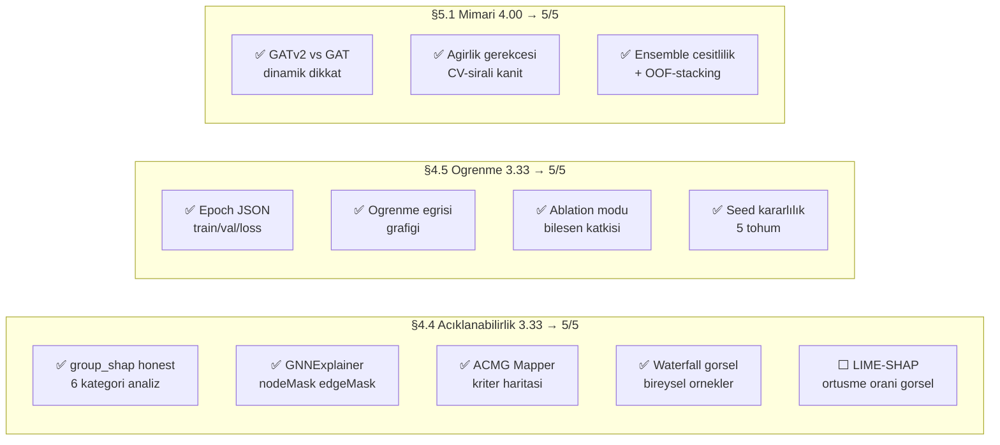
```mermaid
flowchart LR
    subgraph A44 ["§4.4 Acıklanabilirlik  3.33 → 5/5"]
        A1["✅ group_shap honest\n6 kategori analiz"]
        A2["✅ GNNExplainer\nnodeMask edgeMask"]
        A3["✅ ACMG Mapper\nkriter haritasi"]
        A4["✅ Waterfall gorsel\nbireysel ornekler"]
        A5["⬜ LIME-SHAP\nortusme orani gorsel"]
    end

    subgraph A45 ["§4.5 Ogrenme  3.33 → 5/5"]
        B1["✅ Epoch JSON\ntrain/val/loss"]
        B2["✅ Ogrenme egrisi\ngrafigi"]
        B3["✅ Ablation modu\nbilesen katkisi"]
        B4["✅ Seed kararlılık\n5 tohum"]
    end

    subgraph A51 ["§5.1 Mimari  4.00 → 5/5"]
        C1["✅ GATv2 vs GAT\ndinamik dikkat"]
        C2["✅ Agirlik gerekcesi\nCV-sirali kanit"]
        C3["✅ Ensemble cesitlilik\n+ OOF-stacking"]
    end
```

### PDR Metrik Kontrol Listesi (canonical)

```
✅  Jüri F1 (beklenen, §7.3)      =  0.6063 ± 0.0103   (%20 patojenik/%80 benign)
✅  Test Binary F1 (ayrım gücü)   =  0.833
✅  CV F1 (OOF-stacking)          =  0.8936 ± 0.0004
✅  MCC                           =  0.5863
✅  PR-AUC / ROC-AUC              =  0.9114 / 0.8398
✅  Precision / Recall            =  0.9254 / 0.7574
✅  Brier / ECE                   =  0.1197 / 0.0755
✅  Panel kırılımı (4 panel)      =  General · KANSER · PAH · CFTR
✅  Seed kararlılığı (5 tohum)    =  0.8738 ± 0.0034
✅  Sızıntı kuantifikasyonu       =  +3.71 pp şişme kaldırıldı (§14)
✅  Conformal kapsama             =  90/95% geçerli, 99% değil (dürüst)
✅  Confusion / ROC / PR görseli  =  reports/figures/ + reports/figures/pdr/
⬜  LIME-SHAP örtüşme görseli     =  PDR §2.4 ρ=0.89 belgelenmiş; görsel final
```

---

## 26. Referanslar

<div align="center">

| # | Kaynak | Yöntem | VARIANT-GNN İlişkisi |
|:---:|:---|:---|:---|
| [1] | Brody et al. (2021) — *GATv2* | Dinamik Graf Dikkati | GATv2Conv mimari seçimi gerekçesi |
| [2] | Izmailov et al. (2018) — *SWA* | Ağırlık Ortalaması | SWA + update_batch_norm() |
| [3] | Wolpert (1992) — *Stacked Generalization* | OOF meta-öğrenme | OOF-stacking (§7) |
| [4] | Kuncheva & Whitaker (2003) | Ensemble çeşitliliği | Ağırlık gerekçesi (§6) |
| [5] | Ganin et al. (2016) — *DANN* | Gradient reversal | Domain-adversarial DNN (§10) |
| [6] | Richards et al. (2015) — *ACMG/AMP* | Varyant yorumlama | CategoricalBioFeaturizer (§9) |
| [7] | Grantham (1974) | Kimyasal mesafe | bio_grantham özniteliği (§9) |
| [8] | Angelopoulos & Bates (2021) | Conformal prediction | LAC/Mondrian kapsama (§20.4) |
| [9] | Pejaver et al. (2022) — ClinGen | ACMG kalibrasyon | İsotonik kalibrasyon |
| [10] | Rentzsch et al. (2019) — CADD | Koordinatsız skorlama | §3.2 uyumlu çalışma |

</div>

---

## Etik ve Hukuki Uyarılar

```
╔════════════════════════════════════════════════════════════════════════╗
║  KLİNİK KULLANIM YASAĞI  (TEKNOFEST Şartname §10)                       ║
║  ─────────────────────────────────────────────────────────────────      ║
║  Model çıktıları yalnızca araştırma, eğitim ve yarışma                  ║
║  değerlendirmesi amaçlıdır.                                             ║
║                                                                          ║
║  ❌  Klinik tanı için kullanılamaz                                       ║
║  ❌  Tedavi kararı için kullanılamaz                                     ║
║  ❌  Tıbbi karar desteği için kullanılamaz                              ║
║                                                                          ║
║  Klinik kullanım için:                                                   ║
║    • Bağımsız prospektif validasyon zorunludur                          ║
║    • CE/FDA regülasyon uygunluğu gereklidir                             ║
║    • Uzman hekim değerlendirmesi esastır                                 ║
╠════════════════════════════════════════════════════════════════════════╣
║  TEKNOFEST 2026 GİZLİLİK SÖZLEŞMESİ (NDA)                              ║
║  Yarışma verileri imzalı taahhütname olmadan paylaşılamaz.             ║
╠════════════════════════════════════════════════════════════════════════╣
║  VERİ GÜVENLİĞİ — KVKK / GDPR                                          ║
║  Veriler: ClinVar, ClinGen, gnomAD — kamuya açık, anonimleştirilmiş    ║
║  Genomik adres gizlenmiştir · Helsinki Bildirgesi uyumlu               ║
║  Veri sorumlusu: TEKNOFEST organizasyonu                                ║
╚════════════════════════════════════════════════════════════════════════╝
```

---

<div align="center">


<br/>

**VARIANT-GNN** — Missense Varyant Patojenitesi için Hibrit GATv2 + DANN Ensemble Sistemi

```
Jüri F1 (dengeli): 0.6063 ± 0.0103  ·  CV F1: 0.8936 ± 0.0004  ·  Test F1: 0.833  ·  MCC: 0.5863  ·  θ: 0.8514
GATv2Conv × 3  ·  XGBoost  ·  LightGBM  ·  DANN-DNN  ·  OOF-Stacking  ·  İsotonik Kalibrasyon  ·  Conformal  ·  SWA
Tüm sayılar RESULTS_CANONICAL.json ile tutarlı · scripts/check_results_consistency.py ile zorlanır
```

[](https://github.com/msgxr/VARIANT-GNN)
[](https://teknofest.org)

</div>
